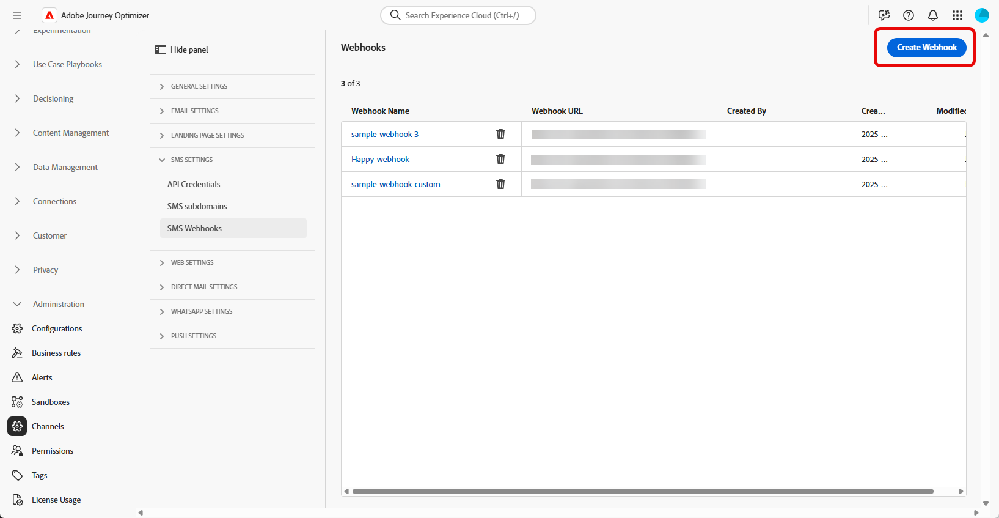
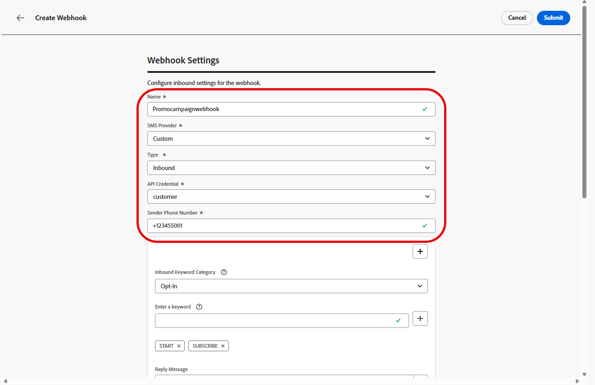
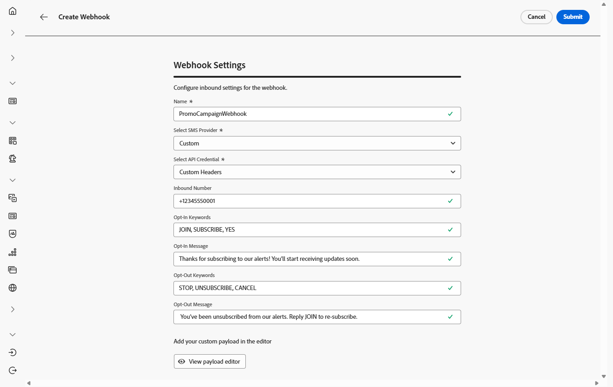
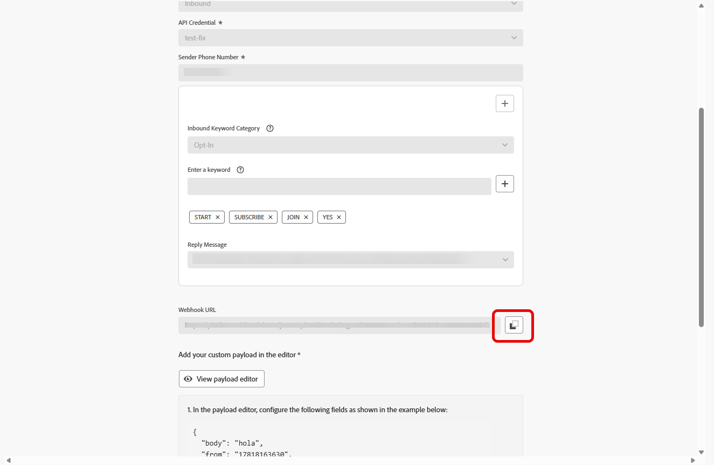

# Creare webhook {#webhook}

>[!CONTEXTUALHELP]
>id="ajo_channels_sms_webhook_settings_create"
>title="Creare un webhook SMS"
>abstract="Puoi configurare i webhook per acquisire le risposte in entrata e gestire il consenso di consenso di consenso e rinuncia e per ricevere rapporti di consegna che includono le conferme di lettura, se disponibili."

>[!CONTEXTUALHELP]
>id="ajo_admin_sms_webhook_flow_type"
>title="Scegli il tipo di webhook"
>abstract="Durante la configurazione di un webhook, scegli **In entrata** per acquisire le risposte di consenso e le preferenze utente, oppure **[!UICONTROL Feedback]** per tenere traccia degli eventi di consegna e coinvolgimento per reporting e analisi."

>[!BEGINSHADEBOX]

Se non vengono fornite parole chiave di consenso o rinuncia, vengono utilizzati messaggi di consenso standard per rispettare la privacy dell’utente. L&#39;aggiunta di parole chiave personalizzate sostituisce automaticamente le impostazioni predefinite.

**Parole chiave predefinite:**

* **Consenso**: SOTTOSCRIVI, SÌ, RIPRENDI, AVVIA, CONTINUA, RIPRENDI, INIZIA
* **Rinuncia**: INTERROMPI, ESCI, ANNULLA, TERMINA, ANNULLA ISCRIZIONE, NO
* **Guida**: GUIDA

>[!ENDSHADEBOX]

Una volta create correttamente le credenziali API, ora puoi configurare i webhook per acquisire le risposte in entrata e gestire il consenso di consenso e rinuncia e per ricevere i rapporti di consegna, comprese le conferme di lettura, se disponibili.

Durante la configurazione di un webhook, puoi definirne lo scopo in base al tipo di dati che desideri acquisire:

* **[!UICONTROL In entrata]**: utilizza questa opzione se desideri acquisire le risposte al consenso, come i consensi o le rinunce, e raccogliere le preferenze dell&#39;utente.

* **[!UICONTROL Feedback]**: scegli questa opzione per tenere traccia degli eventi di consegna e coinvolgimento, incluse le conferme di lettura e le interazioni degli utenti, per supportare la generazione di rapporti e l&#39;analisi.

Sfoglia le schede seguenti a seconda dei provider SMS:

>[!BEGINTABS]

>[!TAB Personalizzato]

1. Nella barra a sinistra, passa a **[!UICONTROL Amministrazione]** `>` **[!UICONTROL Canali]**, seleziona il menu **[!UICONTROL Webhook SMS]** in **[!UICONTROL Impostazioni SMS]** e fai clic sul pulsante **[!UICONTROL Crea webhook]**.

   {zoomable="yes"}

1. Configura le impostazioni del webhook come descritto di seguito:

   * **[!UICONTROL Name]**: immetti un nome per il webhook.

   * **[!UICONTROL Seleziona fornitore SMS]**: personalizzato.

   * **[!UICONTROL Tipo]**: in entrata.

   * **[!UICONTROL Credenziali API]**: scegli dall&#39;elenco a discesa [le credenziali API configurate in precedenza](sms-configuration-custom.md#api-credential).

   * **[!UICONTROL Numero di telefono del mittente &#x200B;]**: immettere il numero di telefono del mittente &#x200B;che si desidera utilizzare per le comunicazioni.

     {zoomable="yes"}

1. Fai clic su  per aggiungere le categorie di parole chiave, quindi configurale in base al provider SMS:

   * **[!UICONTROL Categoria di parole chiave in entrata]**: scegli le categorie di parole chiave **[!UICONTROL Consenso]**, **[!UICONTROL Rinuncia]**, **[!UICONTROL Consenso doppio]**, **[!UICONTROL Guida]** o **[!UICONTROL Personalizzato]**.

   * **[!UICONTROL Inserisci una parola chiave]**: immetti le parole chiave predefinite o personalizzate che attiveranno automaticamente il messaggio. Fare clic su  per aggiungere più parole chiave.

     Per **[!UICONTROL Parola chiave personalizzata]**, utilizza parole chiave non correlate al consenso per azioni basate su batch all&#39;interno di un percorso.

   * **[!UICONTROL Messaggio di risposta]**: seleziona dall&#39;elenco a discesa la risposta personalizzata inviata automaticamente.

   * **[!UICONTROL Rinuncia fuzzy]**: abilita questa opzione per inviare una risposta automatica quando viene rilevata una parola chiave di rinuncia quasi corrispondente.

   {zoomable="yes"}

1. Immetti un **[!UICONTROL Messaggio di risposta predefinito]** inviato automaticamente quando un messaggio in entrata non corrisponde ad alcuna parola chiave o categoria configurata.

1. Fai clic su **[!UICONTROL Visualizza editor payload]** per convalidare e personalizzare i payload della richiesta.

   Puoi personalizzare dinamicamente il payload utilizzando gli attributi del profilo e garantire che vengano inviati dati accurati per l’elaborazione e la generazione di risposte con l’aiuto di funzioni di assistenza integrate.

1. Fai clic su **[!UICONTROL Invia]** al termine della configurazione del webhook.

1. Per creare un webhook **[!UICONTROL Feedback]**, segui gli stessi passaggi indicati sopra, selezionando **[!UICONTROL Feedback]** come **[!UICONTROL Tipo]**.

1. Dal menu **[!UICONTROL Webhook]**, puoi modificare o eliminare i webhook esistenti oppure accedere e copiare l&#39;**[!UICONTROL URL del webhook]** per l&#39;integrazione con il provider SMS.

   {zoomable="yes"}

Dopo aver creato e configurato le impostazioni per il webhook, è ora necessario creare una [configurazione del canale](sms-configuration-surface.md) per i messaggi SMS.

Una volta configurata, puoi sfruttare tutte le funzionalità di canale predefinite, come l’authoring dei messaggi, la personalizzazione, il tracciamento dei collegamenti e il reporting.

>[!TAB Informazioni]

1. Nella barra a sinistra, passa a **[!UICONTROL Amministrazione]** `>` **[!UICONTROL Canali]**, seleziona il menu **[!UICONTROL Webhook SMS]** in **[!UICONTROL Impostazioni SMS]** e fai clic sul pulsante **[!UICONTROL Crea webhook]**.

   {zoomable="yes"}

1. Configura le impostazioni del webhook come descritto di seguito:

   * **[!UICONTROL Name]**: immetti un nome per il webhook.

   * **[!UICONTROL Seleziona fornitore SMS]**: Infobip.

   * **[!UICONTROL Tipo]**: in entrata.

   * **[!UICONTROL Credenziali API]**: scegli dall&#39;elenco a discesa [le credenziali API configurate in precedenza](sms-configuration-infobip.md#api-credential).

   * **[!UICONTROL Numero di telefono del mittente &#x200B;]**: immettere il numero di telefono del mittente &#x200B;che si desidera utilizzare per le comunicazioni.

     {zoomable="yes"}

1. Fai clic su  per aggiungere le categorie di parole chiave, quindi configurale in base al provider SMS:

   * **[!UICONTROL Categoria di parole chiave in entrata]**: scegli le categorie di parole chiave **[!UICONTROL Consenso]**, **[!UICONTROL Rinuncia]**, **[!UICONTROL Consenso doppio]**, **[!UICONTROL Guida]** o **[!UICONTROL Personalizzato]**.

   * **[!UICONTROL Inserisci una parola chiave]**: immetti le parole chiave predefinite o personalizzate che attiveranno automaticamente il messaggio. Fare clic su  per aggiungere più parole chiave.

     Per **[!UICONTROL Parola chiave personalizzata]**, utilizza parole chiave non correlate al consenso per azioni basate su batch all&#39;interno di un percorso.

   * **[!UICONTROL Messaggio di risposta]**: seleziona dall&#39;elenco a discesa la risposta personalizzata inviata automaticamente.

   * **[!UICONTROL Rinuncia fuzzy]**: abilita questa opzione per inviare una risposta automatica quando viene rilevata una parola chiave di rinuncia quasi corrispondente.

   {zoomable="yes"}

1. Immetti un **[!UICONTROL Messaggio di risposta predefinito]** inviato automaticamente quando un messaggio in entrata non corrisponde ad alcuna parola chiave o categoria configurata.

1. Fai clic su **[!UICONTROL Invia]** al termine della configurazione del webhook.

1. Per creare un webhook **[!UICONTROL Feedback]**, segui gli stessi passaggi indicati sopra, selezionando **[!UICONTROL Feedback]** come **[!UICONTROL Tipo]**.

1. Dal menu **[!UICONTROL Webhook]**, puoi modificare o eliminare i webhook esistenti oppure accedere e copiare l&#39;**[!UICONTROL URL del webhook]** per l&#39;integrazione con il provider SMS.

   {zoomable="yes"}

Dopo aver creato e configurato le impostazioni in entrata per il webhook, è ora necessario creare una [configurazione del canale](sms-configuration-surface.md) per i messaggi SMS.

Una volta configurata, puoi sfruttare tutte le funzionalità di canale predefinite, come l’authoring dei messaggi, la personalizzazione, il tracciamento dei collegamenti e il reporting.

>[!TAB Sinch]

1. Nella barra a sinistra, passa a **[!UICONTROL Amministrazione]** `>` **[!UICONTROL Canali]**, seleziona il menu **[!UICONTROL Webhook SMS]** in **[!UICONTROL Impostazioni SMS]** e fai clic sul pulsante **[!UICONTROL Crea webhook]**.

   {zoomable="yes"}

1. Configura le impostazioni del webhook come descritto di seguito:

   * **[!UICONTROL Name]**: immetti un nome per il webhook.

   * **[!UICONTROL Seleziona fornitore SMS]**: Sinch.

   * **[!UICONTROL Tipo]**: in entrata.

   * **[!UICONTROL Credenziali API]**: scegli dall&#39;elenco a discesa [le credenziali API configurate in precedenza](sms-configuration-sinch.md#create-api).

   * **[!UICONTROL Numero di telefono del mittente &#x200B;]**: immettere il numero di telefono del mittente &#x200B;che si desidera utilizzare per le comunicazioni.

     {zoomable="yes"}

1. Fai clic su  per aggiungere le categorie di parole chiave, quindi configurale in base al provider SMS:

   * **[!UICONTROL Categoria di parole chiave in entrata]**: scegli le categorie di parole chiave **[!UICONTROL Consenso]**, **[!UICONTROL Rinuncia]**, **[!UICONTROL Consenso doppio]**, **[!UICONTROL Guida]** o **[!UICONTROL Personalizzato]**.

   * **[!UICONTROL Inserisci una parola chiave]**: immetti le parole chiave predefinite o personalizzate che attiveranno automaticamente il messaggio. Fare clic su  per aggiungere più parole chiave.

     Per **[!UICONTROL Parola chiave personalizzata]**, utilizza parole chiave non correlate al consenso per azioni basate su batch all&#39;interno di un percorso.

   * **[!UICONTROL Messaggio di risposta]**: seleziona dall&#39;elenco a discesa la risposta personalizzata inviata automaticamente.

   * **[!UICONTROL Rinuncia fuzzy]**: abilita questa opzione per inviare una risposta automatica quando viene rilevata una parola chiave di rinuncia quasi corrispondente.

   {zoomable="yes"}

1. Immetti un **[!UICONTROL Messaggio di risposta predefinito]** inviato automaticamente quando un messaggio in entrata non corrisponde ad alcuna parola chiave o categoria configurata.

1. Fai clic su **[!UICONTROL Invia]** al termine della configurazione del webhook.

1. Nel menu **[!UICONTROL Webhook]**, fai clic sull&#39;icona  per eliminare il tuo webhook.

1. Per modificare la configurazione esistente, individuare il webhook desiderato e fare clic sull&#39;opzione **[!UICONTROL Modifica]** per apportare le modifiche necessarie.

1. Accedi e copia il nuovo **[!UICONTROL URL webhook]** dal **[!UICONTROL webhook]** inviato in precedenza.

   {zoomable="yes"}

Dopo aver creato e configurato le impostazioni in entrata per il webhook, è ora necessario creare una [configurazione del canale](sms-configuration-surface.md) per i messaggi SMS.

Una volta configurata, puoi sfruttare tutte le funzionalità di canale predefinite, come l’authoring dei messaggi, la personalizzazione, il tracciamento dei collegamenti e il reporting.

<!--
>[!TAB Twilio]

1. In the left rail, navigate to **[!UICONTROL Administration]** `>` **[!UICONTROL Channels]**, select the **[!UICONTROL SMS Webhooks]** menu under **[!UICONTROL SMS settings]**, and click the **[!UICONTROL Create Webhook]** button.

    {zoomable="yes"}

1. Configure your Webhook Settings, as detailed below:

    * **[!UICONTROL Name]**: Enter a name for your Webhook.

    * **[!UICONTROL Select SMS vendor]**: Twilio.

    * **[!UICONTROL Type]**: Inbound.

    * **[!UICONTROL API credentials]**: Choose from the drop-down you [previously configured API credentials](sms-configuration-twilio.md#create-api).

    * **[!UICONTROL Sender Phone Number ​]**: Enter the Sender phone number ​you want to use for your communications.
        
1. Click  to add your keywords categories, then, configure them depending on your SMS provider:

    * **[!UICONTROL Inbound Keyword Category]**: Choose your keyword categories either **[!UICONTROL Opt-In]**, **[!UICONTROL Opt-Out]**, **[!UICONTROL Double Opt-In]**, **[!UICONTROL Help]** or **[!UICONTROL Custom]**. 

    * **[!UICONTROL Enter a keyword]**: Enter the default or custom keywords that will automatically trigger your message. Click  to add multiple keywords.

        For **[!UICONTROL Custom keyword]**, use non-consent–related keywords for batch-based actions within a journey.

    * **[!UICONTROL Reply Message]**: Select from the drop-down the custom response that is automatically sent.

    * **[!UICONTROL Fuzzy Opt-out]**: Enable this option to send an automatic reply when a near-match opt-out keyword is detected.

1. Enter a **[!UICONTROL Default Reply Message]** automatically sent when an inbound message does not match any configured keyword or category.

1. Click **[!UICONTROL Submit]** when you finished the configuration of your Webhook.

1. In the **[!UICONTROL Webhooks]** menu, click the  to delete your Webhook.

1. To modify existing configuration, locate the desired Webhook and click the **[!UICONTROL Edit]** option to make the necessary changes.

1. Access and copy your new **[!UICONTROL Webhook URL]** from your previously submitted **[!UICONTROL Webhook]**.

After creating and configuring the inbound settings for the Webhook, you now need to create a [channel configuration](sms-configuration-surface.md) for SMS messages. 

Once configured, you can leverage all out-of-the-box channel capabilities such as message authoring, personalization, link tracking, and reporting.
-->

>[!ENDTABS]

## Video introduttivo {#video}

>[!VIDEO](https://video.tv.adobe.com/v/3431625)
