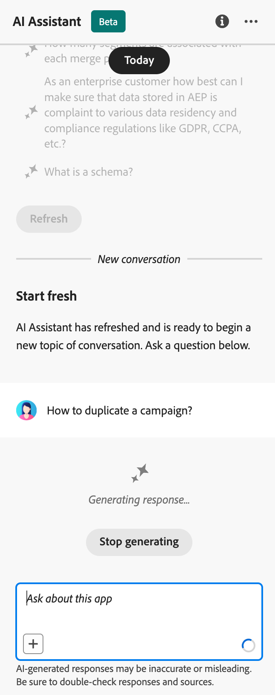

# Utilizzare l’Assistente AI {#ai-assistant}

L’Assistente AI è una funzione dell’interfaccia utente che consente di navigare tra i concetti Adobi e comprenderli e ottenere informazioni operative per l’ambiente specifico. È disponibile in diversi prodotti Adobe Experience Cloud, tra cui Adobe Journey Optimizer.

Per accedere all’Assistente AI, fai clic sull’icona nella barra superiore. L’Assistente AI viene visualizzato nella sezione destra dello schermo.

>[!CAUTION]
>
>Prima di poter utilizzare l’Assistente all’intelligenza artificiale, devi accettare le linee guida per l’utente di Adobe Experience Cloud Generative AI. Ulteriori informazioni sull’accordo sono disponibili in [questa pagina](https://experienceleague.adobe.com/en/docs/experience-platform/ai-assistant/home){target="_blank"}.

In Adobe Journey Optimizer, puoi accedere ai seguenti casi d’uso:

* **Conoscenza del prodotto** (Disponibilità generale)

  Le domande sulla conoscenza del prodotto riguardano concetti di Adobe relativi ad aspetti di Adobe Journey Optimizer. Alcuni esempi di domande sulla conoscenza del prodotto includono:

   * Quante attività live posso avere in una sandbox di Adobe Journey Optimizer?
   * Come si imposta una campagna in Adobe Journey Optimizer?
   * Come si crea un&#39;azione personalizzata da utilizzare nei percorsi Adobe Journey Optimizer?

* **Informazioni operative** in percorsi (Beta)

  Le domande operative riguardano gli oggetti del percorso nella sandbox dell’organizzazione. Alcuni esempi di domande o prompt di approfondimento operativo includono:

   * Quanti percorsi live ho in Adobe Journey Optimizer?
   * Dammi un elenco di tutti i percorsi pianificati
   * Quanti Percorsi sono stati creati negli ultimi 7 giorni?

  >[!NOTE]
  >
  >L’unico oggetto Adobe Journey Optimizer a cui hai accesso per porre domande sulle informazioni operative dell’Assistente all’intelligenza artificiale è **Percorsi**. Conterrà solo i dati relativi alla sandbox in cui ti trovi attualmente.

Per porre una domanda, immetterla nel campo nella parte inferiore dello schermo e premere Invio.

{width="50%" align="left"}

Controlla la risposta e utilizza **Mostra origini** per ottenere collegamenti diretti alla documentazione del prodotto e ulteriori informazioni.

{width="50%" align="left"}

Utilizza il pollice verso l’alto o il pollice verso il basso per valutare la risposta.

Per informazioni su come utilizzare l’Assistente IA, consulta gli obiettivi di esempio che puoi raggiungere con l’Assistente AI e scopri come funziona, consulta [Documentazione di Adobe Experience Platform](https://experienceleague.adobe.com/en/docs/experience-platform/ai-assistant/home){target="_blank"}.
