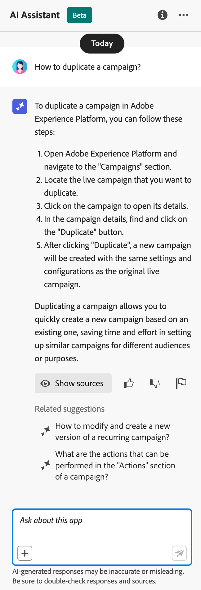
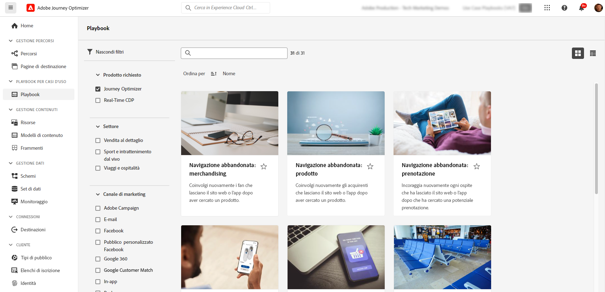

# IA e funzioni intelligenti {#ai-features}

>[!BEGINSHADEBOX]

**In questa pagina:** esplora le funzionalità di intelligenza artificiale e machine learning in Adobe Journey Optimizer, dall&#39;Assistente e dagli agenti di intelligenza artificiale alla generazione di contenuti, all&#39;ottimizzazione del tempo di invio e al decisioning, in modo da poter lavorare più velocemente e fornire esperienze cliente più rilevanti.

>[!ENDSHADEBOX]

Adobe Journey Optimizer sfrutta la potenza dell’intelligenza artificiale e dell’apprendimento automatico per aiutarti a creare, ottimizzare e fornire esperienze cliente eccezionali. Dalla generazione di contenuti personalizzati alla previsione di tempi di invio ottimali, le funzionalità di intelligenza artificiale semplificano il flusso di lavoro e massimizzano l’impatto. I playbook basati su casi d’uso forniscono modelli predefiniti per implementare rapidamente scenari di marketing comuni.

## Assistente IA {#ai-assistant}

Assistente AI è la tua guida di conversazione a Adobe Journey Optimizer. Utilizzalo per ottenere risposte immediate sulle funzioni dei prodotti, informazioni operative sui tuoi percorsi e assistenza nella navigazione nella piattaforma.

### Accedere all’Assistente IA

Fai clic sull’icona Assistente AI nella barra superiore per aprire il pannello Assistente sul lato destro dello schermo.

>[!IMPORTANT]
>
>Prima di utilizzare l&#39;Assistente all&#39;intelligenza artificiale, devi accettare le [linee guida per l&#39;utente di Adobe Experience Cloud Generative AI](https://experienceleague.adobe.com/it/docs/experience-platform/ai-assistant/home){target="_blank"}.

### Quali funzioni può eseguire l’assistente AI

**Conoscenza del prodotto** - Poni domande sulle funzioni e i concetti di Adobe Journey Optimizer:

* &quot;Come si imposta una campagna in Adobe Journey Optimizer?&quot;
* &quot;Come si crea un’azione personalizzata da utilizzare nei percorsi?&quot;
* &quot;Quante attività live posso avere in una sandbox?&quot;

**Informazioni operative (Beta)** - Ottieni informazioni in tempo reale sui tuoi percorsi:

* &quot;Quanti percorsi di vita ho?&quot;
* &quot;Dammi un elenco di tutti i percorsi pianificati&quot;
* &quot;Quanti percorsi sono stati creati negli ultimi 7 giorni?&quot;

>[!NOTE]
>
>Le informazioni operative sono attualmente disponibili solo per **Percorsi** e riflettono i dati della sandbox corrente.

### Come utilizzare l’assistente AI

1. Inserisci la domanda nel campo di testo nella parte inferiore del pannello
2. Premi Invio per inviare la query
3. Rivedi la risposta generata dall’intelligenza artificiale
4. Fai clic su **Mostra origini** per accedere alla documentazione correlata
5. Utilizza i pollici su/giù per valutare la qualità della risposta

{width="40%"}

[Ulteriori informazioni sull’Assistente IA in Experience Platform](https://experienceleague.adobe.com/it/docs/experience-platform/ai-assistant/home){target="_blank"}

## Agenti di intelligenza artificiale avanzati per l’ottimizzazione del Percorso {#ai-agents}

Basandosi sulle funzionalità di conversazione dell’Assistente all’intelligenza artificiale, Adobe Journey Optimizer offre agenti di intelligenza artificiale specializzati che forniscono analisi approfondite e consigli actionable per l’ottimizzazione e la sperimentazione del percorso.

### Journey Agent {#journey-agent}

Journey Agent include due competenze in AI Assistant: Analizza e Crea. Utilizzali per ottimizzare i percorsi esistenti o crearne di nuovi a partire dai prompt del linguaggio naturale.

+++**Autorizzazioni richieste**

* **Visualizza Percorsi** - Visualizza informazioni sui percorsi direttamente nell&#39;Assistente di intelligenza artificiale
* **Gestisci Percorsi** - Crea nuovi percorsi direttamente nell&#39;Assistente IA
* **Visualizza segmenti** - Visualizza informazioni approfondite sui tipi di pubblico e cerca quelli esistenti
* **Gestione segmenti** - Crea nuovi tipi di pubblico direttamente nell&#39;Assistente IA
* **Visualizza eventi di Percorso, origini dati e azioni** - Necessario affinché l&#39;abilità di creazione possa eseguire ricerche in eventi di percorso e azioni personalizzate

+++

#### abilità di analisi percorso {#journey-analyze-skill}

L&#39;[Agente analisi Percorso](https://experienceleague.adobe.com/it/docs/experience-cloud-ai/experience-cloud-ai/agents/ajo-agent#journey-create-agent-skill-overview-and-user-guide){target="_blank"} consente di ottimizzare le prestazioni del percorso mediante l&#39;analisi del linguaggio naturale:

+++**Funzionalità chiave**

* **Analisi dell&#39;abbandono dei Percorsi** - Identifica dove e perché i clienti abbandonano durante i percorsi, rileva i pattern di disimpegno
* **Rilevamento sovrapposizione pubblico** - Analizza la sovrapposizione del pubblico in più percorsi per evitare l&#39;eccesso di targeting
* **Pianifica rilevamento conflitti** - Identifica i conflitti di tempistica tra percorsi pianificati che hanno come destinazione lo stesso pubblico
* **Operational Insights** - Ottieni informazioni basate su prompt come &quot;mostra tutti i percorsi live&quot; o &quot;quali tipi di pubblico vengono utilizzati in più di X percorsi&quot;

+++

+++**Prompt di esempio**

* &quot;Eseguire un&#39;analisi dell&#39;abbandono per il percorso \[Nome Percorso\]&quot;
* &quot;Esistono conflitti di pianificazione per il percorso \[Nome Percorso\]?&quot;
* &quot;Mostra conflitti di sovrapposizione del pubblico per il percorso \[Nome Percorso\]&quot;
* &quot;Quale pubblico viene utilizzato in più di 5 percorsi?&quot;

+++

#### Abilità creazione percorso {#journey-create-skill}

L&#39;[agente di creazione Percorsi](https://experienceleague.adobe.com/en/docs/experience-cloud-ai/experience-cloud-ai/agents/ajo-agent#journey-analyze-agent-skill-overview-and-user-guide){target="_blank"} consente di creare percorsi dai prompt del linguaggio naturale, traducendo gli obiettivi in configurazioni di percorso strutturate:

+++**Funzionalità chiave**

* **Creazione Percorso lingua naturale** - Descrivi il percorso desiderato e crealo automaticamente
* **Avvii basati su eventi e pubblico**: creazione di percorsi di qualificazione del pubblico, degli eventi di business o attivati da eventi
* **Logica condizionale** - Crea percorsi suddivisi in base agli attributi o al comportamento del cliente
* **Messaggistica multicanale** - Aggiungere azioni e-mail, push e SMS
* **Pianificazione** - Configura le date di inizio e gli intervalli tra i passaggi

+++

+++**Prompt di esempio**

* &quot;Crea un percorso che inizia quando un cliente effettua un acquisto online e invia una notifica push di ringraziamento.&quot;
* &quot;Costruisci un percorso destinato al pubblico di escursionisti con tre e-mail in due settimane, a partire dal 20/12.&quot;
* &quot;Crea un percorso che inizia quando un utente accede alla posizione del mio negozio e prosegue in base al fatto che abbia o meno un indirizzo e-mail valido.&quot;

+++

### Agente di sperimentazione {#experimentation-agent}

L&#39;[agente di sperimentazione](https://experienceleague.adobe.com/it/docs/experience-cloud-ai/experience-cloud-ai/agents/agent-experiment){target="_blank"} modernizza le modalità di esecuzione e gestione degli esperimenti digitali su siti Web, e-mail, messaggi push e applicazioni:

+++**Funzionalità chiave**

* **Analisi delle prestazioni** - Chiara visualizzazione di ciò che è successo negli esperimenti
* **Generazione approfondimenti** - Spiegazione del motivo per cui si sono verificati i risultati
* **Individuazione opportunità** - Linee guida sulle azioni successive da intraprendere
* **Analisi dei contenuti** - Esamina gli elementi di messaggistica per capire perché alcuni trattamenti hanno superato altri
* **Generazione di consigli** - Suggerisci nuovi trattamenti o regolazioni in base a informazioni approfondite

+++

+++**Prompt di esempio**

* &quot;Quali esperimenti sono in esecuzione per \[Nome campagna\]?&quot;
* &quot;Quale trattamento porta il mio \[Nome esperimento\]?&quot;
* &quot;Cosa abbiamo imparato da \[Nome esperimento\]?&quot;
* &quot;Cosa consiglia di fare dopo questo esperimento?&quot;
* &quot;Quali pattern comuni stanno emergendo dai test recenti?&quot;

+++

+++**Autorizzazioni richieste**

* **Visualizza esperimenti** - Visualizza informazioni approfondite sugli esperimenti nell&#39;Assistente IA
* **Gestisci metadati esperimento** - Crea nuovi esperimenti nell&#39;Assistente IA

**Nota:** disponibile con licenza Journey Optimizer Experimentation Accelerator.

+++

### Agenti di IA aggiuntivi

**Audience Agent** - Per l&#39;esplorazione e la gestione del pubblico conversazionale in Adobe Experience Platform, inclusi il rilevamento dei duplicati e il tracciamento delle dimensioni. [Ulteriori informazioni su Audience Agent](https://experienceleague.adobe.com/it/docs/experience-cloud-ai/experience-cloud-ai/agents/audience){target="_blank"}

**Agent Orchestrator** - Coordina più agenti specializzati per risolvere problemi di marketing complessi e in più passaggi. L&#39;orchestratore determina automaticamente gli agenti da coinvolgere e ne sequenzia il lavoro in modo efficiente. [Ulteriori informazioni su Agent Orchestrator](https://experienceleague.adobe.com/it/docs/experience-cloud-ai/experience-cloud-ai/agents/agent-orchestrator){target="_blank"}

## Generazione di contenuti basati sull’intelligenza artificiale {#content-generation}

Utilizza l’intelligenza artificiale generativa per creare e personalizzare contenuti su più canali, accelerando il processo di creazione dei contenuti e mantenendo al contempo la coerenza del brand. L&#39;Assistente IA per la generazione di contenuti è disponibile per [e-mail](../email/get-started-email.md), [notifiche push](../push/get-started-push.md), [SMS](../mobile/get-started-mobile.md) e [web](../web/get-started-web.md) esperienze, che consentono di generare oggetti, corpo del testo, immagini e varianti di messaggi complete.

### Funzioni chiave

* **Generazione completa dei contenuti** - Genera esperienze complete di contenuti (testo e immagini) in un unico flusso per e-mail, web, pagine di destinazione e push. [Genera contenuto completo con l&#39;Assistente AI](../content-management/generative-full-content.md)
* **Generazione di testo** - Crea una copia convincente in base alla voce e agli obiettivi del tuo marchio. [Genera testo con IA](../content-management/generative-text.md)
* **Generazione immagine** - Genera immagini personalizzate tramite Adobe Firefly. [Genera immagini con IA](../content-management/generative-image.md)
* **Varianti di contenuto** - Produce più varianti per il test A/B. [Esperimento contenuti con IA](../content-management/generative-experimentation.md)
* **Personalization** - Genera nuove espressioni, spiega il codice esistente o correggi i problemi relativi all&#39;Assistente IA dall&#39;editor di Personalization o dalla barra degli strumenti di E-mail Designer (**Aggiungi espressione**). [Assistente AI per espressioni Personalization](../content-management/generative-personalization-expressions.md)
* **Allineamento marchio** - Assicurati che il contenuto generato corrisponda alle linee guida del tuo marchio. [Valuta l&#39;allineamento del brand](../content-management/brands-score.md)
* **Supporto modelli** - Sfrutta i modelli e-mail esistenti. [Utilizzare i modelli di contenuto](../content-management/content-templates.md)

### Best practice

* **Specifici** - Fornisci prompt chiari e dettagliati per ottenere risultati migliori. [Scopri le best practice per i prompt](../content-management/ai-assistant-prompting-guide.md)
* **Carica risorse marchio** - Utilizza PDF, immagini o file ZIP (massimo 50 MB) per mantenere la coerenza del marchio
* **Utilizza modelli personalizzati**: sfrutta modelli specifici per il tuo marchio con un massimo di 8-10 immagini
* **Fornisci feedback** - Valuta gli output per migliorare i modelli di intelligenza artificiale
* **Controlla tutti i contenuti** - Controlla sempre i contenuti generati dall&#39;intelligenza artificiale prima di pubblicarli

[Ulteriori informazioni sulla generazione di contenuti AI](../content-management/gs-generative.md)

## Ottimizzazione dei tempi di invio {#send-time-optimization}

Utilizza l’intelligenza artificiale per prevedere il tempo ottimale per inviare ogni messaggio in base ai modelli di comportamento dei singoli clienti, massimizzando il coinvolgimento.

### Come funziona

L’ottimizzazione del tempo di invio analizza i dati storici del coinvolgimento (aperture e clic) per prevedere quando è più probabile che ogni cliente sia interessato ai messaggi. Il sistema pianifica automaticamente la consegna entro la finestra temporale specificata.

### Quando utilizzarlo

| Ideale per | Non consigliato per |
|----------|---------------------|
| Campagne di marketing e newsletter | Messaggi operativi sensibili al tempo (conferme d&#39;ordine, reimpostazioni password) |
| Messaggi promozionali | Notifiche urgenti (ritardi dei voli, avvisi di emergenza) |
| Contenuti educativi | Messaggi basati su eventi con requisiti temporali specifici |
| Campagne di coinvolgimento | |

[Scopri di più sull’ottimizzazione dell’ora di invio](../building-journeys/send-time-optimization.md)

## Modelli di intelligenza artificiale per il decisioning {#ai-decisioning}

Crea modelli di classificazione intelligenti che ottimizzano automaticamente le offerte da mostrare a ciascun cliente, massimizzando gli obiettivi aziendali.

### Tipi di modello

**Ottimizzazione automatica**: apprende dalle interazioni dei clienti per migliorare automaticamente le prestazioni delle offerte nel tempo

**Ottimizzazione personalizzata** - Utilizza gli attributi e il comportamento del profilo cliente per prevedere l&#39;offerta migliore per ogni utente

### Requisiti

* Almeno 2 offerte con sufficienti dati di interazione:
   * Oltre 100 eventi di visualizzazione
   * Più di 5 eventi di clic
   * Negli ultimi 14 giorni
* Massimo 5 modelli di classificazione IA per organizzazione

[Ulteriori informazioni sui modelli di IA per il decisioning](../experience-decisioning/ranking/ai-models.md) | [Creare modelli di classificazione IA](../experience-decisioning/ranking/create-ai-models.md)

## Ottimizzazione di regole e formule basate su IA {#decisioning-optimization}

Adobe Journey Optimizer può analizzare automaticamente [Regole di decisione](../experience-decisioning/rules.md) e [formule di classificazione](../experience-decisioning/ranking/ranking-formulas.md) espresse nella sintassi PQL e suggerire semplificazioni che mantengono la logica originale. Quando viene trovata una semplificazione, accanto alla regola o alla formula viene visualizzato un indicatore rosso **[!UICONTROL Ottimizza]**, che apre un confronto affiancato tra le espressioni originali e quelle suggerite dall&#39;intelligenza artificiale, con un&#39;analisi scaricabile per verificare che entrambe si comportino in modo identico.

### Funzionalità chiave

* **Semplificazioni conservanti la logica** - L&#39;IA suggerisce un&#39;espressione più breve che restituisce lo stesso risultato sui profili simulati.
* **Rapporto di convalida** - Scarica un&#39;analisi (TSV) che mostra come ogni profilo simulato viene valutato rispetto a entrambe le versioni prima di applicare la modifica.
* **Applicazione con un solo clic** - Sostituisci il PQL originale con la versione ottimizzata direttamente dalla finestra **[!UICONTROL Ottimizza]**.

### Idoneità

Solo le regole e le formule di classificazione con espressione PQL di dimensioni superiori a **2 KB** (con codifica UTF-8) sono destinate all&#39;analisi, mentre le espressioni più piccole non vengono analizzate.

### Autorizzazioni

Questa funzionalità utilizza gli stessi controlli di accesso AI generativi di **Assistente AI**. Agli utenti deve essere concessa l&#39;autorizzazione **[!UICONTROL Generate Content]** per la risorsa **[!UICONTROL AI Assistant]**. [Ulteriori informazioni sull&#39;accesso all&#39;Assistente AI](../content-management/gs-generative.md#generative-access)

[Ottimizzare le regole di decisioning](../experience-decisioning/rules.md#optimize) | [Ottimizzare le formule di classificazione](../experience-decisioning/ranking/ranking-formulas.md#optimize)

## Sperimentazione dei contenuti con l’IA {#experimentation}

**Experiment Accelerator** consente di eseguire esperimenti più rapidamente con informazioni basate sull&#39;intelligenza artificiale e consigli, identificando più rapidamente le varianti di contenuto vincenti.

Funzionalità principali:

* Generare automaticamente più varianti di contenuto
* Ricevi consigli di IA per la progettazione dell’esperimento
* Ottenere indicatori preliminari delle tendenze delle prestazioni
* Accelerare i tempi di acquisizione della rilevanza statistica

[Ulteriori informazioni su Experiment Accelerator](../content-management/experiment-accelerator-gs.md)

## Playbook casi d’uso {#playbooks}

Le cartelle dei casi d’uso sono flussi di lavoro predefiniti che consentono di implementare rapidamente scenari di marketing comuni. Ogni playbook include percorsi pronti all’uso, messaggi, schemi e segmenti.

### Come funzionano i playbook

1. **Sfoglia** la libreria del playbook per trovare casi d&#39;uso corrispondenti ai tuoi obiettivi
2. **Abilita** un playbook per generare automaticamente tutte le risorse richieste
3. **Personalizza** le risorse generate in base al tuo marchio e ai tuoi requisiti
4. **Distribuisci** per la produzione o il test in una sandbox di sviluppo

### Playbook disponibili

Sfoglia i playbook Journey Optimizer per scenari comuni come:

* Ripristino carrello abbandonato
* Serie di benvenuto per i nuovi clienti
* Coinvolgimento post-acquisto
* Messaggi di compleanno
* Campagne di ricoinvolgimento

+++**Prerequisiti**

* Sandbox con le autorizzazioni appropriate
* Configurazioni del canale per e-mail, push e/o SMS
* Autorizzazioni utente per la creazione di percorsi e messaggi

+++

[Visualizza tutti i playbook disponibili](https://experienceleague.adobe.com/docs/experience-platform/use-case-playbooks/playbooks/playbooks-list.html?lang=it){target="_blank"} | [Ulteriori informazioni sono disponibili nella documentazione di Experience Platform](https://experienceleague.adobe.com/docs/experience-platform/use-case-playbooks/playbooks/overview.html){target="_blank"}

## Funzionalità di intelligenza artificiale aggiuntive {#additional-capabilities}

### Convertitore da immagine a HTML

Trasforma le progettazioni di immagini statiche (JPEG, PNG) in modelli e-mail HTML modificabili utilizzando la tecnologia di conversione basata sull’intelligenza artificiale.

[Ulteriori informazioni su Image to HTML](../content-management/image-to-html.md)

### GenStudio per il marketing sulle prestazioni

Integrazione con Adobe GenStudio for Performance Marketing per creare contenuti e-mail basati sull’intelligenza artificiale e importare modelli in Journey Optimizer per l’orchestrazione. Esporta i modelli Journey Optimizer in GenStudio, genera varianti con IA e riportali per la distribuzione. (Disponibilità limitata, solo canale e-mail).

[Ulteriori informazioni su GenStudio](../integrations/genstudio.md)

### Calcolo del punteggio di allineamento al brand

Valuta l’allineamento dei contenuti con le linee guida del tuo marchio utilizzando il punteggio basato sull’intelligenza artificiale che misura la coerenza di tono, voce e messaggi.

[Ulteriori informazioni sull’allineamento dei marchi](../content-management/brands-score.md)

## Domande frequenti {#faq}

+++**Quali autorizzazioni sono necessarie per le funzionalità di intelligenza artificiale?**

* **[Assistente IA per la generazione di contenuti](#content-generation)** - Richiede l&#39;autorizzazione &quot;Genera contenuto&quot;
* **[Informazioni sul prodotto per l&#39;Assistente all&#39;intelligenza artificiale](#ai-assistant)** - È necessario accettare le linee guida per l&#39;utente di Adobe Generative AI
* **[Agente di analisi Percorso](#journey-agent)** - Richiede le autorizzazioni Visualizza/Gestisci Percorsi e Visualizza/Gestisci segmenti
* **[Agente di creazione Percorso](#journey-create-agent)** - Richiede le autorizzazioni Gestisci Percorsi, Visualizza eventi Percorso/Origini dati/Azioni, Visualizza segmenti e Gestisci segmenti
* **[Agente di sperimentazione](#experimentation-agent)** - Richiede le autorizzazioni Visualizza esperimenti e Gestisci metadati esperimenti

Tutti gli agenti di intelligenza artificiale devono avere accesso all’Assistente di intelligenza artificiale e accettare le linee guida utente per l’intelligenza artificiale generativa di Adobe Experience Cloud.

[Scopri di più sulle autorizzazioni](../administration/ootb-permissions.md)

+++

+++**I contenuti generati da IA sono sempre accurati?**

No. Rivedi sempre [contenuti generati da IA](#content-generation) per l&#39;accuratezza e l&#39;appropriatezza del brand. Utilizza gli strumenti di feedback (miniature verso l’alto o verso il basso) per migliorare i modelli.

+++

+++**Quali sono i limiti principali?**

* **[Ottimizzazione dell&#39;ora di invio](#send-time-optimization)** - Disponibile solo per e-mail e push in percorsi; richiede un periodo di formazione di 30 giorni
* **[Generazione di contenuti AI](#content-generation)** - Non disponibile per direct mailing, schede di contenuto, LINE o WhatsApp
* **[Modelli di classificazione IA](#ai-decisioning)** - Massimo 5 modelli per organizzazione; richiede un minimo di dati di interazione

+++

+++**Come posso accedere a queste funzionalità?**

La maggior parte delle funzioni di intelligenza artificiale sono incluse in Adobe Journey Optimizer. Alcune funzionalità come [Ottimizzazione dell&#39;ora di invio](#send-time-optimization) o [Agenti di IA](#ai-agents) possono richiedere l&#39;abilitazione da parte di Adobe. Contatta il rappresentante Adobe per informazioni dettagliate sulla licenza specifica e sulle funzioni disponibili.

+++

>[!MORELIKETHIS]
>
>* [Cos&#39;è Journey Optimizer?](get-started.md) panoramica delle funzionalità chiave, dei casi d&#39;uso e dell&#39;architettura.
>* [Comprensione del funzionamento](understanding-ajo.md) - Funzionamento congiunto di Journey Optimizer e Experience Platform.
>* [Generazione di contenuti AI](../content-management/gs-generative.md): genera e-mail, push, SMS e contenuti Web con l&#39;Assistente AI.
>* [Ottimizzazione dell&#39;ora di invio](../building-journeys/send-time-optimization.md) - Previsione e ottimizzazione dei tempi di consegna dei messaggi per ogni utente.
>* [Modelli di IA per il decisioning](../experience-decisioning/ranking/ai-models.md): classifica e personalizza le offerte automaticamente con i modelli di classificazione di IA.
