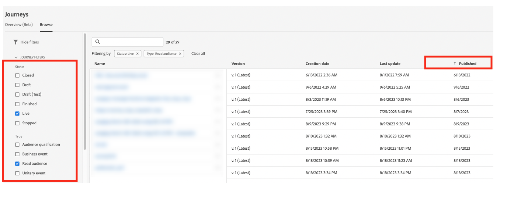

# Best practice {#best-practices}

## Caso d’uso in tempo reale e guida alla personalizzazione omni-channel {#real-time-guidance}

In seguito all’aggiornamento di Identity Service 2.0, l’unione delle identità in tempo reale si è evoluta.

Adobe Journey Optimizer sfrutta il servizio Identity per unire profili e personalizzare le esperienze per l’utente. Di conseguenza, durante la creazione dei casi d’uso, il servizio deve tenere conto di alcuni aspetti importanti. In qualità di marchio, desideri offrire un’esperienza a una persona. Il grafo delle identità consente agli addetti al marketing di capire a quali dispositivi è associata una persona su vari canali. Il grafico può contenere identità che rappresentano una persona (CRMID) o un browser web (ECID). Il servizio Identity unisce queste informazioni, consentendo la creazione di una &quot;visualizzazione a 360 gradi&quot; di una persona o di un profilo unito. Ciò significa che quando qualcuno esplora il tuo sito e poi accede, tutti i dati precedenti di quella sessione possono essere associati all’utente di accesso. Questa azione si verifica in alcuni passaggi diversi:

1. Unione iniziale delle identità: quando una persona effettua l’accesso, l’identificatore di accesso (CRMID) viene associato all’identificatore del browser web (sessione web o app mobile):

   * Il completamento di questa operazione può richiedere da 30 minuti a 4 ore.
   * Di solito, questo evento di accesso genera un grafo di identità che collega CRMID con ECID.

1. Dopo l’unione iniziale, tutti i dati inviati con una delle due identità saranno associati al profilo unito e disponibili per la personalizzazione in Journey Optimizer in tempo reale. L’aggiornamento del profilo con i dati comportamentali più recenti può richiedere fino a 1 minuto. Consulta [questa pagina](https://experienceleague.adobe.com/docs/experience-platform/ingestion/streaming/overview.html?lang=it).

Durante la creazione di casi d’uso, considera quanto segue:

1. Il brand desidera coinvolgere nuovamente un visitatore del sito 30 minuti dopo l’abbandono (ad esempio, e-mail del carrello abbandonato):

   Utilizza l’identità con i dati: ECID. Se desideri acquisire il 100% dei visitatori che hanno fornito il proprio indirizzo e-mail/installazione dell’app negli ultimi 30 minuti, utilizza l’identità basata su cookie per avviare questo percorso (ECID). Ciò presuppone che l’indirizzo e-mail, il token push o un altro indirizzo per l’esperienza sia associato all’ECID.

1. Coinvolgimento omni-channel su web, e-mail, push, ecc.:

   * Gli indirizzi per la comunicazione devono essere disponibili sul profilo al momento del coinvolgimento. Per garantire che ciò accada in modo coerente e tempestivo, assicurati che i dati siano associati all’identità che desideri utilizzare.
   * Se devi utilizzare informazioni provenienti da un’app o da una sessione del browser appena installata, combinate con informazioni note o connesse, questa comunicazione deve essere inviata dopo che si è verificata l’unione di queste identità. Questo può variare per cliente e consigliamo di attendere almeno 30 minuti per ottenere il volume massimo di profili.

## Scalabilità con guardrail Percorso {#scale}

Questa sezione ti guiderà su come effettuare la scalabilità con le seguenti due limitazioni:

* Journey Optimizer ha un guardrail di 50 attività in un quadro di percorso. Questo guardrail è progettato per facilitare la leggibilità, il controllo qualità e la risoluzione dei problemi. Il numero di attività in un percorso verrà visualizzato nella sezione in alto a sinistra dell’area di lavoro del percorso quando si rientrano in 10 attività da questo limite.

* Quando si pubblicano i percorsi, Journey Optimizer viene automaticamente ridimensionato e regolato per garantire la massima velocità effettiva e stabilità. Quando ti avvicini alla milestone di 100 percorsi live in una sola volta in una sandbox, vedrai una sovrapposizione arancione e un segno di avviso nell’interfaccia su questo risultato. Se visualizzi questa notifica e hai la necessità di estendere i percorsi oltre ai 100 percorsi live alla volta, puoi creare un ticket per l’assistenza clienti e ti aiuteremo a raggiungere i tuoi obiettivi.

<!--DOCAC-10977

* As you publish journeys, Journey Optimizer automatically scales and adjusts to ensure maximum throughput and stability. As you near the milestone of 500 live journeys at one time in a sandbox, you will see an orange overlay and warning sign appear in the interface on this achievement. If you see this notification and have a need to extend your journeys beyond 500 live journeys at a time, please create a ticket for customer care and we will help you reach your goals.-->

Puoi adottare diverse best practice, che ti aiuteranno a rimanere all’interno dei guardrail e a utilizzare il sistema in modo efficiente.

* Se ti avvicini al limite di percorsi attivi, il primo passaggio è passare alla scheda **Panoramica** in **Percorsi** per vedere quanti percorsi erano attivi nelle ultime 24 ore con profili attivi. Puoi controllare il numero di profili che entrano ed escono dal percorso in questa sezione per determinarlo.

  

* Quindi, nella sezione Inventario Percorsi, puoi filtrare tutti i percorsi per Stato = &quot;Live&quot; e Tipo = &quot;Read audience&quot;. Quindi ordina per data di pubblicazione (dalla meno recente alla più recente). Fai clic sul percorso e passa alla pianificazione. Interrompi tutti i percorsi live che avevano una pianificazione per eseguire **Una volta** o **Il più presto possibile** che sono più vecchi di un giorno e hanno una sola azione.

  

* Se il percorso **Read audience** dispone di una sola azione, nessuna attesa/decisione o ottimizzazione dell&#39;ora di invio, puoi spostarli in Journey Optimizer Campaigns. Le campagne sono più adatte al coinvolgimento in un singolo passaggio. Una delle differenze chiave tra Campaign e i Percorsi è se ritieni importante ascoltare attivamente il coinvolgimento degli utenti per determinare il passaggio successivo e interagire con un’altra azione.
* Per ridurre il numero di attività all’interno di un percorso, controlla i passaggi della condizione. Ci saranno molte istanze in cui puoi spostare le condizioni nella definizione del segmento o nella composizione del pubblico.
* Se le stesse condizioni vengono ripetute in più percorsi (controlli del consenso, eliminazioni), considera di spostarle come parte della definizione del segmento. Ad esempio, se disponi di una condizione per controllare &quot;l’indirizzo e-mail non è vuoto&quot; in più percorsi, includi tale condizione nella definizione del segmento.
* Se il percorso presenta diverse condizioni che dividono il pubblico per visualizzare i numeri in ogni passaggio, è consigliabile utilizzare Customer Journey Analytics o altre soluzioni di reporting più adatte per l’analisi.
* Se ti stai avvicinando al limite di nodi nell’area di lavoro, considera il consolidamento delle azioni con parametri dinamici o contenuti per fornire il contenuto giusto invece di nodi espliciti.

* Se disponi di un percorso **Read Audience** con segmento batch (A) e utilizzi un segmento inAudience in streaming (B) all&#39;interno del percorso da escludere (ad esempio, esegui A-B), puoi spostare tale logica nella logica di segmentazione e utilizzare l&#39;esclusione come parte della logica di segmentazione stessa.