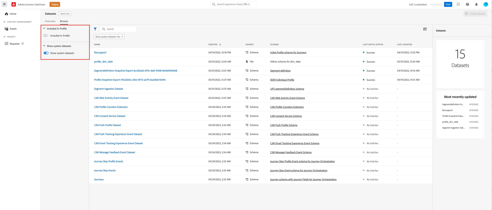

# Guida introduttiva ai set di dati {#datasets-gs}

Tutti i dati acquisiti in Adobe Experience Platform vengono mantenuti all’interno del Data Lake come set di dati. Un set di dati è un costrutto di archiviazione e gestione per una raccolta di dati, in genere una tabella, che contiene uno schema (colonne) e campi (righe).

## Accedere ai set di dati{#access-datasets}

La **Set di dati** area di lavoro [!DNL Adobe Journey Optimizer] l’interfaccia utente ti consente di esplorare i dati e creare set di dati.

Seleziona **Set di dati** nella navigazione a sinistra per aprire il dashboard Set di dati.

L’aggiunta di dati a Adobe Experience Platform è la base per la creazione di un profilo. Potrai quindi sfruttare i profili in [!DNL Adobe Journey Optimizer]. Definisci innanzitutto gli schemi, utilizza gli strumenti ETL per preparare e standardizzare i dati, quindi crea i set di dati in base agli schemi.

Seleziona la **Sfoglia** per visualizzare l’elenco di tutti i set di dati disponibili per la tua organizzazione. Vengono visualizzati i dettagli di ciascun set di dati elencato, compreso il nome, lo schema a cui il set di dati aderisce e lo stato dell’esecuzione di acquisizione più recente.

Per impostazione predefinita, vengono visualizzati solo i set di dati in cui sono stati acquisiti. Se desideri visualizzare i set di dati generati dal sistema, abilita la **Mostra set di dati di sistema** attiva/disattiva il filtro.

Seleziona il nome di un set di dati per accedere alla relativa schermata di attività Set di dati e vedi i dettagli del set di dati selezionato. La scheda Attività include un grafico che mostra il tasso di utilizzo dei messaggi e un elenco di batch con esito positivo o negativo.

## Creare set di dati{#create-datasets}

Per creare un nuovo set di dati, inizia selezionando **Creare un set di dati** nel dashboard Set di dati.

È possibile:

* Crea set di dati dallo schema. [Ulteriori informazioni in questa documentazione](https://experienceleague.adobe.com/docs/experience-platform/catalog/datasets/user-guide.html?lang=en#schema){target=&quot;_blank&quot;}
* Crea set di dati da file CSV. [Ulteriori informazioni in questa documentazione](https://experienceleague.adobe.com/docs/experience-platform/ingestion/tutorials/map-a-csv-file.html){target=&quot;_blank&quot;}

Guarda questo video per scoprire come creare un set di dati, mapparlo su uno schema, aggiungervi dati e confermare che i dati sono stati acquisiti.

>[!VIDEO](https://video.tv.adobe.com/v/334293?quality=12)

Scopri come creare uno schema, un set di dati e acquisire dati per aggiungere profili di test in Adobe Journey Optimizer in [questo campione end-to-end](../segment/creating-test-profiles.md)

Ulteriori informazioni sulla creazione di set di dati in [Documentazione di Adobe Experience Platform](https://experienceleague.adobe.com/docs/experience-platform/catalog/datasets/overview.html){target=&quot;_blank&quot;}.

Scopri come utilizzare l’interfaccia utente dei set di dati in [Panoramica sull’acquisizione dei dati](https://experienceleague.adobe.com/docs/experience-platform/ingestion/home.html?lang=it){target=&quot;_blank&quot;}.

**Consulta anche**

* [Creare uno schema, un set di dati e acquisire dati per aggiungere profili di test in Journey Optimizer](../segment/creating-test-profiles.md)
* [Panoramica sull’acquisizione in streaming](https://experienceleague.adobe.com/docs/experience-platform/ingestion/streaming/overview.html?lang=it){target=&quot;_blank&quot;}
* [Inserire dati in Adobe Experience Platform](https://experienceleague.adobe.com/docs/experience-platform/ingestion/tutorials/ingest-batch-data.html){target=&quot;_blank&quot;}
