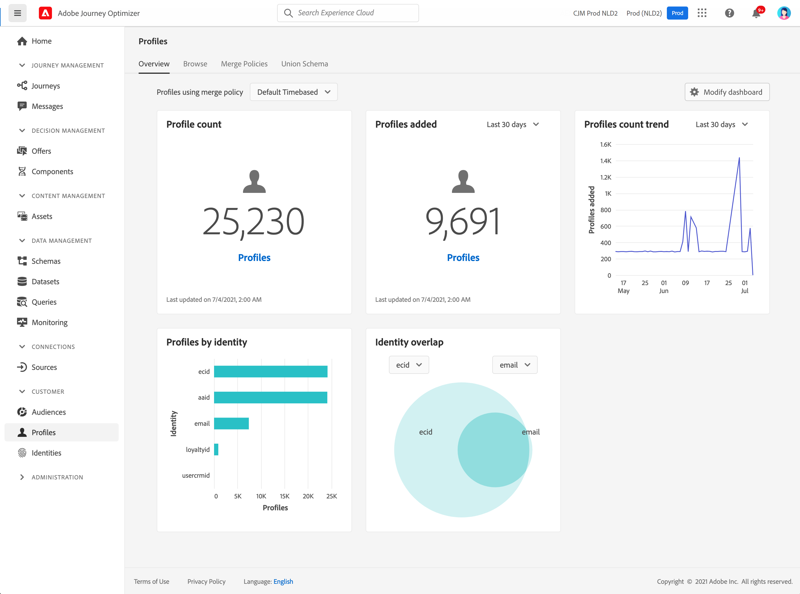

# Guida introduttiva ai profili {#profiles-gs}

Utilizzo del profilo cliente in tempo reale in [!DNL Adobe Journey Optimizer] per visualizzare una visualizzazione olistica di ogni singolo cliente combinando dati provenienti da più canali, inclusi online, offline, CRM e di terze parti. **Profili** consente di consolidare i dati dei clienti in una visualizzazione unificata che offre un account utilizzabile e con marca temporale per ogni interazione con il cliente.

>[!NOTE]
>
>Se la tua organizzazione è nuova a [!DNL Adobe Journey Optimizer] e non dispone ancora di set di dati di profilo attivi o di criteri di unione creati, il **Profili** dashboard non è visibile. Invece, **Panoramica** Visualizza i collegamenti alla documentazione di Adobe Experience Platform per aiutarti a iniziare con Profilo cliente in tempo reale.

Per scoprire come accedere e lavorare con **Dashboard dei profili** e informazioni dettagliate sulle metriche visualizzate nel dashboard, consulta [questa sezione](https://experienceleague.adobe.com/docs/experience-platform/profile/ui/user-guide.html?lang=it){target=&quot;_blank&quot;}.

Puoi unire frammenti di dati provenienti da più sorgenti e combinarli per ottenere una visualizzazione completa di ciascuno dei tuoi clienti. Quando si riuniscono questi dati, i criteri di unione sono le regole utilizzate per determinare in che modo i dati verranno definiti come prioritari e quali dati verranno combinati per creare la visualizzazione unificata.

Ulteriori informazioni **Unisci criteri** in questo [documentazione](https://experienceleague.adobe.com/docs/experience-platform/profile/merge-policies/ui-guide.html){target=&quot;_blank&quot;}.

**Consulta anche**

* [Documentazione del profilo cliente in tempo reale](https://experienceleague.adobe.com/docs/experience-platform/query/home.html?lang=it){target=&quot;_blank&quot;}
* [Video introduttivo sul profilo cliente in tempo reale](https://experienceleague.adobe.com/docs/experience-platform/profile/home.html?lang=it){target=&quot;_blank&quot;}
