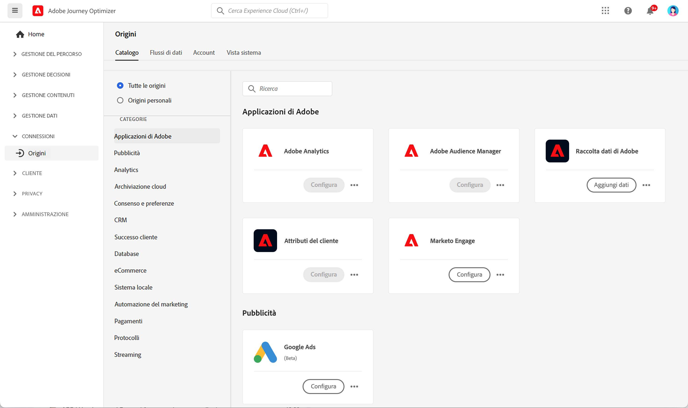

# Introduzione ai connettori di origine {#sources-gs}

Adobe Journey Optimizer consente l’acquisizione di dati da fonti esterne e allo stesso tempo di strutturare, etichettare e migliorare i dati in entrata utilizzando i servizi di Platform. È possibile acquisire dati da diverse origini, ad esempio applicazioni Adobe, archivi basati su cloud, database e molte altre.

Scopri i connettori di origine e come configurarli in Journey Optimizer con questo video:

>[!VIDEO](https://video.tv.adobe.com/v/3422584?captions=ita&quality=12)

Per ulteriori informazioni su come acquisire dati da fonti esterne con i connettori per origini, consulta la [documentazione di Adobe Experience Platform](https://experienceleague.adobe.com/docs/experience-platform/sources/home.html?lang=it){target="_blank"}.
