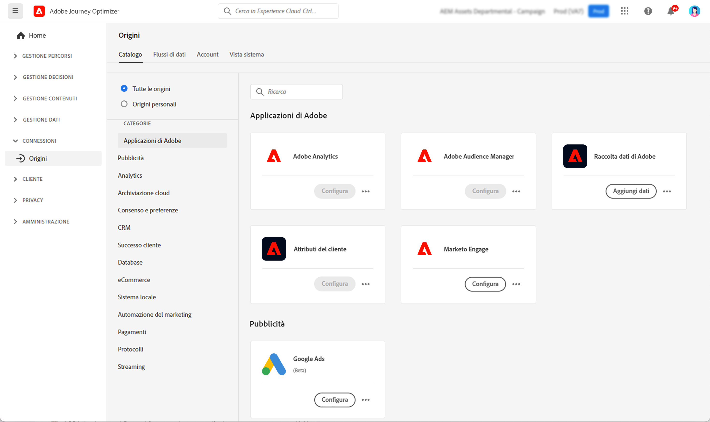

# Introduzione ai connettori di origine {#sources-gs}

## Che cos’è una sorgente? {#what-is-source}

Un **source** è un connettore che porta dati esterni in Adobe Journey Optimizer. Le origini consentono di importare le informazioni sui clienti dai sistemi già in uso, ad esempio piattaforme CRM, archiviazione cloud o database, e di renderli disponibili per la creazione di percorsi di clienti personalizzati.

Considera le origini come ponti tra Journey Optimizer e i sistemi di dati esterni. Sincronizzano automaticamente i dati in modo da disporre sempre di informazioni aggiornate sui clienti per alimentare le campagne di marketing.

## Perché le fonti contano {#why-sources-matter}

Le origini sono essenziali per creare esperienze cliente personalizzate e basate sui dati in Journey Optimizer. Ecco il motivo:

* **Visualizzazione unificata dei clienti** - Combina dati provenienti da più sistemi per visualizzare il quadro completo di ciascun cliente
* **Personalizzazione in tempo reale**: utilizza dati aggiornati per inviare messaggi tempestivi e rilevanti nei tuoi percorsi
* **Sincronizzazione automatizzata dei dati** - Mantieni aggiornate le informazioni del cliente senza importare manualmente i dati
* **Flussi di lavoro efficienti** - Connettiti una volta, quindi i dati fluiscono automaticamente nei tuoi percorsi

Ad esempio, puoi utilizzare le origini per importare la cronologia degli acquisti dalla piattaforma di e-commerce, quindi creare percorsi che inviano consigli di prodotti personalizzati in base a ciò che i clienti hanno acquistato.

## Operazioni possibili con le origini {#sources-use-cases}

I casi d’uso comuni per le origini in Journey Optimizer includono:

* **Importa dati cliente da sistemi CRM** - Sincronizza informazioni di contatto, preferenze e cronologia del coinvolgimento da piattaforme come Salesforce o Microsoft Dynamics
* **Connetti dati di acquisto** - Inserisci la cronologia degli ordini e le preferenze dei prodotti dalle piattaforme di e-commerce per personalizzare le offerte
* **Integrare i dati del programma fedeltà** - Saldi dei punti di accesso e informazioni sui livelli per premiare i clienti più coinvolti
* **Sincronizza dati comportamentali** - Importa interazioni con siti Web e pattern di utilizzo delle app per attivare percorsi rilevanti
* **Aggiorna attributi profilo** - Mantiene aggiornati i profili dei clienti con i dati provenienti dall&#39;archiviazione cloud o dai database

## Tipi di origine comuni {#source-types}

Journey Optimizer supporta diversi tipi di origini per la connessione con i sistemi esistenti:

**Applicazioni Adobe:**
* Adobe Analytics
* Adobe Audience Manager
* Adobe Campaign
* Adobe Commerce

**Archiviazione cloud:**
* Amazon S3
* Archiviazione BLOB di Azure
* Google Cloud Storage
* SFTP

**Database:**
* Amazon Redshift
* Google BigQuery
* Microsoft SQL Server
* MySQL
* PostgreSQL

**Automazione CRM e marketing:**
* Microsoft Dynamics
* Salesforce
* Salesforce Marketing Cloud

➡️ Vedi l&#39;elenco completo nel [catalogo origini Experience Platform](https://experienceleague.adobe.com/docs/experience-platform/sources/home.html#sources-catalog){target="_blank"}

## Prima di iniziare {#prerequisites}

Prima di configurare le origini, assicurati di disporre di:

* **Autorizzazioni appropriate** - Accesso alla gestione delle origini in Adobe Experience Platform
* **Credenziali di sistema di Source** - Dettagli di autenticazione per il sistema esterno da connettere
* **Informazioni sui dati** - Scopri di quali campi dati hai bisogno e come mapparli ai profili Journey Optimizer

➡️ Informazioni su [controllo degli accessi e autorizzazioni](../administration/permissions.md)

## Funzionamento delle origini {#how-sources-work}

Adobe Journey Optimizer utilizza il framework sorgenti di Adobe Experience Platform. Di seguito è riportato il flusso di lavoro di base:

1. **Connetti** - Configura l&#39;autenticazione nel sistema dati esterno
2. **Seleziona dati** - Scegli quali dati importare e con quale frequenza sincronizzare
3. **Mappa campi** - Definisci come i campi dati esterni corrispondono agli attributi del profilo di Journey Optimizer
4. **Pianificazione** - Imposta intervalli di aggiornamento automatico dei dati
5. **Monitoraggio** - Tieni traccia del flusso di dati e risolvi eventuali problemi di sincronizzazione

Una volta configurate, le origini vengono eseguite automaticamente in background, mantenendo i dati dei clienti aggiornati e pronti per l’uso in percorsi.

## Ulteriori informazioni {#learn-more}

Guarda questo video per comprendere i connettori sorgente e come configurarli in Journey Optimizer:

>[!VIDEO](https://video.tv.adobe.com/v/335919?quality=12)

Per informazioni dettagliate sulla configurazione e la gestione delle origini, consulta la [documentazione sulle origini di Adobe Experience Platform](https://experienceleague.adobe.com/docs/experience-platform/sources/home.html?lang=it){target="_blank"}.

## Passaggi successivi {#next-steps}

Ora che capisci cosa sono le sorgenti e perché sono importanti:

* Esplora il [catalogo origini](https://experienceleague.adobe.com/docs/experience-platform/sources/home.html#sources-catalog){target="_blank"} per trovare i connettori per i sistemi
* Scopri come [creare una connessione di origine](https://experienceleague.adobe.com/docs/experience-platform/sources/ui-tutorials/create/overview.html){target="_blank"}
* Comprendere la mappatura e la trasformazione dei dati di [&#128279;](https://experienceleague.adobe.com/docs/experience-platform/sources/ui-tutorials/dataflow/overview.html){target="_blank"}
* Scopri come [utilizzare i dati importati in percorsi](../building-journeys/journey-gs.md)
