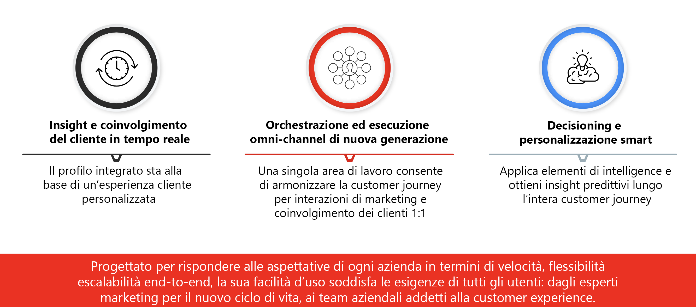

# Introduzione a Journey Optimizer {#cjm-gs}

## Cos’è [!DNL Adobe Journey Optimizer]?{#about-cjm}

[!DNL Adobe Journey Optimizer] aiuta le aziende a fornire ai loro clienti esperienze connesse, contestuali e personalizzate. Il percorso del cliente è l’intero processo di interazione del cliente con il marchio, dal primo momento di contatto fino a quando il cliente se ne va. Inizia con la fase di consapevolezza, in cui il cliente viene a conoscenza del marchio e inizia a essere coinvolto. Il cliente potrà quindi interagire ulteriormente con il marchio, visitare siti online e fisici e fare acquisti, inviare messaggi o pubblicare recensioni.

[!DNL Adobe Journey Optimizer] è stato sviluppato in modalità nativa su [!DNL Adobe Experience Platform] e combina un profilo cliente unificato e in tempo reale, un’infrastruttura aperta API-first, offer decisioning centralizzato, nonché intelligenza artificiale (IA) e machine learning (ML) per la personalizzazione e l’ottimizzazione. Journey Optimizer consente ai brand di determinare in modo intelligente la migliore interazione successiva con scalabilità, velocità e flessibilità lungo l’intero percorso del cliente. Con [!DNL Adobe Journey Optimizer], le aziende possono creare e distribuire all’interno della stessa applicazione sia campagne di marketing pianificate (come le promozioni settimanali di un negozio al dettaglio) che comunicazioni personalizzate (come una notifica push per segnalare a un cliente che è di nuovo disponibile un articolo precedentemente esaurito).

➡️ [Scopri Journey Optimizer](https://experienceleague.adobe.com/docs/journey-optimizer-learn/tutorials/introduction-to-journey-optimizer/introduction.html?lang=it){target="_blank"} (video)

## Casi d’uso {#use-cases}

* Gli addetti al marketing possono utilizzare [!DNL Adobe Journey Optimizer] per inviare comunicazioni personalizzate e comunicazioni batch basate sul pubblico. Ad esempio, un negozio di abbigliamento invia in genere sondaggi post-acquisto a tutti i clienti che hanno acquistato prodotti nell’ultima settimana. A causa delle condizioni climatiche avverse, alcune spedizioni hanno avuto ritardi. Potendo sapere quali clienti non hanno ancora ricevuto le loro spedizioni, il negozio di abbigliamento può escluderli dall’invio del questionario pianificato sulla soddisfazione, inviando loro invece un’e-mail personalizzata di scuse per il ritardo e offrendo un codice sconto con prodotti consigliati in base agli acquisti precedenti.

   Gli addetti al marketing possono inoltre utilizzare l’applicazione per inviare comunicazioni basate sul comportamento in tempo reale. Ad esempio, lo stesso rivenditore potrebbe coinvolgere un cliente fedele che sta entrando nel parcheggio del negozio inviando una notifica push per informarlo che informarlo che è di nuovo disponibile un certo maglione nella sua taglia.

* I non addetti al marketing, come i team operativi e di assistenza clienti coinvolti nell’esperienza del cliente, possono utilizzare [!DNL Adobe Journey Optimizer] per gestire una serie di attività, ad esempio per notifiche operative o per monitorare il processo di onboarding. Prendiamo ad esempio un parco divertimenti i cui i visitatori scaricano un’app mobile come parte dell’esperienza nel parco. Il personale di manutenzione può utilizzare [!DNL Adobe Journey Optimizer] per informare i visitatori dei percorsi attualmente chiusi a causa di manutenzione.

## Funzionalità principali {#key-capabilities}

[!DNL Adobe Journey Optimizer] è un’applicazione agile e scalabile per la creazione e la distribuzione personalizzata, connessa e tempestiva di esperienze cliente tramite qualsiasi app, dispositivo o canale.

Le funzionalità principali includono:

* **Approfondimenti sul cliente in tempo reale e coinvolgimento**: un profilo integrato riunisce i dati live provenienti da tutte le origini nei diversi punti di contatto dei clienti, inclusi i dati comportamentali, transazionali, finanziari e operativi, per ottimizzare le esperienze personali e contestuali dei clienti in tempo reale.

* **Orchestrazione moderna omni-channel ed esecuzione**: un’unica area di lavoro su cui armonizzare e ottimizzare il percorso del cliente per coinvolgimento e attività di marketing 1:1, per consentire ai brand di offrire più valore nel ciclo di vita del cliente. I percorsi del cliente progettati in [!DNL Adobe Journey Optimizer] possono essere dinamici e basati su eventi per aiutare i brand a reagire ai segnali in tempo reale e a collegare tali interazioni con campagne pianificate, in modo da poter prendere le decisioni giuste in merito a quali comunicazioni inviare ai clienti, quando inviarle e attraverso quali canali.

* **Decisioning intelligente e personalizzazione**: i brand possono applicare decisioni centralizzate e incorporare intelligenza artificiale e machine learning per acquisire informazioni predittive in tutta l’esperienza del cliente, semplificando l’automazione delle decisioni e ottimizzando l’esperienza su larga scala. Decisioning potenzia le offerte centralizzate su tutti i canali e su larga scala attraverso [!DNL Adobe Journey Optimizer].

## Architettura {#architecture}

Scopri l’architettura di base di [!DNL Adobe Journey Optimizer], i punti di integrazione e la relazione tra [!DNL Journey Optimizer] ed [!DNL Experience Platform], nel diagramma seguente.

>[!NOTE]
>
> Le linee guida e le procedure generali sulla privacy di Adobe Experience Cloud sono applicabili anche a [!DNL Journey Optimizer]. [Ulteriori informazioni sulla privacy di Adobe Experience Cloud](https://www.adobe.com/it/privacy/experience-cloud.html).
> Prima di iniziare, è inoltre necessario essere a conoscenza di [guardrail per il profilo cliente in tempo reale](https://experienceleague.adobe.com/docs/experience-platform/profile/guardrails.html?lang=it).

**Consulta anche**

* [Passaggi chiave per iniziare](quick-start.md)
* [Progettare i percorsi e inviare i messaggi](../building-journeys/journey-gs.md)
* [Rapporti live](../reports/live-report.md)
* [Domande frequenti su Journey Optimizer](assets/do-not-localize/AJO-FAQ.pdf) (PDF)
* [Panoramica sulla sicurezza di Journey Optimizer](https://www.adobe.com/content/dam/cc/en/security/pdfs/AJO_SecurityOverview.pdf) (PDF)
