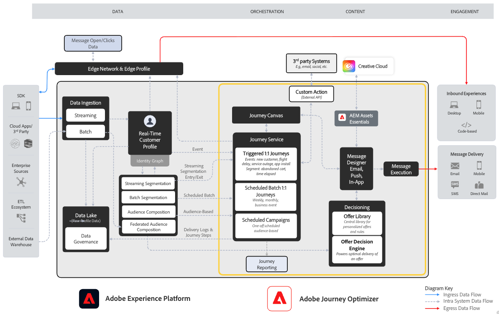

# Introduzione a Journey Optimizer {#cjm-gs}

## Cos’è [!DNL Adobe Journey Optimizer]?{#about-cjm}

[!DNL Adobe Journey Optimizer] aiuta le aziende a fornire ai loro clienti esperienze connesse, contestuali e personalizzate. Per “percorso del cliente” si intende l’intero processo delle interazioni del cliente con il brand, dal primo contatto fino a quando il cliente esce. Inizia con la fase di consapevolezza, in cui il cliente viene a conoscenza del marchio e inizia a essere coinvolto. Il cliente potrà quindi interagire ulteriormente con il marchio, visitare siti online e fisici e fare acquisti, inviare messaggi o pubblicare recensioni.

[!DNL Adobe Journey Optimizer] è stato sviluppato in modalità nativa su [!DNL Adobe Experience Platform] e combina un profilo cliente unificato e in tempo reale, un’infrastruttura aperta API-first, offer decisioning centralizzato, nonché intelligenza artificiale (IA) e machine learning (ML) per la personalizzazione e l’ottimizzazione. Journey Optimizer consente ai brand di determinare in modo intelligente la migliore interazione successiva con scalabilità, velocità e flessibilità lungo l’intero percorso del cliente. Con [!DNL Adobe Journey Optimizer], le aziende possono creare e distribuire all’interno della stessa applicazione sia campagne di marketing pianificate (ad esempio, promozioni settimanali di un negozio al dettaglio) che comunicazioni personalizzate (ad esempio, notifiche push per segnalare a chi usa un’app di fidelizzazione che è di nuovo disponibile un articolo precedentemente esaurito).

➡️ [Scopri Journey Optimizer](https://experienceleague.adobe.com/docs/journey-optimizer-learn/tutorials/introduction-to-journey-optimizer/introduction.html?lang=it){target="_blank"} (video)

<!-- Use [!DNL Adobe Journey Optimizer] to build multi-step customer journeys that initiate a sequence of interactions, offers, and messages across channels in real time. This approach ensures customers are engaged at the optimal moments based on their actions and relevant business signals. Learn how to build journeys in [this section](../building-journeys/journey-gs.md).

You can also create audience-based campaigns to send messages.-->

## Casi d’uso {#use-cases}

* Gli addetti al marketing possono utilizzare [!DNL Adobe Journey Optimizer] per inviare comunicazioni personalizzate e comunicazioni batch basate sul pubblico. Ad esempio, un negozio di abbigliamento invia in genere sondaggi post-acquisto a tutti i clienti che hanno acquistato prodotti nell’ultima settimana. A causa delle condizioni climatiche avverse, alcune spedizioni hanno avuto ritardi. Potendo sapere chi non ha ancora ricevuto le proprie spedizioni, il negozio di abbigliamento può escludere queste persone dall’invio del questionario pianificato sulla soddisfazione, inviando invece un’e-mail personalizzata di scuse per il ritardo e offrendo un codice sconto con prodotti consigliati in base agli acquisti precedenti.

  I marketer possono inoltre utilizzare l’applicazione per inviare comunicazioni basate sul comportamento in tempo reale. Ad esempio, lo stesso rivenditore potrebbe coinvolgere una persona che sta entrando nel parcheggio del negozio inviando una notifica push per informarla che è di nuovo disponibile un certo maglione nella sua taglia.

* I non addetti al marketing, come i team operativi e di assistenza clienti coinvolti nell’esperienza del cliente, possono utilizzare [!DNL Adobe Journey Optimizer] per gestire una serie di attività, ad esempio per notifiche operative o per monitorare il processo di onboarding. Prendiamo ad esempio un parco divertimenti i cui i visitatori scaricano un’app mobile come parte dell’esperienza nel parco. Il personale di manutenzione può utilizzare [!DNL Adobe Journey Optimizer] per informare i visitatori dei percorsi attualmente chiusi a causa di manutenzione.

## Funzionalità principali {#key-capabilities}

[!DNL Adobe Journey Optimizer] è un’applicazione agile e scalabile per la creazione e la distribuzione personalizzata, connessa e tempestiva di esperienze cliente tramite qualsiasi app, dispositivo o canale.

Le funzionalità principali includono:

* **Approfondimenti sul cliente in tempo reale e coinvolgimento**: un profilo integrato riunisce i dati live provenienti da tutte le origini nei diversi punti di contatto dei clienti, inclusi i dati comportamentali, transazionali, finanziari e operativi, per ottimizzare le esperienze personali e contestuali dei clienti in tempo reale.

* **Orchestrazione moderna omnicanale ed esecuzione**: un’unica area di lavoro su cui uniformare e ottimizzare il percorso cliente per coinvolgimento e attività di marketing 1:1, per consentire ai brand di offrire più valore nel ciclo di vita del cliente. I percorsi cliente progettati in [!DNL Adobe Journey Optimizer] possono essere dinamici e basati su eventi per aiutare i brand a reagire ai segnali in tempo reale e a collegare tali interazioni con campagne pianificate, in modo da poter prendere le decisioni giuste in merito a quali comunicazioni inviare alla clientela, quando inviarle e attraverso quali canali.

* **Processi decisionali intelligenti e personalizzazione**: i brand possono applicare decisioni centralizzate e incorporare l’intelligenza artificiale e il machine learning per acquisire insight predittivi in tutta l’esperienza del cliente, in modo da semplificare l’automazione delle decisioni e ottimizzare l’esperienza su larga scala. La funzione Decisioni potenzia le offerte centralizzate su tutti i canali e su larga scala attraverso [!DNL Adobe Journey Optimizer].

>[!NOTE]
>
>* I componenti e le funzionalità disponibili nell’ambiente dipendono dalle [autorizzazioni](../administration/permissions.md) e dal [pacchetto di licenze](https://helpx.adobe.com/it/legal/product-descriptions/adobe-journey-optimizer.html){target="_blank"}. Per qualsiasi domanda, contatta il tuo Adobe Customer Success Manager o il tuo rappresentante Adobe.
>
>* Le linee guida e le procedure generali sulla privacy di Adobe Experience Cloud sono applicabili anche a [!DNL Journey Optimizer]. [Ulteriori informazioni sulla privacy di Adobe Experience Cloud](https://www.adobe.com/it/privacy/experience-cloud.html){target="_blank"}.

## Architettura {#architecture}

Scopri l’architettura di base di [!DNL Adobe Journey Optimizer], i punti di integrazione e la relazione tra [!DNL Journey Optimizer] ed [!DNL Experience Platform], nel diagramma seguente.

Adobe Experience Platform fornisce una base potente, flessibile, aperta e centralizzata che consente di raccogliere, standardizzare e gestire i dati, applicarvi insight basati sull’intelligenza artificiale e unificarli per offrire esperienze cliente digitali ragionate e rilevanti.

{width="70%" zoomable="yes"}

Quattro applicazioni sono create in modalità nativa su Experience Platform: Adobe Real-Time Customer Data Platform, Journey Optimizer, Customer Journey Analytics e Adobe Mix Modeler.

Le funzionalità e i servizi di base di Journey Optimizer funzionano a partire dai componenti fondamentali di Adobe Experience Platform, che include il Profilo cliente in tempo reale. Journey Optimizer funziona in modalità diretta e interoperabile con Real-Time CDP e Customer Journey Analytics, ma può anche funzionare in modo indipendente come un’applicazione autonoma.

{width="70%" zoomable="yes"}

### Blueprint di Adobe Journey Optimizer

I blueprint di esperienze digitali forniscono diagrammi dell’architettura del sistema e del flusso di dati che aiutano a comprendere meglio come Adobe Experience Platform e le applicazioni vengono integrati e implementati. I blueprint forniscono una rappresentazione visiva dei flussi di dati e contenuti tra sistemi e componenti, della sequenza di operazioni e delle dipendenze per contribuire alla progettazione dei casi d’uso e all’architettura di Adobe Experience Platform e delle applicazioni.

Consulta [Blueprint di Adobe Journey Optimizer](https://experienceleague.adobe.com/it/docs/blueprints-learn/architecture/customer-journeys/journey-optimizer/journey-optimizer-overview){target="_blank"}.

>[!MORELIKETHIS]
>
>* [Passaggi fondamentali per iniziare](quick-start.md)
>* [Progettare percorsi e inviare messaggi](../building-journeys/journey-gs.md)
>* [Rapporti live](../reports/live-report.md)
>* [Introduzione al tutorial di Journey Optimizer](https://experienceleague.adobe.com/it/docs/journey-optimizer-learn/tutorials/introduction-to-journey-optimizer/introduction){target="_blank"}
>* [Panoramica sulla sicurezza di Journey Optimizer](https://www.adobe.com/content/dam/cc/en/security/pdfs/AJO_SecurityOverview.pdf) (PDF)
>* [Descrizione del prodotto Journey Optimizer](https://helpx.adobe.com/it/legal/product-descriptions/adobe-journey-optimizer.html){target="_blank"}
