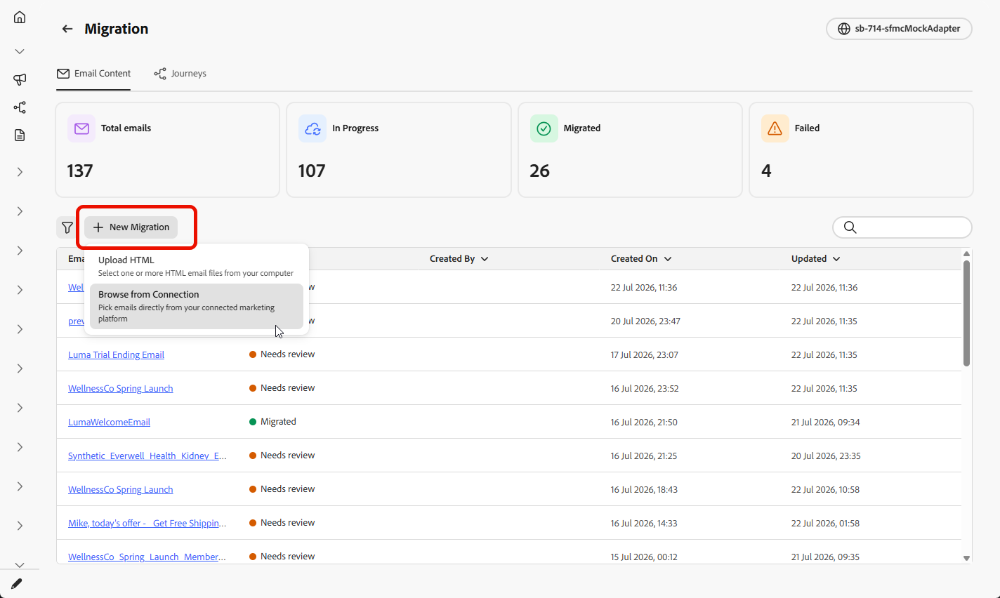
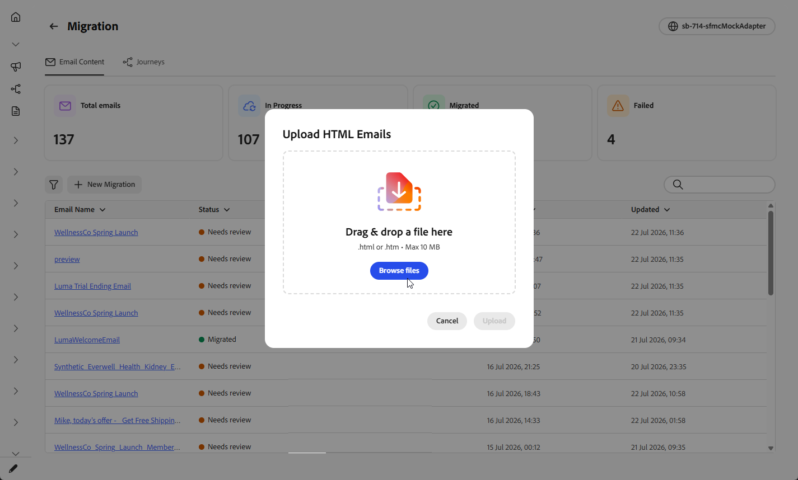
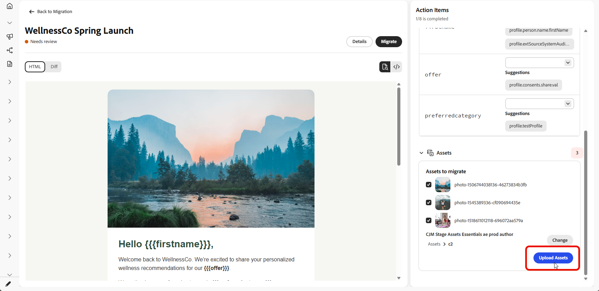
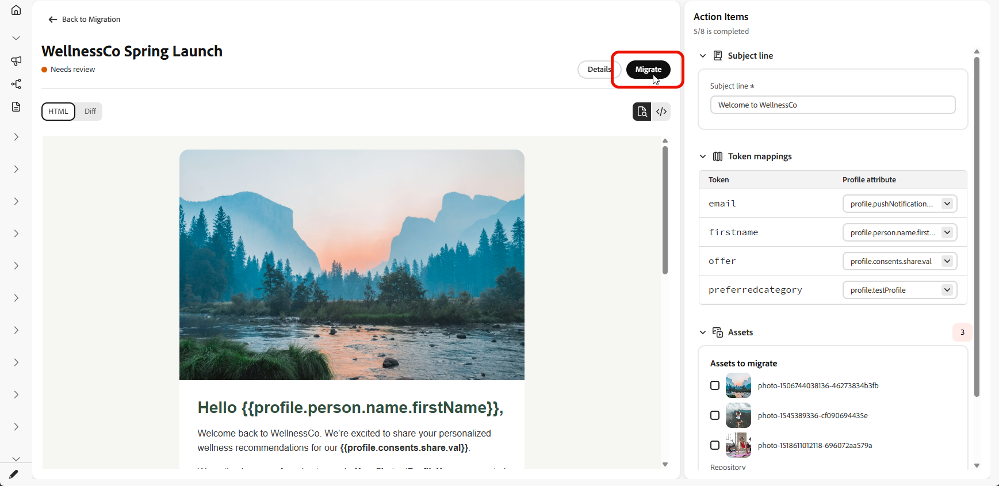

# Migrazione di contenuti e percorsi {#migrate-content-and-journeys}

Se stai passando a [!DNL Journey Optimizer] da un&#39;altra piattaforma di marketing, non è necessario iniziare da una lavagna vuota. Journey Optimizer include un’area di lavoro dedicata che importa il contenuto e i percorsi e-mail esistenti. Vengono convertiti in [!DNL Journey Optimizer] modelli di contenuto e percorsi, in modo da poter scegliere il punto in cui si è interrotto invece di ricostruire tutto da zero.

Per migrare i contenuti e i percorsi a Journey Optimizer, devi disporre delle seguenti autorizzazioni: Gestisci campagne, Gestisci Percorsi, Gestisci messaggi, Gestisci segmenti, Gestisci elementi libreria, Visualizza e gestisci sandbox e Gestisci la configurazione dell’integrazione di AJO. [Ulteriori informazioni su ruoli e autorizzazioni](../administration/permissions.md)

È possibile accedere a questa area di lavoro direttamente dalla home page di [!DNL Journey Optimizer].

## Configurare una connessione {#set-up-a-connection}

>[!CONTEXTUALHELP]
>id="ajo_migration_connection_name"
>title="Nome connessione"
>abstract="Un nome descrittivo che identifica il sistema di origine (ad esempio, &quot;Marketing-Automation-Prod&quot;). Deve iniziare con una lettera e contenere solo caratteri alfanumerici, trattini bassi o trattini (4-50 caratteri)."

>[!CONTEXTUALHELP]
>id="ajo_migration_base_api_url"
>title="URL API di base"
>abstract="L’URL principale dell’API, senza percorsi di risorse o stringhe di query, ad esempio https://api.example.com."

>[!CONTEXTUALHELP]
>id="ajo_migration_authentication_method"
>title="Scelta di un metodo di autenticazione"
>abstract="La chiave API invia una singola credenziale con ogni richiesta, mentre OAuth 2.0 utilizza un protocollo basato su token più adatto per le API aziendali e di terze parti."

>[!CONTEXTUALHELP]
>id="ajo_migration_client_id"
>title="ID client"
>abstract="L&#39;identificatore pubblico dell&#39;applicazione, emesso al momento della registrazione al server di autorizzazione."

>[!CONTEXTUALHELP]
>id="ajo_migration_client_secret"
>title="Segreto client"
>abstract="Credenziali riservate note solo all&#39;app e al server di autorizzazione. Non esporlo mai nel codice lato client."

>[!CONTEXTUALHELP]
>id="ajo_migration_token_url"
>title="URL token"
>abstract="Endpoint del server di autorizzazione che emette i token di accesso per il flusso di credenziali del client, che in genere termina in /oauth/token o /token."

>[!NOTE]
>
>Se carichi file HTML o screenshot anziché importarli tramite un’API, non è necessaria alcuna connessione.

Per importare contenuto o percorsi tramite un&#39;API, connettere [!DNL Journey Optimizer] alla piattaforma di origine:

1. Nell&#39;area di lavoro, selezionare **[!UICONTROL Gestisci connessioni]**.

   

1. Fare clic su **[!UICONTROL Nuova connessione]**.

   

1. Compila i dettagli seguenti:

   * **[!UICONTROL Nome connessione]**: nome che identifica il sistema di origine, ad esempio `Marketing-Automation-Prod`. I nomi devono iniziare con una lettera e possono contenere solo lettere, numeri, trattini bassi o trattini, compresi tra 4 e 50 caratteri.
   * **[!UICONTROL URL API di base]**: URL radice dell&#39;API del sistema di origine, senza percorso di risorsa o stringa di query, ad esempio `https://api.example.com`.
   * **[!UICONTROL Descrizione]**: contesto facoltativo per aiutare te e altri utenti a identificare lo scopo della connessione.
   * **[!UICONTROL Metodo di autenticazione]**: modalità di autenticazione di [!DNL Journey Optimizer] nel sistema di origine. Scegliere **Chiave API** per inviare una singola credenziale a ogni richiesta. Scegliere **OAuth 2.0** per utilizzare un protocollo basato su token più adatto alle API aziendali e di terze parti.
   * **[!UICONTROL ID client]**: l&#39;identificatore pubblico assegnato all&#39;applicazione al momento della registrazione con il server autorizzazioni. Richiesto per le connessioni OAuth 2.0.
   * **[!UICONTROL Segreto client]**: le credenziali riservate associate all&#39;ID client. Tienilo privato, in quanto è noto solo alla tua applicazione e al server di autorizzazione. Richiesto per le connessioni OAuth 2.0.
   * **[!UICONTROL URL token]**: l&#39;endpoint del server autorizzazioni che emette i token di accesso per il flusso di credenziali client, in genere con fine in `/oauth/token` o `/token`. Richiesto per le connessioni OAuth 2.0.

     

1. Seleziona **[!UICONTROL Crea]**.

1. Una volta configurata la connessione, utilizza il menu avanzato per eliminarla o per contrassegnarla come predefinita in modo che venga preselezionata alla successiva importazione di contenuto o percorsi.

   

## Importa contenuto e-mail {#import-email-content}

Dopo aver creato un&#39;origine per il contenuto, un file HTML o una connessione alla piattaforma di origine, importarla nell&#39;area di lavoro per convertirla in un modello di contenuto [!DNL Journey Optimizer].

1. Dalla scheda **[!UICONTROL Contenuto e-mail]**, scegli come desideri importare il contenuto delle e-mail:

   * **[!UICONTROL Carica HTML]**: seleziona uno o più file di posta elettronica di HTML dal computer.

   * **[!UICONTROL Sfoglia dalla connessione]**: sfoglia e seleziona le e-mail direttamente dalla piattaforma di marketing connessa, senza dover esportare e caricare i file manualmente.

   

1. Per un caricamento HTML, cerca il file o trascinalo nell’area di caricamento. Al termine, fai clic su **[!UICONTROL Carica]**.

   I file devono essere in formato `.html` o `.htm` e non devono superare i 10 MB.

   

1. Per importare dalla connessione, scegliere dall&#39;elenco E-mail e fare clic su **[!UICONTROL Importa]**.

1. Accedi all’e-mail importata e controlla il HTML importato.

1. Aggiungi la **[!UICONTROL riga dell&#39;oggetto]** e mappa ogni segnaposto di personalizzazione all&#39;attributo di profilo corrispondente.

   L&#39;area di lavoro converte automaticamente la sintassi di script di origine in sintassi Handlebars. Per un elenco degli operatori supportati, vedere [Operatori](https://experienceleague.adobe.com/it/docs/journey-optimizer/using/content-management/personalization/functions/operators).

   

1. Seleziona una cartella per caricare le immagini dell&#39;e-mail in [!DNL Experience Manager Assets] e fai clic su **[!UICONTROL Carica risorse]**.

   

1. Quando l&#39;e-mail è pronta, seleziona **[!UICONTROL Esegui migrazione]**, quindi seleziona **Visualizza in[!DNL Journey Optimizer]** per aprire il nuovo modello di contenuto.

   

Il modello di contenuto è ora disponibile in [!DNL Journey Optimizer] e pronto per essere utilizzato nei percorsi.

➡️ [Ulteriori informazioni sul modello di contenuto](../content-management/use-content-templates.md)

## Importa percorsi {#import-journeys}

Ricreare i percorsi importando una schermata del flusso di percorso o connettendosi alla piattaforma di origine.

1. Dalla scheda **[!UICONTROL Percorsi]**, scegli come desideri importare i tuoi percorsi:

   * **[!UICONTROL Carica screenshot]**: seleziona uno o più screenshot dei percorsi dal computer.

   * **[!UICONTROL Sfoglia dalla connessione]**: sfoglia e seleziona i percorsi direttamente dalla piattaforma di marketing connessa, senza dover esportare e caricare manualmente le schermate.

   Scheda 

1. Per un caricamento HTML, cerca il file o trascinalo nell’area di caricamento. Al termine, fai clic su **[!UICONTROL Carica]**.

   I file devono essere in formato png, jpg, gif, webp e non devono superare i 5 MB.

   

1. Per importare dalla connessione, scegliere dall&#39;elenco percorsi e fare clic su **[!UICONTROL Importa]**.

1. Visualizzate in anteprima il percorso generato dall&#39;area di lavoro dall&#39;origine.

1. Dal riquadro **[!UICONTROL Elementi azione]**, risolvere ogni elemento in base al tipo di attività a cui appartiene:

   * Per ogni passaggio del messaggio, seleziona una configurazione di canale e un modello di contenuto.
   * Per ogni attività di **[!UICONTROL Audience]**, seleziona il pubblico.

1. Seleziona **[!UICONTROL Applica modifiche]**, quindi seleziona **Visualizza in[!DNL Journey Optimizer]** per aprire l&#39;area di lavoro del percorso.

   

Il tuo percorso è ora disponibile in [!DNL Journey Optimizer], dove puoi rivedere l&#39;area di lavoro, apportare le modifiche finali e attivarla quando sei pronto per andare &quot;live&quot;.

➡️ [Ulteriori informazioni sulla creazione di Percorsi](../building-journeys/journey-gs.md)

## Tracciare la migrazione {#track-migration-progress}

La panoramica di Workspace consente di tenere traccia di ogni e-mail importata e di trovare rapidamente quelle ancora in attesa di azione. Ogni e-mail importata mostra uno stato di revisione delle esigenze, migrazione o errore, in modo da poter vedere da dove si trova. Un set di KPI nella parte superiore dello schermo fornisce un conteggio immediato degli elementi in ogni stato:

* **Totale e-mail** (o **Totale percorsi**): numero complessivo di elementi importati nell&#39;area di lavoro.
* **In corso**: elementi ancora in fase di revisione o mappatura prima della migrazione.
* **Migrazione effettuata**: elementi convertiti correttamente e disponibili in [!DNL Journey Optimizer].
* **Non riuscito**: elementi di cui non è stato possibile eseguire la migrazione e che richiedono attenzione.

Un set di filtri ti consente di restringere l’elenco dei contenuti e-mail importati in modo da poter concentrarti su un sottoinsieme specifico invece di scorrere ogni elemento. Combina uno o più dei seguenti filtri per trovare quello che stai cercando:

* **[!UICONTROL Stato]**: mostra solo le e-mail con uno stato specifico, ad esempio **[!UICONTROL Da rivedere]**, **[!UICONTROL Migrato]** o **[!UICONTROL Non riuscito]**.
* **[!UICONTROL Creato]**: mostra le e-mail importate entro un intervallo di date specifico.
* **[!UICONTROL Aggiornato]**: mostra le e-mail modificate più di recente in un intervallo di date specifico.

