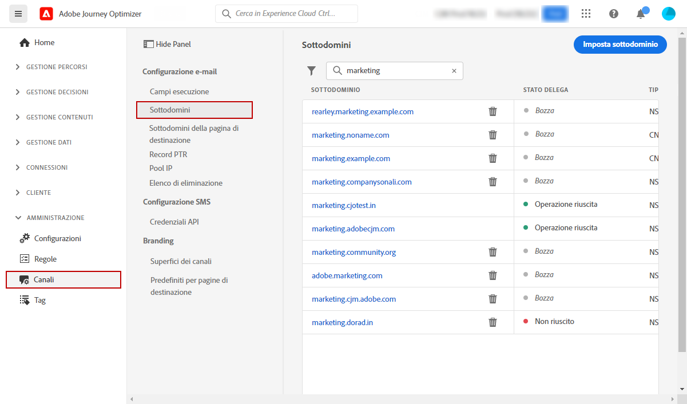
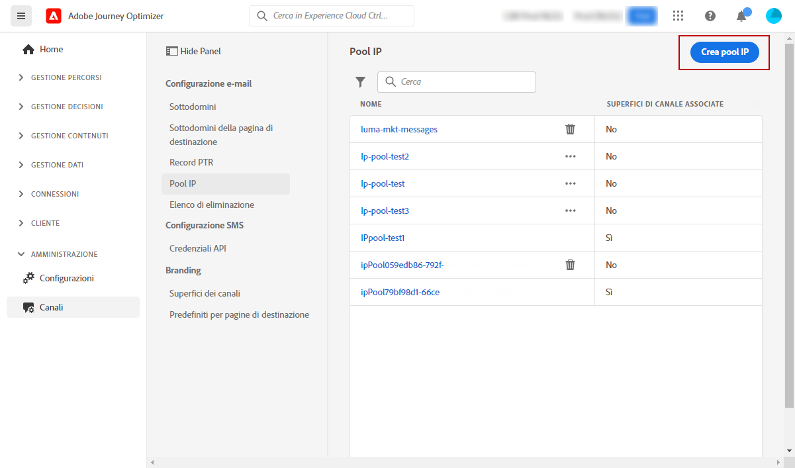
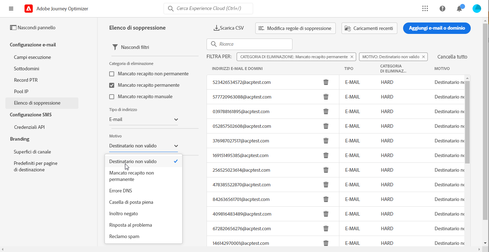

# Guida introduttiva per gli amministratori di sistema {#get-started-sys-admins}

Prima di iniziare a utilizzare [!DNL Adobe Journey Optimizer], sono necessari diversi passaggi per preparare l’ambiente.  Dovrai eseguire questi passaggi prima che [Data Engineer](data-engineer.md) ed [esperti di percorsi](marketer.md) possano iniziare a utilizzare [!DNL Adobe Journey Optimizer].

In qualità di **Amministratore di sistema**, è necessario **comprendere i ruoli e assegnare le autorizzazioni** per l’amministrazione della sandbox e la configurazione dei canali. È inoltre necessario configurare la sandbox (o le sandbox) e gestirla per i ruoli disponibili. Sarai quindi in grado di assegnare i membri del gruppo ai ruoli.

Queste funzionalità possono essere gestite dagli **[!UICONTROL amministratori di prodotto]** che hanno accesso alle autorizzazioni del prodotto. [Ulteriori informazioni sulle Autorizzazioni](../../administration/permissions.md){target="_blank"}.

Per ulteriori informazioni sulla gestione degli accessi, consulta le pagine seguenti:

1. **Creare sandbox** per suddividere le istanze in ambienti virtuali separati e isolati. Le **Sandbox** vengono create in [!DNL Journey Optimizer]. Per ulteriori informazioni, consulta la sezione [Sandbox](../../administration/sandboxes.md).

   >[!NOTE]
   >In qualità di **Amministratore di sistema**, se non riesci a visualizzare il menu **[!UICONTROL Sandbox]** in [!DNL Journey Optimizer], è necessario aggiornare le autorizzazioni. Ulteriori informazioni su come aggiornare il ruolo sono disponibili in [questa pagina](../../administration/permissions.md#edit-product-profile).

1. **Informazioni sui ruoli**. I ruoli sono un set di diritti unitari che consente agli utenti di accedere a determinate funzionalità o oggetti nell’interfaccia. Ulteriori informazioni, sono disponibili nella sezione [ruoli preconfigurati](../../administration/ootb-product-profiles.md).

1. **Imposta le autorizzazioni** per i ruoli, incluse le **sandbox**, e consenti l’accesso ai membri del gruppo assegnandoli a ruoli diversi. Le autorizzazioni sono diritti unitari che ti consentono di definire le autorizzazioni assegnate al **[!UICONTROL Ruolo]**. Ogni autorizzazione viene riunita nelle funzionalità, ad esempio Percorso o Offerte, che rappresentano le diverse funzionalità o oggetti in [!DNL Journey Optimizer]. Per ulteriori informazioni, consulta la sezione [Livelli di autorizzazione](../../administration/high-low-permissions.md).

Inoltre, è necessario aggiungere gli utenti che hanno bisogno di accedere ad Assets Essentials per i ruoli di **Utenti consumer di Assets Essentials** e/o **Utenti di Assets Essentials**. [Ulteriori informazioni sono disponibili nella documentazione di Assets Essentials](https://experienceleague.adobe.com/docs/experience-manager-assets-essentials/help/deploy-administer.html?lang=it){target="_blank"}.

>[!NOTE]
>Per i prodotti di Journey Optimizer ottenuti prima del 6 gennaio 2022, devi implementare [!DNL Adobe Experience Manager Assets Essentials] per la tua organizzazione. Per ulteriori informazioni, consulta la sezione [Distribuire Assets Essentials](https://experienceleague.adobe.com/docs/experience-manager-assets-essentials/help/deploy-administer.html?lang=it){target="_blank"}.

Quando accedi a [!DNL Journey Optimizer] per la prima volta, viene effettuato il provisioning di una sandbox di produzione e viene allocato un determinato numero di IP a seconda del contratto.

Per creare i tuoi percorsi e inviare messaggi, accedi al menu **AMMINISTRAZIONE**. Sfoglia il menu **[!UICONTROL Canali]** per configurare i messaggi e le configurazioni dei canali (ad es. i predefiniti per messaggi).

>[!NOTE]
>In qualità di **Amministratore di sistema**, se non visualizzi il menu **[!UICONTROL Canali]** in [!DNL Journey Optimizer], aggiorna le autorizzazioni in [Autorizzazioni](../../administration/permissions.md){target="_blank"} prodotto.
>

Segui i passaggi seguenti:

1. **Configura i messaggi e i canali**: definisci le configurazioni, adatta e personalizza le impostazioni per e-mail, SMS e messaggi push

   * Definisci le **impostazioni delle notifiche push** sia in [!DNL Adobe Experience Platform] e in [!DNL Adobe Experience Platform Launch]. [Ulteriori informazioni](../../push/push-gs.md)

   * Crea **configurazioni dei canali** (ad esempio, i predefiniti per messaggi) per configurare tutti i parametri tecnici richiesti per e-mail, SMS e notifiche push. [Ulteriori informazioni](../../configuration/channel-surfaces.md)

   * Configura il **Canale SMS** per configurare tutti i parametri tecnici richiesti per gli SMS. [Ulteriori informazioni](../../sms/sms-configuration.md)

   * Gestisci il numero di giorni durante i quali vengono eseguiti **nuovi tentativi** prima di inviare indirizzi e-mail all’elenco di soppressione. [Ulteriori informazioni](../../configuration/manage-suppression-list.md)

1. **Delega sottodomini**: per utilizzare un nuovo sottodominio in Journey Optimizer, il primo passaggio consiste nel delegarlo. [Ulteriori informazioni](../../configuration/about-subdomain-delegation.md)

   

1. **Crea pool IP**: migliora il recapito e la reputazione delle e-mail raggruppando gli indirizzi IP forniti con la tua istanza. [Ulteriori informazioni](../../configuration/ip-pools.md)

   

1. **Gestisci l‘elenco di soppressione e l‘elenco Consentiti**: migliora il recapito messaggi grazie all‘elenco di soppressione e all‘elenco Consentiti

   * Un [elenco di soppressione](../../reports/suppression-list.md) è costituito da indirizzi e-mail che desideri escludere dalle consegne, in quanto l’invio a tali contatti potrebbe danneggiare la reputazione del mittente e i tassi di consegna. Puoi monitorare tutti gli indirizzi e-mail che vengono automaticamente esclusi dall’invio in un percorso, ad esempio indirizzi non validi, indirizzi con regolare mancato recapito non permanente e che potrebbero influenzare negativamente la reputazione delle e-mail e dei destinatari che presentano un reclamo spam di qualsiasi tipo relativo a uno dei tuoi messaggi e-mail. Scopri come gestire l’[elenco di soppressione](../../configuration/manage-suppression-list.md) e i [nuovi tentativi](../../configuration/retries.md).

   

   * L’[elenco Consentiti](../../configuration/allow-list.md) consente di specificare singoli indirizzi e-mail o domini che saranno gli unici destinatari o domini autorizzati a ricevere le e-mail che stai inviando da una sandbox specifica. In questo modo puoi evitare di inviare accidentalmente e-mail a indirizzi reali dei clienti da un ambiente di test. Scopri come [abilitare l’elenco Consentiti](../../configuration/allow-list.md).

   Ulteriori informazioni sulla gestione della recapitabilità dei messaggi in [!DNL Adobe Journey Optimizer] sono disponibili [in questa pagina](../../reports/deliverability.md).
