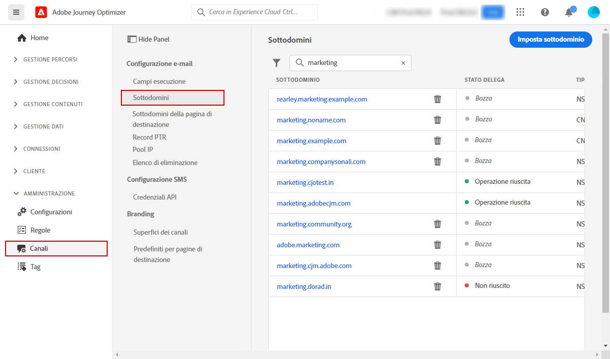
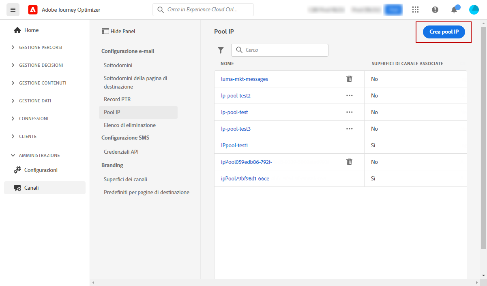
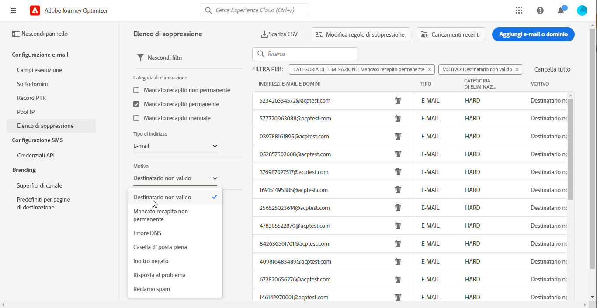

# Guida introduttiva per gli amministratori di sistema {#get-started-sys-admins}

In qualità di **amministratore di sistema**, devi impostare l’ambiente Journey Optimizer e gestire l’accesso per consentire ai team di lavorare in modo efficiente e sicuro. Esegui i passaggi di configurazione essenziali in modo che i [data engineer](data-engineer.md), gli [sviluppatori](developer.md) e i [marketer](marketer.md) possano iniziare a utilizzare [!DNL Adobe Journey Optimizer].

Le tue responsabilità principali includono la configurazione di gruppi di utenti e autorizzazioni, la creazione e la gestione di sandbox per il partizionamento di dati e percorsi per diversi gruppi di utenti e la configurazione di canali di consegna e predefiniti per messaggi per garantire un branding coerente tra i vari messaggi e risorse consegnati tramite Journey Optimizer. Assicurati che le persone giuste abbiano accesso alle funzionalità giuste, mantenendo al contempo la sicurezza e la governance.

Queste funzionalità possono essere gestite dagli **[!UICONTROL amministratori di prodotto]** che hanno accesso alle autorizzazioni del prodotto. [Ulteriori informazioni sulle Autorizzazioni](../../administration/permissions.md){target="_blank"}.

## Impostare l’accesso e le autorizzazioni

Per configurare la gestione degli accessi, segui questi passaggi:

1. **Creare sandbox** per suddividere le istanze in ambienti virtuali separati e isolati. Le **Sandbox** vengono create in [!DNL Journey Optimizer]. Per ulteriori informazioni, consulta la sezione [Sandbox](../../administration/sandboxes.md).

   >[!NOTE]
   >In qualità di **Amministratore di sistema**, se non riesci a visualizzare il menu **[!UICONTROL Sandbox]** in [!DNL Journey Optimizer], è necessario aggiornare le autorizzazioni. Ulteriori informazioni su come aggiornare il ruolo sono disponibili in [questa pagina](../../administration/permissions.md#edit-product-profile).

1. **Informazioni sui ruoli**. I ruoli sono un set di diritti unitari che consente agli utenti di accedere a determinate funzionalità o oggetti nell’interfaccia. Ulteriori informazioni, sono disponibili nella sezione [ruoli preconfigurati](../../administration/ootb-product-profiles.md).

1. **Imposta le autorizzazioni** per i ruoli, incluse le **sandbox**, e consenti l’accesso ai membri del gruppo assegnandoli a ruoli diversi. Le autorizzazioni sono diritti unitari che ti consentono di definire le autorizzazioni assegnate al **[!UICONTROL Ruolo]**. Ogni autorizzazione viene riunita nelle funzionalità, ad esempio Percorso o Offerte, che rappresentano le diverse funzionalità o oggetti in [!DNL Journey Optimizer]. Per ulteriori informazioni, consulta la sezione [Livelli di autorizzazione](../../administration/high-low-permissions.md).

1. **Utilizzare il controllo degli accessi a livello di oggetto** (facoltativo). Applica etichette di accesso a oggetti come percorsi, campagne e configurazioni dei canale per controllare quali utenti possono accedere a risorse specifiche. Ulteriori informazioni su [Controllo degli accessi a livello di oggetto (OLAC)](../../administration/object-based-access.md).

Inoltre, è necessario aggiungere gli utenti che hanno bisogno di accedere ad Assets Essentials per i ruoli di **Utenti consumer di Assets Essentials** e/o **Utenti di Assets Essentials**. [Ulteriori informazioni sono disponibili nella documentazione di Assets Essentials](https://experienceleague.adobe.com/docs/experience-manager-assets-essentials/help/deploy-administer.html?lang=it){target="_blank"}.

Quando accedi a [!DNL Journey Optimizer] per la prima volta, viene effettuato il provisioning di una sandbox di produzione e viene allocato un determinato numero di IP a seconda del contratto.

## Configurare canali e messaggi

Per consentire ai [marketer](marketer.md) di creare e inviare messaggi, accedi al menu **AMMINISTRAZIONE**. Sfoglia il menu **[!UICONTROL Canali]** per configurare le impostazioni dei canali.

>[!NOTE]
>In qualità di **Amministratore di sistema**, se non visualizzi il menu **[!UICONTROL Canali]** in [!DNL Journey Optimizer], aggiorna le autorizzazioni in [Autorizzazioni](../../administration/permissions.md){target="_blank"} prodotto.

Segui questi passaggi:

1. **Imposta le configurazioni dei canali**. Definisci tutti i parametri tecnici richiesti per e-mail, SMS, notifiche push, push web, direct mail e altri canali:

   * Definisci le **impostazioni di notifica push** sia in [!DNL Adobe Experience Platform] che nella Raccolta dati di Adobe Experience Platform. [Ulteriori informazioni](../../push/push-gs.md)

   * Configura le **notifiche push web** per inviare notifiche ai browser di dispositivi mobili e desktop. [Ulteriori informazioni](../../push/push-configuration-web.md)

   * Crea **configurazioni canale** per configurare tutti i parametri tecnici necessari per e-mail, SMS, push, in-app, web e altri canali. [Ulteriori informazioni](../../configuration/channel-surfaces.md)

   * Configura il **Canale SMS** per impostare tutti i parametri tecnici richiesti per gli SMS. [Ulteriori informazioni](../../sms/sms-configuration.md)

   * Gestisci il numero di giorni durante i quali vengono eseguiti **nuovi tentativi** prima di inviare indirizzi e-mail all’elenco di soppressione. [Ulteriori informazioni](../../configuration/manage-suppression-list.md)

   * Abilita l’**esportazione dei messaggi** a livello di configurazione dei canali per archiviare il contenuto di e-mail e SMS inviato quando richiesto (offerta componente aggiuntivo). [Ulteriori informazioni](../../configuration/message-export.md)

1. **Delega sottodomini**: per utilizzare un nuovo sottodominio in Journey Optimizer, il primo passaggio consiste nel delegarlo. [Ulteriori informazioni](../../configuration/about-subdomain-delegation.md). Puoi eseguire la migrazione dei sottodomini da CNAME alla delega personalizzata quando necessario. [Ulteriori informazioni](../../configuration/custom-subdomain-migration.md)

   

1. **Crea pool IP**: migliora il recapito e la reputazione delle e-mail raggruppando gli indirizzi IP forniti con la tua istanza. [Ulteriori informazioni](../../configuration/ip-pools.md)

   

1. **Gestisci l‘elenco di soppressione e l‘elenco Consentiti**: migliora il recapito messaggi grazie all‘elenco di soppressione e all‘elenco Consentiti

   * Un [elenco di soppressione](../../reports/suppression-list.md) è costituito da indirizzi e-mail che desideri escludere dalle consegne, in quanto l’invio a tali contatti potrebbe danneggiare la reputazione del mittente e i tassi di consegna. Puoi monitorare tutti gli indirizzi e-mail che vengono automaticamente esclusi dall’invio in un percorso, ad esempio indirizzi non validi, indirizzi con regolare mancato recapito non permanente e che potrebbero influenzare negativamente la reputazione delle e-mail e dei destinatari che presentano un reclamo spam di qualsiasi tipo relativo a uno dei tuoi messaggi e-mail. Scopri come gestire l’[elenco di soppressione](../../configuration/manage-suppression-list.md) e i [nuovi tentativi](../../configuration/retries.md).

   

   * L’[elenco Consentiti](../../configuration/allow-list.md) consente di specificare singoli indirizzi e-mail o domini che saranno gli unici destinatari o domini autorizzati a ricevere le e-mail che stai inviando da una sandbox specifica. In questo modo puoi evitare di inviare accidentalmente e-mail a indirizzi reali dei clienti da un ambiente di test. Scopri come [abilitare l’elenco Consentiti](../../configuration/allow-list.md).

   Ulteriori informazioni sulla gestione della recapitabilità dei messaggi in [!DNL Adobe Journey Optimizer] sono disponibili [in questa pagina](../../reports/deliverability.md).

## Funzionalità aggiuntive

Man mano che le esigenze della tua organizzazione aumentano, considera queste funzionalità avanzate:

* **Criteri di consenso**: se l’organizzazione ha acquistato Healthcare Shield o Privacy and Security Shield, crea criteri del consenso per rispettare le preferenze della clientela nei vari canali. [Ulteriori informazioni](../../action/consent.md)

* **Criteri di governance dei dati**: applica etichette di utilizzo dei dati e criteri per controllare il modo in cui i dati vengono utilizzati nelle azioni di marketing. [Ulteriori informazioni](../../action/action-privacy.md)

* **Piani di preparazione IP**: aumenta gradualmente i volumi di invio di e-mail per creare la reputazione del mittente con i provider di e-mail. [Ulteriori informazioni](../../configuration/ip-warmup-gs.md)

* **Ore di silenzio**: configura i set di regole per esclusioni basate sul tempo, nei periodi specifici in cui i messaggi non devono essere inviati. [Ulteriori informazioni](../../conflict-prioritization/quiet-hours.md)

## Collaborare tra ruoli

Il tuo lavoro amministrativo consente a tutti i team di avere successo:

>[!BEGINTABS]

>[!TAB Supporto per i data engineer]

Collabora con i [data engineer](data-engineer.md) sulla gestione dei dati e dell’accesso. Rivedi la panoramica di [Introduzione alla gestione dei dati](../../data/gs-data.md) per comprendere gli schemi, i set di dati e le origini dati che i data engineer devono configurare.

* Concedi le autorizzazioni per la gestione dei dati e la creazione di schemi
* Approva l’accesso alla sandbox per lo sviluppo e il test
* Coordina i criteri di conservazione dei dati e le regole di governance
* Abilita l’accesso a funzioni avanzate come la Composizione di pubblico federato

>[!TAB Abilitare gli sviluppatori]

Collabora con gli [sviluppatori](developer.md) per l’accesso e il test delle API:

* Fornisci le credenziali API tramite Adobe Developer Console
* Imposta gli ambienti sandbox per lo sviluppo e il test
* Approva le configurazioni dei canali (certificati push, provider SMS)
* Coordina gli ambienti di test e la strategia di implementazione

>[!TAB Potenziare i marketer]

Collabora con i [marketer](marketer.md) per le autorizzazioni e l’impostazione del canale:

* Assegna le autorizzazioni appropriate per la creazione di percorsi e campagne
* Configura i canali che utilizzeranno (e-mail, push, SMS, ecc.)
* Supporta gli ambienti di test e flussi di lavoro di approvazione
* Abilita l’accesso a nuove funzioni e funzionalità

>[!ENDTABS]

## Passaggi successivi

Una volta configurato l’ambiente:

1. **Verifica l’impostazione**: verifica che tutti i membri del team possano accedere alle funzionalità richieste
2. **Monitora l’utilizzo**: utilizza le dashboard di amministrazione per tenere traccia dell’utilizzo del sistema e identificare i problemi
3. **Gestisci le autorizzazioni**: controlla e aggiorna regolarmente le autorizzazioni man mano che i ruoli del team si evolvono
