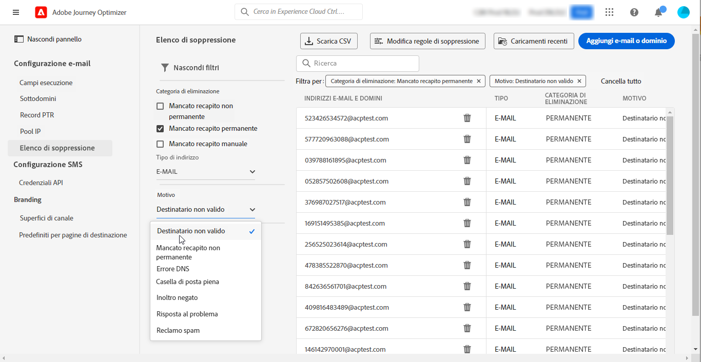

# Guida introduttiva per gli amministratori di sistema {#get-started-sys-admins}

Prima di iniziare a utilizzare [!DNL Adobe Journey Optimizer], sono necessari diversi passaggi per preparare l&#39;ambiente. È necessario eseguire questi passaggi in modo che il [Data Engineer](data-engineer.md) e il [Marketing](marketer.md) possano iniziare a lavorare con [!DNL Adobe Journey Optimizer].

In qualità di **Amministratore di sistema**, è necessario **comprendere i ruoli e assegnare le autorizzazioni** per l’amministrazione della sandbox e la configurazione dei canali. È inoltre necessario impostare le sandbox e gestirle per i ruoli disponibili. Potrai quindi assegnare i membri del gruppo ai ruoli. Mentre [I Data Engineer](data-engineer.md) configurano schemi e origini dati e [gli sviluppatori](developer.md) implementano integrazioni tecniche, assicurati che le persone giuste abbiano accesso alle funzionalità giuste.

Queste funzionalità possono essere gestite dagli **[!UICONTROL amministratori di prodotto]** che hanno accesso alle autorizzazioni del prodotto. [Ulteriori informazioni sulle Autorizzazioni](../../administration/permissions.md){target="_blank"}.

## Configurare l’accesso e le autorizzazioni

Per configurare la gestione degli accessi, segui la procedura riportata di seguito.

1. **Creare sandbox** per suddividere le istanze in ambienti virtuali separati e isolati. Le **Sandbox** vengono create in [!DNL Journey Optimizer]. Per ulteriori informazioni, consulta la sezione [Sandbox](../../administration/sandboxes.md).

   >[!NOTE]
   >In qualità di **Amministratore di sistema**, se non riesci a visualizzare il menu **[!UICONTROL Sandbox]** in [!DNL Journey Optimizer], è necessario aggiornare le autorizzazioni. Ulteriori informazioni su come aggiornare il ruolo sono disponibili in [questa pagina](../../administration/permissions.md#edit-product-profile).

1. **Informazioni sui ruoli**. I ruoli sono un set di diritti unitari che consente agli utenti di accedere a determinate funzionalità o oggetti nell’interfaccia. Ulteriori informazioni, sono disponibili nella sezione [ruoli preconfigurati](../../administration/ootb-product-profiles.md).

1. **Imposta le autorizzazioni** per i ruoli, incluse le **sandbox**, e consenti l’accesso ai membri del gruppo assegnandoli a ruoli diversi. Le autorizzazioni sono diritti unitari che ti consentono di definire le autorizzazioni assegnate al **[!UICONTROL Ruolo]**. Ogni autorizzazione viene riunita nelle funzionalità, ad esempio Percorso o Offerte, che rappresentano le diverse funzionalità o oggetti in [!DNL Journey Optimizer]. Per ulteriori informazioni, consulta la sezione [Livelli di autorizzazione](../../administration/high-low-permissions.md).

1. **Utilizzare il controllo dell&#39;accesso a livello di oggetto** (facoltativo). Applica etichette di accesso a oggetti come percorsi, campagne e configurazioni di canale per controllare quali utenti possono accedere a risorse specifiche. Ulteriori informazioni su [Controllo dell&#39;accesso a livello di oggetto](../../administration/object-based-access.md).

Inoltre, è necessario aggiungere gli utenti che hanno bisogno di accedere ad Assets Essentials per i ruoli di **Utenti consumer di Assets Essentials** e/o **Utenti di Assets Essentials**. [Ulteriori informazioni sono disponibili nella documentazione di Assets Essentials](https://experienceleague.adobe.com/docs/experience-manager-assets-essentials/help/deploy-administer.html?lang=it){target="_blank"}.

Quando accedi a [!DNL Journey Optimizer] per la prima volta, viene effettuato il provisioning di una sandbox di produzione e viene allocato un determinato numero di IP a seconda del contratto.

## Configurare canali e messaggi

Per consentire agli [addetti al marketing](marketer.md) di creare e inviare messaggi, accedere al menu **AMMINISTRAZIONE**. Sfoglia il menu **[!UICONTROL Canali]** per configurare le impostazioni dei canali.

>[!NOTE]
>In qualità di **Amministratore di sistema**, se non visualizzi il menu **[!UICONTROL Canali]** in [!DNL Journey Optimizer], aggiorna le autorizzazioni in [Autorizzazioni](../../administration/permissions.md){target="_blank"} prodotto.

Segui questi passaggi:

1. **Configurare le configurazioni del canale**. Definisci tutti i parametri tecnici richiesti per e-mail, SMS, notifiche push e altri canali:

   * Definisci le **impostazioni di notifica push** sia in [!DNL Adobe Experience Platform] che in Raccolta dati di Adobe Experience Platform. [Ulteriori informazioni](../../push/push-gs.md)

   * Crea **configurazioni canale** per configurare tutti i parametri tecnici necessari per e-mail, SMS, push, in-app, web e altri canali. [Ulteriori informazioni](../../configuration/channel-surfaces.md)

   * Configura il **canale SMS** per impostare tutti i parametri tecnici richiesti per gli SMS. [Ulteriori informazioni](../../sms/sms-configuration.md)

   * Gestisci il numero di giorni durante i quali vengono eseguiti **nuovi tentativi** prima di inviare indirizzi e-mail all’elenco di soppressione. [Ulteriori informazioni](../../configuration/manage-suppression-list.md)

1. **Delega sottodomini**: per utilizzare un nuovo sottodominio in Journey Optimizer, il primo passaggio consiste nel delegarlo. [Ulteriori informazioni](../../configuration/about-subdomain-delegation.md)

   

1. **Crea pool IP**: migliora il recapito e la reputazione delle e-mail raggruppando gli indirizzi IP forniti con la tua istanza. [Ulteriori informazioni](../../configuration/ip-pools.md)

   

1. **Gestisci l‘elenco di soppressione e l‘elenco Consentiti**: migliora il recapito messaggi grazie all‘elenco di soppressione e all‘elenco Consentiti

   * Un [elenco di soppressione](../../reports/suppression-list.md) è costituito da indirizzi e-mail che desideri escludere dalle consegne, in quanto l’invio a tali contatti potrebbe danneggiare la reputazione del mittente e i tassi di consegna. Puoi monitorare tutti gli indirizzi e-mail che vengono automaticamente esclusi dall’invio in un percorso, ad esempio indirizzi non validi, indirizzi con regolare mancato recapito non permanente e che potrebbero influenzare negativamente la reputazione delle e-mail e dei destinatari che presentano un reclamo spam di qualsiasi tipo relativo a uno dei tuoi messaggi e-mail. Scopri come gestire l’[elenco di soppressione](../../configuration/manage-suppression-list.md) e i [nuovi tentativi](../../configuration/retries.md).

   

   * L’[elenco Consentiti](../../configuration/allow-list.md) consente di specificare singoli indirizzi e-mail o domini che saranno gli unici destinatari o domini autorizzati a ricevere le e-mail che stai inviando da una sandbox specifica. In questo modo puoi evitare di inviare accidentalmente e-mail a indirizzi reali dei clienti da un ambiente di test. Scopri come [abilitare l’elenco Consentiti](../../configuration/allow-list.md).

   Ulteriori informazioni sulla gestione della recapitabilità dei messaggi in [!DNL Adobe Journey Optimizer] sono disponibili [in questa pagina](../../reports/deliverability.md).

## Funzionalità aggiuntive

Man mano che le esigenze della tua organizzazione aumentano, considera queste funzionalità avanzate:

* **Criteri di consenso**: se l&#39;organizzazione ha acquistato Healthcare Shield o Privacy and Security Shield, crea criteri di consenso per rispettare le preferenze del cliente nei vari canali. [Ulteriori informazioni](../../action/consent.md)

* **Criteri di governance dei dati**: applica etichette di utilizzo dei dati e criteri per controllare il modo in cui i dati vengono utilizzati nelle azioni di marketing. [Ulteriori informazioni](../../action/action-privacy.md)

* **Piani di riscaldamento IP**: aumenta gradualmente i volumi di invio di e-mail per creare la reputazione del mittente con i provider di e-mail. [Ulteriori informazioni](../../configuration/ip-warmup-gs.md)

## Collaborare con altri ruoli

Il tuo lavoro amministrativo consente a tutti i team di avere successo:

* **Supporto per [Data Engineer](data-engineer.md)**: concedere autorizzazioni per la gestione dei dati, approvare l&#39;accesso alla sandbox e coordinare i criteri di conservazione dei dati

* **Abilita [Sviluppatori](developer.md)**: fornisci le credenziali API, configura gli ambienti sandbox per i test e approva le configurazioni dei canali

* **Potenziare [Gli addetti al marketing](marketer.md)**: assegna le autorizzazioni appropriate per creare percorsi e campagne, configurare i canali da utilizzare e supportare gli ambienti di test

## Rimani aggiornato

Aggiornamenti più recenti della piattaforma Journey Optimizer e modifiche amministrative:

* **[Note sulla versione](../../rn/release-notes.md)**: rivedi nuove funzioni, aggiornamenti della piattaforma, patch di sicurezza e modifiche alla configurazione rilasciati ogni mese
* **[Aggiornamenti alla documentazione](../../rn/documentation-updates.md)**: tieni traccia delle modifiche recenti alle guide alla configurazione, agli aggiornamenti delle autorizzazioni e alle nuove funzionalità amministrative
* **Notifiche prodotto**: abilita le notifiche nel tuo [profilo Adobe Experience Cloud](https://experience.adobe.com/preferences){target="_blank"} per ricevere avvisi critici su:
   * Finestre di manutenzione del sistema e tempi di inattività pianificati
   * Aggiornamenti e patch di sicurezza
   * Nuove funzioni amministrative e modifiche alle autorizzazioni
   * Aggiornamenti delle licenze e delle adesioni
   * Annunci di prodotti critici

  Per abilitare le notifiche, fai clic sull&#39;icona del tuo profilo in alto a destra di Adobe Experience Cloud, vai a **Preferenze > Notifiche** e configura le preferenze per le notifiche Journey Optimizer. In qualità di amministratore, devi abilitare tutte le notifiche critiche del sistema.

## Passaggi successivi

Una volta configurato l’ambiente:

1. **Verifica installazione**: verificare che tutti i membri del team possano accedere alle funzionalità richieste
2. **Monitoraggio dell&#39;utilizzo**: utilizza le dashboard di amministrazione per tenere traccia dell&#39;utilizzo del sistema e identificare i problemi
3. **Gestisci autorizzazioni**: controlla e aggiorna regolarmente le autorizzazioni man mano che i ruoli del team si evolvono
