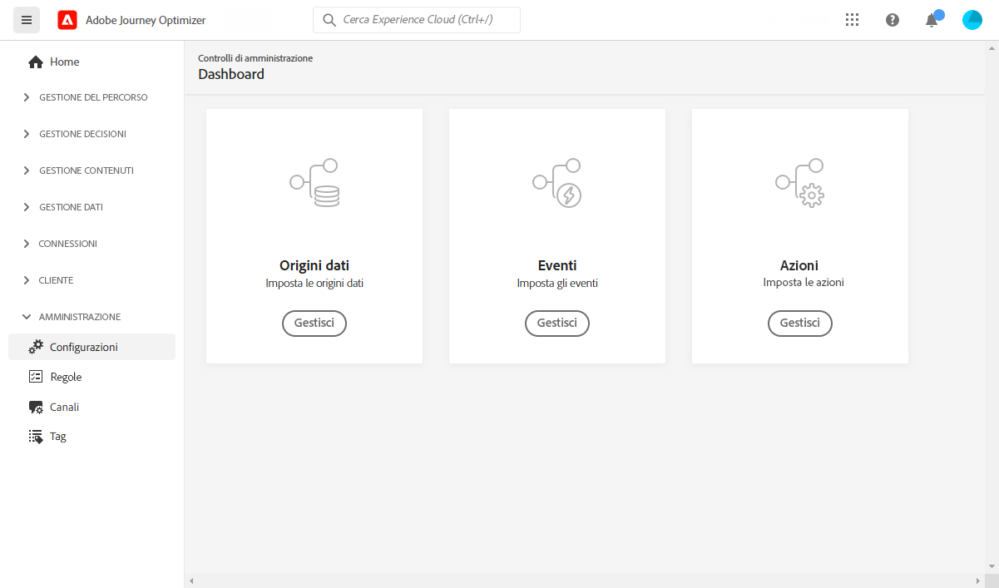

# Guida introduttiva per l’ingegnere dati {#data-engineer}

In qualità di **architetto dati** o **ingegnere dati**, devi impostare e gestire i dati del profilo cliente e altre origini dati che alimentano le esperienze orchestrate da [!DNL Journey Optimizer]. Ciò include l’integrazione di tutti i dati aziendali e dei clienti, provenienti da origini web, CRM o offline, in una visualizzazione unificata a 360 gradi del cliente. Puoi modellare i dati del profilo cliente e i dati aziendali in schemi, configurare connettori sorgente per l’acquisizione dei dati e garantire un flusso di dati fluido per consentire approfondimenti sul cliente e coinvolgimento in tempo reale. Una volta che l’[amministratore di sistema](administrator.md) ti avrà concesso l’accesso e avrà preparato il tuo ambiente, puoi iniziare a lavorare con [!DNL Adobe Journey Optimizer].

>[!NOTE]
>
>Ulteriori informazioni sull’**acquisizione dei dati** nella [documentazione di Adobe Experience Platform](https://experienceleague.adobe.com/docs/experience-platform/ingestion/home.html?lang=it){target="_blank"}.

## Passaggi fondamentali per la configurazione dei dati

Segui questi passaggi per configurare la base dati per Journey Optimizer:

1. **Creare spazi dei nomi di identità**. In Adobe [!DNL Journey Optimizer], le **Identità** collegano i consumatori tra dispositivi e canali creando un grafico delle identità. Il grafico delle identità collegato viene utilizzato per personalizzare le esperienze in base alle interazioni tra tutti i punti di contatto aziendali. Ulteriori informazioni su identità e spazi dei nomi di identità sono disponibili [in questa pagina](../../audience/get-started-identity.md).

   Inoltre, configura **identificatori supplementari** per abilitare lo stesso profilo per immettere più istanze di percorso in base a identificatori secondari come ID ordine o ID prenotazione. Scopri [identificatori supplementari](../../building-journeys/supplemental-identifier.md).

1. **Creare schemi** e abilitarli per i profili. Uno schema è un set di regole che rappresentano e convalidano la struttura e il formato dei dati. In pratica, gli schemi forniscono una definizione astratta di un oggetto reale (ad esempio una persona) e delineano i dati da includere in ogni istanza di tale oggetto (ad esempio nome, cognome, compleanno e così via).

   * Per percorsi e campagne standard: utilizza [schemi XDM](../../data/get-started-schemas.md)
   * Per le campagne orchestrate: crea [schemi relazionali](../../orchestrated/gs-schemas.md) per abilitare la segmentazione con più entità

1. **Crea set di dati** e abilitali per i profili. Un set di dati è un costrutto di archiviazione e gestione per una raccolta di dati, in genere una tabella, che contiene uno schema (colonne) e dei campi (righe). I set di dati contengono anche metadati che descrivono vari aspetti dei dati memorizzati. Una volta creato un set di dati, puoi mapparlo su uno schema esistente e aggiungervi dati. Ulteriori informazioni sui set di dati sono disponibili [in questa pagina](../../data/get-started-datasets.md).

   Per scenari avanzati, prepara **set di dati per le ricerche runtime** per arricchire l&#39;esecuzione del percorso con dati in tempo reale da set di dati record. Scopri [ricerca set di dati](../../building-journeys/dataset-lookup.md).

1. **Configurare i connettori di origine**. Adobe Journey Optimizer consente l’acquisizione di dati da fonti esterne e allo stesso tempo di strutturare, etichettare e migliorare i dati in entrata utilizzando i servizi di Platform. È possibile acquisire dati da diverse origini, ad esempio applicazioni Adobe, archivi basati su cloud, database e molte altre. Ulteriori informazioni sui connettori di origine sono disponibili [in questa pagina](../get-started-sources.md).

1. **Creare profili di test**. I profili di test sono necessari quando si utilizza la [modalità di test](../../building-journeys/testing-the-journey.md) in un percorso e per [visualizzare in anteprima e verificare i messaggi](../../content-management/preview-test.md) prima di inviarli. I passaggi per creare i profili di test sono descritti [in questa pagina](../../audience/creating-test-profiles.md).

1. **Configurare gli attributi calcolati** (facoltativo). Crea attributi derivati dai dati del profilo per semplificare la segmentazione e la personalizzazione. Gli attributi calcolati calcolano automaticamente metriche complesse come &quot;acquisti totali negli ultimi 90 giorni&quot; o &quot;valore medio dell’ordine&quot;. Scopri gli [attributi calcolati](../../audience/computed-attributes.md).

Inoltre, per poter inviare messaggi in percorsi, devi configurare **[!UICONTROL Origini dati]**, **[!UICONTROL Eventi]** e **[!UICONTROL Azioni]**. Per ulteriori informazioni, consulta [questa sezione](../../configuration/about-data-sources-events-actions.md).

* La configurazione dell‘**origine dati** consente di definire una connessione a un sistema per il recupero di informazioni aggiuntive le quali verranno utilizzate nei percorsi. Per ulteriori informazioni sulle origini dati, consulta [questa sezione](../../datasource/about-data-sources.md).

* **Eventi** ti consente di attivare i tuoi percorsi in modo unitario per inviare messaggi in tempo reale all’utente che entra nel percorso. Nella configurazione dell’evento, puoi configurare gli eventi previsti nei percorsi. I dati degli eventi in arrivo vengono normalizzati seguendo Adobe Experience Data Model (XDM). Gli eventi provengono dalle API di acquisizione in streaming per gli eventi autenticati e non autenticati, ad esempio gli eventi SDK di Adobe Mobile. Per ulteriori informazioni sugli eventi, consulta [questa sezione](../../event/about-events.md).

* [!DNL Journey Optimizer] viene fornito con funzionalità per i messaggi incorporate: puoi creare i messaggi all’interno di un percorso e progettare il contenuto. Se per l’invio di messaggi utilizzi un sistema di terze parti, ad esempio Adobe Campaign, è possibile creare un‘**azione personalizzata**. Ulteriori informazioni sulle azioni [sono disponibili in questa sezione](../../action/action.md).

## Monitorare e analizzare i dati del percorso

Una volta che i percorsi sono in esecuzione, puoi eseguire query sugli eventi dei passaggi del percorso nel Data Lake per monitorare le prestazioni, risolvere i problemi e analizzare il comportamento dei clienti. Utilizzare le query SQL per analizzare:

* Modelli di entrata e uscita profilo
* Tassi di errore e motivi di eliminazione
* Prestazioni processo di esportazione Read Audience
* Metriche delle prestazioni delle azioni personalizzate
* Stati e colli di bottiglia dell&#39;istanza di percorso

Esplora gli esempi di query pronti all&#39;uso [per l&#39;analisi dei percorsi](../../reports/query-examples.md) per iniziare a utilizzare l&#39;analisi dei dati e la risoluzione dei problemi.

## Collaborazione tra ruoli

Il lavoro di configurazione dei dati è essenziale per gli altri team:

>[!BEGINTABS]

>[!TAB Lavora con gli amministratori]

Collabora con [Amministratori](administrator.md) per l&#39;accesso e la governance:

* Richiedi le autorizzazioni necessarie per la gestione dei dati e la creazione di schemi
* Coordinazione sull’accesso alla sandbox per sviluppo e test
* Allinea i criteri di governance dei dati e la gestione del consenso
* Analisi delle regole di conservazione dei dati e dei requisiti di storage

>[!TAB Lavora con gli sviluppatori]

Collabora con [sviluppatori](developer.md) sulla struttura dei dati e sugli eventi:

* Fornire schemi XDM e strutture di eventi necessari per l’implementazione
* Definisci quali eventi devono essere inviati e il formato del payload richiesto
* Allineamento ai requisiti di raccolta dei dati e agli standard di qualità dei dati
* Testare insieme la consegna degli eventi e l’acquisizione dei dati

>[!TAB Lavora con gli addetti al marketing]

Collabora con [addetti al marketing](marketer.md) su tipi di pubblico e dati:

* Creare attributi calcolati per la personalizzazione e la segmentazione
* Crea tipi di pubblico in base ai requisiti di campagna e percorso
* Configurare schemi relazionali per campagne orchestrate
* Supporto della segmentazione di più entità per casi d’uso avanzati

>[!ENDTABS]
