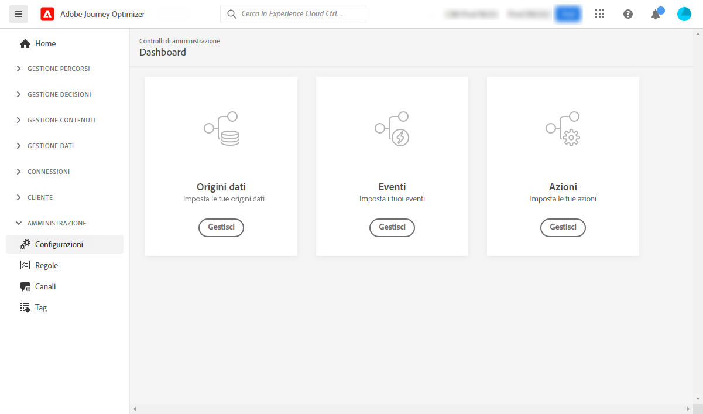

# Guida introduttiva per l’ingegnere dati {#data-engineer}

Come **ingegnere dati di Adobe Journey Optimizer**, devi preparare e gestire i dati del profilo cliente per potenziare le esperienze orchestrate da [!DNL Journey Optimizer], modellare i dati di clienti e aziende negli schemi e configurare i connettori origine per l’acquisizione dei dati. Una volta che l’[amministratore di sistema](administrator.md) ti avrà concesso l’accesso e avrà preparato il tuo ambiente, puoi iniziare a lavorare con [!DNL Adobe Journey Optimizer].

Scopri come **identificare dati e creare schemi e set di dati** per inserire i dati in Adobe Experience Platform in questa pagina.

>[!NOTE]
>
>Ulteriori informazioni sull’**acquisizione dei dati** nella [documentazione di Adobe Experience Platform](https://experienceleague.adobe.com/docs/experience-platform/ingestion/home.html?lang=it){target="_blank"}.

I passaggi per creare uno spazio dei nomi delle identità, un set di dati abilitati per i profili e i profili di test sono descritti nelle sezioni seguenti:

1. **Creare uno spazio dei nomi delle identità**. In Adobe [!DNL Journey Optimizer], le **Identità** collegano i consumatori tra dispositivi e canali creando un grafico delle identità. Il grafo delle identità collegato viene utilizzato per personalizzare le esperienze in base alle interazioni tra tutti i punti di contatto aziendali.  Ulteriori informazioni su identità e spazi dei nomi di identità sono disponibili [in questa pagina](../../audience/get-started-identity.md).

1. **Creare uno schema** e abilitarlo per i profili. Uno schema è un set di regole che rappresentano e convalidano la struttura e il formato dei dati. In pratica, gli schemi forniscono una definizione astratta di un oggetto reale (ad esempio una persona) e delineano i dati da includere in ogni istanza di tale oggetto (ad esempio nome, cognome, compleanno e così via).  Ulteriori informazioni sugli schemi sono disponibili [in questa pagina](../../data/get-started-schemas.md).

1. **Creare set di dati** e abilitarli per i profili. Un set di dati è un costrutto di archiviazione e gestione per una raccolta di dati, in genere una tabella, che contiene uno schema (colonne) e dei campi (righe). I set di dati contengono anche metadati che descrivono vari aspetti dei dati memorizzati. Una volta creato un set di dati, puoi mapparlo su uno schema esistente e aggiungervi dati. Ulteriori informazioni sui set di dati sono disponibili [in questa pagina](../../data/get-started-datasets.md).

1. **Configurare i connettori di origine**. Adobe Journey Optimizer consente l’acquisizione di dati da fonti esterne e allo stesso tempo di strutturare, etichettare e migliorare i dati in entrata utilizzando i servizi di Platform. È possibile acquisire dati da diverse origini, ad esempio applicazioni Adobe, archivi basati su cloud, database e molte altre. Ulteriori informazioni sui connettori di origine sono disponibili [in questa pagina](../get-started-sources.md).

1. **Creare profili di test**. I profili di test sono necessari quando si utilizza la [modalità di test](../../building-journeys/testing-the-journey.md) in un percorso e per [visualizzare in anteprima e verificare i messaggi](../../content-management/preview-test.md) prima di inviarli. I passaggi per creare i profili di test sono descritti [in questa pagina](../../audience/creating-test-profiles.md).

Inoltre, per poter inviare messaggi nei percorsi, devi configurare **[!UICONTROL Origini dati]**, **[!UICONTROL Eventi]** e **[!UICONTROL Azioni]**. Per ulteriori informazioni, consulta [questa sezione](../../configuration/about-data-sources-events-actions.md).

* La configurazione dell‘**origine dati** consente di definire una connessione a un sistema per il recupero di informazioni aggiuntive le quali verranno utilizzate nei percorsi. Per ulteriori informazioni sulle origini dati, consulta [questa sezione](../../datasource/about-data-sources.md).

* **Eventi** ti consente di attivare i tuoi percorsi in modo unitario per inviare messaggi in tempo reale all’utente che entra nel percorso. Nella configurazione dell’evento, puoi configurare gli eventi previsti nei percorsi. I dati degli eventi in arrivo vengono normalizzati seguendo Adobe Experience Data Model (XDM). Gli eventi provengono dalle API di acquisizione in streaming per gli eventi autenticati e non autenticati, ad esempio gli eventi SDK di Adobe Mobile. Per ulteriori informazioni sugli eventi, consulta [questa sezione](../../event/about-events.md).

* [!DNL Journey Optimizer] viene fornito con funzionalità per i messaggi incorporate: puoi creare i messaggi all’interno di un percorso e progettare il contenuto. Se per l’invio di messaggi utilizzi un sistema di terze parti, ad esempio Adobe Campaign, è possibile creare un‘**azione personalizzata**. Per ulteriori informazioni sulle azioni, consulta [questa sezione](../../action/action.md).
