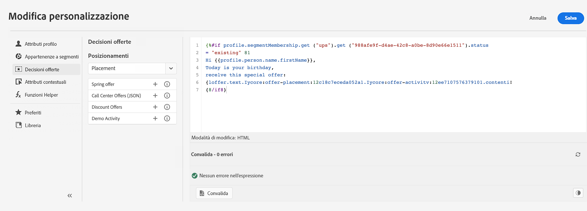
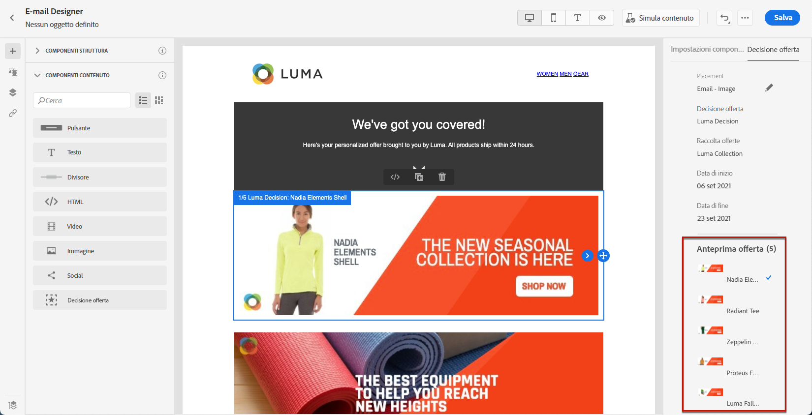
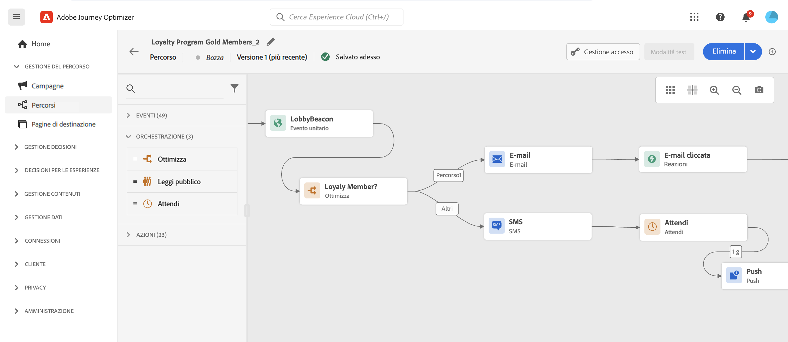

# Introduzione per marketer {#get-started-marketers}

Come **marketer** o **esperto di percorsi**, sei responsabile della creazione di offerte e percorsi e della progettazione del contenuto. Una volta che l’[amministratore di sistema](administrator.md) e il [Data Engineer](data-engineer.md) ti avranno concesso l’accesso e avranno preparato il tuo ambiente, puoi iniziare a lavorare con [!DNL Adobe Journey Optimizer].

Per configurare il primo percorso, aggiungere offerte e risorse e inviare i messaggi, consulta le sezioni seguenti:

1. **Creare tipi di pubblico**. In Journey Optimizer puoi creare tipi di pubblico tramite le definizioni di segmenti direttamente dal menu **Tipi di pubblico** e riutilizzarli quindi nei percorsi.  Ulteriori informazioni sui tipi di pubblico sono disponibili [in questa pagina](../../audience/about-audiences.md). Scopri come generare definizioni di segmenti [in questo esempio](../../audience/creating-a-segment-definition.md).

1. **Aggiungere personalizzazione e contenuti dinamici**. Sfrutta le funzionalità di personalizzazione e per contenuti dinamici di Journey Optimizer per adattare il messaggio al tuo pubblico. Ulteriori informazioni su [personalizzazione](../../personalization/personalize.md) e [contenuti dinamici](../../personalization/get-started-dynamic-content.md).

   

1. **Creare e gestire le risorse**. [!DNL Adobe Experience Manager Assets] fornisce un archivio di risorse unico e centralizzato da utilizzare per compilare i messaggi. [Ulteriori informazioni](../../integrations/assets.md).

1. **Aggiungere offerte**. Utilizza [!DNL Journey Optimizer] per offrire ai clienti l’offerta e l’esperienza migliore al momento giusto, in tutti i punti di contatto. Una volta progettate, puoi indirizzarle al tuo pubblico con offerte personalizzate. Per informazioni sulla gestione delle decisioni, consulta [questa sezione](../../offers/get-started/starting-offer-decisioning.md).

   

1. **Testare e convalidare**. Una volta definito il contenuto, puoi utilizzare profili di test o dati di input di esempio caricati da un file CSV/JSON o aggiunti manualmente per visualizzarne l’anteprima.

   Se hai inserito un [contenuto personalizzato](../../personalization/personalize.md), potrai verificare come viene visualizzato nel messaggio. Inoltre, utilizza in [!DNL Journey Optimizer] le informazioni del tuo account **Litmus** per visualizzare all’istante l’anteprima **Rendering e-mail** nei client e-mail più diffusi. Puoi quindi verificare che il contenuto dell’e-mail si presenti e funzioni correttamente in ogni casella in entrata. Per informazioni su come testare e convalidare i messaggi, consulta [questa sezione](../../content-management/preview-test.md).

1. **Progettare i percorsi cliente** per offrire esperienze personalizzate e contestuali. [!DNL Journey Optimizer] consente di creare casi di utilizzo di orchestrazione in tempo reale sfruttando i dati contestuali archiviati negli eventi o nelle origini dati. Puoi progettare scenari avanzati a più passaggi basati sulle seguenti funzionalità:

   * Invia in tempo reale una **consegna unitaria** attivata quando viene ricevuto un evento o **in batch** utilizzando i tipi di pubblico di Adobe Experience Platform.

   * Sfrutta **dati contestuali** da eventi, informazioni da Adobe Experience Platform o dati da servizi API di terze parti.

   * Utilizza le **azioni canale incorporate** per inviare messaggi progettati in [!DNL Journey Optimizer] o crea **azioni personalizzate** se utilizzi un sistema di terze parti l’invio dei messaggi.

   * Con **journey designer**, genera casi d’uso a più passaggi: trascina facilmente un evento di ingresso o un’attività Leggi pubblico, aggiungi delle condizioni e invia messaggi personalizzati.

   

   Per informazioni su come progettare ed eseguire i percorsi, consulta [questa sezione](../../building-journeys/journey-gs.md)

1. **Monitorare messaggi e percorsi**. Per verificare che i messaggi vengano eseguiti, inviati e consegnati correttamente, [!DNL Journey Optimizer] offre funzionalità per monitorare i messaggi attualmente pubblicati e attivati. Per informazioni su come monitorare le prestazioni, consulta [questa sezione](../../reports/report-gs-cja.md).
