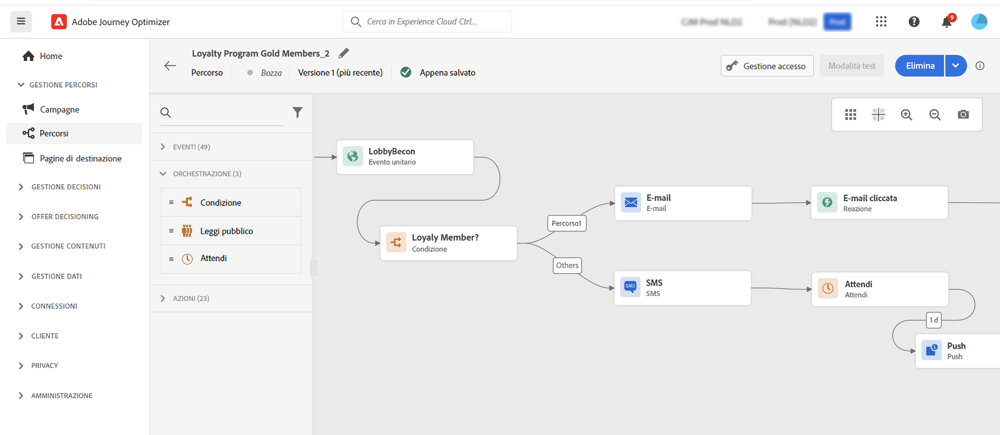

# Introduzione per gli addetti al marketing {#get-started-marketers}

Come **Addetto marketing** o **Praticatore percorso**, l’utente è responsabile della creazione di offerte e percorsi e della progettazione di contenuti. Puoi iniziare a lavorare con [!DNL Adobe Journey Optimizer] una volta che [Amministratore di sistema](administrator.md) e [Ingegnere dati](data-engineer.md) ti ha concesso l&#39;accesso e preparato il tuo ambiente.

Consulta le sezioni seguenti per configurare il primo percorso, aggiungere offerte e risorse e inviare messaggi:

1. **Creare segmenti**. Journey Optimizer consente di creare segmenti di pubblico direttamente dal **Segmenti** e sfruttali nei tuoi percorsi.  Ulteriori informazioni sui segmenti [in questa pagina](../../segment/about-segments.md). Scopri come creare segmenti [in questo campione](../../segment/creating-a-segment.md).

1. **Aggiungere personalizzazione**. Sfrutta le funzionalità di personalizzazione Journey Optimizer per adattare il messaggio al pubblico. Ulteriori informazioni sulla personalizzazione [in questa sezione](../../personalization/personalize.md).

   

1. **Creare e gestire le risorse**. [!DNL Adobe Experience Manager Assets Essentials] fornisce un archivio unico e centralizzato delle risorse che puoi utilizzare per compilare i messaggi. [Ulteriori informazioni](../../design/assets-essentials.md).

1. **Aggiungere offerte**. Utilizza [!DNL Journey Optimizer] per offrire ai clienti l’offerta e l’esperienza migliore al momento giusto, in tutti i punti di contatto. Una volta progettate, puoi indirizzarle al tuo pubblico con offerte personalizzate. Ulteriori informazioni sulla gestione di Decisioning [in questa sezione](../../offers/get-started/starting-offer-decisioning.md).

   

1. **Test e convalida**. Una volta definito il contenuto, puoi utilizzare i profili di test per visualizzarlo in anteprima e testarlo. Se hai inserito [contenuti personalizzati](../../personalization/personalize.md), potrai controllare come questo contenuto viene visualizzato nel messaggio, sfruttando i dati del profilo di test. Inoltre, sfrutta i **Litmo** tenere conto [!DNL Journey Optimizer] per visualizzare istantaneamente l&#39;anteprima del **rendering di e-mail** nei client e-mail popolari. Puoi quindi verificare che il contenuto dell’e-mail sia eccellente e funzioni correttamente in ogni casella in entrata. Scopri come verificare e convalidare i messaggi [in questa sezione](../../design/preview.md).

1. **Progettazione di percorsi cliente** per offrire esperienze personalizzate e contestuali. [!DNL Journey Optimizer] consente di generare casi di utilizzo di orchestrazione in tempo reale sfruttando i dati contestuali archiviati in eventi o origini dati. Progetta scenari avanzati a più passaggi basati sulle seguenti funzionalità:

   * Invia in tempo reale **consegna unitaria** attivato quando viene ricevuto un evento, oppure **in batch** utilizzo di segmenti Adobe Experience Platform.

   * Sfruttamento **dati contestuali** da eventi, informazioni da Adobe Experience Platform o dati da servizi API di terze parti.

   * Utilizza la **azioni di canale integrate** (E-mail, SMS, push) per inviare messaggi progettati in [!DNL Journey Optimizer] o creare **azioni personalizzate** se utilizzi un sistema di terze parti per l’invio dei messaggi.

   * Con la **Progettazione percorsi**, genera i casi di utilizzo con più passaggi: trascina e rilascia facilmente un evento di partecipazione o un’attività di segmento letto, aggiungi condizioni e invia messaggi personalizzati.

   

   Scopri come progettare ed eseguire percorsi [in questa sezione](../../building-journeys/journey-gs.md)

1. **Monitorare messaggi e percorsi**. Per verificare che i messaggi siano correttamente eseguiti, inviati e consegnati, [!DNL Journey Optimizer] offre funzionalità per monitorare i messaggi attualmente pubblicati e attivati. Scopri come monitorare le prestazioni [in questa sezione](../../reports/global-report.md).
