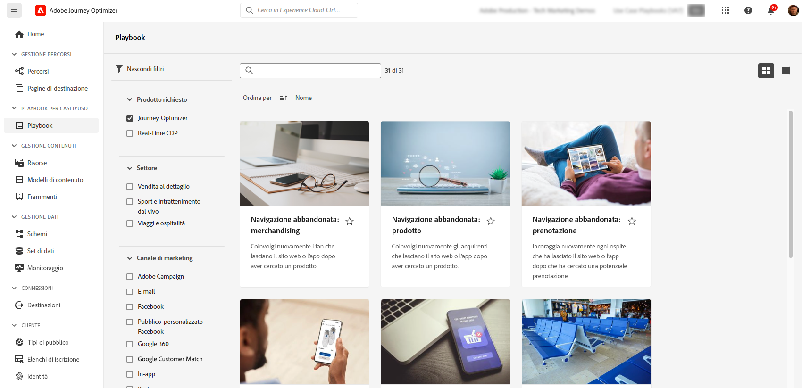

# Usare i playbook sui casi d’uso {#playbooks}

## Che cosa sono i playbook sui casi d’uso {#gs}

I playbook sui casi d’uso sono flussi di lavoro predefiniti che trattano casi d’uso comuni che puoi eseguire utilizzando Adobe Experience Platform e Journey Optimizer.

{width="85%"}

Ogni playbook offre una panoramica completa, che include l’intento, gli obiettivi, le persone di destinazione e le risorse necessarie per implementarlo. Inoltre, in ogni playbook è disponibile una mappa concettuale che rappresenta visivamente i punti di contatto reali dei clienti associati al playbook.

{width="85%"}

## Prerequisiti {#prerequisites}

Prima di utilizzare i playbook sui casi d’uso, è necessario eseguire i seguenti passaggi di configurazione. Informazioni dettagliate su ciascun passaggio sono disponibili nella pagina [Introduzione](https://experienceleague.adobe.com/docs/experience-platform/use-case-playbooks/playbooks/get-started.html?lang=it){target="_blank"} della documentazione dei playbook sui casi d’uso.

* Creare una sandbox
* Configurare le autorizzazioni utente
* Configurare le configurazioni dei canali di Journey Optimizer per le notifiche e-mail, push e SMS

## Accedere e abilitare un playbook {#access}

Per accedere ai playbook, passa al menu **[!UICONTROL Playbook]** situato nella barra di navigazione a sinistra. La libreria include diversi playbook implementati tramite Adobe Journey Optimizer. Per accedervi facilmente, utilizza i filtri disponibili accanto alla barra di ricerca. Un elenco completo dei playbook di Journey Optimizer è disponibile nella [documentazione dei playbook sui casi d’uso](https://experienceleague.adobe.com/docs/experience-platform/use-case-playbooks/playbooks/playbooks-list.html?lang=it){target="_blank"}.

{width="85%"}

Una volta scelto il playbook più adatto alle tue esigenze, puoi abilitarlo. In questo modo viene creata un’istanza del playbook e vengono generate automaticamente le risorse necessarie per supportare un caso d’uso specifico. Tra le risorse figurano quelle di Journey Optimizer come percorsi, messaggi e risorse di Adobe Experience Platform come schemi o segmenti.

>[!NOTE]
>
>Lo scopo di questi oggetti è quello di aiutarti a comprendere tutte le risorse necessarie per implementare un caso d’uso specifico. Non contengono dati e vengono create in sandbox di sviluppo.

Per implementare il caso d’uso, puoi passare a ciascun oggetto per adattarlo alle tue esigenze. Puoi anche condividere l’URL della pagina dell’istanza del playbook tra il team per collaborare all’implementazione del caso d’uso.

Inoltre, puoi importare le risorse dei playbook in altre sandbox. Questo ti consente di allineare le risorse generate alle risorse esistenti e di garantirne la compatibilità con i tuoi dati, nel caso in cui tu abbia già impostato schemi, campi e gruppi di campi personalizzati. Questi passaggi sono descritti nella documentazione dei playbook sui casi d’uso: [Pubblicare risorse generate dal playbook in altre sandbox](https://experienceleague.adobe.com/docs/experience-platform/use-case-playbooks/playbooks/data-awareness.html?lang=it){target="_blank"}.

## Creare playbook personalizzati (Private Beta) {#create}

>[!AVAILABILITY]
>
>La creazione di playbook sui casi d’uso è attualmente disponibile in versione Private Beta solo per un set di organizzazioni. Per potervi accedere, contatta il tuo rappresentante Adobe.

Oltre a sfruttare i playbook predefiniti, puoi creare e condividere i playbook personalizzati in Adobe Experience Platform.

Puoi definire i metadati utilizzando l’assistenza IA o l’input manuale, associare risorse tecniche come schemi e segmenti e condividere i playbook tra diverse organizzazioni IMS.

Per ulteriori informazioni su come creare e condividere playbook, consulta la documentazione dei playbook sui casi d’uso: [Creare e condividere playbook personalizzati utilizzando l’Assistente IA](https://experienceleague.adobe.com/docs/experience-platform/use-case-playbooks/playbooks/author.html?lang=it#sharing-playbooks-sandboxes){target="_blank"}.
