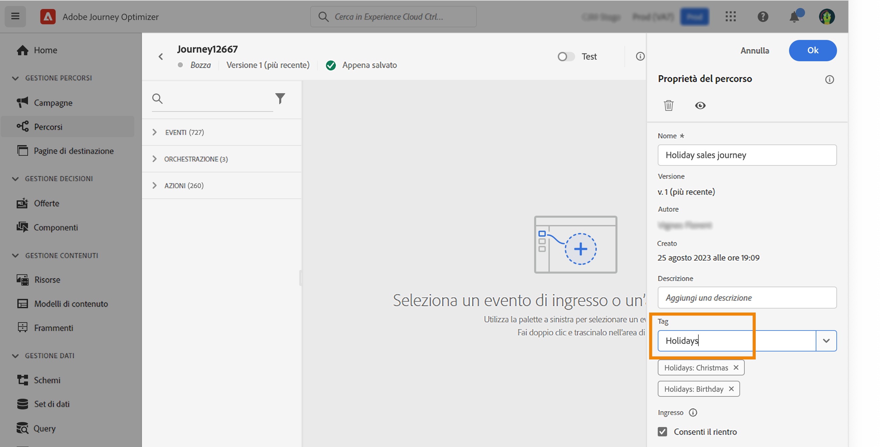
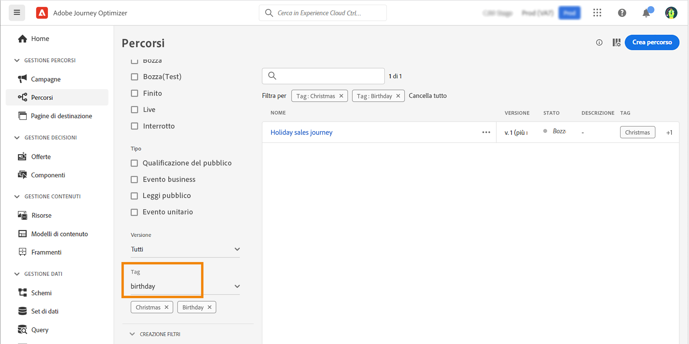

# Cerca, filtra, organizza {#search-filter-organize}

## Cerca{#unified-search}

In qualsiasi area dell’interfaccia di Adobe Journey Optimizer, utilizza la funzione di ricerca unificata di Adobe Experience Cloud al centro della barra superiore per trovare risorse, percorsi, set di dati e altro nelle tue sandbox.

Inizia a immettere il contenuto per visualizzare i risultati migliori. Nei risultati vengono visualizzati anche gli articoli della Guida relativi alle parole chiave inserite.

Premi **Invio** per accedere a tutti i risultati e filtrare per oggetto aziendale.

## Filtrare gli elenchi{#filter-lists}

Nella maggior parte degli elenchi, utilizza la barra di ricerca per trovare elementi specifici e definire criteri di filtro.

Per accedere ai filtri, fai clic sulla relativa icona in alto a sinistra nell’elenco. Il menu del filtro consente di filtrare gli elementi visualizzati in base a diversi criteri: puoi scegliere di visualizzare solo gli elementi di un determinato tipo o stato, quelli creati o quelli modificati negli ultimi 30 giorni. Le opzioni disponibili dipendono dal contesto.

È inoltre possibile utilizzare i tag unificati per filtrare un elenco in base ai tag assegnati a un oggetto. Per il momento, i tag sono disponibili per percorsi e campagne. [Scopri come utilizzare i tag](#tags)

>[!NOTE]
>
>Le colonne visualizzate possono essere personalizzate utilizzando il pulsante di configurazione, posto in alto a destra degli elenchi. La personalizzazione viene salvata per ogni utente.

All’interno degli elenchi, puoi eseguire le azioni di base su ciascun elemento. Ad esempio, è possibile duplicare o eliminare un elemento.

## Utilizza i tag unificati {#tags}

Con i [Tag Unificati](https://experienceleague.adobe.com/docs/experience-platform/administrative-tags/overview.html?lang=it) di Adobe Experience Platform, è possibile classificare facilmente i percorsi e le campagne in Journey Optimizer per migliorare la ricerca dagli elenchi.

>[!AVAILABILITY]
>
>I tag unificati sono attualmente nella versione beta. La documentazione e le funzionalità sono soggette a modifiche.

### Aggiungi tag a un oggetto

Il campo **Tag**, nelle proprietà del [percorso](../building-journeys/journey-gs.md#change-properties) o della [campagna](../campaigns/create-campaign.md#create) consente di definire i tag da assegnare all’oggetto. Puoi selezionare un tag esistente o crearne uno nuovo.

Inizia a digitare il nome del tag desiderato e selezionalo dall’elenco. Se non è disponibile, fai clic su **Crea** per crearne uno nuovo e aggiungerlo. Puoi definire tutti i tag necessari.

L’elenco dei tag definiti viene visualizzato sotto il campo **Tag**.

>[!NOTE]
>
> I tag non distinguono l’uso di maiuscole e minuscole
> 
> Se duplichi o crei una nuova versione di un percorso o di una campagna, i tag vengono mantenuti.

### Filtra i tag

Gli elenchi dei percorsi e delle campagne presentano una colonna dedicata che consente di visualizzare facilmente i tag.

È inoltre disponibile un filtro per visualizzare solo percorsi o campagne con determinati tag.

Puoi aggiungere o rimuovere tag da qualsiasi tipo di percorso o campagna (live, bozza, ecc.). A questo scopo, fai clic sull’icona **Altre azioni** accanto all’oggetto e seleziona **Modifica tag**.

### Gestisci i tag

Gli amministratori possono eliminare i tag e organizzarli per categorie utilizzando il menu **Tag**, sotto **AMMINISTRAZIONE**. Trovi ulteriori informazioni sulla gestione dei tag nella [Documentazione sui tag unificati](https://experienceleague.adobe.com/docs/experience-platform/administrative-tags/ui/managing-tags.html?lang=it).

>[!NOTE]
>
> I tag creati direttamente dal campo **[!UICONTROL Tag]** in Journey Optimizer vengono aggiunti automaticamente alla categoria “Non categorizzato” incorporata.
