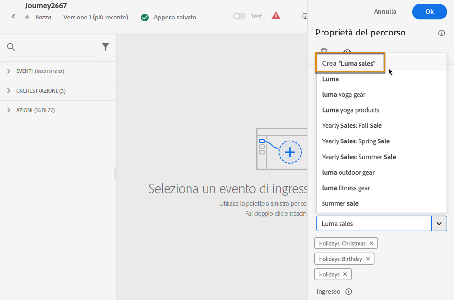

# Cercare, filtrare, organizzare {#search-filter-organize}

## Ricerca {#unified-search}

Dall’interfaccia di Adobe Journey Optimizer, utilizza la funzione di ricerca unificata di Adobe Experience Cloud al centro della barra superiore per trovare risorse, percorsi, set di dati e altro nelle tue sandbox.

Inizia a immettere il contenuto per visualizzare i risultati migliori. Nei risultati vengono visualizzati anche gli articoli della Guida relativi alle parole chiave inserite.

Premi **Invio** per accedere a tutti i risultati e filtrare per oggetto di business.

## Filtrare gli elenchi {#filter-lists}

Nella maggior parte degli elenchi, utilizza la barra di ricerca per trovare elementi specifici e definire criteri di filtro.

Per accedere ai filtri, fai clic sulla relativa icona in alto a sinistra nell’elenco. Il menu del filtro consente di filtrare gli elementi visualizzati in base a diversi criteri: puoi scegliere di visualizzare solo gli elementi di un determinato tipo o stato, quelli creati da te o quelli modificati negli ultimi 30 giorni. Le opzioni disponibili dipendono dal contesto.

È inoltre possibile utilizzare i tag unificati per filtrare un elenco in base ai tag assegnati a un oggetto. Per il momento, i tag sono disponibili per percorsi e campagne. [Scopri come utilizzare i tag](#tags)

>[!NOTE]
>
>Le colonne visualizzate possono essere personalizzate utilizzando il pulsante di configurazione, posto in alto a destra degli elenchi. La personalizzazione viene salvata per ogni utente.

All’interno degli elenchi, puoi eseguire le azioni di base su ciascun elemento. Ad esempio, è possibile duplicare o eliminare un elemento.

## Utilizzare i tag unificati {#tags}

>[!CONTEXTUALHELP]
>id="ajo_campaigns_tags"
>title="Tag"
>abstract="Questo campo consente di assegnare i tag unificati Adobe Experience Platform alla campagna. Questo consente di classificarle facilmente e migliorare la ricerca dall’elenco delle campagne."

Con i [Tag unificati](https://experienceleague.adobe.com/docs/experience-platform/administrative-tags/overview.html?lang=it) di Adobe Experience Platform, è possibile classificare facilmente gli oggetti Journey Optimizer per migliorare la ricerca dagli elenchi.

L’aggiunta di tag significativi ai tipi di pubblico in Journey Optimizer consente di filtrare ed eseguire ricerche in un secondo momento per trovare più facilmente i tipi di pubblico. I tag possono essere utilizzati anche per organizzare i tipi di pubblico in cartelle rilevanti e ricercabili, creare offerte ed esperienze personalizzate e utilizzarli nelle regole di decisione dell’esperienza.

### Aggiungere tag a un oggetto {#add-tags}

Il campo **[!UICONTROL Tag]** consente di definire i tag per l’oggetto. I tag sono disponibili per i seguenti oggetti:

* [Campagne](../campaigns/create-campaign.md)
* [Elementi decisionali](../experience-decisioning/items.md)
* [Frammenti](../content-management/fragments.md)
* [Percorsi](../building-journeys/journey-properties.md)
* [Pagine di destinazione](../landing-pages/create-lp.md)
* [Elenchi di abbonamenti](../landing-pages/subscription-list.md)
* [Modelli](../content-management/content-templates.md)
* [Configurazione del canale](../configuration/channel-surfaces.md#channel-config-tags)

Puoi selezionare un tag esistente o crearne uno nuovo. A questo scopo, segui i passaggi riportati qui sotto.

1. Inizia a digitare il nome del tag desiderato e selezionalo dall’elenco.

   

   >[!NOTE]
   >
   > I tag non fanno distinzione tra maiuscole e minuscole.

1. Se il tag che stai cercando non è disponibile, fai clic su **[!UICONTROL Crea “”]** per definirne uno nuovo: verrà aggiunto automaticamente all’oggetto corrente e sarà disponibile per tutti gli altri oggetti.

   

1. L’elenco dei tag selezionati o creati viene visualizzato sotto il campo **[!UICONTROL Tag]**. Puoi definire tutti i tag necessari.

>[!NOTE]
> 
> Se duplichi o crei una nuova versione di un oggetto, i tag vengono mantenuti.

### Filtrare i tag {#filter-on-tags}

In ogni elenco di oggetti è presente una colonna dedicata che consente di visualizzare facilmente i tag.

È inoltre disponibile un filtro per visualizzare solo gli oggetti a cui sono stati applicati determinati tag.

Puoi aggiungere o rimuovere tag da qualsiasi tipo di percorso o campagna (live, bozza, ecc.). A questo scopo, fai clic sull’icona **[!UICONTROL Altre azioni]** accanto all’oggetto e seleziona **[!UICONTROL Modifica tag]**.

### Gestire i tag {#manage-tags}

Gli amministratori possono eliminare i tag e organizzarli per categorie utilizzando il menu **[!UICONTROL Tag]**, sotto **[!UICONTROL AMMINISTRAZIONE]**. Ulteriori informazioni sulla gestione dei tag sono disponibili nella [Documentazione sui tag unificati](https://experienceleague.adobe.com/docs/experience-platform/administrative-tags/ui/managing-tags.html?lang=it).

>[!NOTE]
>
> I tag creati direttamente dal campo **[!UICONTROL Tag]** in Journey Optimizer vengono aggiunti automaticamente alla categoria incorporata “Non categorizzato”.
