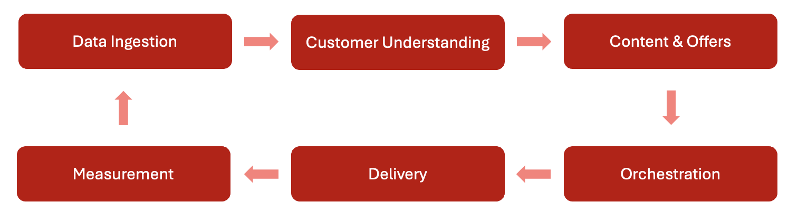

# Informazioni su Journey Optimizer {#understanding-ajo}

Adobe Journey Optimizer (AJO) e Adobe Experience Platform (AEP) collaborano per abilitare la personalizzazione basata sui dati su larga scala. Questa pagina spiega come funzionano questi sistemi e come le loro aree funzionali principali si combinano per offrire ai clienti esperienze eccezionali.

## Come funziona Journey Optimizer {#how-it-works}

Adobe Journey Optimizer funziona come un flusso continuo in cui i dati vengono raccolti, analizzati e applicati per creare percorsi di clienti personalizzati.

### Adobe Experience Platform: la base {#aep-foundation}

Adobe Experience Platform funge da spina dorsale e consente ai brand di centralizzare i dati dei clienti e attivarli per esperienze personalizzate:

* **Piattaforma dati**: hub centrale per la raccolta, la gestione e la strutturazione dei dati dei clienti per garantire la coerenza tra i sistemi
* **Acquisizione dati (origini)** - Importa dati da piattaforme CRM, siti Web, app mobili e archiviazione cloud utilizzando connettori predefiniti
* **Profilo cliente in tempo reale** - Crea profili unificati unendo dati provenienti da più origini (interazioni e-mail, acquisti in-store, comportamento Web)
* **Livello di governance**: disciplina l&#39;accesso ai dati, la conformità alla privacy e la sicurezza nel rispetto delle normative

### Adobe Journey Optimizer: il motore di orchestrazione {#ajo-orchestration}

Adobe Journey Optimizer applica i dati e le informazioni provenienti da AEP per fornire esperienze cliente intelligenti e personalizzate:

* **Informazioni sui clienti** - I profili cliente in tempo reale consentono la segmentazione in tipi di pubblico per la messaggistica mirata
* **Contenuto e offerte** - Strumenti per la creazione, la gestione e la personalizzazione dei contenuti; logica in tempo reale per selezionare l&#39;offerta migliore per ogni persona
* **Gestione Percorsi e campagne** - Automatizza le sequenze di interazioni (percorsi) o pianifica messaggi con targeting occasionale (campagne)
* **Consegna (connessioni)** - Consegna messaggi tramite canali quali e-mail, SMS, notifiche push e direct mail; esporta dati in sistemi esterni
* **Misurazione e analisi**: tiene traccia del coinvolgimento del cliente e delle prestazioni della campagna con rapporti per un miglioramento continuo

### Ciclo di ottimizzazione continua {#optimization-cycle}

Questo ecosistema funziona come un ciclo continuo di ottimizzazione. I dati favoriscono la comprensione dei clienti, che a sua volta contribuisce a determinare contenuti e decisioni personalizzati. Questi vengono orchestrati in percorsi, distribuiti su canali diversi, misurati per verificarne l’efficacia e perfezionati nel tempo.

## Aree funzionali chiave {#functional-areas}

Journey Optimizer include sette aree funzionali chiave in cui la collaborazione è perfetta:

| Area funzionale | Scopo | Attività chiave |
|-----------------|---------|----------------|
| **Gestione dati** | Organizzare i dati dei clienti | Definire schemi, creare set di dati, importare dati da vari sistemi |
| **Gestione clienti** | Chi sono i clienti | Creare profili unificati, risolvere identità e tipi di pubblico |
| **Gestione dei contenuti** | Creare messaggi personalizzati | Progetta le e-mail, gestisci le risorse, crea modelli e frammenti, personalizza il contenuto |
| **Gestione delle decisioni** | Seleziona l’offerta migliore in tempo reale | Gestire la libreria di offerte, definire regole, applicare vincoli, stabilire una logica di classificazione |
| **Gestione Percorso** | Progettare esperienze cliente automatizzate | Creazione di percorsi con la finestra di progettazione visiva, impostazione di trigger, aggiunta di condizioni e passaggi di attesa |
| **Connessioni** | Connettere origini dati e canali | Configurare i connettori di origine, impostare i canali, connettersi alle piattaforme esterne |
| **Amministrazione e privacy** | Configurazione del controllo e conformità | Gestione degli utenti, configurazione delle sandbox, configurazione dei canali, gestione delle richieste di accesso a dati personali |

### Funzionamento congiunto di queste aree {#working-together}

Queste aree funzionali funzionano in ciclo continuo:

1. **Acquisizione dei dati** - Flussi di dati in AEP, strutturati in base alla gestione dati
2. **Informazioni sui clienti** - I profili cliente in tempo reale unificano i dati; la gestione clienti crea tipi di pubblico
3. **Strategia di contenuto e offerta** - Gestione contenuto crea messaggi; Gestione decisioni definisce la logica di offerta
4. **Orchestrazione** - Gestione Percorso esegue il mapping delle interazioni tra i canali utilizzando i dati dei clienti, il contenuto e le decisioni
5. **Consegna** - Le connessioni facilitano la consegna dei messaggi tramite canali o la condivisione di dati con sistemi esterni
6. **Misurazione** - I feed di dati sulle prestazioni restituiscono informazioni per perfezionare tipi di pubblico, contenuti, decisioni e percorsi
7. **Governance** - L&#39;amministrazione e i controlli sulla privacy garantiscono la conformità in tutto

## Dettagli architettura {#architecture-details}

Per i team tecnici, di seguito è riportato il diagramma dettagliato dell’architettura che mostra come Journey Optimizer si integra con Adobe Experience Platform:

Quattro applicazioni sono create in modalità nativa su Experience Platform: Adobe Real-Time Customer Data Platform, Journey Optimizer, Customer Journey Analytics e Adobe Mix Modeler. Journey Optimizer funziona perfettamente con queste applicazioni, ma può anche funzionare in modo indipendente.

### Punti di integrazione {#integration-points}

Journey Optimizer si integra con Adobe Experience Platform a più livelli:

* **Livello dati** - Condivide lo stesso profilo cliente in tempo reale, lo stesso grafico delle identità e gli stessi set di dati
* **Livello di servizio** - Sfrutta i servizi di governance, privacy e query di AEP
* **Livello applicazione** - Fornisce l&#39;orchestrazione del percorso, la gestione delle decisioni e la gestione dei contenuti su AEP

Ulteriori informazioni su [blueprint Adobe Journey Optimizer](https://experienceleague.adobe.com/it/docs/blueprints-learn/architecture/customer-journeys/journey-optimizer/journey-optimizer-overview){target="_blank"}.

## Privacy e sicurezza {#privacy-security}

Le procedure di privacy e sicurezza di Adobe Experience Cloud si applicano a Adobe Journey Optimizer. Queste misure garantiscono la conformità alle normative sulla privacy come il RGPD, consentendoti di fornire esperienze personalizzate mantenendo al contempo la fiducia dei clienti.

[Ulteriori informazioni sulla privacy in Journey Optimizer](../privacy/get-started-privacy.md)

>[!MORELIKETHIS]
>
>* [Introduzione a Journey Optimizer](get-started.md)
>* [Terminologia chiave](terminology.md)
>* [Guida all&#39;interfaccia utente](user-interface.md)
>* [Guardrail e limitazioni](guardrails.md)

