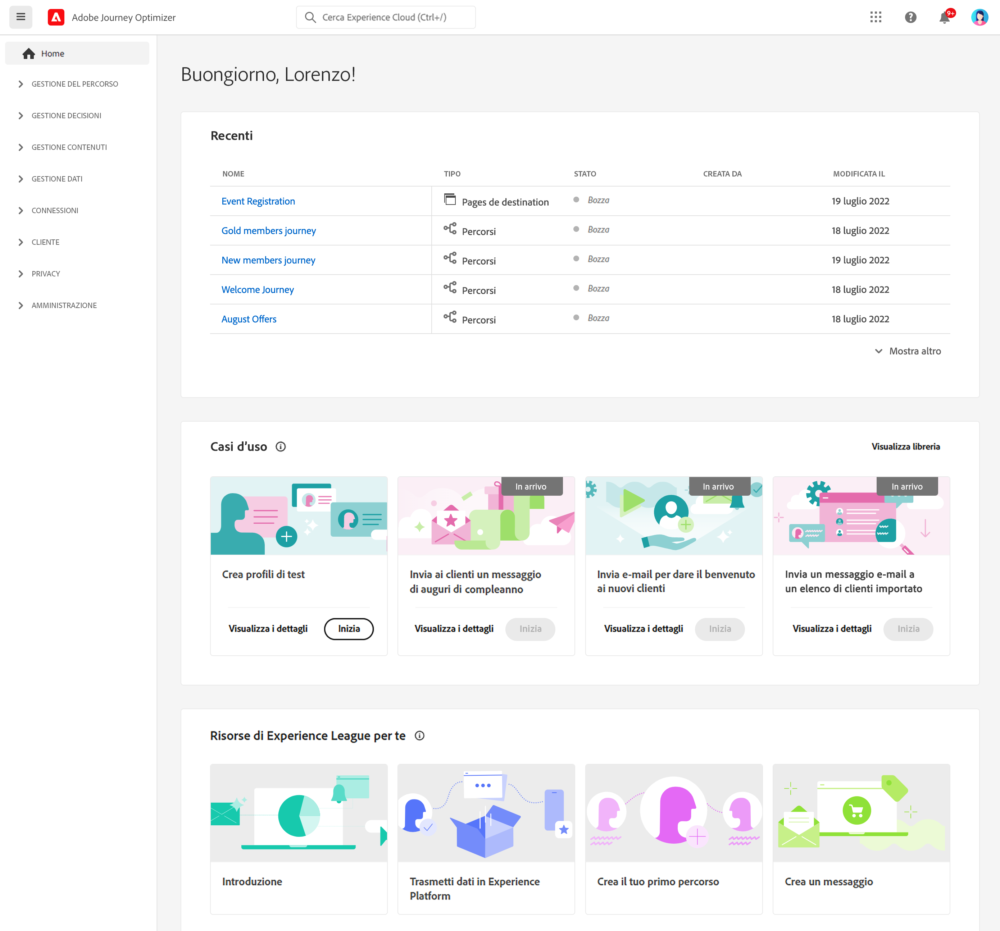
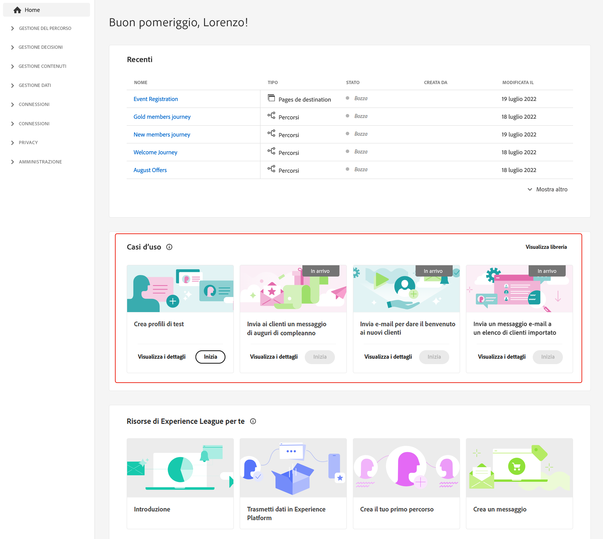
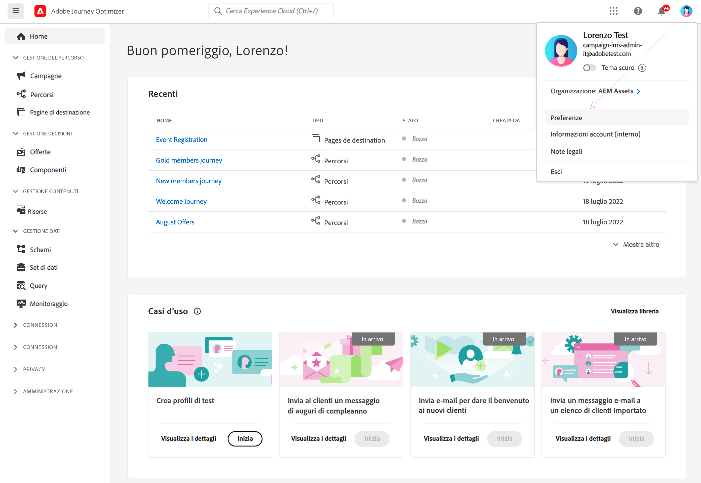
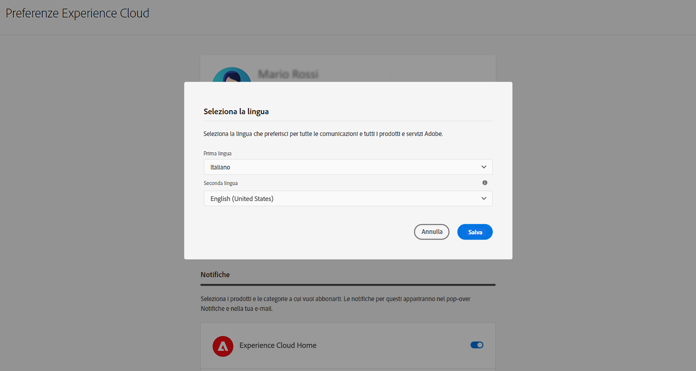

# Interfaccia utente {#cjm-user-interface}

Per accedere a [!DNL Adobe Journey Optimizer], connettiti ad [Adobe Experience Cloud](https://experience.adobe.com) con il tuo Adobe ID e seleziona [!DNL Journey Optimizer].

I concetti chiave della navigazione nell’interfaccia utente sono gli stessi di Adobe Experience Platform. Per ulteriori informazioni, consulta la [documentazione di Adobe Experience Platform](https://experienceleague.adobe.com/docs/experience-platform/landing/platform-ui/ui-guide.html?lang=it#adobe-experience-platform-ui-guide){target="_blank"}.

>[!NOTE]
>
>* I componenti e le funzionalità disponibili nell’ambiente dipendono dalle [autorizzazioni](../administration/permissions.md) e dal [pacchetto di licenze](https://helpx.adobe.com/it/legal/product-descriptions/adobe-journey-optimizer.html){target="_blank"}. Per qualsiasi domanda, contatta il tuo Adobe Customer Success Manager o il tuo rappresentante Adobe.
>
>* Questa documentazione viene aggiornata spesso per riflettere le recenti modifiche all’interfaccia utente del prodotto. Tuttavia, alcune schermate possono risultare leggermente diverse dall’interfaccia del prodotto.
>

## Pannello di navigazione a sinistra {#left-nav}

Sfoglia i collegamenti a sinistra per accedere alle funzionalità di [!DNL Journey Optimizer].

>[!NOTE]
>
>Le funzionalità disponibili possono variare a seconda delle autorizzazioni e del contratto di licenza.

Di seguito è riportato l’elenco completo dei servizi e delle funzionalità disponibili nella barra a sinistra, con i collegamenti alle relative pagine di assistenza.

### Home {#left-nav-home}

La pagina Home di [!DNL Journey Optimizer] contiene collegamenti e risorse chiave per iniziare.

L’elenco **[!UICONTROL Recenti]** fornisce collegamenti agli eventi e ai percorsi creati di recente. Questo elenco mostra le relative date e lo stato di creazione e modifica.

Sfoglia i casi d’uso accessibili dal prodotto per iniziare a creare risorse e messaggi. [Ulteriori informazioni](#in-product-use-cases).

Utilizza i collegamenti nella parte inferiore della pagina Home per scoprire come iniziare con [!DNL Journey Optimizer]. [Ulteriori informazioni](#find-help-and-support).

### [!UICONTROL GESTIONE PERCORSI] {#left-nav-journey}

Crea campagne e percorsi da questa sezione.

* **[!UICONTROL Campagne]**: crea, configura e gestisci campagne per distribuire contenuti una tantum a un pubblico specifico utilizzando vari canali. [Ulteriori informazioni](../campaigns/get-started-with-campaigns.md)

* **[!UICONTROL Percorsi]**: crea, configura e gestisci i percorsi dei clienti combinando gli eventi, le attività di orchestrazione e di azione per creare scenari cross-channel con più passaggi. [Ulteriori informazioni](../building-journeys/journey-gs.md#jo-build)

* **[!UICONTROL Rapporti]**: la funzione di reporting di Journey Optimizer è ora completamente integrata con le funzionalità di Customer Journey Analytics, per standardizzare il reporting su entrambe le piattaforme e migliorare la coerenza e l’affidabilità dei dati. Questa integrazione ottimizzata tra Journey Optimizer e Customer Journey Analytics consente una visione più chiara delle metriche delle prestazioni, a supporto di decisioni più informate. [Ulteriori informazioni](../reports/report-gs-cja.md)

### [!UICONTROL GESTIONE DECISIONI] {#left-nav-decision}

Crea offerte e componenti da questa sezione.

* **[!UICONTROL Offerte]**: accedi alle origini e ai set di dati recenti da questo menu. Usa questa sezione per creare nuove offerte. [Ulteriori informazioni](../offers/offer-library/creating-personalized-offers.md)

* **[!UICONTROL Componenti]**: crea posizionamenti, regole e tag. [Ulteriori informazioni](../offers/offer-library/key-steps.md)

### [!UICONTROL GESTIONE DEI CONTENUTI] {#left-nav-content}

Crea e gestisci i contenuti di questa sezione.

* **[!UICONTROL Risorse]**: [!DNL Adobe Experience Manager Assets] è un archivio centralizzato di risorse che puoi utilizzare per compilare i messaggi. [Ulteriori informazioni](../integrations/assets.md)

* **[!UICONTROL Modelli di contenuto]**: per una progettazione più rapida e migliorata, crea modelli autonomi per riutilizzare facilmente i contenuti personalizzati nelle campagne e nei percorsi di Journey Optimizer. [Ulteriori informazioni](../content-management/content-templates.md)

* **[!UICONTROL Frammenti]**: crea e gestisci frammenti per semplificare il processo di progettazione delle e-mail precompilando blocchi di contenuto personalizzati che possono essere utilizzati per assemblare rapidamente i contenuti delle e-mail. [Ulteriori informazioni](../content-management/fragments.md)

* **[!UICONTROL Pagine di destinazione]**: crea, progetta, testa e pubblica pagine di destinazione per inviare agli utenti i collegamenti ai moduli online in cui possono acconsentire o rinunciare alla ricezione delle comunicazioni o iscriversi a servizi specifici. [Ulteriori informazioni](../landing-pages/get-started-lp.md)

### [!UICONTROL GESTIONE DATI] {#left-nav-data}

Gestisci i dati da questa sezione.

* **[!UICONTROL Schemi]**: utilizza Adobe Experience Platform per creare e gestire gli schemi Experience Data Model (XDM) in un’area di lavoro visiva e interattiva, denominata Editor di schema. [Ulteriori informazioni](../data/get-started-schemas.md)

* **[!UICONTROL Set di dati]**: tutti i dati acquisiti in Adobe Experience Platform vengono mantenuti all’interno del Data lake come set di dati. Un set di dati è un costrutto di archiviazione e gestione per una raccolta di dati, in genere una tabella, che contiene uno schema (colonne) e dei campi (righe). [Ulteriori informazioni](../data/get-started-datasets.md)

* **[!UICONTROL Query]**: utilizza Adobe Experience Platform Query Service per scrivere ed eseguire query, visualizzare le query eseguite in precedenza e accedere a quelle salvate dagli utenti della tua organizzazione. [Ulteriori informazioni](../data/get-started-queries.md)

* **[!UICONTROL Monitoraggio]**: usa questo menu per monitorare l’acquisizione dei dati nell’interfaccia utente di Adobe Experience Platform. Ulteriori informazioni sono disponibili nella [documentazione di Adobe Experience Platform](https://experienceleague.adobe.com/docs/experience-platform/ingestion/quality/monitor-data-ingestion.html?lang=it){target="_blank"}

### [!UICONTROL CONNESSIONI] {#left-nav-connections}

In questa sezione puoi gestire le connessioni dati con altre app e altri cloud.

* **[!UICONTROL Origini]**: utilizza questo menu per acquisire i dati da diverse origini, ad esempio applicazioni Adobe, archivi basati su cloud, database e altro ancora. Puoi strutturare, etichettare e migliorare i dati in arrivo. [Ulteriori informazioni](get-started-sources.md)

* **[!UICONTROL Destinazioni]**: utilizza questo menu per creare una connessione in tempo reale con le posizioni di archiviazione cloud per esportare il contenuto dei set di dati. [Ulteriori informazioni](../data/export-datasets.md)

### [!UICONTROL CLIENTE] {#left-nav-customers}

Gestisci i tuoi tipi di pubblico e i dati del profilo da questa sezione.

* **[!UICONTROL Tipi di pubblico]**: crea e gestisci tipi di pubblico di Experience Platform e sfruttali nei percorsi. [Ulteriori informazioni](../audience/about-audiences.md)

* **[!UICONTROL Elenchi di abbonamenti]**: in [!DNL Journey Optimizer], i clienti che hanno acconsentito a un servizio in abbonamento vengono riuniti in un elenco abbonamenti. [Ulteriori informazioni](../landing-pages/subscription-list.md)

* **[!UICONTROL Profili]**: Il profilo cliente in tempo reale crea una visualizzazione olistica di ciascuno dei singoli clienti, combinando dati provenienti da più canali tra cui dati online, offline, del sistema CRM e di terze parti. [Ulteriori informazioni](../audience/get-started-profiles.md)

* **[!UICONTROL Identità]**: Adobe Experience Platform Identity Service gestisce l’identificazione dei clienti in tempo quasi reale tra dispositivi e canali diversi, in quello che viene definito un grafo di identità in Adobe Experience Platform. [Ulteriori informazioni](../audience/get-started-identity.md)

### [!UICONTROL PRIVACY] {#left-nav-privacy}

Controlla la gestione della privacy e le richieste da questa sezione.

* **[!UICONTROL Criteri]**: Adobe Experience Platform consente di etichettare i campi e creare azioni di marketing per ogni canale. Puoi quindi definire un criterio di governance collegato a un’etichetta e a un’azione di marketing. [Ulteriori informazioni](../action/action-privacy.md)

* **[!UICONTROL Richieste]**: le richieste di privacy sono gestite in Adobe Experience Platform Privacy Service. Fornisce un’API RESTful e un’interfaccia utente per aiutarti a gestire le richieste di dati della clientela. [Ulteriori informazioni](../privacy/requests.md)

* **[!UICONTROL Audit]**: passa a questa sezione per verificare i registri delle attività. [Ulteriori informazioni](../privacy/audit-logs.md)

* **[!UICONTROL Ciclo di vita dei dati]**: questa sezione ti consente di configurare e pianificare le operazioni relative al ciclo di vita dei dati, per una corretta manutenzione dei record. [Ulteriori informazioni](../privacy/data-hygiene.md)

### [!UICONTROL AMMINISTRAZIONE] {#left-nav-admin}

* **[!UICONTROL Configurazioni]**: utilizza questo menu per configurare [eventi](../event/about-events.md), [origini dati](../datasource/about-data-sources.md) e [azioni](../action/action.md) da utilizzare nei percorsi.

  È inoltre possibile accedere alla sezione **Reporting** per configurare i rapporti per la sperimentazione delle campagne e per web o dispositivi mobili. [Ulteriori informazioni](../reports/reporting-configuration.md)

* **[!UICONTROL Regole di business]**: utilizza questa sezione per creare regole di frequenza cross-channel e controllare la frequenza con cui gli utenti ricevono un messaggio o entrano in un percorso. [Ulteriori informazioni](../conflict-prioritization/rule-sets.md)

* **[!UICONTROL Avvisi]** : l’interfaccia utente consente di visualizzare una cronologia degli avvisi ricevuti in base alle metriche rivelate da Adobe Experience Platform Observability Insights. L’interfaccia utente consente inoltre di visualizzare, abilitare e disabilitare le regole di avviso disponibili. [Ulteriori informazioni](../reports/alerts.md)

* **[!UICONTROL Sandbox]**: Adobe Experience Platform fornisce sandbox che suddividono una singola istanza in ambienti virtuali separati, utili per le attività di sviluppo e aggiornamento delle applicazioni di esperienza digitale. Inoltre, [!DNL Journey Optimizer] consente di utilizzare le funzionalità di esportazione e importazione dei pacchetti per copiare oggetti quali percorsi, modelli di contenuto o frammenti in più sandbox. [Ulteriori informazioni](../administration/sandboxes.md)

* **[!UICONTROL Canali]**: utilizza questa sezione per configurare i canali, inclusi i sottodomini, le configurazioni e le impostazioni di recapitabilità. [Ulteriori informazioni](../configuration/get-started-configuration.md)

* **[!UICONTROL Tag]**: con i Tag unificati, è possibile classificare facilmente i percorsi e le campagne per migliorare la ricerca dagli elenchi. [Ulteriori informazioni](../start/search-filter-categorize.md#work-with-unified-tags)

## Casi d’uso accessibili dal prodotto {#in-product-uc}

Dalla pagina home page di [!DNL Adobe Journey Optimizer], i casi d’uso dei prodotti forniscono un input rapido per la creazione di profili di test o il primo percorso della clientela.

+++ **Casi d’uso disponibili**

I casi di utilizzo disponibili sono:

* **Creare profili di test**, per creare profili di test utilizzando il modello CSV per sperimentare messaggi e percorsi personalizzati. Scopri come implementare questo caso d’uso [in questa pagina](../audience/creating-test-profiles.md#use-case-1).
* **Inviare un messaggio di compleanno ai clienti**, per inviare automaticamente un’e-mail ai clienti in occasione del loro compleanno. (disponibile a breve)
* **Invia e-mail per accogliere i nuovi clienti**, per inviare facilmente fino a due e-mail per dare il benvenuto ai clienti appena registrati. (disponibile a breve)
* **Inviare messaggi push a un elenco importato dei clienti**, per inviare rapidamente una notifica push a un elenco di clienti importati da un file CSV. (disponibile a breve)

+++

Per ulteriori informazioni su ogni caso d’uso, fai clic sul collegamento **[!UICONTROL Visualizza dettagli]**.

Per eseguire un caso d’uso, fai clic sul pulsante **[!UICONTROL Inizia]**.

Puoi accedere ai casi d’uso eseguiti dal pulsante **[!UICONTROL Visualizza libreria]**.

## Assistenza e supporto {#find-help}

Dalla sezione inferiore della pagina Home puoi accedere alle pagine importanti della guida di Adobe Journey Optimizer.

Utilizza l’icona **Aiuto** per accedere alle pagine della guida, contattare il supporto e condividere un tuo feedback. Puoi cercare articoli e video di supporto dal campo di ricerca.

In ogni pagina, utilizza i pulsanti di aiuto contestuali per ulteriori informazioni su una funzione e naviga nella documentazione di **[!DNL Adobe Experience League]**.

## Notifiche interne al prodotto {#in-product-notifications}

È possibile abilitare **avvisi interni al prodotto e tramite e-mail** per ricevere notifiche su diversi eventi che potrebbero essere di tuo interesse: errori rilevati dal sistema, richieste di approvazione e/o versioni del prodotto [!DNL Journey Optimizer].

Per abilitare queste notifiche, segui la procedura indicata di seguito.

1. Passa a [!DNL Adobe Experience Cloud] **[!UICONTROL Preferenze]**.
1. In **[!UICONTROL Notifiche]**, individua **[!UICONTROL Journey Optimizer]**.
1. Abilita le notifiche in-app e/o e-mail nel modo desiderato:

   * **[!UICONTROL Avvisi]**: quando si verifica un errore, puoi ricevere notifiche di sistema per gli avvisi di cui disponi dell’abbonamento. [Ulteriori informazioni](../reports/alerts.md)
   * **[!UICONTROL Approvazioni]**: ricevi una notifica quando qualcuno ti chiede di approvare un oggetto o di accedervi.
   * **[!UICONTROL Nuove versioni]**: vengono fornite informazioni su nuove versioni del prodotto [!DNL Journey Optimizer].

{width="70%" align="left"}

## Assistente IA {#ai-assistant}

L’Assistente IA è una funzione dell’interfaccia utente che consente di accedere ai concetti Adobe, comprenderli e ottenere insight operativi per l’ambiente specifico. È disponibile in diversi prodotti Adobe Experience Cloud, tra cui Adobe Journey Optimizer.

Per accedere all’Assistente IA, fai clic sull’icona nella barra superiore. L’Assistente IA viene visualizzato nella sezione destra della schermata.

Per informazioni su come accedere all’Assistente IA e utilizzarlo, visita [questa pagina](ai-assistant.md).

## Preferenze di lingua {#language-pref}

L’interfaccia utente è disponibile nelle seguenti lingue:

* Inglese
* Francese
* Tedesco
* Italiano
* Spagnolo
* Portoghese (brasiliano)
* Giapponese
* Coreano
* Cinese tradizionale
* Cinese semplificato

La lingua predefinita dell’interfaccia è determinata dalla lingua preferita specificata nel profilo utente.

+++ **Come cambiare lingua**

Per cambiare la lingua, segui questi passaggi:

1. Fai clic su **Preferenze** dal tuo avatar, in alto a destra.
   
1. Quindi fai clic sulla lingua visualizzata sotto il tuo indirizzo e-mail
1. Seleziona la lingua preferita e fai clic su **Salva**. Se il componente che utilizzi non è localizzato nella tua lingua, puoi selezionare una seconda lingua.
   

+++

## Ulteriori informazioni {#more}

Hai appena iniziato a utilizzare [!DNL Journey Optimizer]? Sei un utente esperto con domande specifiche? Sei l’amministratore dell’istanza aziendale? [Segui il tuo percorso per raggiungere più velocemente i tuoi obiettivi](quick-start.md).

<!--CONTEXTUAL HELP TO DISPATCH IN DOCS ONCE FEATURE LIVE-->

<!--ORCHESTRATED CAMPAIGNS - Overview page-->

<!--OVERVIEW TAB ORCHESTRATED CAMPAIGNS SKU only-->

>[!CONTEXTUALHELP]
>id="ajo_oc_campaign_ovv_1"
>title="Orchestrazione delle campagne"
>abstract="Dividi, combina, arricchisci e manipola set di dati relazionali per definire il pubblico"

>[!CONTEXTUALHELP]
>id="ajo_oc_campaign_ovv_2"
>title="Sfruttare i dati con più entità"
>abstract="Scopri come le campagne orchestrate possono trarre vantaggio dai set di dati relazionali per arricchire i dati per la segmentazione e la personalizzazione"

>[!CONTEXTUALHELP]
>id="ajo_oc_campaign_ovv_3"
>title="Segmentazione ad hoc e conteggi esatti"
>abstract="Crea un segmento passo dopo passo con conteggi esatti"

>[!CONTEXTUALHELP]
>id="ajo_oc_campaign_ovv_4"
>title="Canali disponibili"
>abstract="E-mail, SMS, Notifiche push, Direct mail"

<!--OVERVIEW TAB ORCHESTRATED CAMPAIGNS + JOURNEYS SKU -->

>[!CONTEXTUALHELP]
>id="ajo_oc_jo_camppaign_ovv_1"
>title="Interfaccia utente guidata per creare e inviare una campagna"
>abstract="Imposta una o più azioni per un canale, scegli un pubblico, imposta i contenuti, definisci una pianificazione ed è tutto pronto per l’invio"

>[!CONTEXTUALHELP]
>id="ajo_oc_jo_camppaign_ovv_2"
>title="Canali disponibili"
>abstract="E-mail, SMS, Notifiche push, In-app, Web, Esperienze basate su codice"

<!--OVERVIEW TAB ORCHESTRATED CAMPAIGNS - API triggered tab -->

>[!CONTEXTUALHELP]
>id="ajo_oc_api_camppaign_ovv_1"
>title="Campagne attivate da API transazionali"
>abstract="Attivare messaggi in tempo reale tramite chiamate API"

>[!CONTEXTUALHELP]
>id="ajo_oc_api_camppaign_ovv_2"
>title="Messaggi di marketing"
>abstract="Contenuto promozionale (richiede il consenso, soggetto alle regole aziendali)"

>[!CONTEXTUALHELP]
>id="ajo_oc_api_camppaign_ovv_3"
>title="Messaggi transazionali"
>abstract="Contenuti relativi ai servizi (conferma, avvisi, non soggetti al consenso sul marketing)"

>[!CONTEXTUALHELP]
>id="ajo_oc_api_camppaign_ovv_4"
>title="Canali disponibili"
>abstract="E-mail, SMS, notifiche push"

<!--APPROVAL POLICIES-->

>[!CONTEXTUALHELP]
>id="ajo_campaigns_edit_disabled"
>title="Modifica disabilitata"
>abstract="Modifica disabilitata (campagne)"

>[!CONTEXTUALHELP]
>id="ajo_journey_edit_disabled"
>title="Modifica disabilitata"
>abstract="Modifica disabilitata (percorsi)"

>[!CONTEXTUALHELP]
>id="ajo_approval_policy_approval_status"
>title="Stato di approvazione"
>abstract="Stato di approvazione"

>[!CONTEXTUALHELP]
>id="ajo_campaigns_approve"
>title="Approva"
>abstract="Approva (campagne)"

>[!CONTEXTUALHELP]
>id="ajo_journey_approve"
>title="Approva"
>abstract="Approva (percorsi)"

>[!CONTEXTUALHELP]
>id="ajo_journey_simulation"
>title="Simulare il percorso"
>abstract="La simulazione del percorso consente di convalidare i percorsi e di verificarne le prestazioni prima dell’attivazione. Utilizza i dati di un modello addestrato per fornire numeri in tutto il percorso per vedere come si comporterà il percorso in uno scenario reale."

<!-- QUIET HOURS -->

>[!CONTEXTUALHELP]
>id="ajo_rule_type"
>title="Tipo di regola"
>abstract="Tipo di regola"

>[!CONTEXTUALHELP]
>id="ajo_journey_business_rules"
>title="Set di regole"
>abstract="Set di regole"

<!-- WEBHOOKS -->

>[!CONTEXTUALHELP]
>id="ajo_channels_feedback_webhook_settings"
>title="Webhook SMS"
>abstract="Consenti ai webhook di ricevere feedback in tempo reale sullo stato di esecuzione dei messaggi. Prima di attivare questa opzione, assicurati di aver configurato un webhook nel menu **Amministrazione** / **Canali** / **Webhook feedback**."

>[!CONTEXTUALHELP]
>id="ajo_channels_feedback_webhook_settings_create"
>title="Webhook feedback"
>abstract="I webhook di feedback consentono di ricevere feedback in tempo reale sullo stato di esecuzione dei messaggi inviati con campagne attivate da API transazionali. È consentita una sola configurazione di webhook per organizzazione e combinazione di sandbox."

>[!CONTEXTUALHELP]
>id="ajo_channels_feedback_webhook_settings_configuration"
>title="Configurazione di base"
>abstract="In questa sezione, immetti un nome descrittivo per identificare il webhook e seleziona i canali per i quali questo webhook deve ricevere feedback (e-mail e/o SMS). Nel campo URL webhook, fornisci l’endpoint HTTPS in cui devono essere consegnati gli eventi di feedback."

>[!CONTEXTUALHELP]
>id="ajo_channels_feedback_webhook_settings_authentication"
>title="Autenticazione"
>abstract="Se l&#39;endpoint richiede l&#39;autenticazione JWT, selezionare **Autenticazione JWT** dall&#39;elenco e fornire i dettagli richiesti."

>[!CONTEXTUALHELP]
>id="ajo_channels_feedback_webhook_settings_header_parameters"
>title="Parametri intestazione"
>abstract="In questa sezione, puoi configurare intestazioni personalizzate aggiuntive da inviare con ogni richiesta di webhook."
