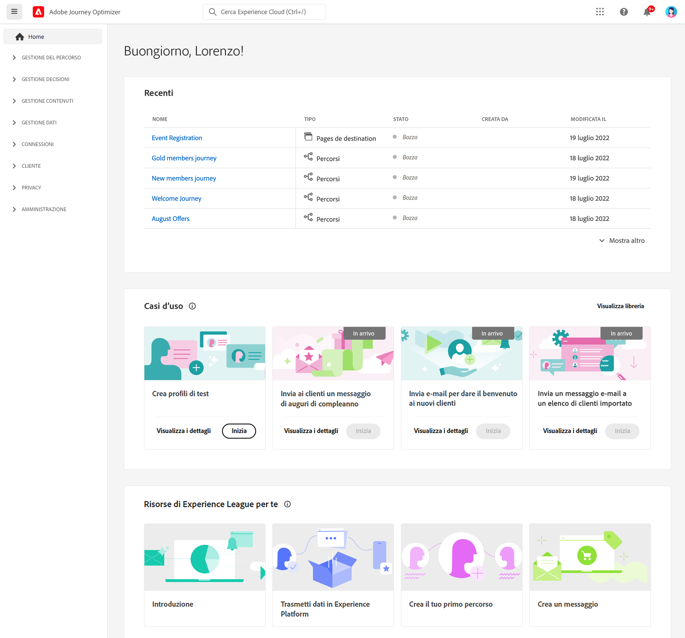

# Navigare nell’interfaccia {#user-interface}

>[!BEGINSHADEBOX]

**In questa pagina:** è possibile trovare l&#39;interfaccia di Adobe Journey Optimizer, ovvero la barra superiore, la home page e la navigazione a sinistra, per accedere rapidamente alle funzionalità necessarie.

>[!ENDSHADEBOX]

Per accedere a Adobe Journey Optimizer, accedi a [[!DNL Adobe CX Enterprise]](https://experience.adobe.com) con il tuo Adobe ID, quindi seleziona [!DNL Journey Optimizer].

>[!NOTE]
>
>* I componenti e le funzionalità disponibili nell’ambiente dipendono dalle [autorizzazioni](../administration/permissions.md) e dal [pacchetto di licenze](https://helpx.adobe.com/it/legal/product-descriptions/adobe-journey-optimizer.html){target="_blank"}.
>* Questa documentazione viene aggiornata frequentemente. Alcune schermate potrebbero essere leggermente diverse dall’interfaccia.

## Presentazione rapida {#quick-tour}

L’interfaccia di Journey Optimizer è costituita da quattro aree principali:

1. **Navigazione a sinistra**: accedi a tutte le funzionalità organizzate per funzione
2. **Barra superiore**: ricerca universale, Guida, notifiche e impostazioni
3. **Pagina Home**: accesso rapido a elementi recenti e risorse utili
4. **Area di lavoro principale**: dove crei e gestisci i contenuti

**Suggerimento:** i nuovi utenti possono iniziare dalla pagina **Home** per accedere agli elementi recenti e ai casi d’uso, oppure utilizzare l’icona **Guida** nella barra superiore per ricevere indicazioni contestuali.

## Funzioni barra superiore {#top-bar}

### Ricerca universale {#universal-search}

Utilizza l’icona di ricerca per trovare rapidamente percorsi, campagne, risorse e altri oggetti all’interno di Journey Optimizer. Digita parole chiave per vedere i risultati rilevanti da tutte le aree della piattaforma. [Ulteriori informazioni sulla ricerca universale](search-filter-categorize.md#unified-search).

### Guida e supporto {#help}

Fai clic sull’icona **Guida** per:

* Cercare video e articoli della guida
* Accedere all’aiuto contestuale per la pagina corrente
* Contattare il supporto Adobe
* Condividivere feedback

La guida contestuale mostra indicazioni pertinenti alla schermata che stai visualizzando e collega direttamente alla documentazione corrispondente, in modo da poter ottenere le informazioni giuste senza uscire dal flusso di lavoro.

#### Linee guida sul ticket di supporto {#support-ticket-guidelines}

Quando contatti il supporto Adobe, includi quanto segue per accelerare l’analisi e la risoluzione della causa principale:

* **Dettagli dell’ambiente**: nome della sandbox, ID organizzazione e area prodotto (ad esempio, percorsi, campagne, funzione Decisioni)
* **Livello di impatto**: gravità del problema (ad esempio, produzione bloccata, funzionalità limitata, estetico)
* **Passaggi per la replica**: istruzioni chiare e dettagliate per riprodurre il problema
* **Registri o schermate**: messaggi di errore, ID richieste o schermate pertinenti che illustrano il problema
* **ID rilevanti**: ID Percorso, ID campagna, ID pubblico o altri identificatori oggetto correlati al problema

### Notifiche {#in-product-uc}

Abilita le notifiche interne al prodotto e e-mail per rimanere informato su:

* **Avvisi**: errori di sistema e problemi di prestazioni
* **Approvazioni**: richieste che richiedono la revisione
* **Nuove versioni**: aggiornamenti del prodotto e nuove funzioni

Per configurare le notifiche:

1. Fai clic sull’icona profilo e seleziona **[!UICONTROL Preferenze]**
2. In **[!UICONTROL Notifiche]**, individua **[!UICONTROL Journey Optimizer]**
3. Abilita i tipi di notifica che desideri ricevere

{width="60%" align="center"}

### Preferenze della lingua {#language}

L’interfaccia è disponibile in inglese, francese, tedesco, italiano, spagnolo, portoghese (brasiliano), giapponese, coreano, cinese tradizionale e cinese semplificato.

Per cambiare lingua:

1. Fai clic su **[!UICONTROL Preferenze]** nel menu profilo
2. Seleziona la lingua preferita
3. Facoltativamente, seleziona una seconda lingua come fallback
4. Fai clic su **Salva**

Sono disponibili scelte rapide da tastiera e funzioni di accessibilità. [Ulteriori informazioni](accessibility.md)

## Pagina Home {#home-page}

La pagina Home fornisce:

* **Recenti**: collegamenti a eventi, percorsi, campagne e altri oggetti creati di recente
* **Casi d’uso**: scenari predefiniti per aiutarti a iniziare rapidamente (creazione di profili di test, invio di messaggi di compleanno, ecc.)
* **Risorse**: collegamenti a documentazione, tutorial e supporto

### Casi d’uso e flussi di lavoro con avvio rapido {#use-cases}

I flussi di lavoro con avvio rapido ti aiutano a eseguire attività comuni:

* **Creare profili di test**: genera profili di test utilizzando modelli CSV
* **Inviare messaggi di compleanno**: invia automaticamente e-mail di compleanno (disponibile a breve)
* **Benvenuto ai nuovi clienti**: serie di messaggi di benvenuto per i nuovi clienti (disponibile a breve)
* **Inviare notifiche push agli elenchi importati**: notifiche push rapide dai dati CSV (disponibile a breve)

Fai clic su **[!UICONTROL Visualizza dettagli]** per ulteriori informazioni su ogni caso d’uso, oppure su **[!UICONTROL Inizia]** per iniziare.

## Pannello di navigazione a sinistra {#left-nav}

Nella navigazione a sinistra le funzionalità di Journey Optimizer sono organizzate in categorie funzionali. Le voci di menu disponibili dipendono dalle autorizzazioni e dalla licenza.

| Sezione | Scopo |
|---------|---------|
| Gestione dei percorsi | Campagne, percorsi, rapporti |
| Gestione delle decisioni | Offerte e personalizzazione |
| Gestione dei contenuti | Risorse, modelli, frammenti, pagine di destinazione |
| Gestione dati | Schemi, set di dati, query |
| Connessioni | Origini e destinazioni |
| Cliente | Tipi di pubblico, profili, identità |
| Privacy | Criteri, richieste, controllo |
| Amministrazione | Configurazioni, canali, sandbox |

### Sezioni principali {#main-sections}

**Home**: punto di partenza con accesso rapido agli elementi creati di recente e alle risorse utili

**Gestione del percorso**: crea e gestisci le esperienze cliente

* **Campagne**: crea messaggi una tantum o pianificati per tipi di pubblico specifici. [Introduzione alle campagne](../campaigns/get-started-with-campaigns.md)
* **Percorsi**: crea esperienze cliente cross-channel in più passaggi. [Creare il primo percorso](../building-journeys/journey-gs.md)
* **Rapporti**: analizza le prestazioni con il reporting integrato di Customer Journey Analytics. [Visualizzare la documentazione di reporting](../reports/campaign-global-report-cja.md)

**Gestione delle decisioni**: gestisci le offerte personalizzate. [Scopri la gestione delle decisioni](../offers/get-started/starting-offer-decisioning.md)

* **Offerte**: crea e gestisci offerte personalizzate
* **Componenti**: imposta posizionamenti, regole e tag per le offerte

**Gestione dei contenuti**: crea e organizza i contenuti

* **Risorse**: archivio centralizzato per immagini e file multimediali. [Gestire le risorse](../integrations/assets.md)
* **Modelli di contenuto**: modelli di messaggio riutilizzabili per campagne e percorsi. [Creare modelli](../content-management/content-templates.md)
* **Frammenti**: blocchi di contenuto che possono essere utilizzati in più messaggi. [Utilizzare i frammenti](../content-management/fragments.md)
* **Pagine di destinazione**: moduli web per abbonamenti e preferenze. [Progettazione delle pagine di destinazione](../landing-pages/get-started-lp.md)
* **Playbook di casi d’uso**: flussi di lavoro predefiniti per scenari di marketing comuni. [Esplorare i playbook](ai-features.md#playbooks)

**Gestione dati**: gestisci le tue basi dati. [Scopri gli schemi e i set di dati](../data/get-started-schemas.md)

* **Schemi**: definisci la struttura dei dati
* **Set di dati**: archivia e gestisci raccolte dati
* **Query**: scrivi ed esegui le query
* **Monitoraggio**: tieni traccia dell’acquisizione di dati

**Connessioni**: integra con altri sistemi

* **Origini**: acquisisci dati da sistemi esterni. [Configurare le origini](get-started-sources.md)
* **Destinazioni**: esporta dati nell’archiviazione cloud. [Impostare le destinazioni](../data/export-datasets.md)

**Cliente**: gestisci i tipi di pubblico e profili

* **Tipi di pubblico**: crea e gestisci segmenti di clienti. [Utilizzare i tipi di pubblico](../audience/about-audiences.md)
* **Elenchi di iscrizioni**: gestisci gli elenchi di consenso. [Gestire le iscrizioni](../landing-pages/subscription-list.md)
* **Profili**: visualizza i profili cliente unificati. [Esplorare i profili](../audience/get-started-profiles.md)
* **Identità**: gestisci la risoluzione delle identità. [Scopri le identità](../audience/get-started-identity.md)

**Privacy**: controlla la privacy e la conformità. [Panoramica sulla privacy](../privacy/get-started-privacy.md)

* **Criteri**: definisci i criteri di governance dei dati
* **Richieste**: gestisci le richieste di privacy (GDPR, CCPA)
* **Audit**: esamina i registri attività. [Visualizzare i registri di controllo](../privacy/audit-logs.md)
* **Ciclo di vita dei dati**: configura la conservazione dei dati

**Amministrazione**: configura le impostazioni di sistema. [Panoramica sul controllo degli accessi](../administration/permissions-overview.md)

* **Configurazioni**: imposta eventi, origini dati e azioni. [Configurare i canali](../configuration/get-started-configuration.md)
* **Regole di business**: controlla la frequenza dei messaggi e l’ingresso nel percorso. [Impostare le regole di business](../conflict-prioritization/rule-sets.md)
* **Avvisi**: visualizza e gestisci gli avvisi di sistema. [Monitorare gli avvisi](../reports/alerts.md)
* **Sandbox**: gestisci gli ambienti e copia gli oggetti tra le sandbox. [Utilizzare le sandbox](../administration/sandboxes.md)
* **Canali**: configura le impostazioni del canale e la recapitabilità. [Impostare le configurazioni dei canali](../configuration/channel-surfaces.md) | [Introduzione alla configurazione](../configuration/get-started-configuration.md)
* **Tag**: organizza e categorizza i contenuti. [Utilizzare i tag unificati](search-filter-categorize.md#tags)

## Assistente IA {#ai-assistant}

L’Assistente IA fornisce assistenza immediata e insight operativi. Fai clic sull’icona dell’Assistente IA nella barra superiore per:

* Ottenere risposte sulle funzioni del prodotto
* Ricevere insight operativi sui tuoi percorsi
* Navigare tra concetti e best practice

[Ulteriori informazioni sull’Assistente IA](ai-features.md#ai-assistant)

## Argomenti correlati {#related-topics}

* [Scegliere il percorso di apprendimento in base al ruolo](quick-start.md)
* [Ricercare, filtrare e categorizzare i contenuti](search-filter-categorize.md)
* [Informazioni sul funzionamento di Journey Optimizer](understanding-ajo.md)
* [Funzioni di accessibilità](accessibility.md)

<!--CONTEXTUAL HELP TO DISPATCH IN DOCS ONCE FEATURE LIVE-->

<!--ORCHESTRATED CAMPAIGNS - Overview page-->

<!--OVERVIEW TAB ORCHESTRATED CAMPAIGNS SKU only-->

>[!CONTEXTUALHELP]
>id="ajo_oc_campaign_ovv_1"
>title="Orchestrazione della campagna"
>abstract="Dividi, combina, arricchisci e manipola set di dati relazionali per definire il pubblico"

>[!CONTEXTUALHELP]
>id="ajo_oc_campaign_ovv_2"
>title="Sfruttare i dati con più entità"
>abstract="Scopri come le campagne orchestrate possono trarre vantaggio dai set di dati relazionali per arricchire i dati per la segmentazione e la personalizzazione"

>[!CONTEXTUALHELP]
>id="ajo_oc_campaign_ovv_3"
>title="Segmentazione ad hoc e conteggi esatti"
>abstract="Crea un segmento passo dopo passo con conteggi esatti"

>[!CONTEXTUALHELP]
>id="ajo_oc_campaign_ovv_4"
>title="Canali disponibili"
>abstract="E-mail, SMS, Notifiche push, Direct mail"

<!--OVERVIEW TAB ORCHESTRATED CAMPAIGNS + JOURNEYS SKU -->

>[!CONTEXTUALHELP]
>id="ajo_oc_jo_campaign_ovv_1"
>title="Interfaccia utente guidata per creare e inviare una campagna"
>abstract="Imposta una o più azioni con un canale, scegli un pubblico, imposta il contenuto, definisci una pianificazione e sei pronto per l’invio"

>[!CONTEXTUALHELP]
>id="ajo_oc_jo_campaign_ovv_2"
>title="Canali disponibili"
>abstract="E-mail, SMS, Notifiche push, In-app, Web, Esperienze basate su codice"

<!--OVERVIEW TAB ORCHESTRATED CAMPAIGNS - API triggered tab -->

>[!CONTEXTUALHELP]
>id="ajo_oc_api_campaign_ovv_1"
>title="Campagne attivate da API transazionali"
>abstract="Attivare messaggi in tempo reale tramite chiamate API"

>[!CONTEXTUALHELP]
>id="ajo_oc_api_campaign_ovv_2"
>title="Messaggi di marketing"
>abstract="Contenuto promozionale (richiede il consenso, soggetto alle regole aziendali)"

>[!CONTEXTUALHELP]
>id="ajo_oc_api_campaign_ovv_3"
>title="Messaggi transazionali"
>abstract="Contenuti relativi ai servizi (conferma, avvisi, non soggetti al consenso sul marketing)"

>[!CONTEXTUALHELP]
>id="ajo_oc_api_campaign_ovv_4"
>title="Canali disponibili"
>abstract="E-mail, SMS, notifiche push"

<!--APPROVAL POLICIES-->

>[!CONTEXTUALHELP]
>id="ajo_campaigns_edit_disabled"
>title="Modifica disabilitata"
>abstract="Modifica disabilitata (campagne)"

>[!CONTEXTUALHELP]
>id="ajo_journey_edit_disabled"
>title="Modifica disabilitata"
>abstract="Modifica disabilitata (percorsi)"

>[!CONTEXTUALHELP]
>id="ajo_approval_policy_approval_status"
>title="Stato di approvazione"
>abstract="Stato di approvazione"

>[!CONTEXTUALHELP]
>id="ajo_campaigns_approve"
>title="Approva"
>abstract="Approva (campagne)"

>[!CONTEXTUALHELP]
>id="ajo_journey_approve"
>title="Approva"
>abstract="Approva (percorsi)"

>[!CONTEXTUALHELP]
>id="ajo_journey_simulation"
>title="Simulare il percorso"
>abstract="La simulazione del percorso consente di convalidare i percorsi e di verificarne le prestazioni prima dell’attivazione. Utilizza i dati di un modello addestrato per fornire numeri in tutto il percorso per vedere come si comporterà il percorso in uno scenario reale."

<!-- WEBHOOKS -->

>[!CONTEXTUALHELP]
>id="ajo_channels_feedback_webhook_settings"
>title="Abilitare i webhook"
>abstract="Consenti ai webhook di ricevere feedback in tempo reale sullo stato di esecuzione dei messaggi. Prima di attivare questa opzione, assicurati di aver configurato un webhook nel menu **Amministrazione**/**Canali**/**Webhook di feedback**."

>[!CONTEXTUALHELP]
>id="ajo_channels_feedback_webhook_settings_create"
>title="Webhook di feedback"
>abstract="I webhook di feedback consentono di ricevere feedback in tempo reale sullo stato di esecuzione dei messaggi inviati con campagne transazionali attivate da API. È consentita una sola configurazione di webhook per combinazione di organizzazione e sandbox."

>[!CONTEXTUALHELP]
>id="ajo_channels_feedback_webhook_settings_configuration"
>title="Configurazione di base"
>abstract="In questa sezione, immetti un nome descrittivo per identificare il webhook e seleziona i canali per i quali questo webhook deve ricevere feedback (e-mail e/o SMS). Nel campo URL webhook, specifica l’endpoint HTTPS a cui devono essere consegnati gli eventi di feedback."

>[!CONTEXTUALHELP]
>id="ajo_channels_feedback_webhook_settings_authentication"
>title="Autenticazione"
>abstract="Se l’endpoint richiede l’autenticazione JWT, seleziona **Autenticazione JWT** dall’elenco e fornisci i dettagli richiesti."

>[!CONTEXTUALHELP]
>id="ajo_channels_feedback_webhook_settings_header_parameters"
>title="Parametri dell’intestazione"
>abstract="In questa sezione, puoi configurare intestazioni personalizzate aggiuntive da inviare con ogni richiesta webhook."

>[!CONTEXTUALHELP]
>id="ajo_admin_aem_content_fragment_configuration"
>title="Guida alla configurazione di AEM"
>abstract="Ulteriori informazioni sulla creazione e la gestione di una configurazione"

>[!CONTEXTUALHELP]
>id="ajo_admin_aem_configure_instance"
>title="Configurazione dell’istanza"
>abstract="Seleziona il tipo di configurazione dell’istanza appropriato per la configurazione.  Configurazione solo authoring: utilizza frammenti di contenuto dall’istanza di authoring di AEM. La configurazione dell’istanza di pubblicazione e gli aggiornamenti live non sono supportati. Configurazione dell’istanza di pubblicazione: configura le impostazioni dell’istanza di pubblicazione. Facoltativamente, abilita “Invia token a istanza di pubblicazione” per fornire le credenziali del servizio per l’autenticazione."

>[!CONTEXTUALHELP]
>id="ajo_admin_aem_send_token"
>title="Invia token a istanza di pubblicazione"
>abstract="Quando questa opzione è abilitata, le credenziali del servizio vengono inviate all’istanza di pubblicazione per autenticare le richieste. Fornisci di seguito un JSON valido delle credenziali del servizio."

>[!CONTEXTUALHELP]
>id="ajo_admin_aem_service_credential"
>title="Incolla JSON delle credenziali del servizio"
>abstract="Incolla il file JSON delle credenziali del servizio di AEM dopo averle create consultando la documentazione tecnica pubblica sull’account. Verrà formattato e convalidato in automatico."
>additional-url=""

>[!CONTEXTUALHELP]
>id="ajo_admin_aem_custom_domain"
>title="Dominio personalizzato"
>abstract="Facoltativo. Specifica un dominio personalizzato se al dominio publish-p16552-e147195.adobeaemcloud.com non è consentito recuperare contenuti per la tua organizzazione"

<!-- JOURNEYS - EXPRESSION ASSISTANT -->

>[!CONTEXTUALHELP]
>id="journeyExpAI"
>title="Assistente di espressione"
>abstract="Utilizza l’Assistente di espressione per generare e perfezionare le espressioni in Journey Optimizer."

<!-- OC - LOAD FILE ACTIVITY -->

>[!CONTEXTUALHELP]
>id="ajo_orchestration_load_file"
>title="Attività di caricamento file"
>abstract="L’attività **Carica file** è un’attività di **targeting**. Utilizzala per caricare un file CSV o TXT nell’area di lavoro della campagna orchestrata e come pubblico della campagna. I dati del file vengono utilizzati al momento dell’esecuzione e non vengono mantenuti come set di dati di Adobe Experience Platform. Le righe vengono riconciliate con i destinatari esistenti utilizzando una colonna di identità e una dimensione targeting."

