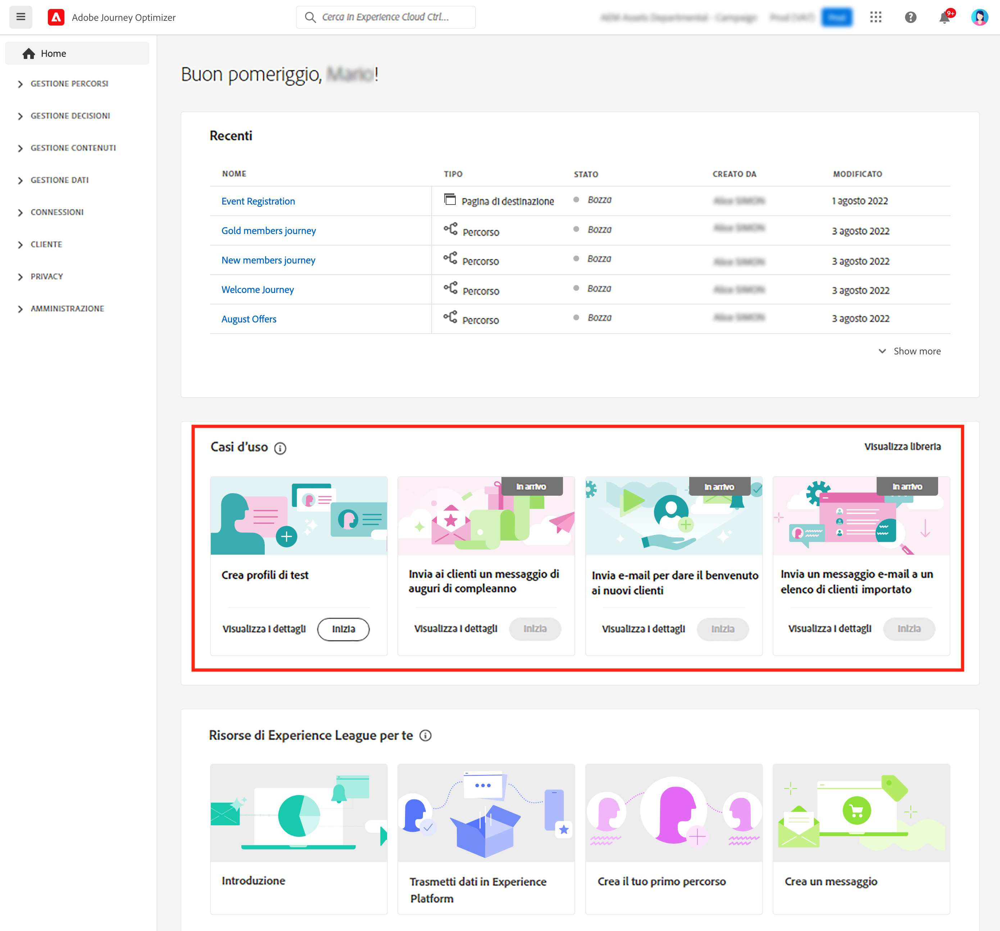
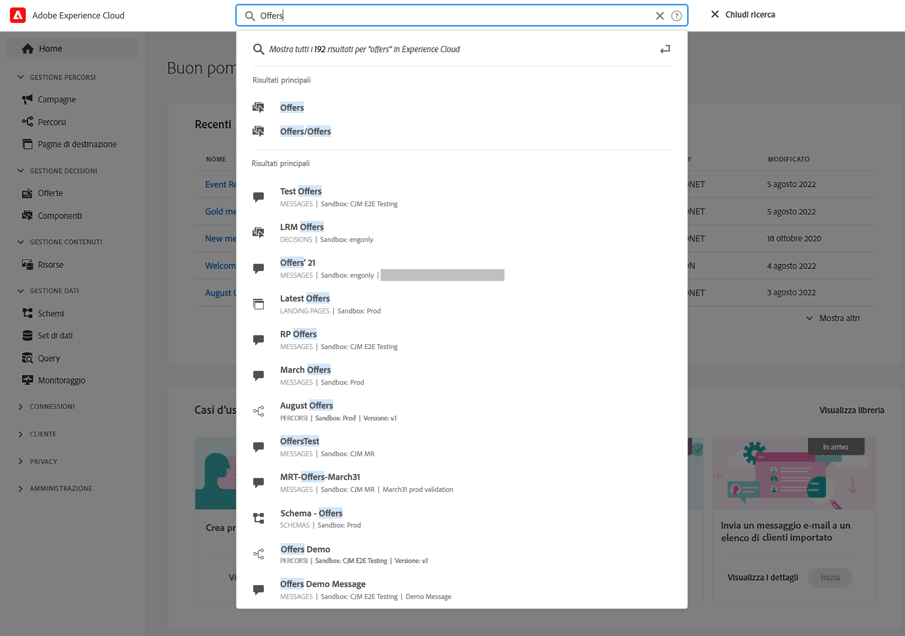
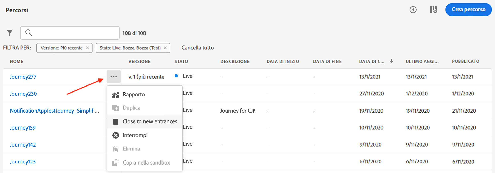

# Interfaccia utente {#cjm-user-interface}

Connetti a [Adobe Experience Cloud](http://experience.adobe.com) e sfogliare per [!DNL Journey Optimizer].

I concetti chiave durante la navigazione nell’interfaccia utente sono comuni ad Adobe Experience Platform. Fai riferimento a [Documentazione di Adobe Experience Platform](https://experienceleague.adobe.com/docs/experience-platform/landing/platform-ui/ui-guide.html#adobe-experience-platform-ui-guide){target=&quot;_blank&quot;} per ulteriori dettagli.

I componenti e le funzionalità disponibili nell’interfaccia utente dipendono dal [permissions](../administration/permissions.md) e [pacchetto di licenze](https://helpx.adobe.com/legal/product-descriptions/adobe-journey-optimizer.html){target=&quot;_blank&quot;}. Per qualsiasi domanda, contatta il tuo Adobe Customer Success Manager.

>[!NOTE]
>
>Questa documentazione viene spesso aggiornata per riflettere le ultime modifiche nell’interfaccia utente del prodotto. Tuttavia, alcune schermate possono differire leggermente dall’interfaccia utente.

## Navigazione a sinistra {#left-nav}

Sfoglia i collegamenti a sinistra per accedere [!DNL Journey Optimizer] funzionalità.

>[!NOTE]
>
>Le funzionalità disponibili possono variare a seconda delle autorizzazioni e del contratto di licenza.

Di seguito è riportato l’elenco completo dei servizi e delle funzionalità disponibili nella navigazione a sinistra e dei collegamenti alle relative pagine di aiuto.

**Pagina principale**

[!DNL Journey Optimizer] la home page contiene collegamenti e risorse chiave da avviare. La **[!UICONTROL Recents]** fornisce collegamenti agli eventi e ai percorsi creati di recente. Questo elenco mostra le relative date e lo stato di creazione e modifica.

**[!UICONTROL JOURNEY MANAGEMENT]**

* **[!UICONTROL Journeys]** - Crea, configura e gestisci i percorsi dei clienti. [Ulteriori informazioni](../building-journeys/journey-gs.md#jo-build)

* **[!UICONTROL Landing pages]** Creazione, progettazione, test e pubblicazione di pagine di destinazione. [Ulteriori informazioni](../landing-pages/get-started-lp.md)

**[!UICONTROL DECISION MANAGEMENT]**

* **[!UICONTROL Offers]** - Accedi alle tue origini e ai set di dati recenti da questo menu. Usa questa sezione per creare nuove offerte. [Ulteriori informazioni](../offers/offer-library/creating-personalized-offers.md)

* **[!UICONTROL Components]** - Creazione di posizionamenti, regole e tag. [Ulteriori informazioni](../offers/offer-library/key-steps.md)

**[!UICONTROL CONTENT MANAGEMENT]**

* **[!UICONTROL Assets]** - [!DNL Adobe Experience Manager Assets Essentials] è un archivio centralizzato di risorse che puoi utilizzare per compilare i messaggi. [Ulteriori informazioni](../email/assets-essentials.md)

**[!UICONTROL DATA MANAGEMENT]**

* **[!UICONTROL Schemas]** - Utilizza Adobe Experience Platform per creare e gestire schemi Experience Data Model (XDM) in un’area di lavoro visiva interattiva denominata Editor di schema. [Ulteriori informazioni](../data/get-started-schemas.md)

* **[!UICONTROL Datasets]** - Tutti i dati acquisiti in Adobe Experience Platform vengono mantenuti all’interno del Data Lake come set di dati. Un set di dati è un costrutto di archiviazione e gestione per una raccolta di dati, in genere una tabella, che contiene uno schema (colonne) e campi (righe). [Ulteriori informazioni](../data/get-started-datasets.md)

* **[!UICONTROL Queries]** - Utilizza Adobe Experience Platform Query Service per scrivere ed eseguire query, visualizzare le query eseguite in precedenza e accedere alle query salvate dagli utenti all’interno dell’organizzazione. [Ulteriori informazioni](../data/get-started-queries.md)

* **[!UICONTROL Monitoring]** - Utilizza questo menu per monitorare l’acquisizione dei dati all’interno dell’interfaccia utente di Adobe Experience Platform. [Ulteriori informazioni](https://experienceleague.adobe.com/docs/experience-platform/ingestion/quality/monitor-data-ingestion.html){target=&quot;_blank&quot;}

**[!UICONTROL CONNECTIONS]**

* **[!UICONTROL Sources]** - Utilizza questo menu per acquisire i dati da diverse origini, ad esempio applicazioni Adobe, archivi basati su cloud, database e altro ancora, nonché struttura, etichetta e ottimizzazione dei dati in arrivo. [Ulteriori informazioni](get-started-sources.md)

**[!UICONTROL CUSTOMER]**

* **[!UICONTROL Segments]** - Crea e gestisci le definizioni dei segmenti Experience Platform e utilizzale nei tuoi percorsi. [Ulteriori informazioni](../segment/about-segments.md)

* **[!UICONTROL Profiles]** - Profilo cliente in tempo reale crea una visualizzazione olistica di ciascuno dei tuoi singoli clienti, combinando dati provenienti da più canali tra cui online, offline, CRM e dati di terze parti. [Ulteriori informazioni](../segment/get-started-profiles.md)

* **[!UICONTROL Identities]** - Il servizio Adobe Experience Platform Identity gestisce l’identificazione dei clienti in tempo reale, tra dispositivi e canali, in tempo reale, in un cosiddetto grafico delle identità all’interno di Adobe Experience Platform. [Ulteriori informazioni](../segment/get-started-identity.md)

**[!UICONTROL ADMINISTRATION]**

* **[!UICONTROL Journey Administration]** - Usa questo menu per configurare [events](../event/about-events.md), [origini dati](../datasource/about-data-sources.md) e [azioni](../action/action.md) da utilizzare nei percorsi.

* **[!UICONTROL Sandboxes]** - Adobe Experience Platform fornisce sandbox che suddividono una singola istanza in ambienti virtuali separati per sviluppare e sviluppare applicazioni di esperienza digitale. [Ulteriori informazioni](../administration/sandboxes.md)

* **[!UICONTROL Alerts]** - L’interfaccia utente ti consente di visualizzare una cronologia degli avvisi ricevuti in base alle metriche rivelate da Adobe Experience Platform Observability Insights. L’interfaccia utente consente inoltre di visualizzare, abilitare e disabilitare le regole di avviso disponibili. [Ulteriori informazioni](https://experienceleague.adobe.com/docs/experience-platform/observability/alerts/overview.html){target=&quot;_blank&quot;}

## Casi di utilizzo all’interno del prodotto {#in-product-uc}

Sfruttamento [!DNL Adobe Journey Optimizer] casi d’uso dalla home page e fornire alcuni input rapidi per creare un percorso del cliente.

I casi di utilizzo disponibili sono:

* **Creare profili di test**, per creare profili di test utilizzando il nostro modello CSV per testare messaggi e percorsi personalizzati. Scopri come implementare questo caso d’uso [in questa pagina](../segment/creating-test-profiles.md#use-case-1).
* **Inviare un messaggio di compleanno ai clienti**, per inviare automaticamente un&#39;e-mail ai tuoi clienti intorno al loro compleanno. (disponibile a breve)
* **Inviare e-mail a nuovi clienti onboard**, per inviare facilmente fino a due e-mail di benvenuto ai clienti appena registrati. (disponibile a breve)
* **Inviare messaggi push all’elenco dei clienti importati**, per inviare rapidamente una notifica push a un elenco di clienti importati da un file CSV. (disponibile a breve)

Fai clic su **[!UICONTROL View details]** per ulteriori informazioni su ogni caso d’uso.

Fai clic sul pulsante **[!UICONTROL Begin]** per avviare il caso d’uso.

Puoi accedere ai casi di utilizzo eseguiti da **[!UICONTROL View use case library]** pulsante .

## Accessibilità{#accessibility}

Funzioni di accessibilità in [!DNL Adobe Journey Optimizer] sono ereditati da Adobe Experience Platform:

* Accessibilità da tastiera
* Contrasto colore
* Convalida dei campi obbligatori

[Ulteriori informazioni](https://experienceleague.adobe.com/docs/experience-platform/accessibility/features.html){target=&quot;_blank&quot;} nella documentazione di Adobe Experience Platform.

È possibile utilizzare le seguenti scelte rapide da tastiera comuni in [!DNL Journey Optimizer]:

| Azione | Scelta rapida |
| --- | --- |
| Spostarsi tra elementi, sezioni e gruppi di menu dell’interfaccia utente | Scheda |
| Consente di spostarsi all’indietro tra gli elementi, le sezioni e i gruppi di menu dell’interfaccia utente. | Maiusc+Tab |
| Sposta all’interno delle sezioni per impostare lo stato attivo su singoli elementi | Freccia |
| Seleziona o cancella un elemento attivo | Inserisci o Barra spaziatrice |
| Annullare una selezione, comprimere un riquadro o chiudere una finestra di dialogo | Esc |

[Ulteriori informazioni](https://experienceleague.adobe.com/docs/experience-platform/accessibility/custom.html){target=&quot;_blank&quot;} nella documentazione di Adobe Experience Platform.

Puoi utilizzare queste scelte rapide in parti specifiche di Journey Optimizer:

<table>
  <thead>
    <tr>
      <th>Elemento di interfaccia</th>
      <th>Azione</th>
      <th>Scelta rapida</th>
    </tr>
  </thead>
  <tr>
    <td>Elenco di percorsi, azioni, origini dati o eventi</td>
    <td>Creare un percorso, un’azione, un’origine dati o un evento</td>
    <td>C</td>
  </tr>
  <tr>
    <td rowspan="3">Area di lavoro in stato bozza</td>
    <td>Aggiungi un’attività dalla palette a sinistra nella prima posizione disponibile, dall’alto verso il basso</td>
    <td>Fai doppio clic sull’attività</td>
  </tr>
  <tr>
    <td>Seleziona tutte le attività</td>
    <td>Ctrl+A (Windows) Comando + A (Mac)</td>
  </tr>
  <tr>
    <td>Elimina le attività selezionate</td>
    <td>Elimina o Backspace, quindi Inserisci per confermare l’eliminazione</td>
  </tr>
  <tr>
  <td rowspan="3">

Riquadro di configurazione dei seguenti elementi:

<ul>
  <li>Attività in un percorso</li>
  <li>Evento</li>
  <li>Origine dati</li>
  <li>Azione</li>
</ul>

</td>
    <td>Passa al campo successivo da configurare</td>
    <td>Scheda</td>
  </tr>
  <tr>
    <td>Salva le modifiche e chiudi il riquadro di configurazione</td>
    <td>Invio</td>
  </tr>
  <tr>
    <td>Ignora le modifiche e chiudi il riquadro di configurazione</td>
    <td>Esc</td>
  </tr>
  <tr>
    <td rowspan="4">Percorso in modalità di test</td>
    <td>Attivare o disattivare la modalità di test</td>
    <td>T</td>
  </tr>
  <tr>
    <td>Attivare un evento in un percorso basato su eventi</td>
    <td>E</td>
  </tr>
  <tr>
    <td>

Attiva un evento in un percorso basato su segmenti per il quale il **[!UICONTROL Single profile at a time]** opzione attivata

</td>
    <td>P</td>
  </tr>
  <tr>
    <td>Visualizza i registri di test</td>
    <td>L</td>
  </tr>
<!-- //Ajouter ce raccourci quand il marchera (actuellement, le raccourci Ctrl/Cmd+F du navigateur a priorité sur celui de AJO).//
  <tr>
    <td>Page with a search bar</td>
    <td>Select the search bar</td>
    <td>Ctrl/Command + F</td>
  </tr>
-->
  <tr>
    <td>Campo di testo</td>
    <td>Seleziona tutto il testo nel campo selezionato</td>
    <td>Ctrl+A (Windows) Comando + A (Mac)</td>
  </tr>
  <tr>
    <td rowspan="2">Finestra a comparsa</td>
    <td>Salva le modifiche o conferma l’azione</td>
    <td>Invio</td>
  </tr>
  <tr>
    <td>Chiudi la finestra</td>
    <td>Esc</td>
  </tr>
  <tr>
    <td>Editor di espressioni semplici</td>
    <td>Selezionare e aggiungere un campo</td>
    <td>Fare doppio clic su un campo</td>
  </tr>
  <tr>
    <td>Esplorazione dei campi XDM</td>
    <td>Seleziona tutti i campi di un nodo</td>
    <td>Selezionare il nodo principale</td>
  </tr>
  <tr>
    <td>Anteprima payload</td>
    <td>Selezionare il payload</td>
    <td>Ctrl+A (Windows) Comando + A (Mac)</td>
  </tr>
</table>

## Assistenza e supporto {#find-help}

Accedi alle pagine della guida chiave di Adobe Journey Optimizer dalla sezione inferiore della home page.

Utilizza la **Aiuto** per accedere alle pagine della guida, contattare il supporto e condividere i commenti. Puoi cercare articoli e video della guida dal campo di ricerca.

## Browser supportati {#browsers}

Adobe [!DNL Journey Optimizer] l’interfaccia è progettata per funzionare in modo ottimale nell’ultima versione di Google Chrome. È possibile che si verifichino problemi durante l’utilizzo di alcune funzioni nelle versioni precedenti o in altri browser.

## Preferenze della lingua {#language-pref}

L’interfaccia utente è attualmente disponibile nelle seguenti lingue:

* Inglese
* Francese
* Tedesco
* Italiano
* Spagnolo
* Portoghese (brasiliano)
* Giapponese
* Coreano

La lingua predefinita dell’interfaccia è determinata dalla lingua preferita specificata nel profilo utente.

Per modificare la lingua:

* Fai clic su **Preferenze** dal tuo avatar, in alto a destra.
   
* Quindi fai clic sulla lingua visualizzata sotto il tuo indirizzo e-mail
* Seleziona la lingua preferita e fai clic su **Salva**. È possibile selezionare una seconda lingua nel caso in cui il componente utilizzato non sia localizzato nella prima lingua.
   

## Ricerca{#unified-search}

In qualsiasi punto dell’interfaccia di Adobe Journey Optimizer, utilizza la funzionalità di ricerca Unified Adobe Experience Cloud al centro della barra superiore per trovare risorse, percorsi, set di dati e altro ancora nelle sandbox.

Inizia a immettere il contenuto per visualizzare i risultati migliori. Nei risultati vengono visualizzati anche gli articoli della Guida relativi alle parole chiave inserite.

Press **Invio** per accedere a tutti i risultati e filtrare per oggetto aziendale.

## Elenchi di filtri{#filter-lists}

Nella maggior parte degli elenchi, una barra di ricerca consente di cercare un elemento specifico e selezionare i criteri di filtro.

Per accedere ai filtri, fai clic sull’icona del filtro in alto a sinistra nell’elenco. Il menu del filtro consente di filtrare gli elementi visualizzati in base a diversi criteri. Puoi scegliere di visualizzare solo gli elementi di un determinato tipo o stato, quelli creati o quelli modificati negli ultimi 30 giorni. Le opzioni variano a seconda del contesto.

Nell’elenco dei percorsi, puoi filtrare i percorsi in base al loro stato, tipo e versione dal **[!UICONTROL Status and version filters]**. Il tipo può essere: **[!UICONTROL Unitary event]**, **[!UICONTROL Segment qualification]**, **[!UICONTROL Read segment]**, **[!UICONTROL Business event]** o **[!UICONTROL Burst]**. Puoi scegliere di visualizzare solo i percorsi che utilizzano un evento, un gruppo di campi o un’azione specifici dal **[!UICONTROL Activity filters]** e **[!UICONTROL Data filters]**. La **[!UICONTROL Publication filters]** consente di selezionare una data di pubblicazione o un utente. Ad esempio, puoi scegliere di visualizzare le versioni più recenti dei percorsi live pubblicate ieri. [Ulteriori informazioni](../building-journeys/using-the-journey-designer.md).

>[!NOTE]
>
>Le colonne visualizzate possono essere personalizzate utilizzando il pulsante di configurazione in alto a destra degli elenchi. La personalizzazione viene salvata per ogni utente.

Utilizza la **[!UICONTROL Last update]** e **[!UICONTROL Last update by]** per verificare quando è stato eseguito l’ultimo aggiornamento dei percorsi e chi li ha salvati.

Nei riquadri di configurazione Evento, Origine dati e Azione, la **[!UICONTROL Used in]** visualizza il numero di percorsi che utilizzano quel particolare evento, gruppo di campi o azione. Puoi fare clic su **[!UICONTROL View journeys]** per visualizzare l’elenco dei percorsi corrispondenti.

Negli elenchi, puoi eseguire azioni di base su ciascun elemento. Ad esempio, è possibile duplicare o eliminare un elemento.

