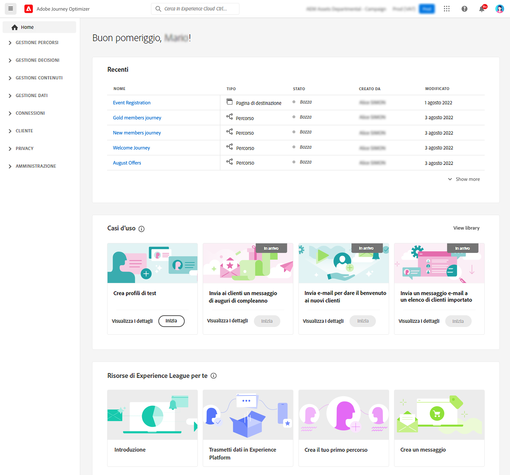
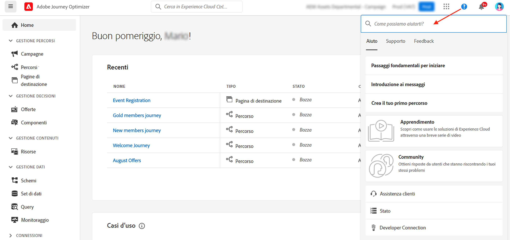
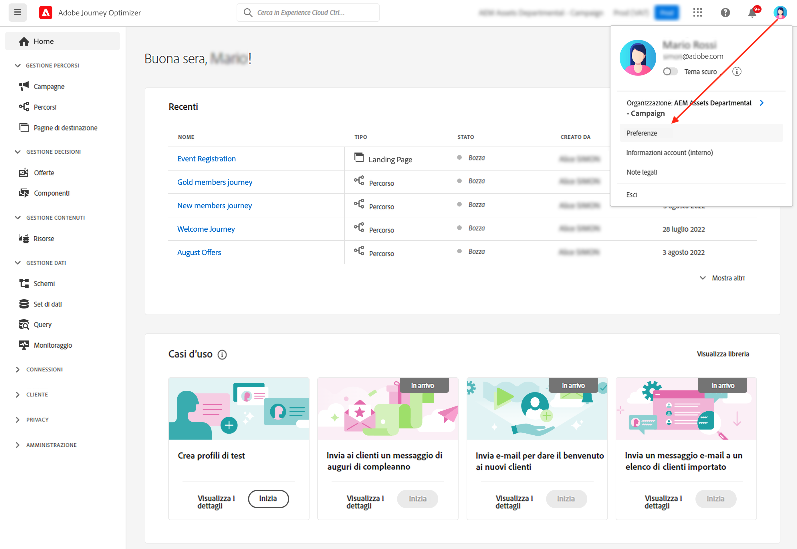

# Interfaccia utente {#cjm-user-interface}

Per accedere a  [!DNL Adobe Journey Optimizer], connettersi a [Adobe Experience Cloud](https://experience.adobe.com) con il tuo Adobe ID e seleziona [!DNL Journey Optimizer].

I concetti chiave della navigazione nell’interfaccia utente sono gli stessi di Adobe Experience Platform. Per ulteriori informazioni, consulta la [documentazione di Adobe Experience Platform](https://experienceleague.adobe.com/docs/experience-platform/landing/platform-ui/ui-guide.html?lang=it#adobe-experience-platform-ui-guide).{target="_blank"}

I componenti e le funzionalità disponibili nell’interfaccia utente dipendono dalle [autorizzazioni](../administration/permissions.md) e dal [pacchetto di licenze](https://helpx.adobe.com/it/legal/product-descriptions/adobe-journey-optimizer.html){target="_blank"}. Per qualsiasi domanda, contatta il tuo Adobe Customer Success Manager.

>[!NOTE]
>
>Questa documentazione viene aggiornata spesso per riflettere le recenti modifiche all’interfaccia utente del prodotto. Tuttavia, alcune schermate possono risultare leggermente diverse dall’interfaccia del prodotto.

## Pannello di navigazione a sinistra {#left-nav}

Sfoglia i collegamenti a sinistra per accedere alle funzionalità di [!DNL Journey Optimizer].

>[!NOTE]
>
>Le funzionalità disponibili possono variare a seconda delle autorizzazioni e del contratto di licenza.

Di seguito è riportato l’elenco completo dei servizi e delle funzionalità disponibili nella barra a sinistra, con i collegamenti alle relative pagine di assistenza.

### Home {#left-nav-home}

La pagina Home di [!DNL Journey Optimizer] contiene collegamenti e risorse chiave per iniziare. 

L’elenco **[!UICONTROL Recenti]** fornisce collegamenti agli eventi e ai percorsi creati di recente. Questo elenco mostra le relative date e lo stato di creazione e modifica.

Sfoglia i casi di utilizzo interni al prodotto per iniziare a creare risorse e messaggi. [Maggiori informazioni](#in-product-use-cases).

Utilizza i collegamenti nella parte inferiore della home page per scoprire come iniziare con [!DNL Journey Optimizer]. [Maggiori informazioni](#find-help-and-support).

### [!UICONTROL GESTIONE PERCORSI] {#left-nav-journey}

Crea campagne e percorsi da questa sezione.

* **[!UICONTROL Campagne]** : crea, configura e gestisci campagne per distribuire contenuti una tantum a un pubblico specifico utilizzando vari canali. [Ulteriori informazioni](../campaigns/get-started-with-campaigns.md)

* **[!UICONTROL Percorsi]** : creazione, configurazione e orchestrazione dei percorsi dei clienti. Combina eventi, attività di orchestrazione e azione per creare scenari cross-channel con più passaggi. [Ulteriori informazioni](../building-journeys/journey-gs.md#jo-build)

* **[!UICONTROL Pagine di destinazione]** - Creazione, progettazione, test e pubblicazione di pagine di destinazione: invia agli utenti i collegamenti ai moduli online, dove possono acconsentire o rinunciare alla ricezione delle comunicazioni o iscriversi a servizi specifici. [Ulteriori informazioni](../landing-pages/get-started-lp.md)

### [!UICONTROL GESTIONE DECISIONI] {#left-nav-offers}

Crea offerte e componenti da questa sezione.

* **[!UICONTROL Offerte]**: accedi alle origini e ai set di dati recenti da questo menu. Usa questa sezione per creare nuove offerte. [Ulteriori informazioni](../offers/offer-library/creating-personalized-offers.md)

* **[!UICONTROL Componenti]**: crea posizionamenti, regole e tag. [Ulteriori informazioni](../offers/offer-library/key-steps.md)

### [!UICONTROL GESTIONE CONTENUTI] {#left-nav-content}

Crea e gestisci i contenuti di questa sezione.

* **[!UICONTROL Risorse]**: [!DNL Adobe Experience Manager Assets Essentials] è un archivio centralizzato di risorse che puoi utilizzare per compilare i messaggi. [Ulteriori informazioni](../email/assets-essentials.md)

* **[!UICONTROL Modelli di contenuto]** : per una progettazione più rapida e migliorata, crea modelli autonomi per riutilizzare facilmente i contenuti personalizzati nelle campagne e nei percorsi Journey Optimizer. [Ulteriori informazioni](../email/content-templates.md)

* **[!UICONTROL Frammenti]** - Creazione e gestione di frammenti per semplificare il processo di progettazione delle e-mail: precreazione di blocchi di contenuto personalizzati che possono essere utilizzati per assemblare rapidamente i contenuti delle e-mail. [Ulteriori informazioni](../email/fragments.md)

### [!UICONTROL GESTIONE DATI] {#left-nav-data}

Gestisci i dati da questa sezione.

* **[!UICONTROL Schemi]**: utilizza Adobe Experience Platform per creare e gestire gli schemi Experience Data Model (XDM) in un’area di lavoro visiva e interattiva, denominata Editor di schema. [Ulteriori informazioni](../data/get-started-schemas.md)

* **[!UICONTROL Set di dati]**: tutti i dati acquisiti in Adobe Experience Platform vengono mantenuti all’interno del Data lake come set di dati. Un set di dati è un costrutto di archiviazione e gestione per una raccolta di dati, in genere una tabella, che contiene uno schema (colonne) e dei campi (righe). [Ulteriori informazioni](../data/get-started-datasets.md)

* **[!UICONTROL Query]**: utilizza Adobe Experience Platform Query Service per scrivere ed eseguire query, visualizzare le query eseguite in precedenza e accedere a quelle salvate dagli utenti della tua organizzazione. [Ulteriori informazioni](../data/get-started-queries.md)

* **[!UICONTROL Monitoraggio]**: usa questo menu per monitorare l’acquisizione dei dati nell’interfaccia utente di Adobe Experience Platform. Ulteriori informazioni in [Documentazione di Adobe Experience Platform](https://experienceleague.adobe.com/docs/experience-platform/ingestion/quality/monitor-data-ingestion.html?lang=it){target="_blank"}

### [!UICONTROL CONNESSIONI] {#left-nav-connections}

In questa sezione puoi gestire le connessioni dati con altre app e cloud.

* **[!UICONTROL Origini]**: utilizza questo menu per acquisire i dati da diverse origini, ad esempio applicazioni Adobe, archivi basati su cloud, database e altro ancora. Puoi strutturare, etichettare e migliorare i dati in arrivo. [Ulteriori informazioni](get-started-sources.md)

* **[!UICONTROL Destinazioni]** : utilizza questo menu per creare una connessione live con le posizioni di archiviazione cloud per esportare il contenuto dei set di dati. [Ulteriori informazioni](../data/export-datasets.md)

### [!UICONTROL CLIENTE] {#left-nav-customers}

Gestisci i tuoi tipi di pubblico e i dati del profilo da questa sezione.

* **[!UICONTROL Segmenti]**: crea e gestisci le definizioni dei segmenti di Experience Platform e sfruttale nei percorsi. [Ulteriori informazioni](../segment/about-segments.md)

* **[!UICONTROL Elenchi di abbonamento]** - In [!DNL Journey Optimizer], i clienti che hanno acconsentito a un servizio di abbonamento vengono raccolti in un elenco di abbonamenti. [Ulteriori informazioni](../landing-pages/subscription-list.md)

* **[!UICONTROL Profili]**: Il profilo cliente in tempo reale crea una visualizzazione olistica di ciascuno dei singoli clienti, combinando dati provenienti da più canali tra cui dati online, offline, del sistema CRM e di terze parti. [Ulteriori informazioni](../segment/get-started-profiles.md)

* **[!UICONTROL Identità]**: Adobe Experience Platform Identity Service gestisce l’identificazione dei clienti in tempo quasi reale tra dispositivi e canali diversi, in quello che viene definito un grafo di identità in Adobe Experience Platform. [Ulteriori informazioni](../segment/get-started-identity.md)

### [!UICONTROL PRIVACY] {#left-nav-privacy}

Controlla la gestione della privacy e le richieste da questa sezione.

* **[!UICONTROL Criteri]** : Adobe Experience Platform ti consente di etichettare i campi e creare azioni di marketing per ogni canale. Puoi quindi definire un criterio di governance collegato a un’etichetta e a un’azione di marketing. [Ulteriori informazioni](../action/action-privacy.md)

* **[!UICONTROL Richieste]** - Le richieste di verifica sono gestite in Adobe Experience Platform Privacy Service. Fornisce un’API RESTful e un’interfaccia utente che consentono di gestire le richieste di dati dei clienti. [Ulteriori informazioni](../privacy/requests.md)

* **[!UICONTROL Audit]** : passa a questa sezione per controllare i registri attività. [Ulteriori informazioni](../privacy/audit-logs.md)

* **[!UICONTROL Igiene dei dati]** : questa sezione ti consente di configurare e pianificare le operazioni di igiene dei dati, assicurandoti che i tuoi record vengano conservati correttamente. [Ulteriori informazioni](../privacy/data-hygiene.md)

### [!UICONTROL AMMINISTRAZIONE] {#left-nav-admin}

* **[!UICONTROL Configurazioni]** : utilizza questo menu per configurare [Eventi](../event/about-events.md), [Origini dati](../datasource/about-data-sources.md), e [Azioni](../action/action.md) da utilizzare nei percorsi.

  È inoltre possibile accedere al **Generazione rapporti** sezione per configurare il reporting per la sperimentazione di campaign. [Ulteriori informazioni](../campaigns/reporting-configuration.md)

* **[!UICONTROL Regole]** : utilizza questa sezione per creare regole di frequenza cross-channel per controllare la frequenza con cui gli utenti ricevono un messaggio o entrano in un percorso. [Ulteriori informazioni](../configuration/frequency-rules.md)

* **[!UICONTROL Avvisi]** : l’interfaccia utente consente di visualizzare una cronologia degli avvisi ricevuti in base alle metriche rivelate da Adobe Experience Platform Observability Insights. L’interfaccia utente consente inoltre di visualizzare, abilitare e disabilitare le regole di avviso disponibili. [Ulteriori informazioni](../reports/alerts.md)

* **[!UICONTROL Sandbox]**: Adobe Experience Platform fornisce sandbox che suddividono una singola istanza in ambienti virtuali separati, utili per le attività di sviluppo e aggiornamento delle applicazioni di esperienza digitale. Sfoglia questa sezione per gestire i sandbox. [Ulteriori informazioni](../administration/sandboxes.md)

* **[!UICONTROL Canali]** : utilizza questa sezione per configurare i canali, inclusi i sottodomini, le superfici e le impostazioni di consegna. [Ulteriori informazioni](../configuration/get-started-configuration.md)

* **[!UICONTROL Tag]** - Con i tag unificati, puoi classificare facilmente i tuoi percorsi e le campagne per migliorare la ricerca dagli elenchi. [Ulteriori informazioni](../start/search-filter-categorize.md#work-with-unified-tags)

## Casi d’uso accessibili dal prodotto {#in-product-uc}

Da [!DNL Adobe Journey Optimizer] I casi di utilizzo di home page e prodotti forniscono input rapidi per la creazione di profili di test o dei primi percorsi di clienti.

I casi di utilizzo disponibili sono:

* **Creare profili di test**, per creare profili di test utilizzando il modello CSV per sperimentare messaggi e percorsi personalizzati. Scopri come implementare questo caso d’uso [in questa pagina](../segment/creating-test-profiles.md#use-case-1).
* **Inviare un messaggio di compleanno ai clienti**, per inviare automaticamente un’e-mail ai clienti in occasione del loro compleanno. (disponibile a breve)
* **Invia e-mail per accogliere i nuovi clienti**, per inviare facilmente fino a due e-mail per dare il benvenuto ai clienti appena registrati. (disponibile a breve)
* **Inviare messaggi push a un elenco importato dei clienti**, per inviare rapidamente una notifica push a un elenco di clienti importati da un file CSV. (disponibile a breve)

Per ulteriori informazioni su ogni caso d’uso, fai clic sul collegamento **[!UICONTROL Visualizza dettagli]**.

Per eseguire un caso d’uso, fai clic sul pulsante **[!UICONTROL Inizia]**.

Puoi accedere ai casi di utilizzo eseguiti da **[!UICONTROL Visualizza libreria]** pulsante.

## Assistenza e supporto {#find-help}

Dalla sezione inferiore della pagina Home puoi accedere alle pagine importanti della guida di Adobe Journey Optimizer.

Utilizza l’icona **Aiuto** per accedere alle pagine della guida, contattare il supporto e condividere i tuoi commenti. Puoi cercare articoli e video di supporto dal campo di ricerca.

In ogni pagina, utilizza i pulsanti di aiuto contestuali per ulteriori informazioni su una funzione e naviga nella documentazione di **[!DNL Adobe Experience League]**.

## Preferenze di lingua {#language-pref}

L’interfaccia utente è disponibile nelle seguenti lingue:

* Inglese
* Francese
* Tedesco
* Italiano
* Spagnolo
* Portoghese (brasiliano)
* Giapponese
* Coreano
* Cinese tradizionale
* Cinese semplificato

La lingua predefinita dell’interfaccia è determinata dalla lingua preferita specificata nel profilo utente.

Per cambiare lingua:

* Fai clic su **Preferenze** dal tuo avatar, in alto a destra.
  
* Quindi fai clic sulla lingua visualizzata sotto il tuo indirizzo e-mail
* Seleziona la lingua preferita e fai clic su **Salva**. Se il componente che utilizzi non è localizzato nella tua lingua, puoi selezionare una seconda lingua.
  
