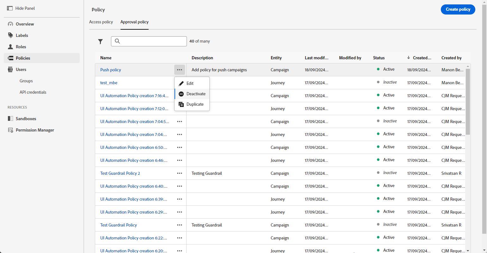

# Creare e gestire criteri di approvazione {#approval-policies}

>[!CONTEXTUALHELP]
>id="ajo_approval_policy_request_approval"
>title="Richiedere un’approvazione"
>abstract="Richiedere un’approvazione"

>[!CONTEXTUALHELP]
>id="ajo_approval_policy_request_change"
>title="Richiedi modifica"
>abstract="Richiedi modifica"

>[!NOTE]
>
>Per creare i criteri di approvazione, è necessario disporre dei privilegi di amministratore di sistema o di prodotto in Adobe Experience Platform. [Ulteriori informazioni](https://experienceleague.adobe.com/en/docs/experience-platform/access-control/home)

I criteri di approvazione consentono agli amministratori di stabilire un processo di convalida per percorsi e campagne. Questo sistema delinea condizioni specifiche che determinano se un percorso o una campagna richiede l’approvazione. Queste regole possono essere di complessità variabile. Possono semplicemente richiedere che tutte le campagne siano riviste da un particolare utente o team, o stabilire criteri in base a chi ha creato la campagna.

Puoi eseguire il targeting dei criteri di approvazione utilizzando criteri flessibili come tag, nomi di campagne/percorsi, tipi di canale o informazioni sul richiedente. Ad esempio, puoi richiedere l’approvazione per tutti gli oggetti con tag &quot;ad alto rischio&quot; o per qualsiasi campagna che corrisponde a uno specifico pattern di denominazione.

## Creare criteri di approvazione {#create-policies}

>[!CONTEXTUALHELP]
>id="ajo_permissions_approval_policy"
>title="Nuovo criterio di approvazione"
>abstract="In questa schermata, immetti il nome e seleziona il contesto per il criterio di approvazione, quindi genera le condizioni per determinare chi può avviare la richiesta di approvazione e chi può convalidarla."

Per creare un criterio di approvazione, eseguire la procedura seguente:

1. Dal menu **[!UICONTROL Amministrazione]** in [!DNL Journey Optimizer], accedi a **[!UICONTROL Autorizzazioni]** e quindi a **[!UICONTROL Criteri]**.

   

1. Fai clic su **[!UICONTROL Crea]** nella scheda **[!UICONTROL Criteri di approvazione]**, scegli **[!UICONTROL Criteri di approvazione]** e fai clic su **[!UICONTROL Conferma]**.

1. Immetti **[!UICONTROL Nome]** e **[!UICONTROL Descrizione]** per il criterio.

1. Seleziona se il criterio verrà applicato a **[!UICONTROL Percorsi]** o **[!UICONTROL Campagne]**.

<!--
1. Enable the **[!UICONTROL Block self-approval]** to prevent Journey/Campaign creators from approving their own objects.

    
-->

È ora possibile perfezionare le condizioni per specificare chi può avviare la richiesta di approvazione e chi può convalidarla.

## Imposta condizioni per i criteri di approvazione {#conditions}

I criteri di approvazione offrono opzioni di targeting flessibili per soddisfare le tue esigenze di governance. Puoi creare criteri di approvazione in base a vari criteri, tra cui:

* **Nomi campagna/Percorso**: oggetti specifici di destinazione per nome
* **Tag**: applica i criteri a tutte le campagne o percorsi con un tag specifico
* **Tipi di canale**: è necessaria l&#39;approvazione per azioni specifiche (e-mail, SMS, push, ecc.)
* **Tipi di campagna**: imposta regole diverse per [Campagne attivate da azioni rispetto a quelle attivate da API](../campaigns/get-started-with-campaigns.md#campaign-types)
* **Richiedenti**: definisci i criteri in base a chi crea la campagna o il percorso

Per definire le condizioni associate a un criterio di approvazione, effettuare le operazioni riportate di seguito.

1. Accedi al **[!UICONTROL criterio di approvazione]**.

1. Nel menu **[!UICONTROL If]**, fai clic su **[!UICONTROL Aggiungi condizione]** per definire quale oggetto o utente attiverà una richiesta di approvazione.

1. Scegli la **[!UICONTROL Categoria]**, **[!UICONTROL Regola corrispondente]** e **[!UICONTROL Opzioni]** appropriate.

   Ad esempio, &quot;se l’azione corrisponde a una direct mailing&quot; o &quot;Se il nome utente del richiedente corrisponde a John Doe&quot;.

   

   +++ Ulteriori informazioni sulle categorie e sulle opzioni disponibili
   <table>
    <tr>
      <th>Categoria</th>
      <th>Opzione</th>
    </tr>
    <tr>
      <td rowspan="3">Tipo di campagna</td>
      <td>Pianificato (marketing)</td>
    </tr>
    <tr>
    <td>Attivata da API (marketing)</td>
    </tr>
    <tr>
    <td>Attivata da API (transazionale)</td>
    </tr>
    <tr>
    <td rowspan="8">Azione</td>
    <td>In-app</td>
    </tr>
    <tr>
    <td>Notifica push</td>
   </tr>
    <tr>
    <td>SMS</td>
    </tr>
    <tr>
    <td>E-mail</td>
    </tr>
    <tr>
    <td>Direct mail</td>
    </tr>
    <tr>
    <td>Web</td>
    </tr>
    <tr>
    <td>Basato su codice</td>
    </tr>
    <tr>
    <td>Scheda contenuto</td>
    </tr>
    <tr>
    <td>Tag</td>
    <td>Nome del tag utilizzato per organizzare il pubblico. </td>
    </tr>
    <tr>
    <td>Nome oggetto</td>
    <td>Nome dell'oggetto.</td>
    </tr>
    <tr>
    <td>Nome utente richiedente</td>
    <td>Nome e indirizzo e-mail del richiedente designato</td>
    </tr>
    <tr>
    <td>Gruppo utenti richiedente</td>
    <td>Nome del gruppo di utenti dei richiedenti designati</td>
    </tr>
    </table>

1. Per aggiungere altri criteri, fare clic su **[!UICONTROL Aggiungi condizione]** per definire regole aggiuntive e selezionare **[!UICONTROL And]** o **[!UICONTROL Or]** per specificare la modalità di connessione delle condizioni.

1. Nel menu **[!UICONTROL Invia quindi la richiesta di approvazione a]**, fai clic su **[!UICONTROL Aggiungi condizione]** per definire quale utente può accettare la richiesta di approvazione.

1. Dal menu a discesa **[!UICONTROL Categoria]**, seleziona se desideri scegliere un gruppo di utenti o un singolo utente.

1. Quindi, dal menu a discesa **[!UICONTROL Opzione]**, seleziona il gruppo di utenti o l&#39;utente specifico.

   L’utente o il gruppo di utenti selezionato sarà responsabile della convalida della richiesta di approvazione.

   

1. Per aggiungere altri criteri, fare clic su **[!UICONTROL Aggiungi condizione]** per definire regole aggiuntive e selezionare **[!UICONTROL And]** o **[!UICONTROL Or]** per specificare la modalità di connessione delle condizioni.

1. Una volta configurati i criteri, fai clic su **[!UICONTROL Salva]**.

Ora puoi attivare il criterio di approvazione per applicarlo.

## Attivare e gestire i criteri di approvazione {#activate-policies}

Per applicare il criterio di approvazione, devi attivarlo. Per eseguire questa operazione, eseguire la procedura seguente:

1. Accedi al **[!UICONTROL criterio di approvazione]**.

1. Quindi, fai clic su **[!UICONTROL Attiva]** per applicare le condizioni configurate al tuo ambiente.

   >[!NOTE]
   >
   >Una volta attivati, i criteri non possono essere modificati. Per modificare le condizioni, disattiva prima il criterio.

   

1. Dal menu **[!UICONTROL Criterio]**, apri le opzioni avanzate per **[!UICONTROL Modifica]**, **[!UICONTROL Disattiva]** o **[!UICONTROL Duplica]** il criterio in base alle esigenze.

   
