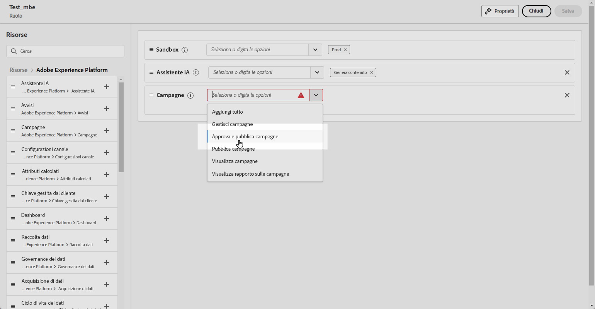
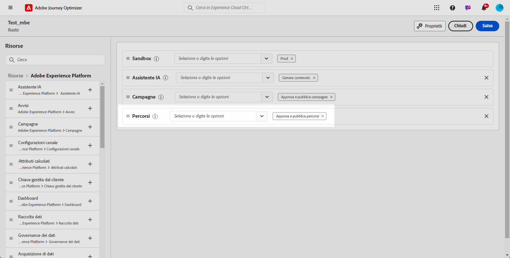
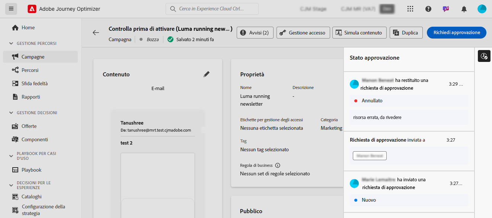

# Introduzione all’approvazione di percorsi e campagne {#send-proofs}

## Introduzione ai criteri di approvazione {#gs}

Journey Optimizer consente di impostare un processo di approvazione che consente ai team di marketing di garantire che le campagne e i percorsi vengano rivisti e autorizzati da stakeholder idonei, prima della pubblicazione.

I criteri di approvazione introducono un flusso di lavoro strutturato direttamente all’interno dell’interfaccia utente, eliminando la necessità di mezzi esterni come e-mail o strumenti di gestione delle attività e garantendo che tutte le approvazioni siano gestite e tracciate a livello centrale.

Inoltre, questa funzione offre un controllo migliorato sulla pubblicazione dei percorsi e delle campagne: con il processo di approvazione incorporato in Journey Optimizer, le campagne e i percorsi rimangono in uno stato “bloccato” durante la revisione, garantendo che non si verifichino modifiche o attivazioni involontarie prima che tutte le approvazioni necessarie siano state attuate.

## Prerequisiti {#prerequisites}

Prima di iniziare, assicurati che siano state configurate le autorizzazioni seguenti.

Per accedere ai percorsi e alle campagne di approvazione e pubblicazione, è necessario concedere agli utenti le autorizzazioni **Approva e pubblica campagne** e **Approva e pubblica percorsi**. [Ulteriori informazioni](../administration/permissions.md)

+++  Scopri come assegnare le autorizzazioni relative all’approvazione

1. Nel prodotto **Autorizzazioni**, passa alla scheda **Ruoli** e seleziona il **Ruolo** desiderato.

1. Fai clic su **Modifica** per modificare le autorizzazioni.

1. Aggiungi la risorsa **Campagne**, quindi seleziona **Approva e pubblica campagne** dal menu a discesa.

   {zoomable="yes"}

1. Aggiungi la risorsa **Percorsi**, quindi seleziona **Approva e pubblica Percorsi** dal menu a discesa.

   {zoomable="yes"}

1. Fai clic su **Salva** per applicare le modifiche.

Le autorizzazioni degli utenti già assegnati a questo ruolo verranno aggiornate automaticamente.

1. Per assegnare questo ruolo a nuovi utenti, passa alla scheda **Utenti** nella dashboard **Ruoli** e fai clic su **Aggiungi utente**.

1. Immetti il nome o l’indirizzo e-mail dell’utente o sceglilo dall’elenco e fai clic su **Salva**.

1. Se l’utente non è già stato creato in precedenza, consulta [questa documentazione](https://experienceleague.adobe.com/it/docs/experience-platform/access-control/abac/permissions-ui/users).

L’utente riceverà un’e-mail con istruzioni per accedere all’istanza.

+++

## Panoramica sul processo di approvazione {#process}

Il processo di approvazione globale è il seguente:

{zoomable="yes"}

1. **Configurazione dei criteri di approvazione**

   Un utente amministratore crea un criterio di approvazione, definendo le condizioni in base alle quali il criterio deve essere applicato a percorsi o campagne. Ad esempio, puoi creare un criterio di approvazione che richiede che tutte le campagne pianificate create da un determinato utente siano approvate prima di essere attivate. [Scopri come creare i criteri di approvazione](approval-policies.md)

1. **Invio campagna/percorso per l’approvazione**

   I creatori di campagna/percorso creano un percorso o una campagna e lo inviano per l’approvazione. La campagna o il percorso entra in stato &quot;In revisione&quot;, durante il quale non è possibile apportare modifiche a meno che la richiesta non venga annullata. [Informazioni su come richiedere l’approvazione](request-approval.md)

   >[!NOTE]
   >
   >Le campagne e i percorsi devono essere inviati per l’approvazione solo se esiste un criterio di approvazione. In caso contrario, il creatore può pubblicare direttamente la campagna o il percorso senza richiedere l’approvazione.

1. **Revisione e approvazione**

   L’approvatore o gli approvatori definiti nei criteri di approvazione applicabili al percorso o alla campagna ricevono una notifica. Questi possono esaminare il contenuto del percorso o della campagna, il pubblico e le impostazioni. Se sono necessarie modifiche, l’approvatore le richiede, restituendo la campagna nello stato di “Bozza” per le revisioni. Se sono pronti, possono attivare e lanciare il percorso o la campagna. [Informazioni su come revisionare e approvare una richiesta](review-approve-request.md)

## Monitorare le richieste di approvazione {#monitor}

Puoi monitorare tutte le richieste di approvazione e modifica inviate per un determinato percorso o campagna. A questo scopo, fai clic sull’icona **[!UICONTROL Mostra Audit Trail]** nella sezione in alto a destra dell’area di lavoro del percorso o nella schermata di revisione della campagna.

