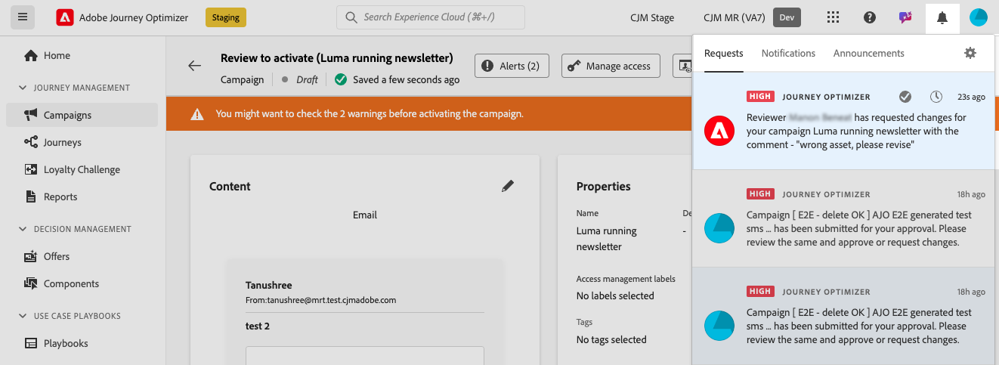

# Richiedere un’approvazione {#request-approval}

L’accesso al flusso di lavoro di approvazione è determinato dal caso d’uso specifico:

* **Nessun criterio di approvazione attivo esistente**

   * **Campagne**: se non sono attivi criteri di approvazione per l&#39;oggetto Campaign in una sandbox, nelle campagne verrà visualizzato il pulsante **[!UICONTROL Attiva]**, che consente di attivarli senza richiedere l&#39;approvazione.

   * **Percorsi**: se non sono attivi criteri di approvazione per l&#39;oggetto Percorso, nei percorsi verrà visualizzato il pulsante **[!UICONTROL Pubblica]**, che consente di pubblicare direttamente.

* **Criteri di approvazione attivi esistenti**

   * **Campagne**: se esistono uno o più criteri di approvazione attivi per l&#39;oggetto Campaign in una sandbox, tutte le campagne in tale sandbox visualizzeranno il pulsante **[!UICONTROL Richiedi approvazione]**.
Se all&#39;oggetto selezionato non viene applicato alcun criterio di approvazione quando si fa clic sul pulsante **[!UICONTROL Richiedi approvazione]**, verrà attivato il flusso di lavoro di approvazione automatica.

   * **Percorsi**: se esistono uno o più criteri di approvazione attivi per l&#39;oggetto Percorso in una sandbox, in tutti i percorsi verrà visualizzato il pulsante **[!UICONTROL Richiedi approvazione]**.
Se all&#39;oggetto selezionato non viene applicato alcun criterio di approvazione quando si fa clic sul pulsante **[!UICONTROL Richiedi approvazione]**, verrà attivato il flusso di lavoro di approvazione automatica.

## Invia richiesta di approvazione

Dopo aver creato la campagna o il percorso, fai clic sul pulsante **[!UICONTROL Richiedi approvazione]**. Verifica se nella sandbox è presente un criterio di approvazione attivo applicabile alla campagna o al percorso.

* Se viene individuato un criterio di approvazione applicabile, la campagna o il percorso verrà inviato per la revisione.

* Se nessun criterio di approvazione è applicabile alla campagna o al percorso dopo aver fatto clic sul pulsante **[!UICONTROL Richiedi approvazione]**, la campagna o il percorso verranno automaticamente approvati e attivati o pubblicati.

Viene aperto il riquadro **[!UICONTROL Richiedi approvazione]**. Fornisci un messaggio per gli approvatori, se necessario, e fai clic su **[!UICONTROL Invia]** per inviare la richiesta.

Mentre la campagna o il percorso è nello stato **[!UICONTROL In revisione]**, è possibile annullare la richiesta di approvazione. Facendo clic sul pulsante **[!UICONTROL Annulla richiesta]**, la campagna o il percorso torneranno alla fase di bozza e verrà inviata una notifica ai revisori per informarli che la richiesta è stata annullata. Puoi quindi apportare le modifiche necessarie e inviare nuovamente la campagna o il percorso per l’approvazione.

## Gestire le richieste di approvazione

Una volta inviata la richiesta di approvazione agli approvatori, questi possono rivederla e attivare il percorso o la campagna per renderla attiva oppure richiedere modifiche, se necessario. [Scopri come rivedere e approvare una richiesta](review-approve-request.md)

Se la richiesta degli approvatori cambia, riceverai una notifica tramite e-mail e un avviso di Journey Optimizer, accessibile facendo clic sull&#39;icona a forma di campana in alto a destra dello schermo nella scheda **[!UICONTROL Richieste]**.

Per esaminare la richiesta di modifica, aprila dall’e-mail o dall’avviso per accedere al percorso o alla campagna e apportare le modifiche richieste. Quando il tuo percorso/campagna è pronto per essere rivisto, invia una nuova richiesta di approvazione utilizzando il pulsante **[!UICONTROL Richiedi approvazione]**.
