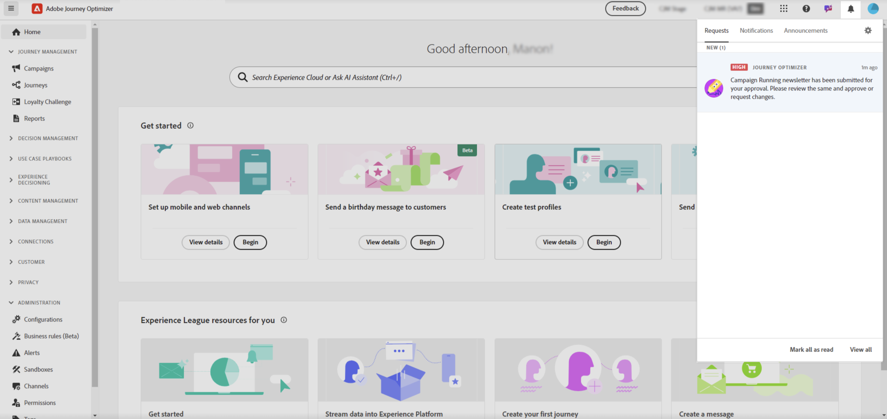

# Rivedere e approvare una richiesta {#approve-requests}

>[!AVAILABILITY]
>
> I criteri di approvazione sono attualmente disponibili solo per un set di organizzazioni (disponibilità limitata). Per potervi accedere, contatta il tuo rappresentante Adobe.

Se a un percorso o a una campagna si applica un criterio di approvazione, è necessario inviarlo per l’approvazione per poter essere pubblicato. A questo scopo, il creatore del percorso/campagna invia una richiesta agli approvatori definiti nei criteri di approvazione e il percorso/campagna ottiene lo stato **[!UICONTROL In revisione]**.

Se sei stato selezionato come approvatore, riceverai una notifica tramite e-mail e un avviso di Journey Optimizer, accessibile facendo clic sull&#39;icona a forma di campana in alto a destra dello schermo, nella scheda **[!UICONTROL Richieste]**.

Per rivedere il percorso/la campagna, aprilo dall’e-mail o dall’avviso e verificane le impostazioni quali pubblico, contenuto o impostazioni.
Al termine, puoi [approvare e pubblicare il percorso/campagna](#approve) o [richiedere modifiche prima di attivarlo](#changes).

>[!NOTE]
>
>La revisione di una campagna è un passaggio di sola lettura: puoi visualizzarne tutte le impostazioni ma non eseguire alcuna azione.
>
>Prima di rivedere un percorso o una campagna, assicurati di disporre delle autorizzazioni necessarie.

## Approvare e pubblicare un percorso/campagna {#approve}

Se un percorso o una campagna sono pronti per essere pubblicati, puoi approvarli facendo clic sul pulsante **[!UICONTROL Approva]**.

Nella finestra visualizzata, fai clic su **[!UICONTROL Approva e attiva]** per rendere il percorso/campagna attivo.

## Richiedi modifiche a un percorso/campagna {#changes}

Se sono necessarie modifiche in un percorso o in una campagna che è stata inviata per l’approvazione, puoi inviare una richiesta al creatore in modo che effettui le modifiche necessarie.

A tale scopo, fare clic sul pulsante **[!UICONTROL Richiedi modifiche]**. Nei riquadri aperti, immetti un messaggio che descrive la richiesta e fai clic su **[!UICONTROL Invia]** per inviare la richiesta.

Dopo aver inviato la richiesta, il creatore del percorso/campagna riceve una notifica tramite e-mail e un avviso Journey Optimizer. La campagna ritorna allo stato &quot;Bozza&quot;. Una volta integrate le modifiche, il creatore di percorso/campagna può inviarle nuovamente per l’approvazione.
