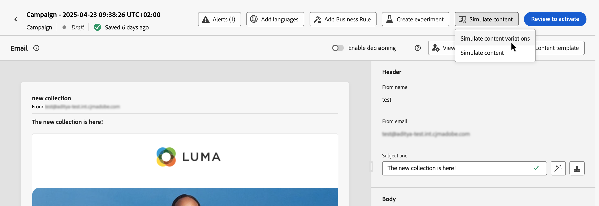

# Verifica il contenuto utilizzando dati di input di esempio (Beta) {#custom-profiles}

>[!CONTEXTUALHELP]
>id="ajo_simulate_sample_profiles"
>title="Simulazione tramite input di esempio"
>abstract="In questa schermata, puoi testare diverse varianti del contenuto fornendo valori per i campi di personalizzazione tramite un modello CSV o JSON oppure immettendo manualmente i valori."

>[!AVAILABILITY]
>
>Questa funzione è attualmente disponibile per tutti i clienti come versione beta pubblica.

Percorsi optimizer consente di testare diverse varianti di contenuto visualizzandolo in anteprima e inviando bozze utilizzando dati di input di esempio caricati da un file o aggiunti manualmente. Tutti gli attributi dei profili utilizzati nel contenuto per la personalizzazione vengono rilevati automaticamente dal sistema e possono essere utilizzati per i test per creare più varianti.

>[!NOTE]
>
>Per il momento, la simulazione delle varianti di contenuto è disponibile solo per i canali di notifica e-mail, SMS e push.

Per accedere a questa esperienza, fai clic sul pulsante **[!UICONTROL Simula contenuto]** e scegli **[!UICONTROL Simula varianti di contenuto (Beta)]**.

I passaggi principali per testare il contenuto sono i seguenti:

1. Aggiungi fino a 30 varianti con dati di input di esempio caricando un file o aggiungendo dati manualmente. [Scopri come aggiungere varianti](#profiles)
1. Controlla l’anteprima del contenuto utilizzando le diverse varianti. [Scopri come visualizzare in anteprima il tuo contenuto](#preview)
1. Per il contenuto delle e-mail, invia fino a 10 bozze agli indirizzi e-mail utilizzando le diverse varianti. [Scopri come inviare bozze](#proofs)

## Guardrail e limitazioni {#limitations}

Prima di iniziare a testare il contenuto utilizzando dati di input di esempio, considera i seguenti guardrail e prerequisiti.

* Al momento, il test eseguito utilizzando dati di input di esempio è disponibile solo per i canali di notifica e-mail, SMS e push. Non è possibile accedere all’esperienza dal pulsante &quot;Simula contenuto&quot; all’interno di E-mail Designer.
* Nell’esperienza corrente non sono disponibili le seguenti funzioni: rendering della casella in entrata, rapporti di posta indesiderata, contenuto multilingue ed esperimento sui contenuti. Per utilizzare queste funzionalità, seleziona dal contenuto il pulsante **[!UICONTROL Simula contenuto]** per accedere all&#39;interfaccia utente precedente.
* Al momento sono supportati solo gli attributi del profilo. Se nel contenuto vengono utilizzati attributi contestuali per la personalizzazione, non potrai testare il contenuto utilizzando questi attributi.
* Per l’immissione di dati per le varianti sono supportati solo i seguenti tipi di dati: numero (intero e decimale), stringa, booleano e tipo data. Qualsiasi altro tipo di dati mostrerà un errore.

## Aggiungi varianti {#profiles}

Puoi aggiungere fino a 30 varianti per testare il contenuto, utilizzando un file o manualmente.

>[!NOTE]
>
>Le varianti aggiunte servono solo come scopo di test per il contenuto corrente. Gli elementi non vengono memorizzati in Adobe Experience Platform, ma nella sessione del browser utente, il che significa che non verranno visualizzati alla disconnessione o quando si lavora da un altro dispositivo.

### Aggiungi variante utilizzando un file {#file}

Per aggiungere una variante da un file, effettua le seguenti operazioni:

1. Fai clic sul collegamento **[!UICONTROL scarica esempio]** per recuperare un modello di file, quindi scegli il formato di file che desideri utilizzare (CSV, JSON o JSONLINES).

1. Fai clic su **[!UICONTROL Scarica]**, quindi archivia il modello nel percorso desiderato.

1. Apri il file e compila il modello in base alle tue esigenze. Il modello include una colonna per ogni attributo di profilo utilizzato nel contenuto per la personalizzazione.

1. Quando il file è pronto, fai clic su **[!UICONTROL Carica dati di input]** per caricarlo e verificare il contenuto.

1. Una volta caricato il file, nel riquadro a sinistra viene aggiunta una casella per ogni riga del file. Ogni casella contiene tutti gli attributi di profilo utilizzati nel contenuto per la personalizzazione. Ora è possibile utilizzare le varianti per visualizzare in anteprima il contenuto nel riquadro a destra e inviare le bozze.

   

### Aggiungere varianti manualmente {#manual}

Per aggiungere manualmente una variante, effettua le seguenti operazioni:

1. Fai clic sul pulsante **[!UICONTROL Crea input di esempio]**.

   Nel riquadro a sinistra viene aggiunta una casella con tutti gli attributi del profilo utilizzati nel contenuto per la personalizzazione.

1. Inserisci i dati di input di esempio per la variante e fai clic su **[!UICONTROL Salva]**.

   

1. Una volta aggiunte le varianti, puoi utilizzarle per visualizzare in anteprima il contenuto nel riquadro a destra e inviare le bozze.

## Visualizzare in anteprima le varianti di contenuto {#preview}

Per visualizzare l’anteprima del contenuto utilizzando una delle varianti, seleziona la casella pertinente per aggiornare l’anteprima del contenuto nella sezione a destra con le informazioni immesse per questa variante.

Puoi rimuovere una variante in qualsiasi momento utilizzando il pulsante con i puntini di sospensione nell&#39;angolo superiore destro e selezionando **[!UICONTROL Rimuovi]**. Per modificare le informazioni per una variante, fai clic sul pulsante con i puntini di sospensione e seleziona **[!UICONTROL Modifica]**.

## Inviare bozze {#proofs}

Journey Optimizer ti consente di inviare bozze agli indirizzi e-mail impersonando una o più varianti aggiunte nella schermata di simulazione. I passaggi sono i seguenti:

1. Verifica che siano state aggiunte varianti per verificare il contenuto e fai clic sul pulsante **[!UICONTROL Invia bozza]**.

1. Nel campo **[!UICONTROL Destinatari]**, inserisci l&#39;indirizzo e-mail a cui desideri inviare la bozza, quindi fai clic su **[!UICONTROL Aggiungi]**. Ripeti l’operazione per inviare la bozza ad altri indirizzi e-mail. Puoi aggiungere fino a 10 destinatari della bozza.

1. Nella sezione inferiore della schermata, seleziona la variante da utilizzare nella bozza. Puoi selezionare più varianti, nel qual caso l’e-mail includerà tante bozze quante sono le varianti selezionate.

   Per ulteriori informazioni su una variante, seleziona il collegamento **[!UICONTROL Visualizza dettagli profilo]**. Questo consente di visualizzare le informazioni immesse nella schermata precedente per le diverse varianti.

   

1. Fare clic sul pulsante **[!UICONTROL Invia bozza]** per iniziare a inviare la bozza.

1. Per tenere traccia dell&#39;invio della bozza, fare clic sul pulsante **[!UICONTROL Visualizza bozze]** nella schermata Simula contenuto.

