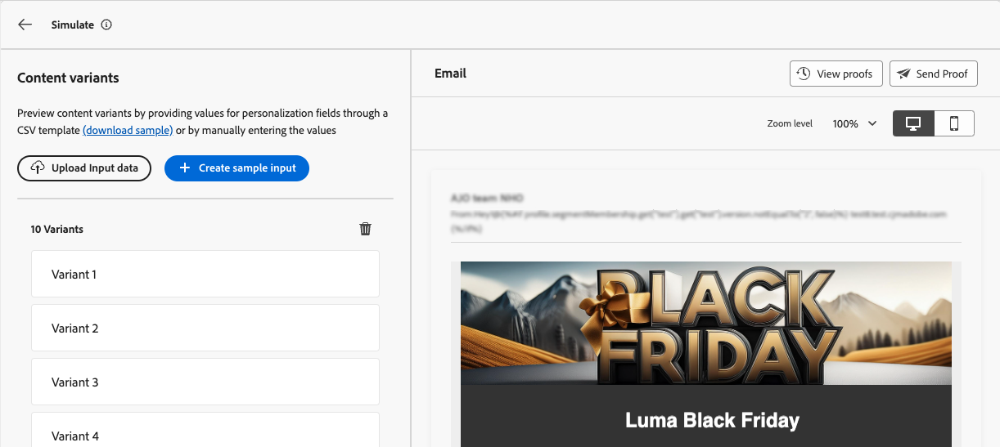

# Simulare varianti di contenuto {#custom-profiles}

>[!CONTEXTUALHELP]
>id="ajo_simulate_sample_profiles"
>title="Simulazione tramite input di esempio"
>abstract="In questa schermata, puoi testare diverse varianti del contenuto fornendo valori per i campi di personalizzazione tramite un modello CSV o JSON, oppure immettendo manualmente i valori."

Percorsi Optimizer consente di visualizzare in anteprima diverse varianti di contenuto utilizzando dati di input di esempio caricati da un file CSV o JSON o aggiunti manualmente.

Tutti gli attributi utilizzati nel contenuto per la personalizzazione vengono rilevati automaticamente dal sistema e possono essere utilizzati per i test al fine di creare più varianti. Una variante si riferisce a una versione del contenuto con valori diversi per i relativi attributi.

>[!NOTE]
>
>Le varianti fungono solo da scopo di test per il contenuto corrente. Non vengono memorizzati in Adobe Experience Platform, ma nella sessione del browser utente, il che significa che non vengono visualizzati alla disconnessione o quando si lavora da un altro dispositivo.

## Guardrail e limitazioni {#limitations}

Prima di iniziare a testare il contenuto utilizzando dati di input di esempio, considera i seguenti guardrail e prerequisiti.

* **Canali** - La simulazione delle varianti di contenuto è disponibile per:

   * i canali di notifica e-mail, SMS e push;
   * tutti i canali in entrata (web, esperienza basata su codice, in-app, schede di contenuto).

* **Funzionalità supportate** - Le varianti di contenuto possono essere utilizzate con [!DNL Journey Optimizer] contenuti multilingue e funzionalità di sperimentazione dei contenuti. Questo consente di testare i messaggi in più lingue e di ottimizzare il contenuto attraverso la sperimentazione.

  Puoi anche sfruttare le varianti di contenuto per testare i modelli di contenuto.

  >[!NOTE]
  >
  >Per il momento, il rendering della casella in entrata e i rapporti di posta indesiderata non sono disponibili nell’esperienza corrente. Per utilizzare queste funzionalità, seleziona dal contenuto il pulsante **[!UICONTROL Simula contenuto]** per accedere all&#39;interfaccia utente precedente.

* **Attributi** - Sono supportati sia gli attributi di profilo che quelli contestuali.

* **Tipi di dati** - Durante l&#39;immissione dei dati per le varianti sono supportati solo i tipi di dati seguenti: numero (intero e decimale), stringa, booleano e tipo di data. Qualsiasi altro tipo di dati mostrerà un errore.

* **Numero di varianti** - È possibile aggiungere fino a 30 varianti per testare il contenuto, utilizzando un file o manualmente.

## Aggiungere e visualizzare in anteprima le varianti di contenuto

Per creare varianti per il contenuto e visualizzarle in anteprima, fare clic sul pulsante **[!UICONTROL Simula contenuto]** e scegliere **[!UICONTROL Simula varianti di contenuto]**.


I passaggi principali per testare il contenuto sono i seguenti:

1. **Aggiungi varianti** - Aggiungi fino a 30 varianti con dati di input di esempio caricando un file o aggiungendo dati manualmente. [Scopri come aggiungere varianti](#profiles)
1. **Anteprima varianti di contenuto** - Controlla l&#39;anteprima del contenuto utilizzando le diverse varianti. [Scopri come visualizzare in anteprima il tuo contenuto](#preview)
1. **Invia bozze e-mail** - Per il contenuto delle e-mail, invia fino a 10 bozze agli indirizzi e-mail utilizzando le diverse varianti. [Scopri come inviare bozze](#proofs)

### Aggiungi varianti {#profiles}

Quando accedi all’esperienza delle varianti di contenuto, tutti i campi di personalizzazione utilizzati nel contenuto vengono rilevati e visualizzati automaticamente in un elenco di varianti vuote.

Ad esempio, se l’e-mail contiene due campi di personalizzazione &quot;Città&quot; e &quot;Bilancio punti programma&quot;, verranno visualizzati nell’elenco. Inizialmente non viene immesso alcun valore e nel riquadro di anteprima non viene visualizzato alcun contenuto personalizzato.


Per modificare il valore di una variante:

1. Fai clic sul pulsante con i puntini di sospensione accanto alla variante.
1. Seleziona **[!UICONTROL Modifica]** per fornire valori personalizzati per ogni campo di personalizzazione.
1. Il riquadro di anteprima viene aggiornato per mostrare il rendering del contenuto con i valori immessi.

Per aggiungere una nuova variante:

1. Fai clic sul pulsante **[!UICONTROL Crea input di esempio]**.
1. Viene visualizzata una nuova variante vuota, contenente tutti i campi di personalizzazione rilevati.
1. Modifica la nuova variante in base alle esigenze.


Puoi anche caricare un file con varianti e valori predefiniti per accelerare il processo.

1. Fai clic su **[!UICONTROL Scarica campione]** per scaricare un modello di file.
1. Scegli un formato di file: CSV, JSON o JSONLINES.
1. Apri il file modello e inserisci i valori desiderati per ciascun attributo di profilo. Il modello include una colonna per ogni attributo di profilo utilizzato nel contenuto per la personalizzazione.

   Esempio di sintassi JSON:

   ```
   {
   "profile": {
       "attributes": {
       "person": {
           "name": {
               "lastName": "Doe",
               "firstName": "John"
               }
           }
       }
   }
   }
   ```

1. Quando il file è pronto, fai clic su **[!UICONTROL Carica dati di input]** per caricarlo.
1. Dopo il caricamento, viene aggiunta una nuova variante all’elenco per ogni voce del file.

   

Una volta aggiunte le varianti, puoi utilizzarle per visualizzare l’anteprima del contenuto nel riquadro a destra e per inviare bozze e-mail.

### Anteprima varianti di contenuto {#preview}

Per visualizzare l’anteprima del contenuto utilizzando una variante, seleziona la variante pertinente dall’elenco per aggiornare il contenuto nel riquadro di anteprima con le informazioni immesse per questa variante.

Nell’esempio seguente, sono state aggiunte due varianti per la riga dell’oggetto dell’e-mail:

| Selezione variante 1 | Selezione variante 2 |
|----------|-------------|
|  |  |

Per i contenuti e la sperimentazione multilingue, è disponibile un menu a discesa per passare tra le diverse varianti di lingua o i diversi trattamenti.


Puoi rimuovere una variante in qualsiasi momento utilizzando il pulsante con i puntini di sospensione nell&#39;angolo superiore destro e selezionando **[!UICONTROL Rimuovi]**. Per modificare le informazioni per una variante, fai clic sul pulsante con i puntini di sospensione e seleziona **[!UICONTROL Modifica]**.

### Inviare bozze {#proofs}

Journey Optimizer ti consente di inviare bozze agli indirizzi e-mail impersonando una o più varianti aggiunte nella schermata di simulazione. I passaggi sono i seguenti:

1. Verifica che siano state aggiunte varianti per verificare il contenuto e fai clic sul pulsante **[!UICONTROL Invia bozza]**.

1. Nel campo **[!UICONTROL Destinatari]**, inserisci l&#39;indirizzo e-mail a cui desideri inviare la bozza, quindi fai clic su **[!UICONTROL Aggiungi]**. Ripeti l’operazione per inviare la bozza ad altri indirizzi e-mail. Puoi aggiungere fino a 10 destinatari della bozza.

1. Nella sezione inferiore della schermata, seleziona la variante da utilizzare nella bozza. Puoi selezionare più varianti, nel qual caso l’e-mail includerà tante bozze quante sono le varianti selezionate.

   Per ulteriori informazioni su una variante, seleziona il collegamento **[!UICONTROL Visualizza dettagli profilo]**. Questo consente di visualizzare le informazioni immesse nella schermata precedente per le diverse varianti.

   

1. Fare clic sul pulsante **[!UICONTROL Invia bozza]** per iniziare a inviare la bozza.

1. Per tenere traccia dell&#39;invio della bozza, fare clic sul pulsante **[!UICONTROL Visualizza bozze]** nella schermata Simula contenuto.


