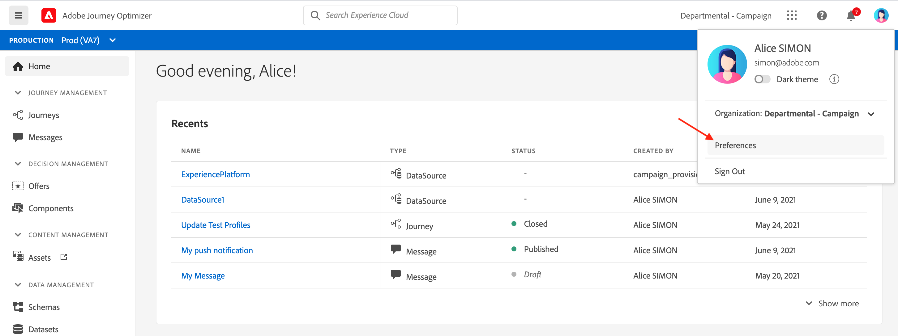
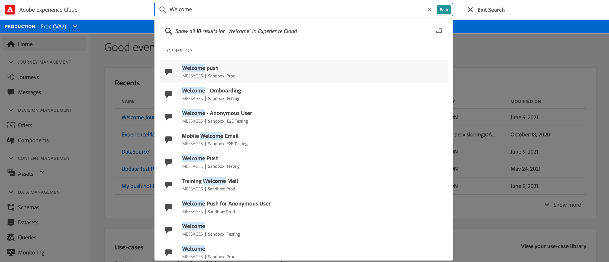

# Interfaccia utente {#cjm-user-interface}

Questa documentazione viene spesso aggiornata per riflettere le recenti modifiche apportate al prodotto. Tuttavia, alcune schermate possono risultare leggermente diverse dall’interfaccia del prodotto.

## Workspace {#cjm-workspace}

Una volta connesso a [Adobe Experience Cloud](http://experience.adobe.com), passa a [!DNL Journey Optimizer].

>[!NOTE]
>
>I concetti chiave durante la navigazione nell’interfaccia utente sono descritti in dettaglio nella [documentazione di Adobe Experience Platform](https://experienceleague.adobe.com/docs/experience-platform/landing/platform-ui/ui-guide.html?lang=it#adobe-experience-platform-ui-guide).

Utilizza i collegamenti a sinistra per sfogliare le funzionalità.

>[!NOTE]
>
>Le funzionalità disponibili possono variare a seconda delle autorizzazioni e del contratto di licenza.

Di seguito è riportato l’elenco completo dei servizi e delle funzionalità disponibili nella navigazione a sinistra e dei collegamenti alla relativa documentazione.

**Home**

La pagina Home di [!DNL Journey Optimizer] contiene collegamenti e risorse chiave per iniziare. L’elenco **[!UICONTROL Recents]** fornisce collegamenti ai messaggi, agli eventi e ai percorsi creati o aggiornati di recente. Questo elenco mostra le relative date e lo stato di creazione e modifica.

**[!UICONTROL JOURNEY MANAGEMENT]**

* **[!UICONTROL Journeys]**: crea, configura e gestisci i percorsi dei clienti. [Ulteriori informazioni](building-journeys/journey-gs.md#jo-build).

* **[!UICONTROL Messages]**: crea, progetta, testa e pubblica e-mail e messaggi push. [Ulteriori informazioni](create-message.md)

**[!UICONTROL DECISION MANAGEMENT]**

* **[!UICONTROL Offers]**: accedi alle origini e ai set di dati recenti da questo menu. Usa questa sezione per creare nuove offerte. [Ulteriori informazioni](offers/offer-library/creating-personalized-offers.md)

* **[!UICONTROL Components]**: crea posizionamenti, regole e tag. [Ulteriori informazioni](offers/offer-library/key-steps.md)

**[!UICONTROL CONTENT MANAGEMENT]**

* **[!UICONTROL Assets]**: [!DNL Adobe Experience Manager Assets Essentials] è un archivio centralizzato di risorse che puoi utilizzare per compilare i messaggi. [Ulteriori informazioni](assets-essentials.md)

**[!UICONTROL DATA MANAGEMENT]**

* **[!UICONTROL Schemas]**: utilizza Adobe Experience Platform per creare e gestire gli schemi Experience Data Model (XDM) in un’area di lavoro visiva e interattiva, denominata Editor di schema. [Ulteriori informazioni](https://experienceleague.adobe.com/docs/experience-platform/xdm/tutorials/create-schema-ui.html?lang=it)

* **[!UICONTROL Datasets]**: tutti i dati acquisiti in Adobe Experience Platform vengono mantenuti all’interno del Data Lake come set di dati. Un set di dati è un costrutto di archiviazione e gestione per una raccolta di dati, in genere una tabella, che contiene uno schema (colonne) e campi (righe). [Come visualizzare in anteprima e creare un set di dati](https://experienceleague.adobe.com/docs/experience-platform/catalog/datasets/user-guide.html?lang=it)

* **[!UICONTROL Queries]**: utilizza Adobe Experience Platform Query Service per scrivere ed eseguire query, visualizzare le query eseguite in precedenza e accedere a quelle salvate dagli utenti della tua organizzazione. [Ulteriori informazioni](https://experienceleague.adobe.com/docs/experience-platform/query/ui/overview.html?lang=it)

* **[!UICONTROL Monitoring]**: usa questo menu per monitorare l’inserimento dei dati nell’interfaccia utente di Adobe Experience Platform. [Ulteriori informazioni](https://experienceleague.adobe.com/docs/experience-platform/ingestion/quality/monitor-data-ingestion.html?lang=it)

**[!UICONTROL CONNECTIONS]**

* **[!UICONTROL Sources]**: utilizza questo menu per acquisire i dati da diverse origini, ad esempio applicazioni Adobe, archivi basati su cloud, database e altro ancora, nonché per strutturare, etichettare e ottimizzare i dati in arrivo. [Ulteriori informazioni](https://experienceleague.adobe.com/docs/experience-platform/sources/home.html?lang=it)

**[!UICONTROL CUSTOMER]**

* **[!UICONTROL Segments]**: crea e gestisci le definizioni dei segmenti di Experience Platform per utilizzarle nei tuoi percorsi. Per ulteriori informazioni, consulta [questa pagina](segment/about-segments.md).

* **[!UICONTROL Profiles]**: la funzione Profilo cliente in tempo reale crea una visualizzazione olistica di ciascuno dei singoli clienti, combinando dati provenienti da più canali tra cui dati online, offline, del sistema CRM e di terze parti. [Ulteriori informazioni](https://experienceleague.adobe.com/docs/experience-platform/profile/ui/user-guide.html?lang=it)

* **[!UICONTROL Identities]**: il servizio Adobe Experience Platform Identity gestisce l’identificazione dei clienti in tempo reale, tra dispositivi e canali diversi, in quello che viene definito un grafico di identità in Adobe Experience Platform. [Scopri come creare uno spazio dei nomi delle identità](https://experienceleague.adobe.com/docs/experience-platform/identity/namespaces.html?lang=it#manage-namespaces)

**[!UICONTROL ADMINISTRATION]**

* **[!UICONTROL Journey Administration]**: utilizza questo menu per configurare [eventi](event/about-events.md), [origini dati](datasource/about-data-sources.md) e [azioni](action/action.md) da utilizzare nei tuoi percorsi.

* **[!UICONTROL Sandboxes]**: Adobe Experience Platform fornisce ambienti sandbox che permettono di suddividere una singola istanza in ambienti virtuali separati, utili per le attività di sviluppo e aggiornamento delle applicazioni di esperienza digitale. [Ulteriori informazioni sugli ambienti sandbox](https://experienceleague.adobe.com/docs/experience-platform/sandbox/ui/user-guide.html?lang=it)

## Supporto di browser e lingue

L’interfaccia di Adobe [!DNL Journey Optimizer] è progettata per funzionare in modo ottimale nell’ultima versione di Google Chrome. L’utilizzo di versioni precedenti o di altri browser potrebbe comportare problemi durante l’utilizzo di alcune funzioni.

L’interfaccia utente è attualmente disponibile nelle seguenti lingue:

* Inglese
* Francese
* Tedesco

La lingua predefinita dell’interfaccia è determinata dalla lingua preferita specificata nel profilo utente.

Per cambiare lingua:

* Fai clic su **Preferenze** dall&#39;avatar, in alto a destra.
   
* Quindi fai clic sulla lingua visualizzata sotto il tuo indirizzo e-mail
* Seleziona la lingua preferita e fai clic su **Salva**. È possibile selezionare una seconda lingua nel caso in cui il componente che si utilizza non sia localizzato nella lingua di forst.
   

## Cerca

Utilizza la ricerca Adobe Experience Cloud al centro della barra superiore per trovare risorse, percorsi o messaggi nelle sandbox. Inizia a immettere il contenuto per visualizzare i risultati migliori.

Premere **Invio** per accedere a tutti i risultati e al filtro.

## Elenchi di filtri{#section_lgm_hpz_pgb}

Nella maggior parte degli elenchi, una barra di ricerca consente di cercare un elemento specifico e selezionare i criteri di filtro.

Per accedere ai filtri, fai clic sull’icona del filtro in alto a sinistra nell’elenco. Il menu dei filtri consente di filtrare gli elementi visualizzati in base a criteri diversi. Puoi scegliere di visualizzare solo gli elementi di un determinato tipo o stato, quelli che hai creato oppure quelli modificati negli ultimi 30 giorni. Le opzioni variano a seconda del contesto.

Nell’elenco dei percorsi, è possibile filtrare i percorsi in base al loro stato e alla loro versione dal **[!UICONTROL Status and version filters]**. È possibile scegliere di visualizzare solo i percorsi che utilizzano un evento, un gruppo di campi o un&#39;azione specifici tra **[!UICONTROL Activity filters]** e **[!UICONTROL Data filters]**. La sezione **[!UICONTROL Publication filters]** consente di selezionare una data di pubblicazione o un utente. Ad esempio, puoi scegliere di visualizzare le versioni più recenti dei percorsi live pubblicati ieri. [Ulteriori informazioni](building-journeys/using-the-journey-designer.md).

>[!NOTE]
>
>Le colonne visualizzate possono essere personalizzate utilizzando il pulsante di configurazione, posto in alto a destra degli elenchi. La personalizzazione viene salvata per ogni utente.

Utilizza le colonne **[!UICONTROL Last update]** e **[!UICONTROL Last update by]** per verificare quando è avvenuto l’ultimo aggiornamento dei percorsi e chi l’ha salvato.

Nei riquadri di configurazione dell’evento, dell’origine dati e dell’azione, il campo **[!UICONTROL Used in]** mostra il numero di percorsi che utilizzano quel particolare evento, gruppo di campi o azione. Per visualizzare l’elenco dei percorsi corrispondenti, puoi fare clic sul pulsante **[!UICONTROL View journeys]**.

All’interno dei vari elenchi, puoi eseguire le azioni di base su ciascun elemento. Ad esempio, è possibile duplicare o eliminare un elemento.

## Sfogliare i campi di Adobe Experience Platform {#friendly-names-display}

Quando si definisce il [payload dell’evento](event/about-creating.md#define-the-payload-fields) e il [payload del gruppo di campi](datasource/configure-data-sources.md#define-field-groups) e si selezionano i campi nell’[editor delle espressioni](https://experienceleague.adobe.com/docs/journeys/using/building-advanced-conditions-journeys/expressionadvanced.html?lang=it), oltre al nome del campo viene mostrato anche il nome visualizzato. Queste informazioni vengono recuperate dalla definizione dello schema di Experience Data Model.

Se durante la configurazione degli schemi vengono forniti descrittori come &quot;xdm:alternateDisplayInfo&quot;, i nomi descrittivi sostituiranno i nomi visualizzati. È particolarmente utile quando si lavora con “eVar” e campi generici. Puoi configurare descrittori di nomi descrittivi tramite una chiamata API. Per ulteriori informazioni, consulta la [Guida per gli sviluppatori del registro dello schema](https://experienceleague.adobe.com/docs/experience-platform/xdm/api/getting-started.html?lang=it).

Se è disponibile un nome descrittivo, il campo verrà visualizzato come `<friendly-name>(<name>)`. Se non è disponibile alcun nome descrittivo, verrà mostrato il nome visualizzato, ad esempio `<display-name>(<name>)`. Se non è definito nessuno dei due, verrà visualizzato solo il nome tecnico del campo `<name>`.

>[!NOTE]
>
>I nomi descrittivi non vengono recuperati quando si selezionano i campi da un’unione di schemi.
