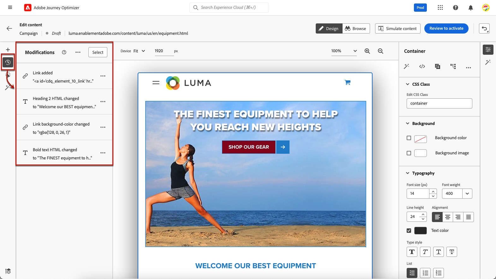

# Creare pagine web {#author-web}

>[!AVAILABILITY]
>
>La funzione canale web è attualmente disponibile come versione beta solo per gli utenti selezionati.

In [!DNL Journey Optimizer] l&#39;authoring web è basato sull&#39;estensione del browser Adobe Experience Cloud Visual Helper chrome. [Ulteriori informazioni](visual-editing-helper.md)

Per accedere e creare pagine web nel [!DNL Journey Optimizer] interfaccia utente, segui i prerequisiti elencati in [questa sezione](create-web.md#prerequesites).

## Modifica del contenuto della pagina web {#edit-web-content}

Una volta creata un’azione web dalla campagna, è possibile modificarne il contenuto utilizzando il web designer. A questo scopo, segui i passaggi riportati qui sotto.

>[!CAUTION]
>
>Per accedere a [!DNL Journey Optimizer], la pagina web deve essere implementata utilizzando [Adobe Experience Platform Web SDK](https://experienceleague.adobe.com/docs/platform-learn/implement-web-sdk/overview.html?lang=it){target=&quot;_blank&quot;}.

1. Da **[!UICONTROL Azione]** scheda della campagna, seleziona **[!UICONTROL Modifica contenuto]** per iniziare a creare la campagna web.

1. Se hai creato una regola di corrispondenza per le pagine, devi immettere qualsiasi URL che corrisponda a questa regola. Le modifiche verranno applicate a tutte le pagine che corrispondono alla regola.

   >[!NOTE]
   >
   >Se hai inserito un singolo URL come superficie web, l’URL da personalizzare è già popolato.

   

1. Viene visualizzato il contenuto della pagina.

   >[!CAUTION]
   >
   >La pagina web deve includere [Adobe Experience Platform Web SDK](https://experienceleague.adobe.com/docs/platform-learn/implement-web-sdk/overview.html){target=&quot;_blank&quot;}.

1. Fai clic su **[!UICONTROL Apri web designer]** per modificarlo. [Ulteriori informazioni](author-web.md)

   

1. Viene visualizzato il web designer.

   

1. Seleziona qualsiasi elemento dall’area di lavoro, ad esempio immagine, pulsante, paragrafo, testo, contenitore, intestazione, collegamento e così via. e utilizzare:

   * Il menu contestuale per modificarne il contenuto, il layout, l’inserimento di collegamenti o la personalizzazione, ecc.

      

   * Le icone nella parte superiore destra del pannello consentono di modificare, duplicare, eliminare o nascondere ogni elemento.

      

   * Il pannello di destra che cambia dinamicamente in base all’elemento selezionato. Ad esempio, puoi modificare lo sfondo, la composizione tipografica, il bordo, le dimensioni, la posizione, la spaziatura, gli effetti o gli stili in linea di un elemento.

      

## Utilizza i componenti contenuto {#content-components}

1. Da **[!UICONTROL Componenti]** a sinistra, puoi aggiungere i seguenti componenti alla pagina web e modificarli in base alle tue esigenze:

   * [Divider](../design/content-components.md#divider)
   * [HTML](../design/content-components.md#HTML)
   * [Immagine](../design/content-components.md#image)
   * Intestazione : l’utilizzo di questo componente è simile all’utilizzo del comando **[!UICONTROL Testo]** in e-mail designer. [Ulteriori informazioni](../design/content-components.md#text)
   * Paragrafo - L’utilizzo di questo componente è simile a quello dell’utilizzo del **[!UICONTROL Testo]** in e-mail designer. [Ulteriori informazioni](../design/content-components.md#text)
   * Collegamento : scopri come definire lo stile dei collegamenti in [questa sezione](../design/styling-links.md)
   * [Decisione di offerta](../design/deliver-personalized-offers.md)

   

1. Passa il puntatore del mouse sulla pagina e fai clic sul pulsante **[!UICONTROL Inserisci prima]** o **[!UICONTROL Inserisci dopo]** per aggiungere il componente a un elemento esistente nella pagina.

   

1. Dal contenitore visualizzato per questo componente, modifica il contenuto del componente in base alle esigenze.

   

1. Regolare gli stili visualizzati dalla **[!UICONTROL Contenitore]** a destra, ad esempio sfondo, colore del testo, bordo, dimensione, posizione, ecc. a seconda del componente selezionato.

   

## Navigare nel web designer

### Utilizzare le breadcrumb

1. Seleziona qualsiasi elemento dall’area di lavoro.

1. Fai clic sul pulsante **[!UICONTROL Espandi/comprimi breadcrumb]** pulsante in basso a sinistra dello schermo per visualizzare rapidamente le informazioni sull’elemento selezionato.

   

1. Quando passi il cursore del mouse sulle breadcrumb, l’elemento corrispondente viene evidenziato nell’editor.

1. Puoi facilmente passare a qualsiasi elemento principale, di pari livello o secondario all’interno dell’editor visivo.

### Scambio in modalità Sfoglia {#browse-mode}

È possibile eseguire lo scambio dal valore predefinito **[!UICONTROL Progettazione]** alla modalità **[!UICONTROL Sfoglia]** utilizzando il pulsante dedicato.

Da **[!UICONTROL Sfoglia]** In questa modalità, puoi passare alla pagina esatta dalla superficie selezionata che desideri personalizzare.

È particolarmente utile quando si tratta di pagine che si trovano dietro l’autenticazione o che non sono disponibili dall’inizio in un determinato URL. Ad esempio, potrai eseguire l’autenticazione, passare alla pagina dell’account o alla pagina del carrello e quindi tornare a **[!UICONTROL Progettazione]** per eseguire le modifiche desiderate nella pagina desiderata.

### Modificare le dimensioni del dispositivo

È possibile modificare le dimensioni del dispositivo in una dimensione predefinita, ad esempio **[!UICONTROL Tablet]** o **[!UICONTROL Panorama mobile]** o definire una dimensione personalizzata. Immetti il numero desiderato di pixel per definire una dimensione personalizzata.

È inoltre possibile modificare la messa a fuoco dello zoom dal 25% al 400%.

## Gestione delle modifiche {#manage-modifications}

Puoi gestire facilmente tutti i componenti, le regolazioni e gli stili aggiunti alla pagina web.

1. Seleziona la **[!UICONTROL Modifiche]** per visualizzare il riquadro corrispondente a sinistra.

   

1. Puoi rivedere ciascuna delle modifiche apportate alla pagina.

1. Seleziona una modifica indesiderata e fai clic sull’icona Elimina per rimuoverla.

   

   >[!CAUTION]
   >
   >Procedi con cautela durante l’eliminazione di un’azione in quanto potrebbe influenzare le azioni successive.

1. È inoltre possibile annullare e ripristinare le azioni utilizzando **[!UICONTROL Annulla/Ripristina]** in alto a destra dello schermo.

   

   Fai clic e tieni premuto il pulsante per passare dalla **[!UICONTROL Annulla]** e **[!UICONTROL Ripeti]** opzioni. Quindi fai clic sul pulsante stesso per applicare l’azione desiderata.

## Aggiungere personalizzazione e offerte

Per aggiungere la personalizzazione, seleziona un contenitore e fai clic sull’icona di personalizzazione nella barra dei menu contestuale visualizzata. Aggiungi le modifiche utilizzando l’editor espressioni. [Ulteriori informazioni](../personalization/personalization-build-expressions.md)

Utilizza la **[!UICONTROL Decisione di offerta]** componente da inserire [offerte](../offers/get-started/starting-offer-decisioning.md) nelle pagine web. Il processo è lo stesso di quando [aggiunta di un’offerta a un messaggio e-mail](../design/deliver-personalized-offers.md). Utilizza la Gestione delle decisioni per scegliere l&#39;offerta migliore da consegnare ai tuoi clienti.

## Test della campagna web {#test-web-campaign}

Per visualizzare un’anteprima dell’esperienza web modificata, segui i passaggi riportati di seguito.

>[!CAUTION]
>
>Devi disporre di profili di test per simulare quali offerte verranno consegnate loro. Scopri come [creare profili di test](../segment/creating-test-profiles.md).

1. Da **[!UICONTROL Modifica contenuto]** schermata o web designer, seleziona **[!UICONTROL Simulazione del contenuto]**.

   

1. Fai clic su **[!UICONTROL Gestire i profili di test]** per selezionare uno o più profili di test.
1. Viene visualizzata un’anteprima della pagina web modificata.

   

1. Puoi anche copiare l’URL di test per incollarlo in qualsiasi browser, oppure aprirlo nel browser predefinito.
