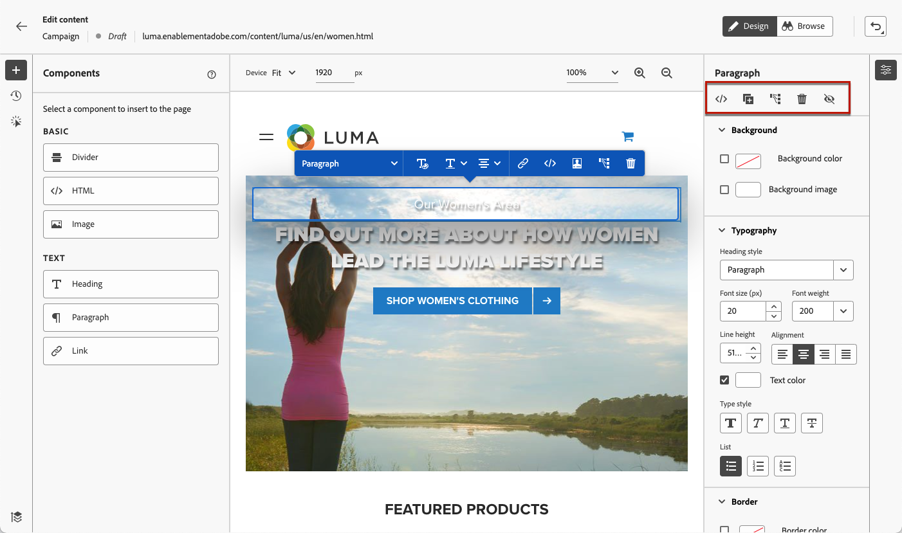
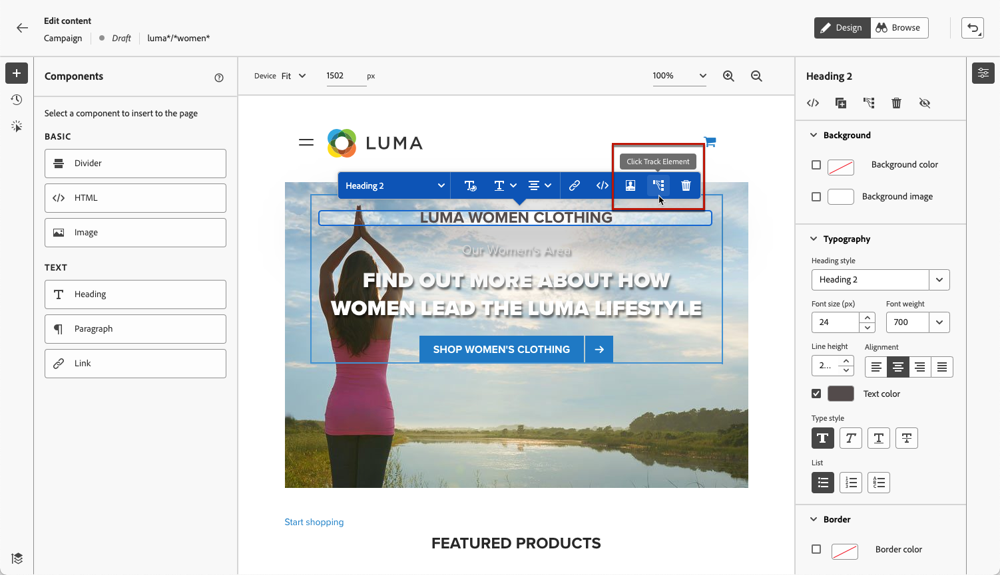

# Creare pagine web {#author-web}

Una volta [aggiunta di un’azione web](create-web.md#create-web-campaign) nella campagna, puoi modificare il contenuto del sito utilizzando il web designer.

In [!DNL Journey Optimizer], l’authoring web è basato su **Adobe Experience Cloud Visual Helper** estensione del browser chrome. [Ulteriori informazioni](web-prerequisites.md#visual-authoring-prerequisites)

>[!CAUTION]
>
>Per accedere e creare pagine web nel [!DNL Journey Optimizer] , assicurati di seguire i prerequisiti elencati in [questa sezione](web-prerequisites.md).

[Scopri come creare una campagna web in questo video](#video)

## Modifica del contenuto della pagina web {#edit-web-content}

>[!CONTEXTUALHELP]
>id="ajo_web_url_to_edit_surface"
>title="Confermare l’URL per la modifica"
>abstract="Conferma l’URL della pagina web specifica da utilizzare per modificare il contenuto che verrà applicato sulla superficie web definita sopra. La pagina web deve essere implementata utilizzando Adobe Experience Platform Web SDK."
>additional-url="https://experienceleague.adobe.com/docs/platform-learn/implement-web-sdk/overview.html?lang=it" text="Ulteriori informazioni"

>[!CONTEXTUALHELP]
>id="ajo_web_url_to_edit_rule"
>title="Immettere l’URL per la modifica"
>abstract="Immetti l’URL di una pagina web specifica da utilizzare per modificare il contenuto che verrà applicato a tutte le pagine che corrispondono alla regola. La pagina web deve essere implementata utilizzando l’SDK per web di Adobe Experience Platform."
>additional-url="https://experienceleague.adobe.com/docs/platform-learn/implement-web-sdk/overview.html?lang=it" text="Ulteriori informazioni"

Per iniziare a creare la campagna web, segui i passaggi riportati di seguito.

1. Da **[!UICONTROL Azione]** della scheda [campagna](create-web.md#create-web-campaign), seleziona **[!UICONTROL Modifica contenuto]**.<!--change screen with rule-->

   

1. Se hai creato una regola di corrispondenza delle pagine, devi immettere qualsiasi URL corrispondente a questa regola: le modifiche verranno applicate a tutte le pagine che corrispondono alla regola. Viene visualizzato il contenuto della pagina.

   >[!NOTE]
   >
   >Se hai inserito un singolo URL come superficie web, l’URL da personalizzare è già popolato.

   

   >[!CAUTION]
   >
   >La pagina web deve includere [Adobe Experience Platform Web SDK](https://experienceleague.adobe.com/docs/platform-learn/implement-web-sdk/overview.html?lang=it){target="_blank"}. [Ulteriori informazioni](web-prerequisites.md#implementation-prerequisites)

1. Fai clic su **[!UICONTROL Modifica pagina web]** per iniziare a crearlo. Viene visualizzato il web designer.

   

   >[!NOTE]
   >
   >Se si tenta di caricare un sito web che non riesce a caricarsi, viene visualizzato un messaggio per suggerirti di installare il [Estensione di Visual Editing Helper per il browser](#install-visual-editing-helper). Vedi alcuni suggerimenti per la risoluzione dei problemi in [questa sezione](web-prerequisites.md#troubleshooting).

1. Seleziona qualsiasi elemento dall’area di lavoro, ad esempio immagine, pulsante, paragrafo, testo, contenitore, intestazione, collegamento e così via. [Ulteriori informazioni](#content-components)

1. Seleziona:

   * Il menu contestuale per modificarne il contenuto, il layout, l’inserimento di collegamenti o la personalizzazione, ecc.

      

   * Le icone nella parte superiore destra del pannello consentono di modificare, duplicare, eliminare o nascondere ogni elemento.

      

   * Il pannello di destra che cambia dinamicamente in base all’elemento selezionato. Ad esempio, puoi modificare lo sfondo, la composizione tipografica, il bordo, le dimensioni, la posizione, la spaziatura, gli effetti o gli stili in linea di un elemento.

      

>[!NOTE]
>
>Il web content designer è per lo più simile al designer delle e-mail. Ulteriori informazioni su [progettazione di contenuti con [!DNL Journey Optimizer]](../email/get-started-email-design.md).

## Utilizzare i componenti {#content-components}

>[!CONTEXTUALHELP]
>id="ajo_web_designer_components"
>title="Aggiungere componenti alla pagina web"
>abstract="Puoi aggiungere diversi componenti alla pagina web e modificarli in base alle tue esigenze."

1. Da **[!UICONTROL Componenti]** a sinistra, selezionare un elemento. Puoi aggiungere i seguenti componenti alla pagina web e modificarli in base alle tue esigenze:

   * [Divisore](../email/content-components.md#divider)
   * [HTML](../email/content-components.md#HTML)
   * [Immagine](../email/content-components.md#image)
   * Intestazione : l’utilizzo di questo componente è simile all’utilizzo del comando **[!UICONTROL Testo]** in e-mail designer. [Ulteriori informazioni](../email/content-components.md#text)
   * Paragrafo - L’utilizzo di questo componente è simile a quello dell’utilizzo del **[!UICONTROL Testo]** in e-mail designer. [Ulteriori informazioni](../email/content-components.md#text)
   * Collegamento
   * [Decisione di offerta](../email/add-offers-email.md)

   

1. Passa il puntatore del mouse sulla pagina e fai clic sul pulsante **[!UICONTROL Inserisci prima]** o **[!UICONTROL Inserisci dopo]** per aggiungere il componente a un elemento esistente nella pagina.

   

   >[!NOTE]
   >
   >Per deselezionare un componente, fai clic sul pulsante **[!UICONTROL ESC]** nel banner blu contestuale visualizzato sopra l’area di lavoro.

1. Modifica il componente in base alle esigenze direttamente nel contenuto della pagina.

   

1. Regolare gli stili visualizzati dal riquadro contestuale a destra, ad esempio sfondo, colore del testo, bordo, dimensione, posizione, ecc. - a seconda del componente selezionato.

   

## Aggiungere personalizzazione e offerte

Per aggiungere la personalizzazione, seleziona un contenitore e fai clic sull’icona di personalizzazione nella barra dei menu contestuale visualizzata. Aggiungi le modifiche utilizzando l’editor espressioni. [Ulteriori informazioni](../personalization/personalization-build-expressions.md)

Utilizza la **[!UICONTROL Decisione di offerta]** componente da inserire [offerte](../offers/get-started/starting-offer-decisioning.md) nelle pagine web. Il processo è lo stesso di quando [aggiunta di un’offerta a un messaggio e-mail](../email/add-offers-email.md). Utilizza la Gestione delle decisioni per scegliere l&#39;offerta migliore da consegnare ai tuoi clienti.

## Gestione delle modifiche {#manage-modifications}

>[!CONTEXTUALHELP]
>id="ajo_web_designer_modifications"
>title="Gestire con facilità tutte le modifiche"
>abstract="Utilizzando questo riquadro, puoi esplorare e gestire tutte le modifiche e gli stili aggiunti alla pagina web."

Puoi gestire facilmente tutti i componenti, le regolazioni e gli stili aggiunti alla pagina web.

1. Seleziona la **[!UICONTROL Modifiche]** per visualizzare il riquadro corrispondente a sinistra.

   

1. Puoi rivedere ciascuna delle modifiche apportate alla pagina.

1. Seleziona una modifica indesiderata e fai clic sull’icona Elimina per rimuoverla.

   

   >[!CAUTION]
   >
   >Procedi con cautela durante l’eliminazione di un’azione in quanto potrebbe influenzare le azioni successive.

1. Utilizza la **[!UICONTROL Altre azioni]** pulsante in alto **[!UICONTROL Modifiche]** per eliminare tutte le modifiche contemporaneamente.

   

1. Da **[!UICONTROL Altre azioni]** è inoltre possibile eliminare solo le modifiche non valide, ovvero quelle ignorate da altre modifiche. Ad esempio, se modifichi il colore di un testo e successivamente lo elimini, la modifica del colore diventa non valida in quanto il testo non esiste più.

1. È inoltre possibile annullare e ripristinare le azioni utilizzando **[!UICONTROL Annulla/Ripristina]** in alto a destra dello schermo.

   

   Fai clic e tieni premuto il pulsante per passare dalla **[!UICONTROL Annulla]** e **[!UICONTROL Ripeti]** opzioni. Quindi fai clic sul pulsante stesso per applicare l’azione desiderata.

## Usa tracciamento dei clic {#use-click-tracing}

Questa funzionalità nel web designer consente di selezionare qualsiasi elemento del sito web e di tenere traccia dei clic su tale elemento.

Una volta che la campagna è attiva, puoi controllare il numero di clic per ogni elemento nel report web della campagna. Queste informazioni possono essere utili per migliorare l’esperienza degli utenti del tuo sito web. Ad esempio, se [rapporti web](../reports/campaign-global-report.md#web-tab) mostra che molti utenti fanno clic su un elemento su cui non è effettivamente possibile fare clic, puoi aggiungere un collegamento a tale elemento.

1. Seleziona un elemento nella pagina e scegli **[!UICONTROL Elemento di tracciamento del clic]** dal menu contestuale.

   

   >[!NOTE]
   >
   >È possibile selezionare qualsiasi elemento, selezionabile o meno.

1. L’azione tracciata corrispondente viene visualizzata automaticamente nel **[!UICONTROL Traccia dei clic]** a sinistra.

   

1. Aggiungi un’etichetta significativa per gestire tutti gli elementi tracciati e trovarli facilmente nei rapporti. La **[!UICONTROL Selettore CSS]** Il campo mostra le informazioni per individuare l’elemento selezionato.

1. Ripeti i passaggi descritti sopra per selezionare tutti gli altri elementi necessari per il tracciamento dei clic. Le azioni corrispondenti sono elencate nel riquadro a sinistra.

   

1. Per rimuovere il tracciamento dei clic su un elemento, seleziona l’icona di eliminazione corrispondente.

Una volta che la campagna è attiva, puoi controllare il rapporto della campagna **[!UICONTROL Web]** per confrontare il numero di impression, fai clic su frequenza e numero di clic per elemento. [Ulteriori informazioni](../reports/campaign-global-report.md#web-tab)

## Navigare nel web designer {#navigate-web-designer}

### Utilizzare le breadcrumb {#breadcrumbs}

1. Seleziona qualsiasi elemento dall’area di lavoro.

1. Fai clic sul pulsante **[!UICONTROL Espandi/comprimi breadcrumb]** pulsante in basso a sinistra dello schermo per visualizzare rapidamente le informazioni sull’elemento selezionato.

   

1. Quando passi il cursore del mouse sulle breadcrumb, l’elemento corrispondente viene evidenziato nell’editor.

1. Puoi facilmente passare a qualsiasi elemento principale, di pari livello o secondario all’interno dell’editor visivo.

### Scambio in modalità Sfoglia {#browse-mode}

>[!CONTEXTUALHELP]
>id="ajo_web_designer_browse"
>title="Utilizzare la modalità Sfoglia"
>abstract="Da questa modalità puoi passare alla pagina esatta dalla superficie selezionata che desideri personalizzare."

È possibile eseguire lo scambio dal valore predefinito **[!UICONTROL Progettazione]** alla modalità **[!UICONTROL Sfoglia]** utilizzando il pulsante dedicato.

Da **[!UICONTROL Sfoglia]** In questa modalità, puoi passare alla pagina esatta dalla superficie selezionata che desideri personalizzare.

È particolarmente utile quando si tratta di pagine che si trovano dietro l’autenticazione o che non sono disponibili dall’inizio in un determinato URL. Ad esempio, potrai eseguire l’autenticazione, passare alla pagina dell’account o alla pagina del carrello e quindi tornare a **[!UICONTROL Progettazione]** per eseguire le modifiche desiderate nella pagina desiderata.

### Modificare le dimensioni del dispositivo {#change-device-size}

È possibile modificare le dimensioni del dispositivo della visualizzazione Web designer impostando dimensioni predefinite, ad esempio **[!UICONTROL Tablet]** o **[!UICONTROL Panorama mobile]** oppure definisci una dimensione personalizzata immettendo il numero desiderato di pixel.

È inoltre possibile modificare la messa a fuoco dello zoom dal 25% al 400%.

La possibilità di modificare le dimensioni del dispositivo è progettata per i siti reattivi che eseguono il rendering su vari dispositivi, finestre e dimensioni dello schermo. I siti reattivi si adattano automaticamente a qualsiasi dimensione di schermo, compresi desktop, laptop, tablet o telefoni cellulari.

>[!CAUTION]
>
>Puoi modificare un’esperienza web con una dimensione specifica del dispositivo. Tuttavia, finché i selettori sono uguali, queste modifiche si applicano a tutte le dimensioni e ai dispositivi, non solo alle dimensioni del dispositivo in cui si lavora. Allo stesso modo, la modifica di un’esperienza nella normale visualizzazione desktop applica le modifiche a tutte le dimensioni dello schermo, non solo alla visualizzazione desktop.
>
>Attualmente, [!DNL Journey Optimizer] non supporta le modifiche di pagina specifiche per le dimensioni del dispositivo. Ciò significa, ad esempio, che se disponi di un sito web mobile separato con una struttura di sito separata, devi apportare le modifiche specifiche al sito mobile in una campagna diversa.

## Test della campagna web {#test-web-campaign}

>[!CONTEXTUALHELP]
>id="ajo_web_designer_preview"
>title="Visualizzare l’esperienza web in anteprima"
>abstract="Ottieni una simulazione dell’aspetto che avrà l’esperienza web."

Per visualizzare un’anteprima dell’esperienza web modificata, segui i passaggi riportati di seguito.

>[!CAUTION]
>
>Devi disporre di profili di test per simulare quali offerte verranno consegnate loro. Scopri come [creare profili di test](../segment/creating-test-profiles.md).

1. Dalla schermata di modifica del contenuto della campagna web, seleziona **[!UICONTROL Simulazione del contenuto]**.

   <!---->

   

1. Fai clic su **[!UICONTROL Gestire i profili di test]** per selezionare uno o più profili di test.
1. Viene visualizzata un’anteprima della pagina web modificata.

   

1. Puoi anche aprirlo nel browser predefinito o copiare l’URL di test per incollarlo in qualsiasi browser. Questo consente di condividere il collegamento con il team e le parti interessate, che potranno visualizzare in anteprima la nuova esperienza web in qualsiasi browser prima che la campagna diventi attiva.

   >[!NOTE]
   >
   >Quando copi l’URL del test, il contenuto visualizzato è quello personalizzato per il profilo di test utilizzato quando la simulazione del contenuto è stata generata in [!DNL Journey Optimizer].

## Video introduttivo{#video}

Il video seguente mostra come creare un’esperienza web utilizzando il web designer in [!DNL Journey Optimizer] campagne.

>[!VIDEO](https://video.tv.adobe.com/v/3418803/?quality=12&learn=on)
