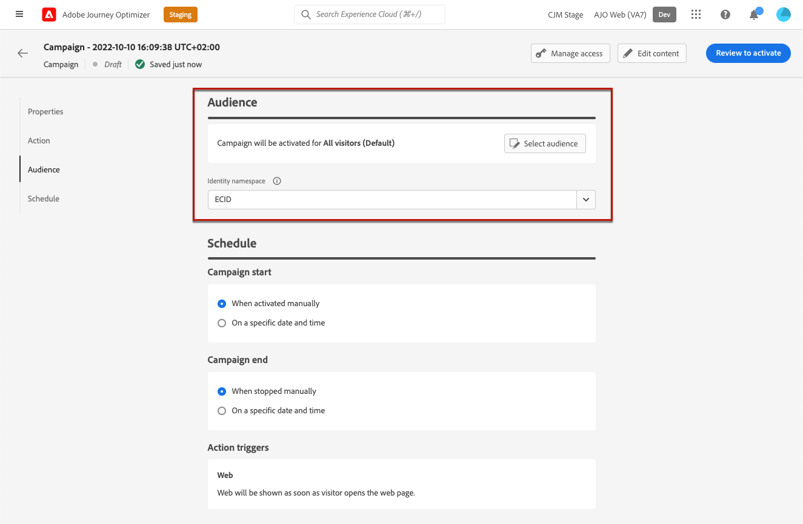
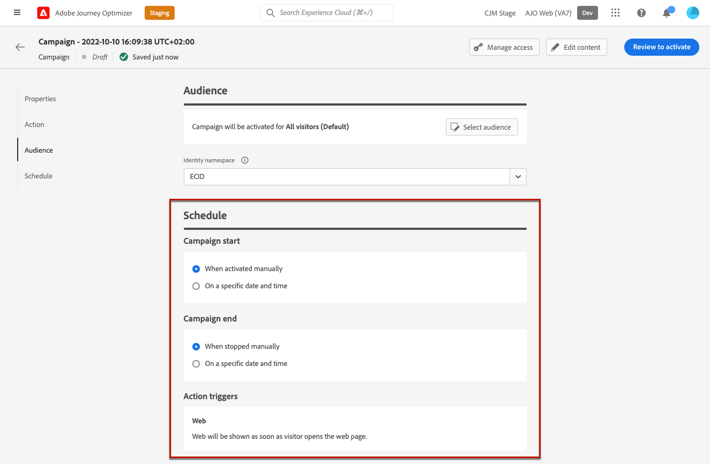

# Creare esperienze web {#create-web}

>[!AVAILABILITY]
>
>La funzione canale web è attualmente disponibile come versione beta solo per gli utenti selezionati.

[!DNL Journey Optimizer] ti consente di personalizzare l’esperienza web che distribuisci ai clienti tramite campagne web in entrata.

>[!CAUTION]
>
>Attualmente in [!DNL Journey Optimizer] puoi creare esperienze web solo utilizzando **campagne**.

## Prerequisiti {#prerequesites}

Per accedere e creare pagine web nel [!DNL Journey Optimizer] interfaccia utente, segui i prerequisiti seguenti:

* Per aggiungere modifiche al sito web, devi implementare la funzione [Adobe Experience Platform Web SDK](https://experienceleague.adobe.com/docs/platform-learn/implement-web-sdk/overview.html?lang=it){target="_blank"} sul tuo sito web.

* Per accedere al [!DNL Journey Optimizer] web designer, è necessario scaricare [Helper per l&#39;editing video di Adobe Experience Cloud](https://chrome.google.com/webstore/detail/adobe-experience-cloud-vi/kgmjjkfjacffaebgpkpcllakjifppnca){target="_blank"} estensione del browser su Chrome. [Ulteriori informazioni](visual-editing-helper.md)

>[!CAUTION]
>
>Google Chrome è attualmente l’unico browser che supporta la creazione di pagine web in [!DNL Journey Optimizer].

Affinché l&#39;esperienza web possa essere consegnata correttamente, è necessario definire le seguenti impostazioni:

* In [Raccolta dati Adobe Experience Platform](https://experienceleague.adobe.com/docs/experience-platform/edge/datastreams/overview.html?lang=it){target="_blank"}, assicurati che sia definito un datastream come sotto **[!UICONTROL Adobe Experience Platform]** il servizio **[!UICONTROL Segmentazione Edge]** e **[!UICONTROL Adobe Journey Optimizer]** opzioni abilitate.

   In questo modo gli eventi in entrata Journey Optimizer vengono gestiti correttamente da Adobe Experience Platform Edge. [Ulteriori informazioni](https://experienceleague.adobe.com/docs/experience-platform/edge/datastreams/configure.html){target="_blank"}

   

   >[!NOTE]
   >
   >La **[!UICONTROL Adobe Journey Optimizer]** può essere attivata solo quando **[!UICONTROL Segmentazione Edge]** opzione già abilitata.

* In [Adobe Experience Platform](https://experienceleague.adobe.com/docs/experience-platform/profile/home.html?lang=it){target="_blank"}, make sure you have one merge policy with the **[!UICONTROL Active-On-Edge Merge Policy]** option enabled. To do this, select a policy under the **[!UICONTROL Customer]** > **[!UICONTROL Profiles]** > **[!UICONTROL Merge Policies]** Experience Platform menu. [Learn more](https://experienceleague.adobe.com/docs/experience-platform/profile/merge-policies/ui-guide.html#configure){target="_blank"}

   Questo criterio di unione è utilizzato da [!DNL Journey Optimizer] canali in entrata per attivare e pubblicare correttamente le campagne in entrata sul bordo. [Ulteriori informazioni](https://experienceleague.adobe.com/docs/experience-platform/profile/merge-policies/ui-guide.html){target="_blank"}

   

## Creare una campagna web {#create-web-campaign}

>[!CONTEXTUALHELP]
>id="ajo_web_surface"
>title="Definire una superficie web"
>abstract="Una superficie web può corrispondere a uno o più URL di pagina, consentendoti di apportare modifiche al contenuto in una o più pagine web."

Per iniziare a creare l’esperienza web tramite una campagna, segui i passaggi riportati di seguito.

1. Creare una campagna. [Ulteriori informazioni](../campaigns/create-campaign.md)

1. Seleziona la **[!UICONTROL Web]** azione.

   

1. Definire una superficie web.

   >[!NOTE]
   >
   >Una superficie web è una proprietà web identificata da un URL in cui verrà distribuito il contenuto. Può corrispondere a uno o più URL di pagina, consentendoti di apportare modifiche in una o più pagine web.

   Puoi immettere un **[!UICONTROL URL della pagina]** per applicare le modifiche a una sola pagina.

   

1. Oppure puoi creare un **[!UICONTROL Regola corrispondente alle pagine]** per eseguire il targeting di più URL che corrispondono alla stessa regola, ad esempio, se desideri applicare le modifiche a un banner eroe in un intero sito web o aggiungere un’immagine principale che viene visualizzata su tutte le pagine di prodotto di un sito web.

   A questo scopo, seleziona **[!UICONTROL Regola corrispondente alle pagine]** e fai clic su **[!UICONTROL Crea regola]**.

   

1. Definisci i criteri per la **[!UICONTROL Dominio]** e **[!UICONTROL Pagina]** campi.

   Ad esempio, se desideri modificare gli elementi che vengono visualizzati su tutte le pagine di prodotto donna del sito web Luma, seleziona **[!UICONTROL Dominio]** > **[!UICONTROL Inizia con]** > `luma` e **[!UICONTROL Pagina]** > **[!UICONTROL Contiene]** > `women`.

   

1. Salva le modifiche. La regola viene visualizzata nella **[!UICONTROL Creare una campagna]** schermo.

   

1. Una volta definita la superficie web, seleziona **[!UICONTROL Crea]**. Ora puoi configurare le proprietà e le impostazioni della campagna.

## Configurare la campagna web {#configure-web-campaign}

1. In **[!UICONTROL Proprietà]** È possibile modificare il nome della campagna e aggiungere una descrizione, se necessario.

   

1. Per assegnare etichette di utilizzo dati personalizzate o di base alla campagna web, seleziona la **[!UICONTROL Gestisci accesso]** nella parte superiore dello schermo. [Ulteriori informazioni su Object Level Access Control (OLAC)](../administration/object-based-access.md)

1. È possibile selezionare **[!UICONTROL Esperimento dei contenuti]** per testare i trattamenti dei contenuti con parti del pubblico, al fine di determinare quale trattamento funziona meglio rispetto a una metrica specifica. [Ulteriori informazioni](../campaigns/content-experiment.md)

   >[!AVAILABILITY]
   >
   >La **Esperimento dei contenuti** al momento è disponibile solo per un set di organizzazioni (disponibilità limitata). Per ulteriori informazioni, contatta il tuo rappresentante Adobe.

1. Da **[!UICONTROL Azione]** scheda della campagna, seleziona **[!UICONTROL Modifica contenuto]** per iniziare a creare la campagna web. [Ulteriori informazioni](author-web.md)

   

1. Da **[!UICONTROL Pubblico]** definisci chi potrà visualizzare la tua campagna web. Per impostazione predefinita, la campagna web sarà visibile a tutti i visitatori.

   

   Puoi anche selezionare un pubblico specifico. Utilizza la **[!UICONTROL Selezionare il pubblico]** per visualizzare l’elenco dei segmenti Adobe Experience Platform disponibili. [Ulteriori informazioni sui segmenti](../segment/about-segments.md)

   >[!NOTE]
   >
   >Per le campagne con attivazione API, il pubblico deve essere impostato tramite chiamata API. [Ulteriori informazioni](../campaigns/api-triggered-campaigns.md)

   

1. In **[!UICONTROL Spazio dei nomi identità]** scegli lo spazio dei nomi da utilizzare per identificare gli individui del segmento selezionato. [Ulteriori informazioni sugli spazi dei nomi](../event/about-creating.md#select-the-namespace)

1. Definire un **[!UICONTROL Pianificazione]** per la campagna web. [Ulteriori informazioni](../campaigns/create-campaign.md#schedule)

   

   Per impostazione predefinita viene avviato quando viene attivato manualmente e termina quando viene interrotto manualmente, ma puoi anche definire date e ore specifiche per rendere visibili le modifiche.

   

## Attivare la campagna web {#activate-web-campaign}

Una volta definiti i [impostazioni campagna web](#configure-web-campaign) e il contenuto viene modificato come desiderato utilizzando la [web designer](author-web.md), puoi rivedere e attivare la tua campagna web. Effettua le seguenti operazioni.

>[!NOTE]
>
>Puoi anche visualizzare in anteprima il contenuto della campagna web prima di attivarlo. [Ulteriori informazioni](author-web.md#test-web-campaign)

1. Dalla campagna web, seleziona **[!UICONTROL Rivedi per attivare]**.

   

1. Rivedi e modifica se necessario i contenuti, le proprietà, la superficie, il pubblico e la pianificazione.

1. Seleziona **[!UICONTROL Attiva]**.

   

   >[!NOTE]
   >
   >Dopo aver fatto clic su **[!UICONTROL Attiva]**, potrebbero essere necessari fino a 15 minuti perché le modifiche alle campagne web siano disponibili in diretta sul sito web.

La tua campagna web prende il **[!UICONTROL Live]** ed è ora visibile al pubblico selezionato. Ogni destinatario della campagna può vedere le modifiche aggiunte al sito web utilizzando [!DNL Journey Optimizer] web designer.

>[!NOTE]
>
>Se hai definito una pianificazione per la campagna web, la **[!UICONTROL Pianificato]** fino al raggiungimento della data e dell&#39;ora di inizio.
>
>Se attivate una campagna web che interessa le stesse pagine di un’altra campagna già attiva, tutte le modifiche verranno applicate alle pagine web.

Ulteriori informazioni sull’attivazione delle campagne in [questa sezione](../campaigns/review-activate-campaign.md).

## Interrompere una campagna web {#stop-web-campaign}

Quando una campagna web è attiva, puoi interromperla per impedire al pubblico di visualizzare le modifiche. Effettua le seguenti operazioni.

1. Seleziona una campagna live dall’elenco.

1. Dal menu principale, seleziona **[!UICONTROL Interrompi campagna]**.

   

1. Le modifiche aggiunte non saranno più visibili al pubblico definito.

>[!NOTE]
>
>Una volta interrotta una campagna web, non puoi modificarla o attivarla nuovamente. Puoi duplicarla e attivare la campagna duplicata.
