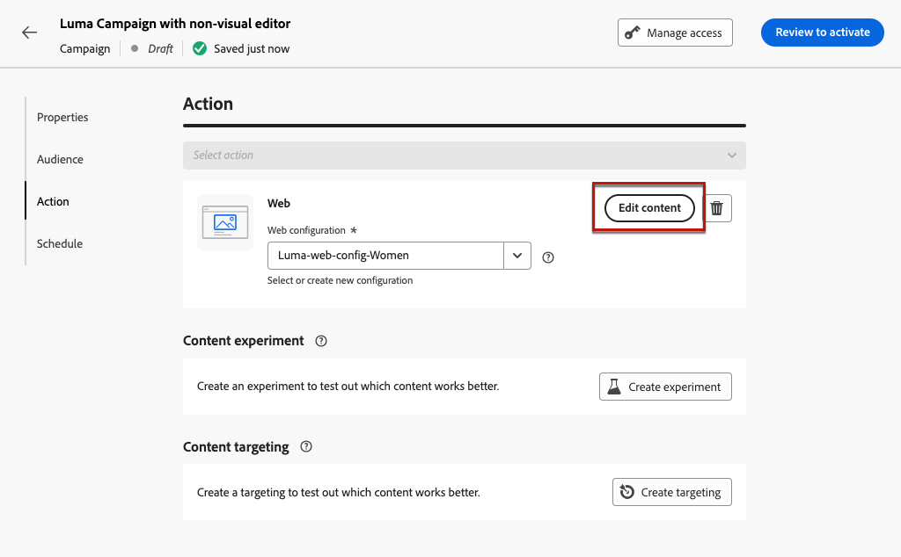

# Creare esperienze web {#create-web}

[!DNL Journey Optimizer] ti consente di personalizzare l&#39;esperienza web che fornisci ai tuoi clienti tramite percorsi o campagne in entrata.

## Definire un’esperienza web tramite un percorso o una campagna {#create-web-experience}

>[!CONTEXTUALHELP]
>id="ajo_web_surface"
>title="Definire una configurazione web"
>abstract="Una superficie web può corrispondere all’URL di una sola pagina o più pagine, consentendoti di apportare modifiche al contenuto in una o più pagine web."

>[!CONTEXTUALHELP]
>id="ajo_web_surface_rule"
>title="Creare una regola di corrispondenza delle pagine"
>abstract="Una regola di corrispondenza delle pagine consente di eseguire il targeting di più URL che corrispondono alla stessa regola. Può servire, ad esempio, per applicare a un intero sito web le modifiche apportate a un banner hero oppure per aggiungere un’immagine nella parte superiore da visualizzare su tutte le pagine dei prodotti di un sito web."

Per iniziare a creare la tua esperienza web attraverso una campagna o un percorso, segui i passaggi seguenti.

>[!NOTE]
>
>Se è la prima volta che crei un’esperienza web, assicurati di seguire i prerequisiti descritti in [questa sezione](web-prerequisites.md).

>[!BEGINTABS]

>[!TAB Aggiungi un&#39;esperienza Web a un percorso]

Per aggiungere un&#39;attività **Web** a un percorso, eseguire la procedura seguente:

1. [Crea un percorso](../building-journeys/journey-gs.md).

1. Avvia il percorso con un&#39;attività [Event](../building-journeys/general-events.md) o [Read Audience](../building-journeys/read-audience.md).

1. Trascina e rilascia un&#39;attività **[!UICONTROL Web]** dalla sezione **[!UICONTROL Azioni]** della palette.

   

   >[!NOTE]
   >
   >Poiché **Web** è un&#39;attività esperienza in entrata, include un&#39;attività **Wait** di 3 giorni. [Ulteriori informazioni](../building-journeys/wait-activity.md#auto-wait-node)

1. Immetti un **[!UICONTROL Etichetta]** e una **[!UICONTROL Descrizione]** per il messaggio.

1. Selezionare o creare la [configurazione Web](web-configuration.md) da utilizzare.

   

1. Seleziona il pulsante **[!UICONTROL Modifica contenuto]** e modifica il contenuto come desiderato. [Ulteriori informazioni](#edit-web-content)

1. Se necessario, completa il flusso di percorso trascinando altre azioni o eventi. [Ulteriori informazioni](../building-journeys/about-journey-activities.md)

1. Quando la tua esperienza web è pronta, finalizza la configurazione e pubblica il percorso per attivarla. [Ulteriori informazioni](../building-journeys/publish-journey.md)

Per ulteriori informazioni su come configurare un percorso, consultare [questa pagina](../building-journeys/journey-gs.md).

>[!TAB Creare una campagna web]

Per iniziare a creare la tua esperienza web attraverso una campagna, segui i passaggi indicati di seguito.

1. Creare una campagna. [Ulteriori informazioni](../campaigns/create-campaign.md)

1. Seleziona il tipo di campagna da eseguire

   * **Pianificato - Marketing**: esegui la campagna immediatamente o in una data specificata. Le campagne pianificate hanno lo scopo di inviare messaggi di marketing. Vengono configurati ed eseguiti dall’interfaccia utente di.

   * **Attivato da API - Marketing/Transazionale**: esegui la campagna utilizzando una chiamata API. Le campagne attivate da API hanno lo scopo di inviare messaggi di marketing o transazionali, ovvero messaggi inviati in seguito a un’azione eseguita da un individuo: reimpostazione della password, acquisto del carrello, ecc. [Scopri come attivare una campagna utilizzando le API](../campaigns/api-triggered-campaigns.md)

1. Completa i passaggi per creare una campagna web, ad esempio le proprietà della campagna, [pubblico](../audience/about-audiences.md) e [pianificazione](../campaigns/create-campaign.md#schedule).

1. Selezionare l&#39;azione **[!UICONTROL Web]**.

1. Seleziona o crea la configurazione web. [Ulteriori informazioni sulla configurazione Web](web-configuration.md)

   

1. Fai clic sul pulsante **[!UICONTROL Modifica contenuto]** per modificare il contenuto nel modo desiderato. [Ulteriori informazioni](#edit-web-content)

   <!---->

Per ulteriori informazioni su come configurare una campagna, consulta [questa pagina](../campaigns/get-started-with-campaigns.md).

➡️ [Scopri come creare una campagna web in questo video](#video)

>[!ENDTABS]

## Modificare i contenuti web {#edit-web-content}

>[!CONTEXTUALHELP]
>id="ajo_web_url_to_edit_surface"
>title="Confermare l’URL per la modifica"
>abstract="Conferma l’URL della pagina web specifica da utilizzare per modificare il contenuto che verrà applicato sulla configurazione web definita sopra. La pagina web deve essere implementata utilizzando Adobe Experience Platform Web SDK."
>additional-url="https://experienceleague.adobe.com/docs/platform-learn/implement-web-sdk/overview.html?lang=it" text="Ulteriori informazioni"

>[!CONTEXTUALHELP]
>id="ajo_web_url_to_edit_rule"
>title="Immettere l’URL per la modifica"
>abstract="Immetti l’URL di una pagina web specifica da utilizzare per modificare il contenuto che verrà applicato a tutte le pagine che corrispondono alla regola. La pagina web deve essere implementata utilizzando l’SDK per web di Adobe Experience Platform."
>additional-url="https://experienceleague.adobe.com/docs/platform-learn/implement-web-sdk/overview.html?lang=it" text="Ulteriori informazioni"

Dopo aver [aggiunto un&#39;azione Web](#create-web-experience) a un percorso o a una campagna, puoi modificare il contenuto del sito utilizzando:

* [web designer](web-visual-editor.md), per creare la tua esperienza utilizzando un editor visivo;
* oppure [editor non visivo](web-non-visual-editor.md).

Per iniziare a creare la tua esperienza web, segui i passaggi indicati di seguito.

1. Dalla scheda **[!UICONTROL Azione]** della campagna o dell&#39;attività **[!UICONTROL Web]** nel percorso, selezionare **[!UICONTROL Modifica contenuto]**.

   

1. Viene visualizzata la schermata dell’edizione. Puoi effettuare le seguenti operazioni:

   * Fare clic sul pulsante **[!UICONTROL Modifica pagina Web]** per iniziare a creare i contenuti utilizzando il Web Designer per un&#39;esperienza visiva. [Ulteriori informazioni](web-visual-editor.md)

     

   * Deseleziona l&#39;opzione **[!UICONTROL Editor visivo]** per utilizzare la modalità di edizione non visiva e fai clic su **[!UICONTROL Aggiungi una modifica]** per iniziare a modificare il contenuto Web senza caricare l&#39;editor visivo. [Ulteriori informazioni](web-non-visual-editor.md)

     

## Verificare l’esperienza web {#test-web-experience}

>[!CONTEXTUALHELP]
>id="ajo_web_designer_preview"
>title="Visualizzare l’esperienza web in anteprima"
>abstract="Ottieni una simulazione dell’aspetto che avrà l’esperienza web."

Dopo aver [creato la tua esperienza Web](web-visual-editor.md) utilizzando il designer Web, puoi utilizzare i profili di test per visualizzare in anteprima le pagine Web modificate. Se hai inserito dei contenuti personalizzati, puoi verificare come vengono visualizzati, utilizzando i dati del profilo di test.

A questo scopo, fai clic su **[!UICONTROL Simula contenuto]** nella schermata Modifica contenuto del percorso o della campagna, quindi aggiungi un profilo di test per controllare la pagina Web utilizzando i dati del profilo di test.

Puoi anche aprirlo nel browser predefinito, oppure copiare l’URL di prova per incollarlo in qualsiasi browser. Questo ti consente di condividere il collegamento con il team e le parti interessate, che potranno visualizzare in anteprima la nuova esperienza web in qualsiasi browser prima che la campagna venga pubblicata.

>[!NOTE]
>
>Durante la copia dell&#39;URL di test, il contenuto visualizzato è quello personalizzato per il profilo di test utilizzato quando la simulazione del contenuto è stata generata in [!DNL Journey Optimizer].

Informazioni dettagliate su come selezionare profili di test e visualizzare in anteprima il contenuto sono disponibili nella sezione [Gestione dei contenuti](../content-management/preview-test.md).

## Reindirizzare a un URL {#web-redirect-to-url}

>[!CONTEXTUALHELP]
>id="ajo_web_designer_redirect"
>title="Reindirizzare a un altro URL"
>abstract="Inserisci un URL esistente verso il quale reindirizzare i visitatori della pagina."

Durante la creazione di un’esperienza web, è possibile reindirizzare i visitatori a un altro URL esistente anziché creare una nuova variante nel web designer.

Utilizzando questa capacità, puoi eseguire un [esperimento sui contenuti](../content-management/content-experiment.md) confrontando due esperienze diverse invece di modificare solo alcuni elementi all&#39;interno di una pagina.

Ad esempio, crea una campagna web con due trattamenti:

* In **Trattamento A**, creare un&#39;esperienza Web utilizzando il Web Designer per metà della popolazione di destinazione.

* In **Trattamento B**, selezionare l&#39;opzione **[!UICONTROL Reindirizza all&#39;URL]** per l&#39;altra metà della popolazione di destinazione. Immettere l&#39;URL di una pagina con una struttura alternativa creata all&#39;esterno di [!DNL Journey Optimizer].

  

  >[!NOTE]
  >
  >L&#39;anteprima del sito Web non viene più visualizzata e l&#39;interruttore **[!UICONTROL Editor visivo]** è disabilitato.

Una volta che la campagna Web è attiva, puoi tenere traccia delle prestazioni dell&#39;esperienza Web creata in [!DNL Journey Optimizer] per i visitatori della pagina rispetto a quelli che sono stati reindirizzati alla pagina di destinazione esterna. Scopri come utilizzare il rapporto della [campagna di sperimentazione](../reports/campaign-global-report-cja-experimentation.md)

## Rendi live la tua esperienza web {#web-experience-live}

>[!IMPORTANT]
>
> Se la campagna è soggetta a un criterio di approvazione, sarà necessario richiedere l’approvazione per poter attivare le esperienze web. [Ulteriori informazioni](../test-approve/gs-approval.md)

Dopo aver definito l’esperienza web e aver modificato il contenuto come desiderato, puoi attivare il percorso o la campagna per rendere le modifiche visibili al pubblico.

Puoi anche visualizzare in anteprima il contenuto della tua esperienza web prima di pubblicarlo in diretta. [Ulteriori informazioni](#test-web-experience)

>[!NOTE]
>
>Se attivi un percorso web o una campagna che interessa le stesse pagine di un altro percorso o campagna già live, tutte le modifiche verranno applicate alle pagine web.
>
>Se più percorsi o campagne aggiornano gli stessi elementi del sito web, il percorso/campagna con priorità più elevata ha la precedenza.

### Pubblicare un percorso web {#activate-web-journey}

Per rendere la tua esperienza web live da un percorso, segui i passaggi indicati di seguito.

1. Verifica che il percorso sia valido e che non ci siano errori. [Ulteriori informazioni](../building-journeys/troubleshooting.md#activity-errors)

1. Dal percorso, seleziona l&#39;opzione **[!UICONTROL Pubblica]**, che si trova nel menu a discesa in alto a destra.

   

   >[!NOTE]
   >
   >Ulteriori informazioni sulla pubblicazione di percorsi in [questa sezione](../building-journeys/publish-journey.md).

Il percorso Web assume lo stato **[!UICONTROL Live]** ed è ora di sola lettura. Ogni destinatario del percorso può visualizzare le modifiche aggiunte al sito web.

>[!NOTE]
>
>Dopo aver fatto clic su **[!UICONTROL Pubblica]**, potrebbero essere necessari fino a 15 minuti perché le modifiche siano disponibili in tempo reale sul sito Web.

### Attivare una campagna web {#activate-web-campaign}

Una volta definite le impostazioni della campagna web e modificato il contenuto come desiderato, puoi rivedere e attivare la campagna web. Segui i passaggi seguenti.

1. Dalla tua campagna Web, seleziona **[!UICONTROL Verifica per attivare]**.

1. Se necessario, seleziona e modifica il contenuto, le proprietà, la configurazione, il pubblico e la pianificazione.

1. Seleziona **[!UICONTROL Attiva]**.

   

   >[!NOTE]
   >
   >Ulteriori informazioni sull&#39;attivazione delle campagne in [questa sezione](../campaigns/review-activate-campaign.md).

La tua campagna Web accetta il **[!UICONTROL Live]** [status](../campaigns/manage-campaigns.md#statuses) ed è ora visibile al pubblico selezionato. Ogni destinatario della campagna può visualizzare le modifiche aggiunte al sito web.

>[!NOTE]
>
>Dopo aver fatto clic su **[!UICONTROL Attiva]**, potrebbero essere necessari fino a 15 minuti perché le modifiche alle campagne Web siano disponibili in tempo reale sul sito Web.
>
>Se hai definito una pianificazione per la tua campagna Web, questa avrà **[!UICONTROL Pianificato]** [stato](../campaigns/manage-campaigns.md#statuses) fino a raggiungere la data e l&#39;ora di inizio.

Una volta che la tua esperienza è attiva, puoi monitorare i percorsi web e le campagne. [Ulteriori informazioni](monitor-web-experiences.md)

## Interrompere un percorso web o una campagna {#stop-web-experience}

Quando un percorso web o una campagna sono in diretta, puoi interromperlo per impedire al pubblico di visualizzare le modifiche. Segui i passaggi seguenti.

1. Seleziona un percorso o una campagna live dal rispettivo elenco.

1. Esegui l’azione pertinente in base al caso:

   * Dal menu principale della campagna, seleziona **[!UICONTROL Interrompi campagna]**.

     

   * Dal menu principale del percorso, fare clic sul pulsante **[!UICONTROL Altro]** e selezionare **[!UICONTROL Interrompi]**.

     

1. Le modifiche aggiunte non saranno più visibili al pubblico definito.

>[!NOTE]
>
>Una volta interrotto un percorso web o una campagna, non puoi più modificarlo o attivarlo. Puoi solo duplicarlo e attivare il percorso o la campagna duplicati.

## Video dimostrativo{#video}

Il video seguente mostra come creare una campagna web, configurarne le proprietà, rivederla e pubblicarla.

>[!VIDEO](https://video.tv.adobe.com/v/3449989/?captions=ita&quality=12&learn=on)