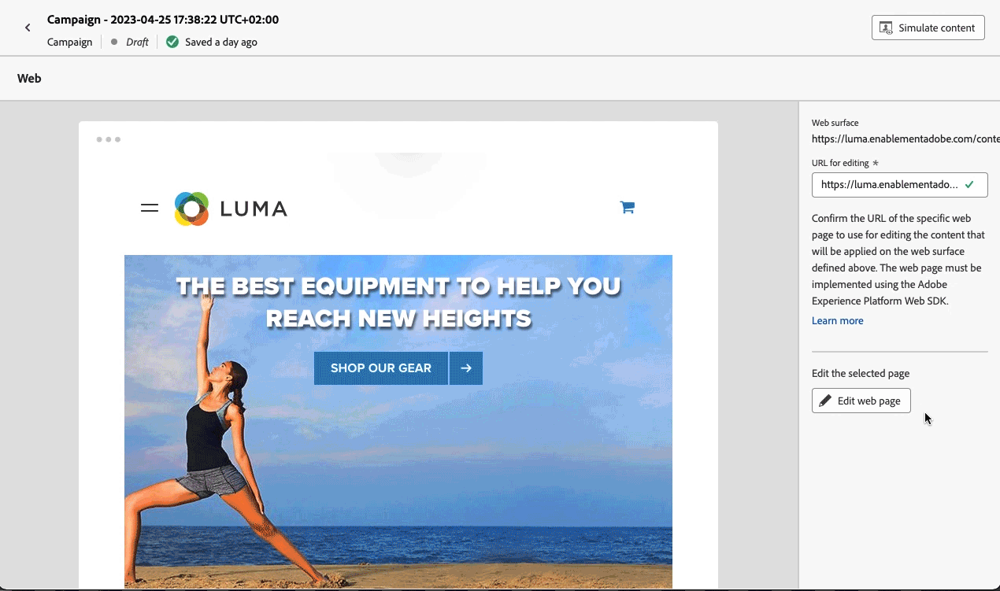

# Introduzione al canale Web {#get-started-web}

>[!BEGINSHADEBOX]

**In questa pagina:** Inizia a usare il canale web in Adobe Journey Optimizer per creare e distribuire visivamente esperienze web personalizzate nei tuoi percorsi di clienti e nelle tue campagne.

>[!ENDSHADEBOX]

[!DNL Journey Optimizer] consente di creare visivamente e fornire esperienze web personalizzate ai clienti.

Tramite un’interfaccia visiva intuitiva, usa il canale web di modificare facilmente le proprietà web per sperimentare, ottimizzare e personalizzare le campagne per gli utenti finali.

Se utilizzi già canali in uscita per la consegna dei messaggi, come e-mail, SMS o notifiche push, puoi sfruttare il canale web in entrata per offrire un’esperienza veramente personalizzata su tutti i canali.

Una volta creato un percorso o una campagna, seleziona **Web** come azione e definisci le impostazioni di base. Per ulteriori informazioni sulla modalità di configurazione di una campagna o di un percorso, consulta questa [pagina](create-web.md#create-web-experience).

>[!NOTE]
>
>Se questa è la prima volta che crei un’esperienza web, assicurati di seguire i prerequisiti descritti in [questa sezione](web-prerequisites.md).

Scopri i passaggi dettagliati per la creazione di una campagna web in [questo video](create-web.md#video).

<table style="table-layout:fixed"><tr style="border: 0;">
<td>

<a href="web-prerequisites.md"><strong>Prerequisiti</strong>

</td>
<td>

<a href="create-web.md"><strong>Crea un’esperienza web</strong></a>

</td>
<td>

<a href="web-visual-editor.md"><strong>Creare pagine web</strong></a>

</td>
<td>

<a href="monitor-web-experiences.md"><strong>Generazione rapporti</strong></a>

</td>
</tr></table>

## Risorse aggiuntive

* **[Creare esperienze web](create-web.md)**: scopri come creare e configurare campagne e percorsi web per modificare il contenuto web.
* **[Prerequisiti per il canale web](web-prerequisites.md)**: informazioni sui requisiti tecnici e la configurazione necessari per l’implementazione del canale web.
* **[Modificare i contenuti web](create-web.md#edit-web-content)**: padroneggia il designer web per modificare le pagine utilizzando le modalità di modifica visiva o non visiva.
* **[Gestire le modifiche web](manage-web-modifications.md)**: scopri come organizzare, applicare e gestire le modifiche nelle esperienze web.
* **[Monitorare le esperienze web](monitor-web-experiences.md)**: tieni traccia e analizza le prestazioni delle campagne web con un reporting dettagliato.
* **[Generare contenuti web con l’Assistente AI](../content-management/generative-full-content.md)**: sfrutta l’intelligenza artificiale per creare e ottimizzare contenuti web con testo e immagini.
* **[Tutorial sulle campagne web](https://experienceleague.adobe.com/it/docs/journey-optimizer-learn/tutorials/channels/web-channel/create-a-web-campaign){target="_blank"}**: esplora i tutorial video dettagliati sulle funzioni e sulle best practice dei canali web.

