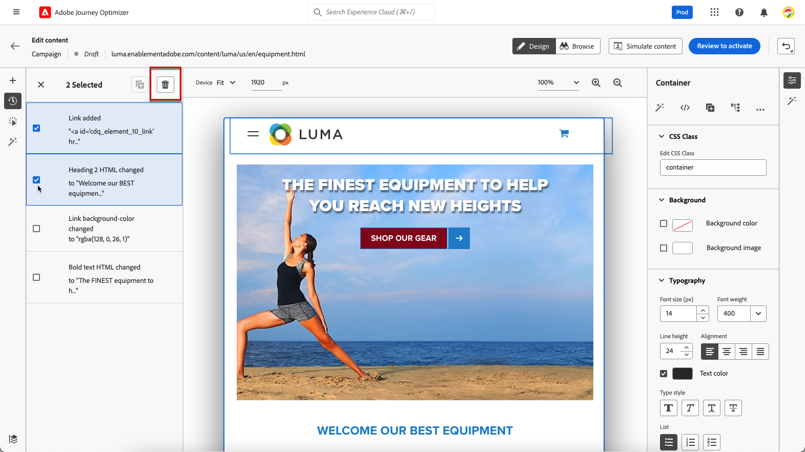
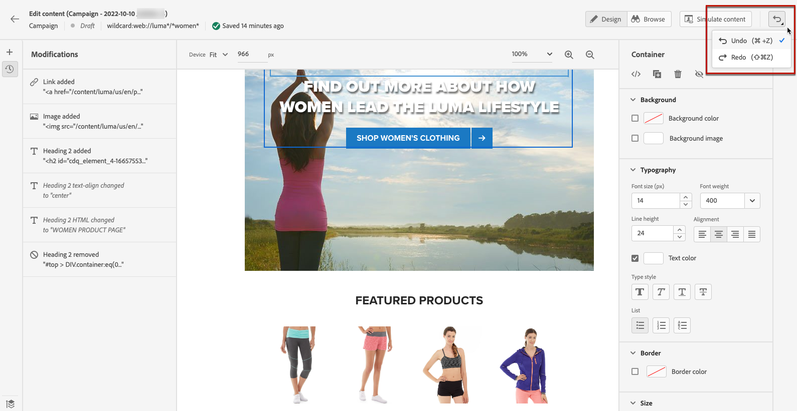
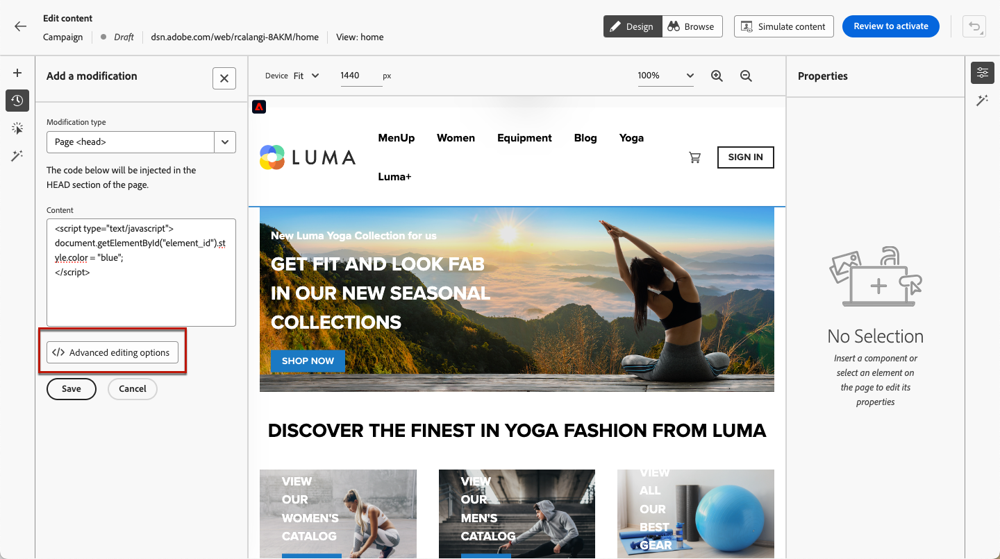

# Gestire le modifiche web {#manage-web-modifications}

>[!CONTEXTUALHELP]
>id="ajo_web_designer_modifications"
>title="Gestire con facilità tutte le modifiche"
>abstract="Utilizzando questo riquadro, puoi esplorare e gestire tutte le modifiche e gli stili aggiunti alla pagina web."

Puoi gestire facilmente tutti i componenti, le regolazioni e gli stili aggiunti alla pagina web. Puoi anche aggiungere modifiche direttamente dal riquadro dedicato.

## Utilizzare il riquadro Modifiche {#use-modifications-pane}

1. Seleziona l&#39;icona **[!UICONTROL Modifiche]** per visualizzare il riquadro corrispondente a sinistra.

   

1. Puoi rivedere tutte le modifiche apportate alla pagina.

1. Seleziona una modifica indesiderata e fai clic sull&#39;opzione **[!UICONTROL Elimina modifica]** dal pulsante **[!UICONTROL Altre azioni]** per rimuoverla.

   

   >[!CAUTION]
   >
   >Procedi con cautela durante l’eliminazione di un’azione, in quanto può influire sulle azioni successive.

1. Se si sta creando un&#39;[applicazione a pagina singola](web-spa.md), è possibile applicare qualsiasi modifica ad altre visualizzazioni. [Ulteriori informazioni](web-spa.md#apply-modifications-views)

1. Per eliminare più modifiche contemporaneamente, fai clic sul pulsante **[!UICONTROL Seleziona]** sopra il riquadro **[!UICONTROL Modifiche]**, controlla le modifiche e fai clic sull&#39;icona **[!UICONTROL Elimina]**.

   

1. Utilizza il pulsante **[!UICONTROL Altre azioni]** sopra il riquadro **[!UICONTROL Modifiche]** per eliminare tutte le modifiche contemporaneamente.

   

1. Puoi anche eliminare solo le modifiche non valide, ovvero quelle ignorate da altre modifiche. Ad esempio, se si modifica il colore di un testo e successivamente si elimina tale testo, la modifica del colore non sarà più valida in quanto il testo non esiste più.

1. Puoi annullare e ripristinare le azioni utilizzando il pulsante **[!UICONTROL Annulla/Ripristina]** in alto a destra dello schermo.

   

   Fai clic e tieni premuto il pulsante per passare dalle opzioni **[!UICONTROL Annulla]** alle opzioni **[!UICONTROL Ripristina]**. Quindi fai clic sul pulsante stesso per applicare l’azione desiderata.

## Aggiungi modifiche dal riquadro dedicato {#add-modifications}

Quando modifichi una pagina utilizzando il designer Web, puoi aggiungere nuove modifiche al contenuto direttamente dal riquadro **[!UICONTROL Modifiche]**, senza dover selezionare un componente e modificarlo dall&#39;interfaccia del designer Web. Segui i passaggi seguenti.

1. Nel riquadro **[!UICONTROL Modifiche]** fare clic sul pulsante **[!UICONTROL Altre azioni]**.

1. Seleziona **[!UICONTROL Aggiungi una modifica]**.

   

1. Selezionare il tipo di modifica:

   * **[!UICONTROL Selettore CSS]** - [Ulteriori informazioni](#css-selector)
   * **[!UICONTROL Pagina`<Head>`]** - [Ulteriori informazioni](#page-head)

1. Inserisci il contenuto e **[!UICONTROL Salva]** le modifiche.

1. Fai clic sul pulsante **[!UICONTROL Altre azioni]** accanto alla modifica e seleziona **[!UICONTROL Informazioni]** per visualizzarne i dettagli.

   

### Selettore CSS {#css-selector}

Per aggiungere una modifica del tipo **Selettore CSS**, effettua le seguenti operazioni.

1. Seleziona **[!UICONTROL Selettore CSS]** come tipo di modifica.

1. Il campo **[!UICONTROL Selettore elemento CSS]** consente di trovare e selezionare gli elementi HTML (o i nodi nella struttura DOM) su cui si desidera applicare le modifiche. <!--specify the desired CSS element that you want to modify.-->

   

1. Selezionare un tipo di azione (**[!UICONTROL Imposta contenuto]** o **[!UICONTROL Imposta attributo]**) e inserire le informazioni/il contenuto richiesti.

   * **[!UICONTROL Imposta contenuto]**: specifica il contenuto da inserire nell&#39;elemento identificato dal campo **[!UICONTROL Selettore elemento CSS]**.

   * **[!UICONTROL Imposta attributo]**: specifica un attributo da associare al selettore CSS corrente in modo che possa essere identificato anche da questo attributo. A tale scopo, immettere un nome nel campo **[!UICONTROL Nome attributo]** e un valore nel campo **[!UICONTROL Contenuto]**. Se l’attributo esiste già, il valore viene aggiornato; in caso contrario viene aggiunto un nuovo attributo con il nome e il valore specificati.

     

### Pagina `<head>` {#page-head}

>[!CONTEXTUALHELP]
>id="ajo_web_designer_head"
>title="Aggiungere codice personalizzato"
>abstract="L’elemento HEAD è un contenitore per metadati e si trova tra il tag HTML e il tag BODY. Aggiungi solo elementi SCRIPT e STYLE. Se si aggiungono tag DIV e altri elementi, gli elementi HEAD rimanenti potrebbero comparire all’interno del contenuto BODY."

È possibile aggiungere codice personalizzato utilizzando il tipo di modifica **[!UICONTROL Pagina`<head>`]**.

L&#39;elemento `<head>` è un contenitore per metadati (dati sui dati) e si trova tra il tag `<html>` e il tag `<body>`. In questo caso, il codice non attende gli eventi di caricamento del corpo del testo o della pagina, ma viene eseguito all’inizio del caricamento della pagina.

L&#39;elemento `<head>` viene comunemente utilizzato per aggiungere codice JavaScript o CSS nella parte superiore della pagina. I selettori per le azioni visive successive dipendono dagli elementi HTML aggiunti in questa scheda.

Per aggiungere una modifica del tipo **Pagina`<head>`**, eseguire la procedura seguente.

1. Selezionare **[!UICONTROL Pagina`<head>`]** come tipo di modifica.

   

1. Aggiungi il codice personalizzato nella casella **[!UICONTROL Contenuto]**.

   >[!CAUTION]
   >
   >È possibile aggiungere solo `<script>` e `<style>` elementi alla sezione `<head>`. L&#39;aggiunta di `<div>` tag e di altri elementi potrebbe causare la comparsa di `<head>` elementi rimanenti in `<body>`.

1. Fai clic sul pulsante **[!UICONTROL Opzioni di modifica avanzate]**. Viene aperto l’editor di personalizzazione.

   

   Puoi sfruttare l&#39;editor di personalizzazione [!DNL Journey Optimizer] con tutte le sue funzionalità di personalizzazione e authoring. [Ulteriori informazioni](../personalization/personalization-build-expressions.md)

#### Esempi di codice personalizzato {#custom-code-examples}

È possibile utilizzare il tipo di modifica **[!UICONTROL Pagina`<head>`]** per:

* Utilizza JavaScript in linea o collega a un file JavaScript esterno.

  Ad esempio, per modificare il colore di un elemento:

  ```
  <script type="text/javascript">
  document.getElementById("element_id").style.color = "blue";
  </script>
  ```

* Configurare uno stile in linea o un collegamento a un foglio di stile esterno.

  Ad esempio, per definire una classe per un elemento di sovrapposizione:

  ```
  <style>
  .overlay
  { position: absolute; top:0; left: 0; right: 0; bottom: 0; background: red; }
  </style>
  ```

#### Best practice per il codice personalizzato {#custom-code-best-practices}

+++ **Racchiudere sempre il codice personalizzato in un elemento.**

Ad esempio:

```
<script>
// Code goes here
</script>
```

Nel caso in cui siano necessarie modifiche, apporta modifiche all’interno del contenitore.

Se non hai più bisogno del codice personalizzato, lascia vuoto questo contenitore, ma non rimuoverlo. In questo modo, non influisce sulle altre modifiche dell’esperienza.

+++

+++ **Non eseguire azioni document.write negli script di codice personalizzato.**

Gli script vengono eseguiti in modo asincrono. Questo causa spesso la visualizzazione delle azioni document.write nella posizione sbagliata della pagina. Non è consigliabile utilizzare document.write negli script creati nel codice personalizzato.

+++

+++ **Se si crea un elemento e quindi lo si modifica, non eliminare l&#39;elemento originale.**

Ogni modifica crea un nuovo elemento nel pannello **[!UICONTROL Modifiche]**. La seconda azione modifica l&#39;elemento 1: se lo elimini, questa azione non avrà più nulla da modificare e la modifica non funzionerà più.

+++

+++ **Presta attenzione quando utilizzi il tipo di modifica**&#x200B;[!UICONTROL &#x200B; Pagina `<head>`]&#x200B;**per due campagne che interessano lo stesso URL.**

Se utilizzi il tipo di modifica **[!UICONTROL Pagina`<head>`]** per due campagne che interessano lo stesso URL, il JavaScript viene inserito nella pagina da entrambe le campagne. [!DNL Journey Optimizer] determina automaticamente l&#39;ordine del contenuto consegnato. Assicurati che il codice non dipenda dal posizionamento. Sta a te verificare che il codice non contenga conflitti.

+++
