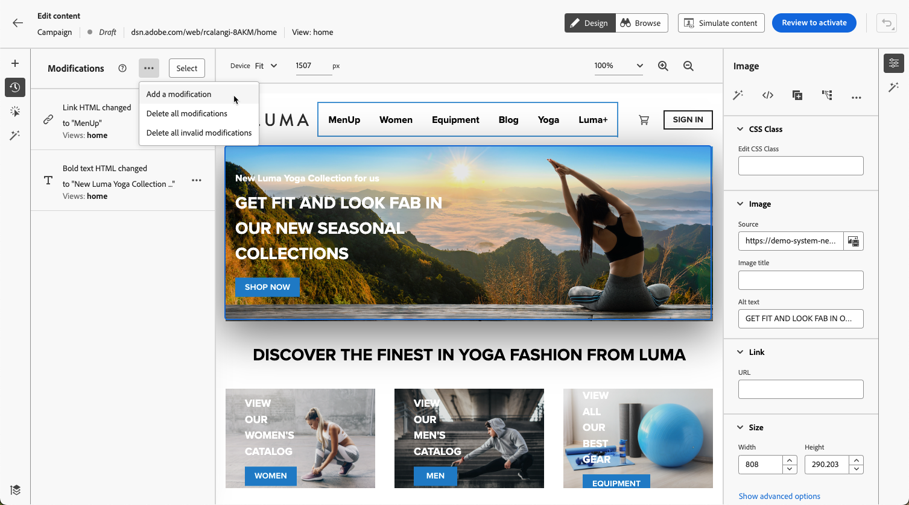
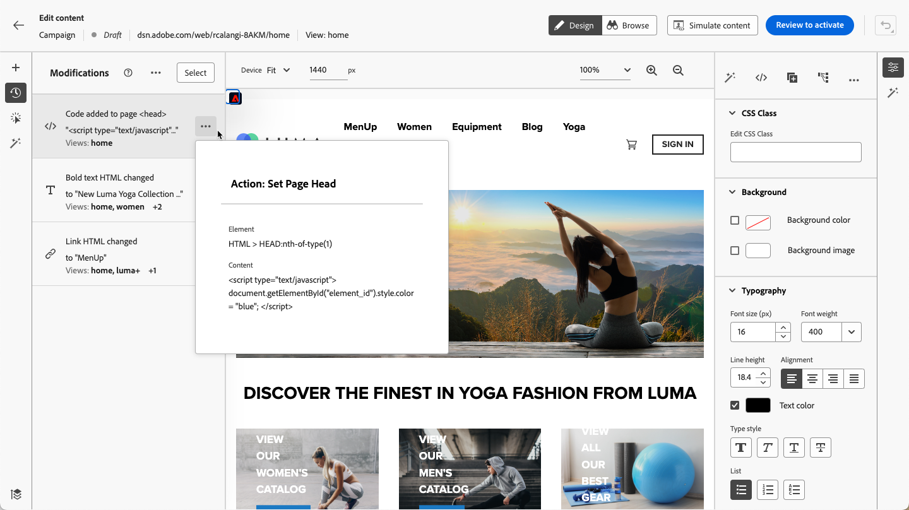

# Gestire le modifiche web {#manage-web-modifications}

>[!CONTEXTUALHELP]
>id="ajo_web_designer_modifications"
>title="Gestire con facilità tutte le modifiche"
>abstract="Utilizzando questo riquadro, puoi esplorare e gestire tutte le modifiche e gli stili aggiunti alla pagina web."

Puoi gestire facilmente tutti i componenti, le regolazioni e gli stili aggiunti alla pagina web. Puoi anche aggiungere modifiche direttamente dal riquadro dedicato.

## Utilizzare il riquadro Modifiche {#use-modifications-pane}

1. Seleziona la **[!UICONTROL Modifiche]** per visualizzare il riquadro corrispondente a sinistra.

   

1. Puoi rivedere tutte le modifiche apportate alla pagina.

1. Seleziona una modifica indesiderata e fai clic su **[!UICONTROL Elimina modifica]** opzione dalla **[!UICONTROL Altre azioni]** per rimuoverlo.

   

   >[!CAUTION]
   >
   >Procedi con cautela durante l’eliminazione di un’azione, in quanto può influire sulle azioni successive.

1. Per eliminare più modifiche contemporaneamente, fai clic sul pulsante **[!UICONTROL Seleziona]** sulla parte superiore della **[!UICONTROL Modifiche]** , verificare le modifiche desiderate e fare clic sul pulsante **[!UICONTROL Elimina]** icona.

   

1. Utilizza il **[!UICONTROL Altre azioni]** sulla parte superiore della **[!UICONTROL Modifiche]** per eliminare tutte le modifiche contemporaneamente.

   

1. Puoi anche eliminare solo le modifiche non valide, ovvero quelle ignorate da altre modifiche. Ad esempio, se si modifica il colore di un testo e successivamente si elimina tale testo, la modifica del colore non sarà più valida in quanto il testo non esiste più.

1. È possibile annullare e ripristinare le azioni utilizzando **[!UICONTROL Annulla/Ripristina]** in alto a destra.

   

   Fai clic e tieni premuto il pulsante per passare da un’icona all’altra **[!UICONTROL Annulla]** e **[!UICONTROL Ripeti]** opzioni. Quindi fai clic sul pulsante stesso per applicare l’azione desiderata.

## Aggiungi modifiche dal riquadro dedicato {#add-modifications}

Quando modifichi una pagina utilizzando il designer Web, puoi aggiungere nuove modifiche al contenuto direttamente dal **[!UICONTROL Modifiche]** riquadro - senza la necessità di selezionare un componente e modificarlo dall’interfaccia di web designer. Effettua le seguenti operazioni.

1. Dalla sezione **[!UICONTROL Modifiche]** , fare clic sul pulsante **[!UICONTROL Altre azioni]** pulsante.

1. Seleziona **[!UICONTROL Aggiungi una modifica]**.

   

1. Selezionare il tipo di modifica:

   * **[!UICONTROL Selettore CSS]** - [Ulteriori informazioni](#css-selector)
   * **[!UICONTROL Pagina`<Head>`]** - [Ulteriori informazioni](#page-head)

1. Inserisci il contenuto e **[!UICONTROL Salva]** le tue modifiche.

1. Fai clic su **[!UICONTROL Altre azioni]** accanto alla modifica e seleziona **[!UICONTROL Info]** per visualizzarne i dettagli.

   

### Selettore CSS {#css-selector}

Per aggiungere una **Selettore CSS** modifica del tipo, segui la procedura riportata di seguito.

1. Seleziona **[!UICONTROL Selettore CSS]** come tipo di modifica.

1. Il **[!UICONTROL Selettore elemento CSS]** Questo campo consente di individuare e selezionare gli elementi HTML (o i nodi nella struttura DOM) su cui si desidera applicare le modifiche. <!--specify the desired CSS element that you want to modify.-->

   

1. Seleziona un tipo di azione (**[!UICONTROL Imposta contenuto]** o **[!UICONTROL Imposta attributo]**) e inserisci le informazioni/i contenuti richiesti.

   * **[!UICONTROL Imposta contenuto]**: specifica il contenuto da inserire nell’elemento identificato da **[!UICONTROL Selettore elemento CSS]** campo.

   * **[!UICONTROL Imposta attributo]**: specifica un attributo da associare al selettore CSS corrente in modo che questo selettore possa essere identificato anche da questo attributo. A tale scopo, immetti un nome nel campo **[!UICONTROL Nome attributo]** e un valore nel campo **[!UICONTROL Contenuto]** campo. Se l’attributo esiste già, il valore viene aggiornato; in caso contrario viene aggiunto un nuovo attributo con il nome e il valore specificati.

     

### Pagina `<head>` {#page-head}

>[!CONTEXTUALHELP]
>id="ajo_web_designer_head"
>title="Aggiungere codice personalizzato"
>abstract="L’elemento HEAD è un contenitore per metadati e si trova tra il tag HTML e il tag BODY. Aggiungere solo elementi SCRIPT e STYLE. L’aggiunta di tag DIV e di altri elementi potrebbe causare il passaggio di elementi HEAD rimanenti nel BODY. "

Puoi aggiungere codice personalizzato utilizzando **[!UICONTROL Pagina`<head>`]** tipo di modifica.

Il `<head>` è un contenitore per i metadati (dati sui dati) e si trova tra `<html>` tag e `<body>` tag. In questo caso, il codice non attende gli eventi di caricamento del corpo del testo o della pagina, ma viene eseguito all’inizio del caricamento della pagina.

Il `<head>` Questo elemento viene comunemente utilizzato per aggiungere codice JavaScript o CSS nella parte superiore della pagina. I selettori per le azioni visive successive dipendono dagli elementi HTML aggiunti in questa scheda.

Per aggiungere una **Pagina`<head>`** modifica del tipo, segui la procedura riportata di seguito.

1. Seleziona **[!UICONTROL Pagina`<head>`]** come tipo di modifica.

   

1. Aggiungere il codice personalizzato in **[!UICONTROL Contenuto]** casella.

   >[!CAUTION]
   >
   >Puoi aggiungere solo `<script>` e `<style>` elementi al `<head>` sezione. L’aggiunta di tag `<div>` e di altri elementi potrebbe causare la comparsa di elementi `<head>` rimanenti nel `<body>`. 

1. Fai clic su **[!UICONTROL Opzioni di modifica avanzate]** pulsante. Viene aperto l’editor espressioni.

   

   Puoi sfruttare [!DNL Journey Optimizer] Editor espressioni con tutte le sue funzionalità di personalizzazione e authoring. [Ulteriori informazioni](../personalization/personalization-build-expressions.md)

#### Esempi di codice personalizzato {#custom-code-examples}

È possibile utilizzare **[!UICONTROL Pagina`<head>`]** tipo di modifica in:

* Utilizza JavaScript in linea o collega a un file JavaScript esterno.

  Ad esempio, per modificare il colore di un elemento:

  ```
  <script type="text/javascript">
  document.getElementById("element_id").style.color = "blue";
  </script>
  ```

* Configurare uno stile in linea o un collegamento a un foglio di stile esterno.

  Ad esempio, per definire una classe per un elemento di sovrapposizione:

  ```
  <style>
  .overlay
  { position: absolute; top:0; left: 0; right: 0; bottom: 0; background: red; }
  </style>
  ```

#### Best practice per il codice personalizzato {#custom-code-best-practices}

+++ **Racchiudi sempre il codice personalizzato in un elemento.**

Ad esempio:

```
<script>
// Code goes here
</script>
```

Nel caso in cui siano necessarie modifiche, apporta modifiche all’interno del contenitore.

Se non è più necessario il codice personalizzato, è sufficiente lasciare vuoto questo contenitore, ma non rimuoverlo. In questo modo, non influisce sulle altre modifiche dell’esperienza.

+++

+++ **Non eseguire azioni document.write negli script di codice personalizzato.**

Gli script vengono eseguiti in modo asincrono. Questo causa spesso la visualizzazione delle azioni document.write nella posizione sbagliata della pagina. Non è consigliabile utilizzare document.write negli script creati nel codice personalizzato.

+++

+++ **Se crei un elemento e lo modifichi, non eliminare l’elemento originale.**

Ogni modifica crea un nuovo elemento nel **[!UICONTROL Modifiche]** pannello. La seconda azione modifica l&#39;elemento 1: se lo elimini, questa azione non avrà più niente da modificare, risultando nella mancata applicazione della modifica.

+++

+++ **Presta attenzione quando utilizzi**[!UICONTROL  Pagina `<head>`]**tipo di modifica per due campagne che influiscono sullo stesso URL.**

Se si utilizza **[!UICONTROL Pagina`<head>`]** tipo di modifica per due campagne che influiscono sullo stesso URL, il codice JavaScript viene inserito nella pagina da entrambe le campagne. [!DNL Journey Optimizer] determina automaticamente l’ordine del contenuto consegnato. Assicurati che il codice non dipenda dal posizionamento. Sta a te verificare che il codice non contenga conflitti.

+++
