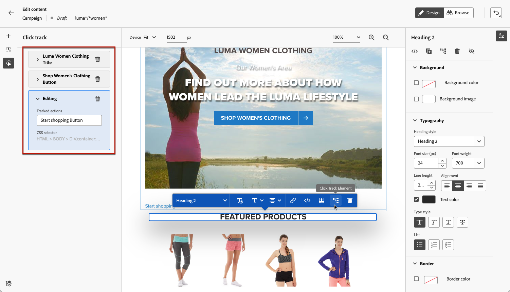

# Monitorare le esperienze web {#monitor-web-experiences}

## Controlla i report web {#check-web-reports}

Una volta che la tua esperienza Web è attiva, puoi controllare la scheda **[!UICONTROL Web]** del [rapporto Percorso](../reports/journey-global-report-cja-web.md) e del [rapporto campagna](../reports/campaign-global-report-cja-web.md) per confrontare elementi quali il numero di impression, il tasso di clic e il numero di impegni con la pagina Web.

<!--You can check the **[!UICONTROL Web]** tab of the campaign reports. Learn more about the campaign web [live report](../reports/campaign-live-report.md#web-tab) and [global report](../reports/campaign-global-report-cja.md#web).-->

Per migliorare ulteriormente il monitoraggio dell’esperienza web, puoi anche tenere traccia dei clic su qualsiasi elemento specifico del sito web. Questo consente di visualizzare il numero di clic su tale elemento nei rapporti web. [Scopri come](#use-click-tracing)

## Utilizzare il tracciamento dei clic {#use-click-tracking}

Il web designer consente di selezionare qualsiasi elemento del sito web e di tenere traccia dei clic su di esso.

Queste informazioni possono essere utili per migliorare l’esperienza degli utenti del sito web. Ad esempio, se i [report Web](../reports/campaign-global-report-cja-web.md) mostrano che molti utenti fanno clic su un elemento che non è effettivamente cliccabile, è possibile aggiungere un collegamento a tale elemento.

1. Seleziona un elemento nella pagina e scegli **[!UICONTROL Seleziona l&#39;elemento di tracciamento]** dal menu contestuale.

   

   >[!NOTE]
   >
   >È possibile selezionare qualsiasi elemento, cliccabile o meno.

1. L&#39;azione tracciata corrispondente viene visualizzata automaticamente nel riquadro **[!UICONTROL Traccia clic]** a sinistra.

   

1. Aggiungi un’etichetta significativa per gestire tutti gli elementi tracciati e trovarli facilmente nei rapporti. Il campo **[!UICONTROL Selettore CSS]** mostra le informazioni per individuare l&#39;elemento selezionato.

1. Ripeti i passaggi precedenti per selezionare tutti gli altri elementi necessari per il tracciamento dei clic. Tutte le azioni corrispondenti sono elencate nel riquadro a sinistra.

   

1. Per rimuovere il tracciamento dei clic su un elemento, seleziona l’icona di eliminazione corrispondente.

Una volta che la campagna è attiva, puoi controllare il numero di clic per ogni elemento nel web della campagna [report live](../reports/campaign-live-report.md#web-tab) e [report Customer Journey Analytics](../reports/campaign-global-report-cja-web.md).
