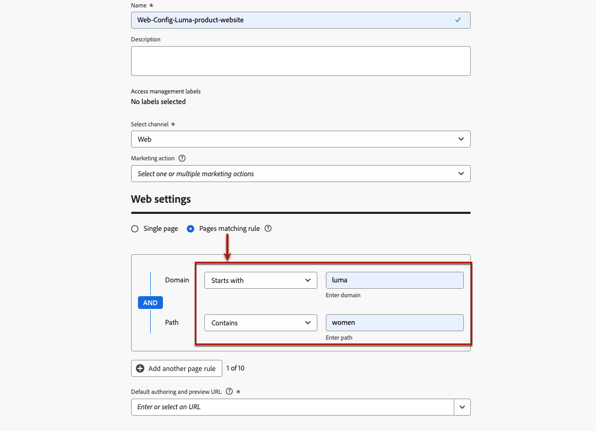
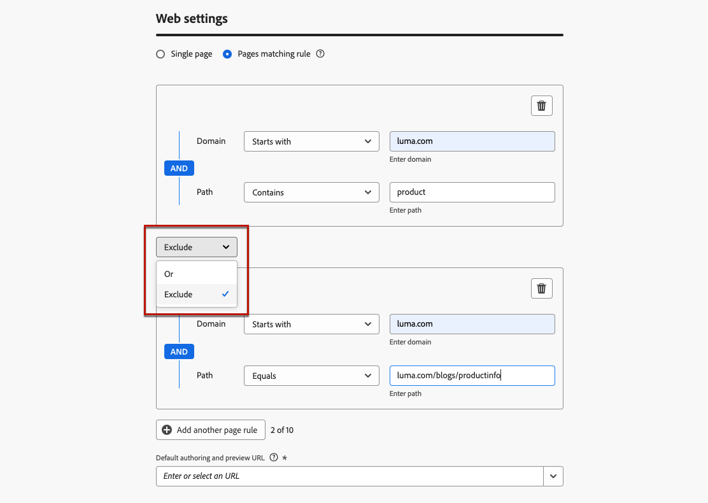

# Configurare le esperienze web {#web-configuration}

## Creare una configurazione del canale web {#create-web-configuration}

Una configurazione web è una proprietà web identificata da un URL in cui il contenuto verrà recapitato. Può corrispondere a un singolo URL di pagina o a più pagine, consentendoti di apportare modifiche in una o più pagine web.

Per creare una configurazione del canale web, segui la procedura riportata di seguito.

1. Accedi al menu **[!UICONTROL Canali]** > **[!UICONTROL Impostazioni generali]** > **[!UICONTROL Configurazioni canale]**, quindi fai clic su **[!UICONTROL Crea configurazione canale]**.

   

1. Immetti un nome e una descrizione (facoltativa) per la configurazione.

   >[!NOTE]
   >
   > I nomi devono iniziare con una lettera (A-Z). Può contenere solo caratteri alfanumerici. È inoltre possibile utilizzare i caratteri trattino basso `_`, punto `.` e trattino `-`.

1. Per assegnare etichette di utilizzo dei dati personalizzate o di base alla configurazione, è possibile selezionare **[!UICONTROL Gestisci accesso]**. [Ulteriori informazioni sul controllo degli accessi a livello di oggetto (OLAC)](../administration/object-based-access.md)

1. Seleziona il canale **Web**.

   

1. Seleziona **[!UICONTROL Azione di marketing]** per associare i criteri di consenso ai messaggi utilizzando questa configurazione. Tutti i criteri di consenso associati all’azione di marketing vengono utilizzati per rispettare le preferenze dei clienti. [Ulteriori informazioni](../action/consent.md#surface-marketing-actions)

1. Nella sezione **[!UICONTROL Impostazioni Web]** selezionare una delle opzioni seguenti:

   * **[!UICONTROL Pagina singola]** - Se desideri applicare le modifiche solo a una pagina singola, immetti un **[!UICONTROL URL pagina]**.

   * **[!UICONTROL Regola di corrispondenza pagine]** - Per eseguire il targeting di più URL che corrispondono alla stessa regola, crea una regola di corrispondenza pagine e immetti un **[!UICONTROL URL predefinito per l&#39;authoring e l&#39;anteprima]**. [Ulteriori informazioni](#web-page-matching-rule)

1. Fai clic su **[!UICONTROL Invia]** per salvare le modifiche.

Ora puoi selezionare questa configurazione quando utilizzi il canale web nelle campagne o nei percorsi.

## Creare una regola di corrispondenza delle pagine {#web-page-matching-rule}

>[!CONTEXTUALHELP]
>id="ajo_admin_page_rule"
>title="Creare una regola di corrispondenza delle pagine"
>abstract="Per gestire e indirizzare in modo efficiente un gruppo di URL che condividono gli stessi criteri, crea una regola di corrispondenza delle pagine. Questa regola consente di consolidare più URL in un’unica linea guida, semplificando l’applicazione di impostazioni e azioni coerenti in queste pagine."

>[!CONTEXTUALHELP]
>id="ajo_admin_default_url"
>title="Definire un URL per l’authoring e l’anteprima dei contenuti"
>abstract="Questo campo assicura che le pagine generate o associate dalla regola abbiano un URL designato, essenziale sia per la creazione che per l’anteprima efficace del contenuto."

Durante la creazione di una configurazione di [esperienza basata su codice](../code-based/get-started-code-based.md), puoi creare una **[!UICONTROL regola di corrispondenza pagine]** per eseguire il targeting di più URL che corrispondono alla stessa regola. Puoi quindi applicare le stesse modifiche al contenuto in più pagine contemporaneamente.

Ad esempio, puoi applicare le modifiche a un banner principale in un intero sito web, oppure aggiungere un’immagine superiore che viene visualizzata in tutte le pagine di prodotto di un sito web.

1. Durante la configurazione di [web](#web-configuration) o [esperienza basata su codice](../code-based/code-based-configuration.md), seleziona **[!UICONTROL Regola di corrispondenza pagine]**.

1. Definisci i criteri per i campi **[!UICONTROL Dominio]** e **[!UICONTROL Pagina]**.

   >[!NOTE]
   >
   >Controlla gli operatori disponibili in [questa sezione](#available-operators).

   Ad esempio, se desideri modificare gli elementi visualizzati in tutte le pagine del sito Web Luma relative alle donne, seleziona **[!UICONTROL Dominio]** > **[!UICONTROL Inizia con]** > `luma` e **[!UICONTROL Pagina]** > **[!UICONTROL Contiene]** > `women`.

   

1. Se il caso d’uso non può essere modellato utilizzando una regola, puoi aggiungere più regole. Fai clic su **[!UICONTROL Aggiungi un&#39;altra regola di pagina]** e ripeti il passaggio precedente.

   >[!NOTE]
   >
   >Puoi aggiungere fino a 10 regole.

1. È possibile utilizzare gli operatori **[!UICONTROL Or]** o **[!UICONTROL Exclude]** tra le diverse regole.

   **[!UICONTROL Escludi]** è utile quando una delle pagine che corrispondono alla regola definita non deve essere sottoposta a targeting. Ad esempio, è possibile eseguire il targeting di tutte le `luma.com` pagine che contengono `product`, esclusa la seguente pagina: `https://luma.com/blogs/productinfo`.

   

1. Immetti l&#39;**[!UICONTROL URL predefinito per l&#39;authoring e l&#39;anteprima]**. Questo passaggio assicura che le pagine generate o associate dalla regola abbiano un URL designato sia per la creazione di contenuti che per l’anteprima.

### Operatori disponibili per la creazione di regole di corrispondenza delle pagine {#available-operators}

Durante la creazione di una [regola che corrisponde a più pagine](#web-page-matching-rule), è possibile utilizzare operatori diversi nel **[!UICONTROL Dominio]** e nelle sezioni **[!UICONTROL Percorso]** per generare la regola desiderata. Gli operatori disponibili sono elencati di seguito.

* **Dominio**

  | Operatore  | Descrizione  | Esempi  |
  |---|---|---|
  | Uguale a  | Corrispondenza esatta del dominio.  | |
  | Inizia con  | Corrisponde a tutti i domini (inclusi i sottodomini) che iniziano con la stringa immessa.  | Esempio: &quot;Starts with: dev&quot; -> rileva tutti i domini e i sottodomini che iniziano con &quot;dev&quot;, come: dev.example.com, dev.products.example.com, developer.example.com  |
  | Termina con  | Corrisponde a tutti i domini (inclusi i sottodomini) che terminano con la stringa immessa.  | Esempio: &quot;Ends with: example.com&quot; -> rileva tutti i domini e i sottodomini che terminano con &quot;example.com&quot;, come: stage.example.com, prod.example.com, myexample.com  |
  | Corrispondenza con caratteri jolly  | L’operatore &quot;Wildcard matching&quot; (Corrispondenza caratteri jolly) consente di definire una corrispondenza con caratteri jolly al centro della stringa, ad esempio &quot;dev.*.example.com&quot; Le regole di convalida prevedono che il valore debba contenere un solo carattere jolly (asterisco) quando l’operatore è &quot;corrispondenza con caratteri jolly&quot;.  | Esempio: &quot;Abbinamento con caratteri jolly: dev.*.example.com&quot; -> corrisponde a domini come: dev.products.example.com, dev.mytest.products.example.com, dev.blog.example.com  |
  | Qualsiasi  | Corrisponde a tutti i domini: utile quando si esegue il test di un percorso particolare tra più domini  |  |

* **Percorso**

<table>
    <thead>
    <tr>
        <th><strong>Operatore</th>
        <th><strong>Descrizione</th>
        <th><strong>Esempi</th>
    </tr>
    </thead>
    <tbody>
    <tr>
        <td>È uguale a</td>
        <td>Corrispondenza esatta del percorso. </td>
        <td></td>
    </tr>
    <tr>
        <td>Inizia con</td>
        <td>Corrisponde a tutti i percorsi (inclusi i percorsi secondari) che iniziano con la stringa immessa.</td>
        <td></td>
    </tr>
    <tr>
        <td>Termina con</td>
        <td>Corrisponde a tutti i percorsi (inclusi i percorsi secondari) che terminano con la stringa immessa.</td>
        <td></td>
    </tr>
    <tr>
        <td>Qualsiasi</td>
        <td>Corrisponde a tutti i percorsi: utile quando si esegue il targeting di tutti i percorsi sotto uno o più domini.</td>
        <td></td>
    </tr>
    <tr>
        <td>Corrispondenza con caratteri jolly</td>
        <td>L’operatore "Wildcard matching" (Corrispondenza caratteri jolly) consente di definire un carattere jolly interno al percorso, ad esempio "/products/*/detail".  Il carattere jolly * nel componente ** percorso corrisponde a qualsiasi sequenza di caratteri fino a quando non viene rilevato il primo carattere /.  /*/ corrisponde a qualsiasi sequenza di caratteri (inclusi i percorsi secondari)</td>
        <td>Esempio: "Corrispondenza con caratteri jolly: /products/*/detail", corrisponde a tutti i percorsi come: <ul><li>example.com/products/yoga/detail</li><li>example.com/products/surf/detail</li><li>example.com/products/tennis/detail</li><li>example.com/products/yoga/pants/detail</li></ul>Esempio: "Corrisponde a: /prod*/detail, corrisponde a tutti i percorsi come: <ul><li>example.com/products/detail</li><li>example.com/production/detail</li></ul>non corrisponde a percorsi come: <ul><li>example.com/products/yoga/detail</li></ul></td>
    </tr>
    <tr>
        <td>Contiene</td>
        <td>"contains" viene tradotto in un carattere jolly come "mystring" e corrisponde a tutti i percorsi che contengono questa sequenza di caratteri.</td>
        <td>Esempio: "Contiene: product", corrisponde a tutti i percorsi che contengono la stringa product, come: <ul><li>example.com/products</li><li>example.com/yoga/perfproduct</li><li>example.com/surf/productdescription</li><li>example.com/home/product/page</li></ul></td>
    </tr>
    </tbody>
</table>
