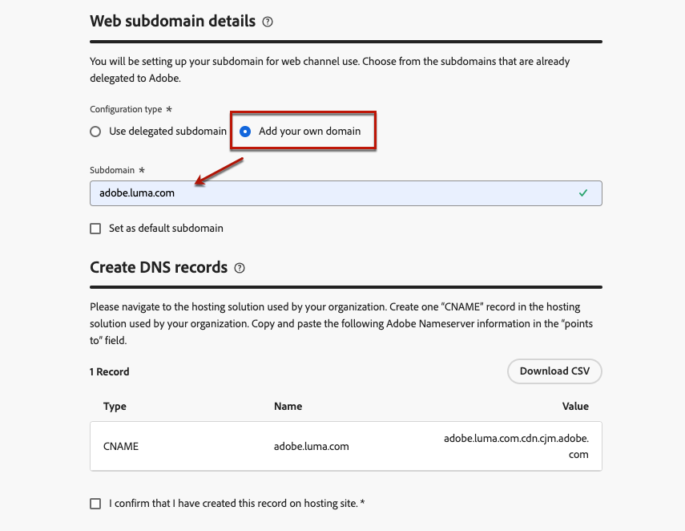

# Configurare i sottodomini web {#web-subdomains}

>[!CONTEXTUALHELP]
>id="ajo_admin_subdomain_web_header"
>title="Delegare un sottodominio web"
>abstract="Devi configurare il sottodominio da utilizzare per il canale web. Puoi utilizzare un sottodominio già delegato ad Adobe o configurarne un altro."

>[!CONTEXTUALHELP]
>id="ajo_admin_subdomain_web"
>title="Delegare un sottodominio web"
>abstract="Se aggiungi contenuti provenienti da Adobe Experience Manager Assets alle esperienze web, devi configurare il sottodominio che verrà utilizzato per pubblicare tali contenuti. Seleziona tra i sottodomini già delegati ad Adobe o configura un nuovo sottodominio."

>[!CONTEXTUALHELP]
>id="ajo_admin_subdomain_web_default"
>title="Impostare un sottodominio web"
>abstract="Seleziona un sottodominio dall’elenco dei sottodomini delegati ad Adobe. È possibile impostare questo sottodominio web come predefinito, ma è possibile utilizzare un solo sottodominio predefinito alla volta."

Quando crei esperienze web, se aggiungi contenuti provenienti da [Adobe Experience Manager Assets](../content-management/assets.md) devi impostare il sottodominio che verrà utilizzato per pubblicare questo contenuto.

Puoi utilizzare un sottodominio già delegato ad Adobe oppure configurare un altro sottodominio. Ulteriori informazioni sulla delega dei sottodomini all’Adobe in [questa sezione](../configuration/delegate-subdomain.md).

>[!CAUTION]
>
>La configurazione del sottodominio web è comune a tutti gli ambienti. Pertanto:
>
>* Per accedere e modificare i sottodomini web, devi disporre del **[!UICONTROL Gestire i sottodomini web]** autorizzazione per la sandbox di produzione.
>
> * Qualsiasi modifica a un sottodominio web influirà anche sulle sandbox di produzione.

Puoi creare diversi sottodomini web, ma solo **predefinito** verrà utilizzato il sottodominio. Puoi modificare il sottodominio web predefinito, ma è possibile utilizzarne solo uno alla volta.

## Accesso e gestione dei sottodomini web {#access-web-subdomains}

1. Vai a **[!UICONTROL Amministrazione]** > **[!UICONTROL Canali]** , quindi seleziona **[!UICONTROL Configurazione web]** > **[!UICONTROL Sottodomini web]**. Vengono visualizzati tutti i sottodomini configurati con la sandbox corrente.

   

1. Puoi filtrare in base all’utente che ha delegato ciascun sottodominio o uno dei due stati di delega (**[!UICONTROL Bozza]**, **[!UICONTROL Elaborazione]**, **[!UICONTROL Completato]** o **[!UICONTROL Non riuscito]**).

   

1. Il **[!UICONTROL Predefinito]** il badge viene visualizzato accanto al sottodominio attualmente utilizzato come predefinito. Per modificare il sottodominio predefinito, seleziona **[!UICONTROL Imposta come predefinito]** dal **[!UICONTROL Altre azioni]** accanto al sottodominio desiderato.

   

   >[!NOTE]
   >
   >Puoi modificare il sottodominio web predefinito, ma è possibile utilizzarne solo uno alla volta.

## Usa un sottodominio esistente {#web-use-existing-subdomain}

Per utilizzare un sottodominio già delegato ad Adobe, segui i passaggi seguenti.

1. Accedere a **[!UICONTROL Amministrazione]** > **[!UICONTROL Canali]** , quindi seleziona **[!UICONTROL Configurazione web]** > **[!UICONTROL Sottodomini web]**.

1. Clic **[!UICONTROL Configurare il sottodominio]**.

1. Seleziona la **[!UICONTROL Usa sottodominio delegato]** opzione dalla **[!UICONTROL Tipo di configurazione]** e scegli un sottodominio delegato dall’elenco.

   

   >[!NOTE]
   >
   >Non puoi selezionare un sottodominio già utilizzato come sottodominio web.

1. Il prefisso che verrà visualizzato nell’URL web viene aggiunto automaticamente. Non puoi cambiarlo.

1. Per impostare questo sottodominio come predefinito, seleziona l’opzione corrispondente.

   

   >[!NOTE]
   >
   >Solo il **predefinito** verrà utilizzato il sottodominio.

1. Clic **[!UICONTROL Invia]**. Il sottodominio ottiene il **[!UICONTROL Completato]** stato. È pronto per essere utilizzato nelle esperienze web.

   >[!NOTE]
   >
   >In casi molto rari, l’impostazione di un sottodominio potrebbe non riuscire. In questo caso, è possibile eliminare **[!UICONTROL Non riuscito]** sottodominio per pulire l’elenco utilizzando **[!UICONTROL Elimina]** dal pulsante **[!UICONTROL Altre azioni]** icona.

## Configurare un nuovo sottodominio {#web-configure-new-subdomain}

>[!CONTEXTUALHELP]
>id="ajo_admin_web_subdomain_dns"
>title="Generare il record DNS corrispondente"
>abstract="Per configurare un nuovo sottodominio web, devi copiare le informazioni del server dei nomi di Adobe visualizzate nell’interfaccia di Journey Optimizer e incollarle nella soluzione di hosting del dominio per generare il record DNS corrispondente. Una volta completati i controlli, il sottodominio è pronto per essere utilizzato per pubblicare il contenuto proveniente dalla libreria Experience Manager Assets "

Per configurare un nuovo sottodominio, segui i passaggi indicati di seguito.

1. Accedere a **[!UICONTROL Amministrazione]** > **[!UICONTROL Canali]** , quindi seleziona **[!UICONTROL configurazione web]** > **[!UICONTROL sottodomini web]**.

1. Clic **[!UICONTROL Configurare il sottodominio]**.

1. Seleziona **[!UICONTROL Aggiungi il tuo dominio]** dal **[!UICONTROL Tipo di configurazione]** sezione.

1. Specifica il sottodominio da delegare.

   >[!CAUTION]
   >
   >Non puoi utilizzare un sottodominio web esistente.
   >
   >Nei sottodomini non sono consentite lettere maiuscole.

   

   La delega di un sottodominio non valido a Adobe non è consentita. Assicurati di immettere un sottodominio valido di proprietà della tua organizzazione, ad esempio marketing.yourcompany.com.

   >[!NOTE]
   >
   >Sono supportati i sottodomini a più livelli (dello stesso dominio padre). Ad esempio, puoi utilizzare &quot;web.marketing.yourcompany.com&quot;.

1. Per impostare questo sottodominio come predefinito, seleziona l’opzione corrispondente.

   >[!NOTE]
   >
   >Solo il **predefinito** verrà utilizzato il sottodominio.

1. Viene visualizzato il record da inserire nei server DNS. Copia questo record o scarica un file CSV, quindi accedi alla soluzione di hosting del tuo dominio per generare il record DNS corrispondente.

1. Assicurati che il record DNS sia stato generato nella soluzione di hosting del dominio. Se tutto è configurato correttamente, seleziona la casella &quot;Confermo...&quot;, quindi fai clic su **[!UICONTROL Invia]**.

   

   >[!NOTE]
   >
   >Quando configuri un nuovo sottodominio web, questo punterà sempre a un record CNAME.

1. Una volta inviata la delega del sottodominio, il sottodominio viene visualizzato nell’elenco con **[!UICONTROL Elaborazione]** stato. Per ulteriori informazioni sugli stati dei sottodomini, consulta [questa sezione](../configuration/about-subdomain-delegation.md#access-delegated-subdomains).<!--Same statuses?-->

   >[!NOTE]
   >
   >Prima di poter utilizzare tale sottodominio per inviare messaggi web, devi attendere che Adobe esegua i controlli richiesti, che possono richiedere fino a 4 ore.

1. Quando i controlli hanno esito positivo, il sottodominio ottiene il **[!UICONTROL Completato]** stato. È pronto per essere utilizzato per creare superfici di canale web.

   Il sottodominio verrà contrassegnato come **[!UICONTROL Non riuscito]** se non riesci a creare il record di convalida nella soluzione di hosting.

<!--
Only a subdomain with the **[!UICONTROL Success]** status can be set as default.
You cannot delete a subdomain with the **[!UICONTROL Processing]** status.
-->
