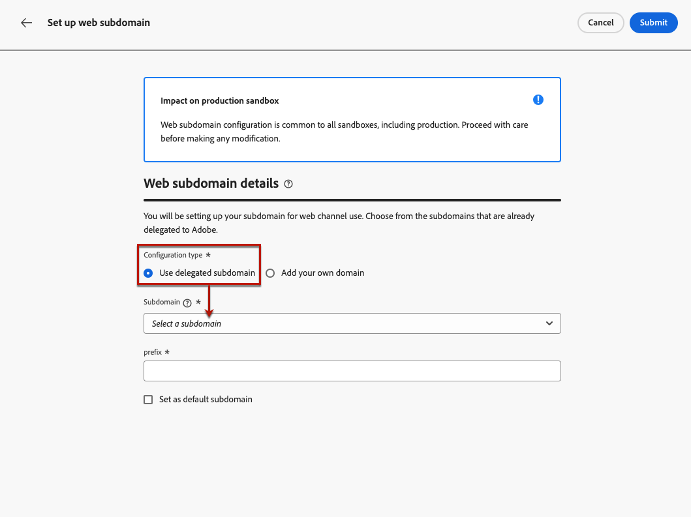

# Configurare i sottodomini web {#web-subdomains}

>[!CONTEXTUALHELP]
>id="ajo_admin_subdomain_web_header"
>title="Delegare un sottodominio web"
>abstract="Devi configurare il sottodominio da utilizzare per il canale web. Puoi utilizzare un sottodominio già delegato ad Adobe o configurarne un altro."

>[!CONTEXTUALHELP]
>id="ajo_admin_subdomain_web"
>title="Delegare un sottodominio web"
>abstract="Se aggiungi contenuti provenienti da Adobe Experience Manager Assets alle esperienze web, devi configurare il sottodominio che verrà utilizzato per pubblicare tali contenuti. Seleziona tra i sottodomini già delegati ad Adobe o configura un nuovo sottodominio."

>[!CONTEXTUALHELP]
>id="ajo_admin_subdomain_web_default"
>title="Impostare un sottodominio web"
>abstract="Seleziona un sottodominio dall’elenco dei sottodomini delegati ad Adobe. È possibile impostare questo sottodominio web come predefinito, ma è possibile utilizzare un solo sottodominio predefinito alla volta."

## Introduzione ai sottodomini web {#gs-web-subdomains}

Quando crei esperienze web, se aggiungi contenuto provenienti dall&#39;libreria [Assets](../integrations/assets.md) Adobe Experience Manager, devi impostare il sottodominio che verrà utilizzato per pubblicare questo contenuto.

È possibile utilizzare un sottodominio già delegato a Adobe Systems oppure configurare un altro sottodominio. Scopri ulteriori informazioni sulla delega di sottodomini a Adobe Systems in [questa sezione](../configuration/delegate-subdomain.md).

La configurazione del sottodominio Web è **comune a tutti gli ambienti**. Pertanto:

* Per accedere e modificare i sottodomini Web, devi disporre dell&#39;autorizzazione **[!UICONTROL Gestisci sottodomini Web]** nella sandbox di produzione.

* Qualsiasi modifica a un sottodominio web influirà anche sulle sandbox di produzione.

Puoi creare diversi sottodomini web, ma verrà utilizzato solo il sottodominio **default**. Puoi modificare il sottodominio web predefinito, ma è possibile utilizzarne solo uno alla volta.

## Accesso e gestire sottodomini web {#access-web-subdomains}

Per accesso i sottodomini per le esperienze Web, seguire questi passaggi:

1. Sfoglia al **[!UICONTROL menu Amministrazione]** > **[!UICONTROL canali]** , quindi seleziona **[!UICONTROL Impostazioni]** web > **[!UICONTROL Sottodomini]** web. Vengono visualizzati tutti i sottodomini configurati con la sandbox corrente.

   

1. È possibile filtrare i utente che hanno delegato ogni sottodominio o uno stato di delega (**[!UICONTROL Bozza]**, **[!UICONTROL Elaborazione]**, **[!UICONTROL Operazione riuscita]** o **[!UICONTROL Non riuscita]**).

   

1. Il badge **[!UICONTROL Default]** viene visualizzato accanto al sottodominio attualmente utilizzato come predefinito. Per modificare il sottodominio predefinito, seleziona **[!UICONTROL Imposta come predefinito]** dal pulsante **[!UICONTROL Altre azioni]** accanto al sottodominio desiderato.

   

   Puoi modificare il sottodominio web predefinito, ma è possibile utilizzarne solo uno alla volta.

## Utilizza un sottodominio esistente {#web-use-existing-subdomain}

Per utilizzare un sottodominio già delegato a Adobe Systems, seguire i passaggi seguenti:

1. Accedi al **[!UICONTROL menu Amministrazione]** > **[!UICONTROL canali]** , quindi seleziona **[!UICONTROL Impostazioni]** web > **[!UICONTROL sottodomini]** web.

1. Fai clic su **[!UICONTROL Imposta sottodominio]**.

1. Selezionare l&#39;opzione **[!UICONTROL Usa sottodominio]** delegato dalla **[!UICONTROL sezione Tipo di]** configurazione e scegliere un sottodominio delegato dall&#39;elenco.

   

   >[!NOTE]
   >
   >Non è possibile selezionare un sottodominio già utilizzato come sottodominio Web.

1. Il prefisso che verrà visualizzato nel URL Web viene aggiunto automaticamente. Non è possibile modificarlo.

1. Per impostare questo sottodominio come predefinito, selezionare l&#39;opzione corrispondente.

   

   Verrà utilizzato solo il **sottodominio predefinito** .

1. Fai clic su &quot;Submit&quot; (Invia **&#x200B;**). Il sottodominio ottiene lo **[!UICONTROL stato Operazione riuscita]** . È pronto per essere utilizzato nelle esperienze web.

   In casi molto rari, l’impostazione di un sottodominio potrebbe non riuscire. In questo caso, puoi eliminare il sottodominio **[!UICONTROL Non riuscito]** per pulire l&#39;elenco utilizzando il pulsante **[!UICONTROL Elimina]** dall&#39;icona **[!UICONTROL Altre azioni]**.

## Configurare un nuovo sottodominio {#web-configure-new-subdomain}

>[!CONTEXTUALHELP]
>id="ajo_admin_web_subdomain_dns"
>title="Generare il record DNS corrispondente"
>abstract="Per configurare un nuovo sottodominio web, devi copiare le informazioni del server dei nomi di Adobe visualizzate nell’interfaccia di Journey Optimizer e incollarle nella soluzione di hosting del dominio per generare il record DNS corrispondente. Una volta completati i controlli, il sottodominio è pronto per essere utilizzato per pubblicare il contenuto proveniente dalla libreria Adobe Experience Manager Assets."

Per impostazione predefinita, [!DNL Journey Optimizer] consente di delegare **fino a 10 sottodomini** in totale (che coprono sia i canali e-mail che quelli web). Tuttavia, a seconda del contratto di licenza, puoi delegare fino a 100 sottodomini. Per ulteriori informazioni sul numero di sottodomini a cui hai diritto, rivolgiti al tuo referente Adobe.

Per configurare un nuovo sottodominio, effettua le seguenti operazioni:

1. Accedi al menu **[!UICONTROL Amministrazione]** > **[!UICONTROL Canali]**, quindi seleziona **[!UICONTROL Impostazioni Web]** > **[!UICONTROL Sottodomini Web]**.

1. Fare clic su **[!UICONTROL Configura sottodominio]**.

1. Seleziona **[!UICONTROL Aggiungi il tuo dominio]** dalla sezione Tipo di **&#x200B;**&#x200B;configurazione.

1. Specifica il sottodominio da delegare.

   >[!CAUTION]
   >
   >* Non puoi utilizzare un sottodominio web esistente.
   >
   >* Le lettere maiuscole non sono consentite nei sottodomini.

   

   Non è consentito delegare un sottodominio non valido a Adobe Systems. Assicurati di immettere un sottodominio valido di proprietà della tua organizzazione, ad esempio marketing.yourcompany.com.

   Sono supportati i sottodomini a più livelli (dello stesso dominio padre). Ad esempio, puoi utilizzare &quot;web.marketing.yourcompany.com&quot;.

1. Per impostare questo sottodominio come predefinito, seleziona l’opzione corrispondente.

   >[!NOTE]
   >
   >Verrà utilizzato solo il sottodominio **default**.

1. Viene visualizzato il record da inserire nei server DNS. Copia questo record o scarica un file CSV, quindi accedi alla soluzione di hosting del tuo dominio per generare il record DNS corrispondente.

1. Assicurati che il record DNS sia stato generato nella soluzione di hosting del dominio. Se tutto è configurato correttamente, seleziona la casella &quot;Confirmo...&quot;, quindi fai clic su **[!UICONTROL Invia]**.

   

   Quando configuri un nuovo sottodominio web, punta sempre a un record CNAME.

1. Una volta inviata la delega del sottodominio, il sottodominio viene visualizzato nell&#39;elenco con lo stato di **[!UICONTROL elaborazione]** . Per ulteriori informazioni sugli stati dei sottodomini, consulta [questa sezione](../configuration/about-subdomain-delegation.md#access-delegated-subdomains).<!--Same statuses?-->

   Prima di poter utilizzare quel sottodominio per inviare messaggi Web, è necessario attendere che Adobe Systems esegua i controlli richiesti, che possono richiedere **fino a 4 ore**.

1. Una volta completati i controlli, il sottodominio ottiene lo stato **[!UICONTROL Completato]**. È pronto per essere utilizzato per creare configurazioni del canale web.

   Tieni presente che il sottodominio verrà contrassegnato come **[!UICONTROL Non riuscito]** se non riesci a creare il record convalida sulla tua soluzione di hosting.

<!--
Only a subdomain with the **[!UICONTROL Success]** status can be set as default.
You cannot delete a subdomain with the **[!UICONTROL Processing]** status.
-->

## Annullare la delega di un sottodominio {#undelegate-subdomain}

Se desideri annullare la delega di un sottodominio web, contatta il tuo rappresentante Adobe Systems.

Tuttavia, è necessario eseguire diversi passaggi nell&#39;interfaccia di utente prima di contattare Adobe Systems.

>[!NOTE]
>
>È possibile annullare la **[!UICONTROL delega solo i sottodomini con stato Operazione riuscita]** . I sottodomini con gli **[!UICONTROL stati Bozza]** e **[!UICONTROL Non riuscito]** possono essere semplicemente eliminati dall&#39;interfaccia utente.

Innanzitutto, esegui i seguenti passaggi in [!DNL Journey Optimizer]:

1. Disattiva tutte le configurazioni di canale associate al sottodominio. [Scopri come](../configuration/channel-surfaces.md#deactivate-a-surface)

<!--
1. If the web subdomain is using an email subdomain that was [already delegated](#lp-use-existing-subdomain) to Adobe, undelegate the email subdomain. [Learn how](../configuration/delegate-subdomain.md#undelegate-subdomain)-->

1. Interruzione le campagne attive associate ai sottodomini. [Scopri come](../campaigns/modify-stop-campaign.md#stop)

1. Interruzione i percorsi attivi associati ai sottodomini. [Scopri come](../building-journeys/end-journey.md#stop-journey)

1. Se il sottodominio Web è un [nuovo sottodominio delegato](#web-configure-new-subdomain), rimuovere le voci DNS associate a tale sottodominio.

Al termine, rivolgiti al tuo rappresentante Adobe con il sottodominio da annullare la delega.

Dopo che la richiesta è gestita da Adobe, il dominio non delegato non viene più visualizzato nella pagina di inventario del sottodominio.

>[!CAUTION]
>
>Dopo la rimozione della delega di un sottodominio:
>
>   * Non è possibile riattivare le configurazioni di canale che utilizzavano quel sottodominio.
>
>   * Non è possibile delegare nuovamente il sottodominio esatto tramite l&#39;interfaccia utente. Se vuoi farlo, contatta il tuo rappresentante Adobe Systems.