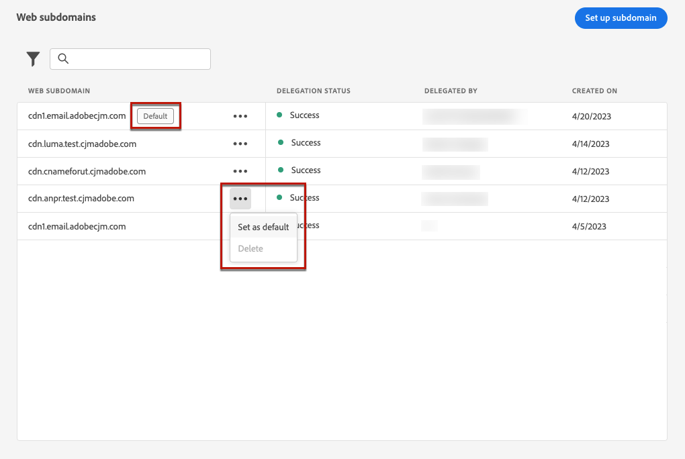

# Configurare i sottodomini web {#web-subdomains}

>[!CONTEXTUALHELP]
>id="ajo_admin_subdomain_web_header"
>title="Delega di un sottodominio web"
>abstract="Imposta il tuo sottodominio per l’uso del canale web. Scegli tra i sottodomini già delegati ad Adobe."

>[!CONTEXTUALHELP]
>id="ajo_admin_subdomain_web"
>title="Delega di un sottodominio web"
>abstract="Se aggiungi contenuti provenienti da Adobe Experience Manager Assets Essentials alle esperienze web, devi configurare il sottodominio che verrà utilizzato per pubblicare tali contenuti. Seleziona uno dei sottodomini già delegati all’Adobe."

>[!CONTEXTUALHELP]
>id="ajo_admin_subdomain_web_default"
>title="Impostare un sottodominio web"
>abstract="Seleziona un sottodominio dall’elenco dei sottodomini delegati all’Adobe. È possibile impostare questo sottodominio Web come predefinito, ma è possibile utilizzare un solo sottodominio predefinito alla volta."

Durante la creazione di esperienze web, se aggiungi contenuto proveniente da [Adobe Experience Manager Assets Essentials](../email/assets-essentials.md) devi configurare il sottodominio che verrà utilizzato per pubblicare il contenuto.

A questo scopo, devi scegliere tra l’elenco dei sottodomini già delegati all’Adobe. Ulteriori informazioni sulla delega dei sottodomini ad Adobe in [questa sezione](../configuration/delegate-subdomain.md).

>[!CAUTION]
>
>La configurazione del sottodominio web è comune a tutti gli ambienti. Pertanto:
>
>* Per accedere e modificare i sottodomini web, devi disporre dei **[!UICONTROL Gestire i sottodomini Web]** autorizzazione per la sandbox di produzione.
>
> * Qualsiasi modifica apportata a un sottodominio web influisce anche sulle sandbox di produzione.

Puoi creare più sottodomini web, ma solo **default** verrà utilizzato il sottodominio. È possibile modificare il sottodominio Web predefinito, ma è possibile utilizzarne solo uno alla volta.

1. Accedere al **[!UICONTROL Amministrazione]** > **[!UICONTROL Canali]** quindi seleziona **[!UICONTROL Configurazione web]** > **[!UICONTROL Sottodomini web]**.

   

1. Fai clic su **[!UICONTROL Imposta sottodominio]**.

1. Seleziona un sottodominio delegato dall’elenco.

   

   >[!NOTE]
   >
   >Non è possibile selezionare un sottodominio già utilizzato come sottodominio Web.

1. Il prefisso che verrà visualizzato nell’URL web viene aggiunto automaticamente. Non può cambiarla.

1. Per impostare questo sottodominio come predefinito, seleziona l’opzione corrispondente.

   

   >[!NOTE]
   >
   >Solo il **default** verrà utilizzato il sottodominio.

1. Fai clic su **[!UICONTROL Invia]**. Il sottodominio ottiene il **[!UICONTROL Completato]** stato. È pronto per essere utilizzato per le esperienze web.

   >[!NOTE]
   >
   >In rare occasioni, la configurazione di un sottodominio potrebbe non riuscire. In questo caso, puoi eliminare il **[!UICONTROL Non riuscito]** sottodominio per ripulire l’elenco utilizzando **[!UICONTROL Elimina]** dal pulsante **[!UICONTROL Altre azioni]** icona.

1. La **[!UICONTROL Predefinito]** il badge viene visualizzato accanto al sottodominio attualmente utilizzato come predefinito. Per modificare il sottodominio predefinito, seleziona **[!UICONTROL Imposta come predefinito]** dal **[!UICONTROL Altre azioni]** accanto al sottodominio desiderato.

   

   >[!NOTE]
   >
   >È possibile modificare il sottodominio Web predefinito, ma è possibile utilizzarne solo uno alla volta.

   <!--Only a subdomain with the **[!UICONTROL Success]** status can be set as default.

    You cannot delete a subdomain with the **[!UICONTROL Processing]** status.-->
