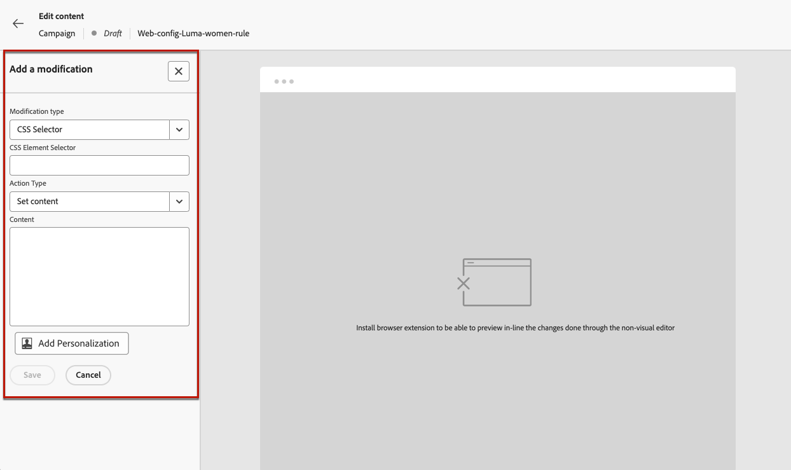

# Utilizza l’editor non visivo web {#web-non-visual-editor}

Oltre al [!DNL Journey Optimizer] [Web Designer](web-visual-editor.md) visivo, puoi anche aggiungere modifiche alle pagine Web utilizzando un **editor non visivo**.

Ciò può essere utile se non è possibile installare estensioni del browser, ad esempio [Adobe Experience Cloud Visual Helper](web-prerequisites.md#visual-authoring-prerequisites), necessario per caricare le pagine nella finestra di progettazione Web.

In alcuni casi, potrebbe essere più semplice utilizzare un editor non visivo per applicare modifiche a un particolare selettore CSS, senza il rischio di modificare altri elementi di una pagina web o di modificare la struttura della pagina.

Per creare le tue esperienze web con l’editor non visivo, segui i passaggi indicati di seguito.

1. Dalla schermata **[!UICONTROL Modifica contenuto]** nel percorso o nella campagna, deseleziona l&#39;opzione **[!UICONTROL Editor visivo]**.

1. Fai clic su **[!UICONTROL Aggiungi una modifica]** per iniziare a modificare il contenuto Web.

   

1. Viene visualizzato l’editor non visivo. Puoi aggiungere la prima modifica utilizzando il riquadro a sinistra.

   

1. Nell’elenco a discesa, seleziona il tipo di modifica.

   Sono disponibili due tipi. Sono disponibili diverse opzioni. Per ulteriori informazioni, consulta i collegamenti seguenti:

   * **[!UICONTROL Selettore CSS]** - [Ulteriori informazioni](manage-web-modifications.md#css-selector)
   * **[!UICONTROL Pagina`<head>`]** - [Ulteriori informazioni](manage-web-modifications.md#page-head)

1. Fai clic sul pulsante **[!UICONTROL Aggiungi personalizzazione]**. Viene aperto l’editor di personalizzazione.

   Puoi sfruttare l&#39;editor di personalizzazione [!DNL Journey Optimizer] con tutte le sue funzionalità di personalizzazione e authoring. [Ulteriori informazioni](../personalization/personalization-build-expressions.md)

1. Inserisci il contenuto e **[!UICONTROL Salva]** le modifiche.

   

1. La prima modifica viene visualizzata sopra il riquadro **[!UICONTROL Modifiche]**.

   Fai clic sul pulsante **[!UICONTROL Altre azioni]** accanto alla modifica e seleziona **[!UICONTROL Informazioni]** per visualizzarne i dettagli. Se necessario, puoi anche **[!UICONTROL Eliminare la modifica]**.

   {width="50%" align="left"}

   >[!NOTE]
   >
   >Il riquadro **[!UICONTROL Modifiche]** è identico a quello utilizzato per [Web Designer](web-visual-editor.md). Tutte le azioni che è possibile eseguire sono descritte in [questa sezione](manage-web-modifications.md#use-modifications-pane).

1. Fai clic sul pulsante **[!UICONTROL Aggiungi]** nella parte superiore del riquadro **[!UICONTROL Modifiche]** per aggiungere un&#39;altra modifica e ripeti i passaggi precedenti.

1. Inoltre, puoi selezionare qualsiasi elemento del sito web e tenere traccia dei clic su di esso. Per abilitare il tracciamento dei clic e definire le azioni da tracciare, fai clic sulla seconda icona nella barra a sinistra, come illustrato di seguito:

   {width="50%" align="left"}

   Utilizza il pulsante **Aggiungi componente** per selezionare una nuova azione da tracciare. Ulteriori informazioni sull&#39;utilizzo del tracciamento dei clic in [questa sezione](monitor-web-experiences.md#use-click-tracking).

1. Fai clic sulla freccia in alto a sinistra dello schermo per tornare alla schermata dell’edizione del percorso o della campagna. Puoi visualizzare il numero corrente di modifiche e aggiungere altre modifiche.

   

   Se necessario, puoi anche passare al web designer. Tutte le modifiche verranno mantenute.
