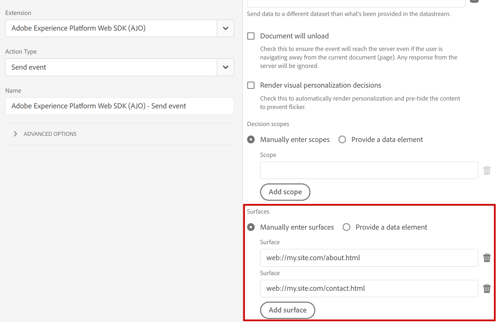

# Utilizzo di [!DNL Adobe Journey Optimizer] con [!DNL Experience Platform Web SDK]

[!DNL Adobe Experience Platform] [!DNL Web SDK] può inviare ed eseguire il rendering di esperienze personalizzate gestite in [!DNL Adobe Journey Optimizer] al canale web. Puoi utilizzare un editor di WYSIWYG, [!DNL Adobe Journey Optimizer] [Canale Web](get-started-web.md), o un&#39;interfaccia non visiva, [Canale esperienza basato su codice](../code-based/get-started-code-based.md) per creare, attivare e distribuire le campagne [!DNL Journey Optimizer Web] e le esperienze di personalizzazione.

## Terminologia {#terminology}

**[!UICONTROL Superficie]**: una superficie Web è una pagina Web o una posizione in una pagina identificata da un URI in cui verrà distribuito il contenuto dell&#39;esperienza [!DNL Adobe Journey Optimizer].

**[!UICONTROL Proposte]**: in [!DNL Adobe Journey Optimizer], le proposte sono correlate all&#39;esperienza selezionata da un [!DNL Journey Optimizer Campaign].

## Abilitazione di [!DNL Adobe Journey Optimizer] {#enable-ajo}

Per iniziare a utilizzare [!DNL Adobe Journey Optimizer], attieniti alla procedura seguente.

1. Segui i [prerequisiti](web-prerequisites.md), in particolare:
   * Configura [!DNL Adobe Experience Cloud Visual Editing Helper].
   * Abilita [!DNL Adobe Journey Optimizer] nel [flusso di dati](https://experienceleague.adobe.com/docs/experience-platform/datastreams/overview.html){target="_blank"}.
   * Abilita l&#39;opzione [!UICONTROL Criterio di unione attivo su Edge].

1. Aggiungi l&#39;opzione `renderDecisions` ai tuoi eventi. Imposta `renderDecisions` su `true` per il rendering automatico delle proposte di contenuto Journey Optimizer distribuite sulle superfici delle pagine Web.

   ```javascript
   alloy("sendEvent", {
       ...,
       "renderDecisions": true
   })
   ```

1. Facoltativamente, specificare superfici aggiuntive negli eventi. Per impostazione predefinita, il Web SDK genera automaticamente la superficie Web per la pagina Web corrente e la include nella richiesta ad Edge Network. Se necessario, è possibile includere superfici aggiuntive nella richiesta specificandole nell&#39;opzione `personalization.surfaces` del comando `sendEvent` o nella configurazione **[!UICONTROL Surfaces]** [[!UICONTROL Send event] action](https://experienceleague.adobe.com/docs/experience-platform/tags/extensions/client/web-sdk/action-types.html#send-event){target="_blank"} corrispondente dell&#39;estensione Web SDK.

   ```javascript
   alloy("sendEvent", {
       ...
       "personalization": {
           "surfaces": [ "web://my.site.com/about.html", "web://my.site.com/contact.html" ]
       }
   })
   ```

   

   Le superfici evento sono incluse nel campo di richiesta `query.personalization.surfaces`:

   ```json
   {
   "events": [
       {
           "query": {
               "personalization": {
               "schemas": [
                   ...
               ],
               "decisionScopes": [
                   "__view__"
               ],
               "surfaces": [
                   "web://ajostage.weebly.com/"
               ]
               }
           },
           ...
       }
   ]
   }
   ```

1. Analogamente ad altre funzionalità di personalizzazione, puoi aggiungere un **[frammento pre-hiding](https://experienceleague.adobe.com/docs/experience-platform/edge/personalization/manage-flicker.html){target="_blank"}** per nascondere solo alcune parti della pagina durante il recupero delle esperienze.

## Rendering di contenuti personalizzati {#rendering-personalized-content}

Per ulteriori informazioni sul rendering di contenuti personalizzati, consulta la [documentazione di Adobe Experience Platform Web SDK](https://experienceleague.adobe.com/docs/experience-platform/edge/personalization/rendering-personalization-content.html){target="_blank"}.

Le proposte di Adobe Journey Optimizer per le superfici web vengono elaborate in modo simile alle proposte di ambito di decisione `__view__`. In particolare, quando l&#39;opzione `renderDecisions` è impostata su `true` nel comando `sendEvent`, il rendering verrà eseguito automaticamente dal Web SDK.

Esempio di proposta di contenuto Journey Optimizer:

```json
{
    "scope": "web://ajostage.weebly.com/",
    "scopeDetails": {
        "correlationID": "ccfaf19c-6360-4aea-b464-0cf924db5da7",
        "characteristics": {
            "eventToken": "eyJtZXNzYWdlRXhlY3V0aW9uIjp7Im1lc3NhZ2VFeGVjdXRpb25JRCI6ImEzNDYxYTMzLTc5MjktNGQyNS1hNmMxLTVkYzM2YWY1NzRmMyIsIm1lc3NhZ2VJRCI6ImNjZmFmMTljLTYzNjAtNGFlYS1iNDY0LTBjZjkyNGRiNWRhNyIsIm1lc3NhZ2VUeXBlIjoibWFya2V0aW5nIiwiY2FtcGFpZ25JRCI6IjEzN2JmMzllLWM1ODgtNGI1My1iODQxLTJiMWZiZDYxM2JkYiIsImNhbXBhaWduVmVyc2lvbklEIjoiMTA1NzY1MmEtZWYwNS00YjE3LWExMmUtY2FlOTQyOTFhMWFjIiwiY2FtcGFpZ25BY3Rpb25JRCI6ImViNTlmODQ4LTk5ZDYtNGE1OC05YmU4LTk4MjIxODU0NmYzNiIsIm1lc3NhZ2VQdWJsaWNhdGlvbklEIjoiYzg2NzFjZmItNDdjYS00YTVjLTg4Y2YtNzYwZDFlZjU1MzQyIn0sIm1lc3NhZ2VQcm9maWxlIjp7ImNoYW5uZWwiOnsiX2lkIjoiaHR0cHM6Ly9ucy5hZG9iZS5jb20veGRtL2NoYW5uZWxzL3dlYiIsIl90eXBlIjoiaHR0cHM6Ly9ucy5hZG9iZS5jb20veGRtL2NoYW5uZWwtdHlwZXMvd2ViIn0sIm1lc3NhZ2VQcm9maWxlSUQiOiI2YTViY2I3ZC02MmYxLTQ5NDItODRkMC02MzE5ZjM5Zjk1ZGUifX0="
        },
        "decisionProvider": "AJO",
        "activity": {
            "id": "137bf39e-c588-4b53-b841-2b1fbd613bdb#eb59f848-99d6-4a58-9be8-982218546f36"
        }
    },
    "id": "002321c0-dff5-4153-b171-a9dfb70b9750",
    "items": [
        {
            "schema": "https://ns.adobe.com/personalization/dom-action",
            "data": {
                "uiData": {
                    "tagType": "Text",
                    "actionType": "changed"
                },
                "content": "Welcome AJO!",
                "prehidingSelector": "#wsite-content > DIV:nth-of-type(2) > DIV:nth-of-type(1) > DIV:nth-of-type(1) > DIV:nth-of-type(1) > DIV:nth-of-type(1) > DIV:nth-of-type(3) > FONT:nth-of-type(1) > SPAN:nth-of-type(1)",
                "type": "setHtml",
                "selector": "#wsite-content > DIV.wsite-section-wrap:eq(1) > DIV.wsite-section:eq(0) > DIV.wsite-section-content:eq(0) > DIV.container:eq(0) > DIV.wsite-section-elements:eq(0) > DIV.paragraph:eq(0) > FONT:nth-of-type(1) > SPAN:nth-of-type(1)"
            },
            "id": "0a522f66-9e6a-4ded-b1d0-e9167f103290"
        }
    ]
}
```

## Eseguire il debug {#debugging}

Per eseguire il debug delle implementazioni di personalizzazione di Adobe Journey Optimizer, utilizzare [Debug Web SDK](https://experienceleague.adobe.com/docs/experience-platform/edge/fundamentals/debugging.html){target="_blank"}. [!DNL Adobe Journey Optimizer] tracce di debug sono disponibili durante la risoluzione dei problemi con [[!DNL Adobe Experience Platform Assurance]](https://developer.adobe.com/client-sdks/documentation/platform-assurance/). Verificare la presenza di eventi con il prefisso `AJO:`.


