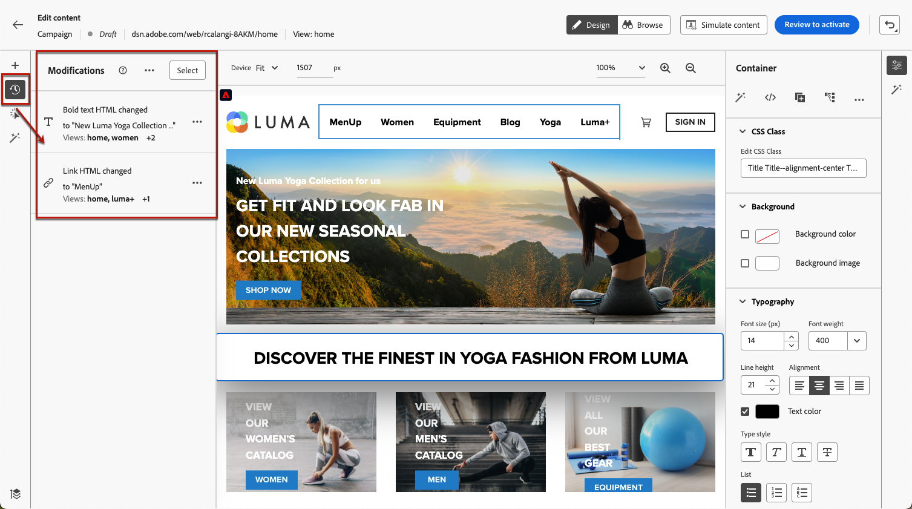

# Creare applicazioni a pagina singola {#web-author-spas}

## Informazioni sulle viste {#about-views}

>[!CONTEXTUALHELP]
>id="ajo_web_designer_modifications_views"
>title="Applicare le modifiche alle viste selezionate"
>abstract="Le modifiche verranno applicate solo alle viste selezionate. Le viste possono essere rilevate utilizzando la modalità **Sfoglia** e accedendo ad esse. Non trovi la vista che stai cercando?"
>additional-url="https://experienceleague.adobe.com/docs/platform-learn/implement-web-sdk/overview.html?lang=it" text="Ulteriori informazioni"

È ora possibile creare **applicazioni a pagina singola** (SPA) nell&#39;editor visivo di Web Designer. In questo modo puoi selezionare a quali **visualizzazioni** specifiche desideri applicare le modifiche alla pagina Web.

[Scopri come creare applicazioni a pagina singola in questo video](#video)

Una visualizzazione può essere definita come un intero sito o un gruppo di elementi visivi su un sito, ad esempio la pagina Home, l’intero sito dei prodotti o la cornice delle preferenze di consegna su tutte le pagine di pagamento.

Per definire le visualizzazioni nell’implementazione di Adobe Experience Platform Web SDK è necessaria la configurazione per sviluppatori una tantum. Questo consente di creare ed eseguire campagne web Adobe Journey Optimizer sulle applicazioni a pagina singola.

## Definire le visualizzazioni nell’implementazione di Web SDK {#define-views}

Le visualizzazioni XDM possono essere utilizzate in Adobe [!DNL Journey Optimizer] per consentire agli addetti al marketing di eseguire campagne di personalizzazione e sperimentazione web sulle applicazioni a pagina singola tramite l&#39;editor visivo web. [Ulteriori informazioni](https://experienceleague.adobe.com/docs/experience-platform/edge/personalization/ajo/web-spa-implementation.html?lang=it){target="_blank"}

Per poter accedere e creare visualizzazioni nell&#39;interfaccia utente di [!DNL Journey Optimizer], assicurarsi di seguire i passaggi elencati in [questa sezione](https://experienceleague.adobe.com/docs/experience-platform/edge/personalization/ajo/web-spa-implementation.html?lang=it#implement-xdm-views){target="_blank"}.

## Scopri le visualizzazioni nel web designer {#discover-views}

Una volta effettuata la configurazione delle applicazioni a pagina singola nell’implementazione di Adobe Experience Platform Web SDK, è necessario spostarsi tra tutte le visualizzazioni del sito web a cui si desidera applicare le modifiche. Segui i passaggi seguenti.

1. [Crea un percorso Web o una campagna](create-web.md) e accedi al [Web Designer](web-visual-editor.md).

   La vista in cui sei attualmente è visualizzata in alto a sinistra.

   

1. Passare alla modalità **[!UICONTROL Sfoglia]**. [Ulteriori informazioni](web-visual-editor.md#browse-mode)

   

1. Passa tra le diverse pagine del sito web per scoprirle tutte. Il nome visualizzato nella parte superiore cambia quando si passa da un&#39;altra pagina all&#39;altra.

   

## Applica modifiche ad altre viste {#apply-modifications-views}

Dopo aver aggiunto una modifica mentre ti trovi in una vista specifica, puoi applicarla ad altre viste selezionate. Segui i passaggi seguenti.

>[!CAUTION]
>
>Se non hai individuato le visualizzazioni utilizzando la modalità **[!UICONTROL Sfoglia]**, non potrai selezionarle per applicare le modifiche. [Ulteriori informazioni](#discover-views)

1. Seleziona l&#39;icona **[!UICONTROL Modifiche]** per visualizzare il riquadro corrispondente a sinistra.

   

1. Seleziona una modifica e fai clic sul pulsante **[!UICONTROL Altre azioni]** accanto a essa. Seleziona **[!UICONTROL Applica a più visualizzazioni]**.

   

1. Selezionare le visualizzazioni a cui applicare le modifiche.

   

1. Fare clic su **[!UICONTROL Applica]**.

1. Passare alla modalità **[!UICONTROL Sfoglia]** per verificare che le modifiche siano applicate alle pagine desiderate.

   

## Video dimostrativo{#video}

Questo video spiega come:

* Scopri le visualizzazioni SPA utilizzando la modalità **[!UICONTROL Sfoglia]**
* Eseguire l’authoring sulla vista corrente
* Applicare le modifiche al sito web per più viste o tutte le viste individuate
* Eseguire azioni in blocco sulle modifiche

>[!VIDEO](https://video.tv.adobe.com/v/3446893/?captions=ita&quality=12&learn=on)
