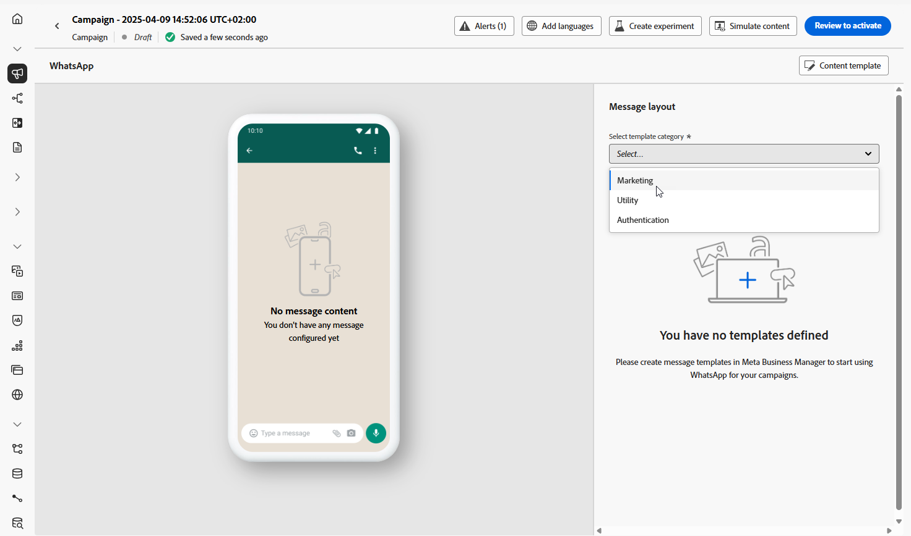
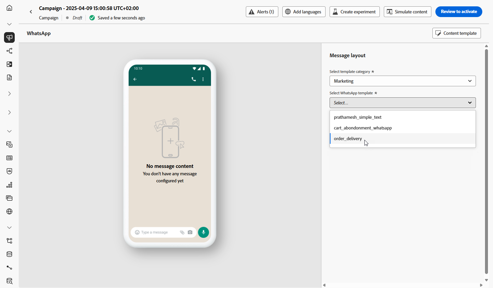
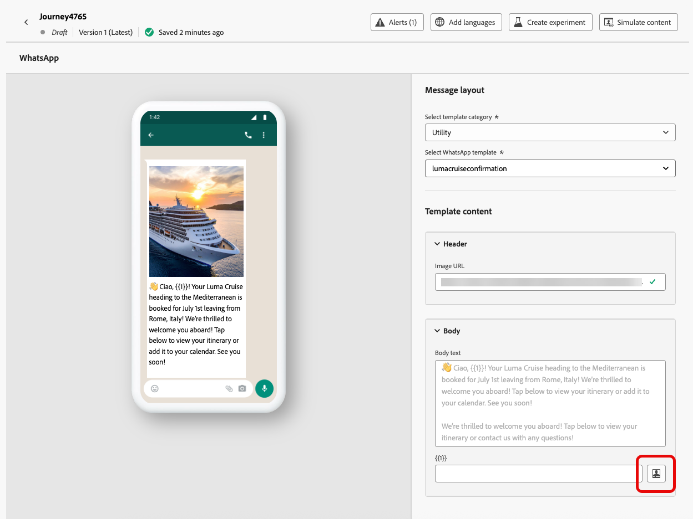

# Creare un messaggio WhatsApp {#create-whatsapp}

Con Adobe Journey Optimizer, puoi progettare e inviare messaggi coinvolgenti su WhatsApp. È sufficiente aggiungere un’azione WhatsApp al percorso o alla campagna e creare il contenuto del messaggio come descritto di seguito. Adobe Journey Optimizer consente inoltre di testare i messaggi WhatsApp prima di inviarli, garantendo un rendering perfetto, una personalizzazione accurata e una configurazione corretta di tutte le impostazioni.

In Journey Optimizer sono supportati solo gli elementi dei messaggi in uscita.

+++ Ulteriori informazioni sugli elementi del messaggio supportati e sulle chiamate alle azioni

I seguenti tipi di messaggi sono supportati in WhatsApp:

| Funzione Messaggio | Descrizione |
|-|-|
| Intestazioni | Testo opzionale visualizzato sopra il corpo del messaggio. |
| Testo | Supporta il contenuto dinamico tramite parametri. |
| Immagini (JPEG, PNG) | Deve essere in formato RGB o RGBA a 8 bit e di dimensioni inferiori a 5 MB. |
| Video | Deve essere 3GPP o MP4, di dimensioni inferiori a 16 MB e ospitato tramite URL. |
| Audio | Disponibile solo per i messaggi di risposta. Deve essere in formato AAC, AMR, MP3, MP4 audio o OGG, ospitato su un URL e inferiore a 16 MB. |
| Documenti | Deve essere inferiore a 100 MB, ospitato su un URL e in uno dei seguenti formati: .txt, .xls/.xlsx, .doc/.docx, .ppt/.pptx o .pdf. |
| Corpo del testo | Supporta il contenuto dinamico tramite parametri. |
| Testo piè di pagina | Supporta il contenuto dinamico tramite parametri. |

La seguente opzione call-to-action è disponibile per i messaggi WhatsApp:

| Inviti all&#39;azione | Descrizione |
|-|-|
| Visita il sito web | È consentito un solo pulsante, con parametri variabili inclusi. |
| Chiamata su WhatsApp | Fornisce un pulsante che apre una chat WhatsApp con il numero di telefono specificato direttamente dal messaggio. |
| Numero di telefono della chiamata | Fornisce un pulsante che avvia una chiamata telefonica al numero specificato quando viene toccato dall&#39;utente. |

+++

## Aggiungi un messaggio WhatsApp {#create-whatsapp-journey-campaign}

Sfoglia le schede seguenti per scoprire come aggiungere un messaggio WhatsApp in una campagna o in un percorso.

>[!BEGINTABS]

>[!TAB Aggiungi un messaggio WhatsApp a un Percorso]

1. Apri il percorso, quindi trascina e rilascia un&#39;**attività WhatsApp** dalla sezione **Azioni** della palette.

   

1. Fornisci informazioni di base sul messaggio (etichetta, descrizione, categoria), quindi scegli la configurazione del messaggio da utilizzare.

   Per ulteriori informazioni su come configurare un percorso, fare riferimento a [questa pagina](../building-journeys/journey-gs.md)

   Il campo **[!UICONTROL configuration]** è precompilato, per impostazione predefinita, con l&#39;ultima configurazione utilizzata per quel canale dall&#39;utente.

Puoi iniziare a progettare il contenuto del messaggio WhatsApp dal pulsante **[!UICONTROL Modifica contenuto]**, come descritto di seguito.

>[!TAB Aggiungere un messaggio WhatsApp a una campagna]

1. Accedi al menu **[!UICONTROL Campagne]**, quindi fai clic su **[!UICONTROL Crea campagna]**.

1. Seleziona il tipo di campagna **Pianificato - Marketing**.

1. Dalla sezione **[!UICONTROL Proprietà]**, modifica il **[!UICONTROL Titolo]** e la **[!UICONTROL Descrizione]** della tua campagna.

1. Fai clic sul pulsante **[!UICONTROL Seleziona pubblico]** per definire il pubblico di destinazione dall&#39;elenco dei tipi di pubblico di Adobe Experience Platform disponibili. [Ulteriori informazioni](../audience/about-audiences.md).

1. Nel campo **[!UICONTROL Spazio dei nomi identità]**, scegli lo spazio dei nomi da utilizzare per identificare i singoli utenti del pubblico selezionato. [Ulteriori informazioni](../event/about-creating.md#select-the-namespace).

1. Nella sezione **[!UICONTROL Azioni]**, scegli **[!UICONTROL WhatsApp]** e seleziona o crea una nuova configurazione.

   Ulteriori informazioni sulla configurazione WhatsApp in [questa pagina](whatsapp-configuration.md).

   

1. Fai clic su **[!UICONTROL Crea esperimento]** per iniziare a configurare l&#39;esperimento sui contenuti e creare trattamenti per misurarne le prestazioni e identificare l&#39;opzione migliore per il pubblico di destinazione. [Ulteriori informazioni](../content-management/content-experiment.md)

1. Nella sezione **[!UICONTROL Tracciamento azioni]**, specifica se desideri tenere traccia dei clic sui collegamenti nel messaggio WhatsApp.

1. Le campagne sono progettate per essere eseguite in una data specifica o con una frequenza ricorrente. Scopri come configurare la **[!UICONTROL pianificazione]** della campagna in [questa sezione](../campaigns/create-campaign.md#schedule).

1. Dal menu **[!UICONTROL Trigger azione]**, scegli la **[!UICONTROL Frequenza]** del messaggio WhatsApp:

   * Una volta
   * Giornaliera
   * Settimanale
   * Month

Puoi iniziare a progettare il contenuto del messaggio WhatsApp dal pulsante **[!UICONTROL Modifica contenuto]**, come descritto di seguito.

>[!ENDTABS]

## Definire il contenuto WhatsApp{#whatsapp-content}

>[!BEGINSHADEBOX]

Prima di progettare il messaggio WhatsApp in Journey Optimizer, devi innanzitutto creare e progettare il modello in Meta. [Ulteriori informazioni](https://www.facebook.com/business/help/2055875911147364?id=2129163877102343)

Nota che il modello WhatsApp deve prima essere approvato da Meta prima di essere utilizzato in Journey Optimizer. Questo processo richiede in genere alcune ore, ma può richiedere fino a 24 ore. [Ulteriori informazioni](https://developers.facebook.com/docs/whatsapp/message-templates/guidelines/#approval-process)

>[!ENDSHADEBOX]

1. Dalla schermata di configurazione del percorso o della campagna, fai clic sul pulsante **[!UICONTROL Modifica contenuto]** per configurare il contenuto del messaggio WhatsApp.

<!--
1. Select **[!UICONTROL Template message]**.
-->

1. Scegli la **categoria modello**:

   * Marketing
   * Utilità
   * Autenticazione

   [Ulteriori informazioni sulle categorie dei modelli](https://developers.facebook.com/docs/whatsapp/updates-to-pricing/new-template-guidelines/#template-category-guidelines)

   

1. Dal menu a discesa **Modello WhatsApp**, seleziona il modello creato in precedenza e progettato in Meta.

   [Ulteriori informazioni su come creare i modelli Whatsapp](https://www.facebook.com/business/help/2055875911147364?id=2129163877102343)

   

1. Nel campo **[!UICONTROL URL immagine]**, aggiungi gli URL multimediali per sostituire eventuali segnaposto nel modello. I file multimediali modello di Meta sono solo segnaposto. Per visualizzare correttamente immagini, audio o video, è necessario utilizzare URL esterni da Adobe Experience Manager o da altre origini.

   

1. Utilizza l’editor di personalizzazione per aggiungere la personalizzazione al modello. Puoi utilizzare qualsiasi attributo, ad esempio il nome del profilo o la città.

   Sfoglia la pagina seguente per ulteriori informazioni sulla [personalizzazione](../personalization/personalize.md).

   

1. Utilizza il pulsante **[!UICONTROL Simula contenuto]** per visualizzare in anteprima il contenuto del messaggio WhatsApp, gli URL abbreviati e il contenuto personalizzato. [Ulteriori informazioni](send-whatsapp.md)

Dopo aver eseguito i test e convalidato il contenuto, puoi [inviare il messaggio WhatsApp](send-whatsapp.md) al pubblico e monitorarne le prestazioni tramite [reporting](../reports/campaign-global-report-cja.md).

<!--
* **[!UICONTROL Template message]**: Predefined message imported from Meta into Journey Optimizer. These are intended for sending notifications, alerts, or updates to your customers.

* **[!UICONTROL Response message]**: Message created in Journey Optimizer and sent in reply to customer queries or interactions.

>[!BEGINTABS]

>[!TAB Template message]

1. From the journey or campaign configuration screen, click the **[!UICONTROL Edit content]** button to configure the WhatsApp message content.

1. Select **[!UICONTROL Template message]**.

1. Choose your Template category. [Learn more](https://developers.facebook.com/docs/WhatsApp/updates-to-pricing/new-template-guidelines/)

1. From the **WhatsApp template** drop-down, select your previously created template designed in Meta.

1. Use the personalization editor to define content, add personalization and dynamic content. You can use any attribute, such as the profile name or city for example. You can also define conditional rules. Browse to the following pages to learn more about [personalization](../personalization/personalize.md) and [dynamic content](../personalization/get-started-dynamic-content.md) in the personalization editor.

1. Use the **[!UICONTROL Simulate content]** button to preview your WhatsApp message content, shortened URLs, and personalized content. [Learn more](send-whatsapp.md)

Once you have performed your tests and validated the content, you can send your WhatsApp message to your audience. These steps are detailed on [this page](send-whatsapp.md)

>[!TAB Response message]

1. From the journey or campaign configuration screen, click the **[!UICONTROL Edit content]** button to configure the WhatsApp message content.

1. Select **[!UICONTROL Response message]**.

1. Enter your text in the **[!UICONTROL Body]** field.

1. Use the personalization editor to define content, add personalization and dynamic content. You can use any attribute, such as the profile name or city for example. You can also define conditional rules. Browse to the following pages to learn more about [personalization](../personalization/personalize.md) and [dynamic content](../personalization/get-started-dynamic-content.md) in the personalization editor.

1. Use the **[!UICONTROL Simulate content]** button to preview your WhatsApp message content, shortened URLs, and personalized content. [Learn more](send-whatsapp.md)

Once you have performed your tests and validated the content, you can send your WhatsApp message to your audience. These steps are detailed on [this page](send-whatsapp.md)

>[!ENDTABS]
-->

## Video dimostrativo {#video}

Il video seguente mostra come creare un percorso WhatsApp in più passaggi utilizzando Adobe Journey Optimizer.

+++ Guarda il video

>[!VIDEO](https://video.tv.adobe.com/v/3470290/?captions=ita&learn=on")

+++
