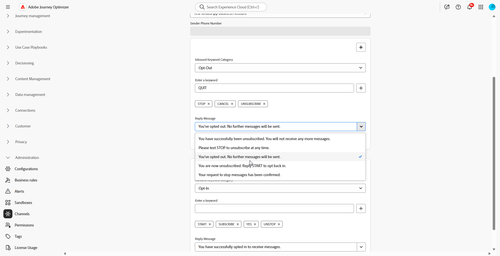

# Introduzione alla configurazione di WhatsApp {#whatsapp-config}

Prima di inviare il messaggio WhatsApp, devi configurare l’ambiente Adobe Journey Optimizer e associarti all’account WhatsApp. Per eseguire questa operazione:

1. [Creare le credenziali API WhatsApp](#WhatsApp-credentials)
1. [Creare i webhook WhatsApp](#WhatsApp-webhook)
1. [Creare la configurazione WhatsApp](#WhatsApp-configuration)

Questi passaggi devono essere eseguiti da un [amministratore di sistema](../start/path/administrator.md) di Adobe Journey Optimizer.

## Creare le credenziali API WhatsApp {#whatsapp-credentials}

1. Nella barra a sinistra, passa a **[!UICONTROL Amministrazione]** `>` **[!UICONTROL Canali]** e seleziona il menu **[!UICONTROL Credenziali API]**. Fare clic sul pulsante **[!UICONTROL Crea nuove credenziali API]**.

1. Configura le credenziali API come descritto di seguito:

   * **Token API**: immetti il token API. Ulteriori informazioni nella [documentazione di Meta](https://developers.facebook.com/blog/post/2022/12/05/auth-tokens/)
   * **ID account aziendale**: immetti il numero univoco relativo al tuo portfolio aziendale. Ulteriori informazioni nella [documentazione di Meta](https://www.facebook.com/business/help/1181250022022158?id=180505742745347).

   

1. Fai clic su **[!UICONTROL Continua]**.

1. Scegli l&#39;**account aziendale WhatsApp** che desideri connettere alle credenziali API WhatsApp.

   

1. Seleziona il **Nome mittente** utilizzato per inviare i messaggi WhatsApp.

1. Le impostazioni del numero di telefono vengono compilate automaticamente:

   * **Valutazione qualità**: riflette il feedback del cliente sui messaggi inviati nelle ultime 24 ore.
      * Verde: alta qualità
      * Giallo: qualità Medium
      * Rosso: bassa qualità

     Ulteriori informazioni sulla [valutazione qualità](https://www.facebook.com/business/help/766346674749731#)

   * **Velocità effettiva**: indica la velocità con cui il numero di telefono può inviare messaggi.

1. Fai clic su **[!UICONTROL Invia]** al termine della configurazione delle credenziali API.

Dopo aver creato e configurato le credenziali API, ora è necessario creare il webhook per i messaggi WhatsApp. [Ulteriori informazioni](#whatsapp-webhook)

## Creare webhook {#WhatsApp-webhook}

>[!CONTEXTUALHELP]
>id="ajo_admin_whatsapp_webhook_inbound_keyword_category"
>title="Categoria parole chiave in entrata"
>abstract="<b>Consenso</b>: invia la risposta automatica definita quando un utente si abbona.  <b>Rinuncia</b>: invia la risposta automatica definita quando un utente annulla l’abbonamento.  <b>Guida</b>: invia la risposta automatica definita quando un utente richiede assistenza o supporto.  <b>Predefinito</b>: invia la risposta automatica di fallback quando nessuna parola chiave corrisponde."

>[!CONTEXTUALHELP]
>id="ajo_admin_whatsapp_webhook_inbound_keyword"
>title="Immettere le parole chiave"
>abstract="Puoi definire parole chiave per attivare risposte automatiche specifiche in base al testo digitato dagli utenti. Le parole chiave non fanno distinzione tra maiuscole e minuscole, ad esempio, interruzione e INTERRUZIONE vengono trattate allo stesso modo."

>[!CONTEXTUALHELP]
>id="ajo_admin_whatsapp_webhook_webhook_url"
>title="URL di callback"
>abstract="La richiesta di convalida e le notifiche webhook per questo oggetto vengono inviate all’URL specificato."

>[!CONTEXTUALHELP]
>id="ajo_admin_whatsapp_webhook_verify_token"
>title="Verifica token"
>abstract="Token restituito da Meta per confermare e verificare l’URL di callback durante il processo di verifica."

>[!NOTE]
>
>Senza le parole chiave di consenso o rinuncia specificate, i messaggi di consenso standard non sono abilitati.

Una volta create correttamente le credenziali API WhatsApp, ora puoi configurare i webhook per acquisire le risposte in entrata e gestire il consenso di consenso di consenso e rinuncia e per ricevere rapporti di consegna, comprese le conferme di lettura, se disponibili.

1. Nella barra a sinistra, passa a **[!UICONTROL Amministrazione]** `>` **[!UICONTROL Canali]**, seleziona il menu **[!UICONTROL Webhook WhatsApp]** in **[!UICONTROL Impostazioni WhatsApp]** e fai clic sul pulsante **[!UICONTROL Crea webhook]**.

   

1. Immetti un **[!UICONTROL Nome]** per il tuo webhook.

1. Dall&#39;elenco a discesa **[!UICONTROL Seleziona configurazione]**, seleziona le [credenziali API](#whatsapp-credentials) create in precedenza.

   

1. Scegli la **[!UICONTROL categoria di parole chiave in entrata]**, ad esempio:

   * **[!UICONTROL Parole chiave di consenso]**
   * **[!UICONTROL Parole chiave per la rinuncia]**
   * **[!UICONTROL Parole chiave della Guida]**

1. Immetti **[!UICONTROL Parole chiave]** e fai clic su .

   

1. Dal campo **[!UICONTROL Messaggio di risposta]**, immettere il messaggio inviato quando viene ricevuta una parola chiave configurata oppure selezionare un&#39;opzione predefinita dal menu a discesa.

   

<!--
1. Click **[!UICONTROL View payload editor]** to validate and customize your request payloads. 
    
    You can dynamically personalize your payload using profile attributes, and ensure accurate data is sent for processing and response generation with the help of built-in helper functions.
-->
1. Fai clic su  per aggiungere ulteriori **[!UICONTROL parole chiave in entrata]**.

1. Fai clic su **[!UICONTROL Invia]** al termine della configurazione del webhook WhatsApp.

1. Nel menu **[!UICONTROL Webhook]**, fai clic sull&#39;icona  per eliminare il tuo webhook WhatsApp.

   

1. Per modificare la configurazione esistente e accedere all&#39;**[!UICONTROL URL webhook]** o al **[!UICONTROL token di verifica webhook]**, individuare il webhook desiderato e fare clic sull&#39;opzione **[!UICONTROL Modifica]** per apportare le modifiche necessarie.

1. Copia il **[!UICONTROL token di verifica del webhook]** generato qui, quindi incollalo nell&#39;interfaccia di Meta come parte della configurazione del webhook.

   Per istruzioni dettagliate su come e dove aggiungere questo token di verifica, consulta la [documentazione di Meta](https://developers.facebook.com/docs/graph-api/webhooks/getting-started#configure-webhooks-product).

1. Accedi e copia il nuovo **[!UICONTROL URL webhook]** dal **[!UICONTROL webhook WhatsApp]** inviato in precedenza.

   

Una volta configurato il webhook, puoi creare la configurazione WhatsApp.

## Crea configurazione WhatsApp {#whatsapp-configuration}

1. Nella barra a sinistra, passa a **[!UICONTROL Amministrazione]** > **[!UICONTROL Canali]** e seleziona **[!UICONTROL Impostazioni generali]** > **[!UICONTROL Configurazioni canale]**. Fare clic sul pulsante **[!UICONTROL Crea configurazione canale]**.

   

1. Inserisci un nome e una descrizione (facoltativa) per la configurazione, quindi seleziona il canale WhatsApp.

   >[!NOTE]
   >
   > I nomi devono iniziare con una lettera (A-Z). Può contenere solo caratteri alfanumerici. È inoltre possibile utilizzare i caratteri trattino basso `_`, punto `.` e trattino `-`.

1. Seleziona **[!DNL WhatsApp]** come tuo canale.

   {width=80%}

1. Seleziona **[!UICONTROL Azioni di marketing]** per associare i criteri di consenso ai messaggi utilizzando questa configurazione. Tutti i criteri di consenso associati all’azione di marketing vengono utilizzati per rispettare le preferenze dei clienti. [Ulteriori informazioni](../action/consent.md#surface-marketing-actions)

1. Nella sezione **[!UICONTROL Impostazioni WhatsApp]**, seleziona la **[!UICONTROL configurazione WhatsApp]** creata in precedenza.

   {width=80%}

1. Immettere il **[!UICONTROL numero di telefono del mittente]** &#x200B;che si desidera utilizzare per le comunicazioni.

1. Utilizza il **[!UICONTROL Campo di esecuzione WhatsApp]** per selezionare tra gli attributi del profilo il numero di telefono da utilizzare in priorità se nel database sono disponibili più numeri. [Ulteriori informazioni](../configuration/primary-email-addresses.md#override-execution-address-channel-config)

   >[!NOTE]
   >
   >Per impostazione predefinita, [!DNL Journey Optimizer] utilizza il numero di telefono specificato nelle [impostazioni generali](../configuration/primary-email-addresses.md) a livello di sandbox. L’aggiornamento di questo campo sovrascrive il valore predefinito per i percorsi e le campagne che utilizzano questa configurazione.

1. Una volta configurati tutti i parametri, fai clic su **[!UICONTROL Invia]** per confermare. Puoi anche salvare la configurazione del canale come bozza e riprenderla in un secondo momento.

1. Una volta creata, la configurazione del canale viene visualizzata nell&#39;elenco con lo stato **[!UICONTROL Elaborazione]**.

   >[!NOTE]
   >
   >Se i controlli non hanno esito positivo, ulteriori informazioni sui possibili motivi di errore in [questa sezione](../configuration/channel-surfaces.md).

1. Una volta completati i controlli, la configurazione del canale ottiene lo stato **[!UICONTROL Attivo]**. È pronto per essere utilizzato per inviare messaggi.

Una volta configurata, puoi sfruttare tutte le funzionalità di canale predefinite, come l’authoring dei messaggi, la personalizzazione, il tracciamento dei collegamenti e il reporting.

Ora puoi inviare messaggi WhatsApp con Journey Optimizer.

## Risoluzione dei problemi relativi alla configurazione del canale WhatsApp {#troubleshooting}

### Errori HTTP 500 durante la configurazione delle credenziali API

Se riscontri un errore HTTP 500 durante la configurazione delle credenziali API WhatsApp, segui questi passaggi per la risoluzione dei problemi:

1. **Verifica diritti**: verifica che sia stato eseguito il provisioning di `cjm_whatsapp` diritti per la tua organizzazione. Senza questo diritto, il canale WhatsApp non può essere configurato.

1. **Convalida campi account aziendale**: verificare che tutti i campi obbligatori siano compilati correttamente:
   * **Token API**: deve essere un token di accesso Meta valido con le autorizzazioni appropriate. [Ulteriori informazioni](https://developers.facebook.com/blog/post/2022/12/05/auth-tokens/)
   * **ID account aziendale**: deve corrispondere esattamente all&#39;ID account aziendale Meta. [Ulteriori informazioni](https://www.facebook.com/business/help/1181250022022158?id=180505742745347)

1. **Verifica le credenziali esternamente**: verifica le credenziali direttamente con l&#39;API Meta per verificare se il problema riguarda le credenziali o la gestione delle credenziali Journey Optimizer.

1. **Abilita registrazione avanzata**: per identificare errori di configurazione interni del server o di autenticazione, abilita i registri avanzati nell&#39;ambiente Journey Optimizer per fornire informazioni dettagliate sugli errori di chiamata API.

1. **Contatta il supporto**: se l&#39;ambiente e le adesioni sono confermate valide, ma l&#39;errore HTTP 500 persiste, contatta il rappresentante Adobe.

## Video dimostrativo {#video}

Il video seguente mostra come impostare il canale WhatsApp in Adobe Journey Optimizer.

+++ Guarda il video

>[!VIDEO](https://video.tv.adobe.com/v/3470276/?captions=ita&learn=on)

+++
